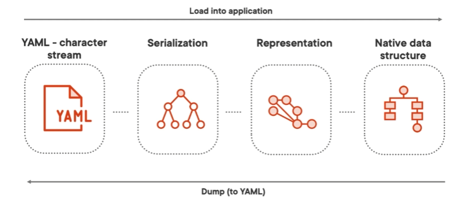

# YAML (YAML Ain't Markup Language)
YAML (YAML Ain't Markup Language) is a human-readable data serialization language used to convert data objects into text for storage and transfer.  
The format can be later be interpreted and converted back to the original data object.  

The text of serialized data in YAML consist of Unicode printable characters (etters, digits, punctuation, etc., can be used to represent the data).  
YAML is great for cross-language data sharing, e.g: you can serialize objects in JavaScript and transfer this to a PHP application. PHP app then can deserialize the data and use the objects in application.  
YAML is also used a lot for configuration files.  
YAML can also be used for logging, according to its own documentation, and using the YAML standard allows dashboards that support YAML to automatically process the log files.  
Another advantage is that YAML is not only readable to the automatic interpreter, but also for humans. YAML can be used for object persistency as well. Since we can serialize objects and store them and deserialize them later, YAML could be used to do the storing; however, this is definitely not the most common use case. The same is true for logging.  
A use case where YAML is used a lot for is working with languages that match YAML's native data structure such as PHP, JavaScript, Perl, Ruby, and Python.

YAML is a superset of JSON, meaning all JSON is valid YAML, though their goals differ: JSON prioritizes simplicity and universal support, while YAML focuses on human readability and complex data representation.  
YAML offers two styles:  
1. Block style: YAML's format, indentation to give the data structure.  
2. Flow style: JSON style formatting, using characters as explicit indicators to indicate structure.  

## YAML Building Blocks
### Sequences also known as lists or arrays
**Indentation is done with spaces never with tabular data!!!NO TABS**  

Sequences are just lists [1,2,3].  
Block style: use dashes `-` to specify items.  
```yaml
- first item of the list
- second item of the list
- third item of the list
# another example
- yaml
- java
- python
```
Flow style: brackets to specify list + `,` to separate items.  
```yaml
[just, a list, in flow style]
# another example
[yaml, java, python]
```
Both styles can be mixed; for example, a block-style list can contain a flow-style sublist:  
```yaml
- firstitem  
- seconditem  
- [list, as, list, item]
```
### Mappings also known as key value pairs, dictionaries etc.
Key-value pair, indicated by key, colon `:`, space and then its value.  

Block style:  
```yaml
key: value
list:
  - first item
  - second item
  - third item
flowlist: [just, a list, in flow style]
# another example
# if you want spaces in the key use ""
"data serialization language": yaml
version: 1.2
list2: 
  - python
  - C#
  - java
```
Mapping flow style:  
```yaml
{key: value, another: value, flowlist: [Java, Python, PHP]}
# another example
{
  key: value, 
  "data serialization language": yaml, 
  version: 1.2.2, 
  list: [Java, Python, PHP]}
```
### Scalar
**Scalar** are the actual values like strings, numbers, booleans and dates.  
For escaping use `\`.  

Block style:  
```yaml
# here both keys and values are scalars
tool: yaml
version: 1.2.2
awesome: true
notihing: null
duplicatedKeys: not allowed
# another example
name: raf
noqutes: whatever without quotes
quotes: "whatever with quotes"
singleQuotes: 'single quotes formatter does not like them'
escaping: "rule: \"escaping can only be done in double quotes scalars\""
floats: 1.2
decimal: 123
# be careful with octal because they start with 0! Whenever a number starts with 0 
# is considered an octal value
octal: 012
hexadecimal: 0xABC
boolean: true
nothing: null
"123 lot of wierd stuff": can be used as keys
```
### Documents
One file can contain multiple documents.  
Documents are separated by 3 hyphens (---).  
Can be ended with suffix of 3 dots (...).  
```yaml
tool: yaml
version: 1.2.2
awesome: true
notihing: null
duplicatedKeys: not allowed
---
description: This is a new document can use same keys-values
tool: yaml
version: 1.2.2
awesome: true
---
One file can have multiple documents
```
___
## YAML advanced syntax
### Folding and Chomping of Multi-line strings
**Folding:**  Determines how newlines (\n) within the string are handled:  
 - `>` (folded style): Converts newlines into spaces unless there's a blank line or indentation.
 - `|` (literal style): Preserves all line breaks as they are.
**Chomping:** Handles trailing newlines (\n) at the end of the string:  
 - No indicator (default): Replaces multiple trailing newlines with a single one.
 - `-` (strip): Removes all trailing newlines.
 - `+` (keep): Preserves all trailing newlines.

These indicators can be combined (`>|`, `>-`, `>+`, etc.) to control both folding and chomping behaviors.
```yaml
# show for folding: > and |
# show for chomping: + - and nothing

multi-line: >+
  Some silly text across multiple lines,
  very important to include some white spaces:
  
  And some
    more indentation
  And some trailing newlines.


```
### Nested sequences
```yaml
# block list with flow style lists
flow_lists:
  - [yaml, json]
  - [python, javascript]

block_lists:
  -
    - yaml
    - json
  -
    - python
    - javascript
```
### Nested mappings
```yaml
person:
  name: Maaike
  age: 30
  address:
    streetname: Langstraat
    number: 1
    zipcode: 1234AB
    city: Amsterdam
    country: The Netherlands
  dog: {name: Bobby, breed: labrador}
```
### Combining Sequences and Mappings
```yaml
languages:
  - programming:
      - frontend:
          - html
          - css
          - js
      - backend:
          - java
          - python
          - c#
  - data serialization:
      - yaml
      - json
---
person:
  - name: maaike
    age: 30
    address:
      streetname: Langstraat
      number: 1
      zipcode: 1234AB
      city: Amsterdam
      country: The Netherlands
  - name: elias
    age: 34
    address: {streetname: YAML streetname, number: 1}
```
### Dates
```yaml
timestamp: 2022-03-22T22:19:56. 10+02:00
simple_date: 2022-03-22
not_a_date: !!str 2022-03-22 # explicit typing whatever follows here is a string not a date
```
### Repeated Notes
Anchor name (&name) and next referenced with alias (*name).  
```yaml
key: &repeated Hi there
new_key: *repeated
___
config: &db
  database_name: dbname
  password: notsafe
config_prod: *db
___
config: &db
  database_name: dbname
  password: notsafe
config_prod:
  <<: *db # this is for overwriting
  password: custompassword
```
### Tags
Tags give a node a type  
Explicit typing can be done with the `!`  
Schemas specify the tags  
```yaml
no_date: !!str 2022-03-21
no_number: !!str 20
unnecessary: !!int 20
```
### Schemas
YAML validation  
Used to create custom data types with language specific schemas  
Default:
 - Failsafe schema
 - JSON schema
 - Core schema (most common) recommended  
___
## Parsing and Validation
**Parsing:**  
Reading text and converting it.  
Outcome could for example be objects in the memory.  
Converts the text in a YAML file to native dta structures.  

Process:  
- Starts with a YAML file (stream of characters).
- Steps:
  1. Create a serialization tree.
  2. Convert to a node graph.
  3. Transform into a native data structure (e.g., objects in Python or Java).
- Loading: YAML → Native data structure.
- Dumping: Native data structure → YAML file.



**Validation:**  
Checking the syntax of a YAML file against its formatting rules.  
Identifies issues in YAML syntax without converting it into a data structure.  
Browser-based tools, editor extensions (e.g., Visual Studio Code).  

### Parsing, validating and dumping YAML with Python
install `PyYAML` module
```python
import yaml

with open("parsing.yaml", "r") as stream:
    try:
        print(yaml.safe_load(stream))
    except yaml.YAMLError as e:
        print(e)
```
Dumping: got from python objects to yaml
```python
import yaml

persons = [{'name': 'Terry', 'age': 34},
           {'name': 'Maaike', 'age': 30}]
print(yaml.dumb(persons))
```
___
## Sources
- M. van Putten, YAML 1 Fundamentals, https://app.pluralsight.com/library/courses/yaml-1-fundamentals/.