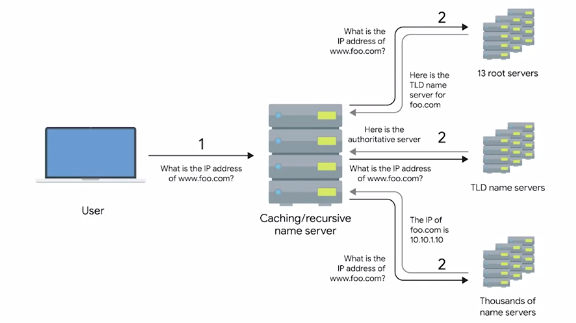

# Network Services

## DNS
`DNS` is an application layer service that uses UDP protocol.
`DNS - Domain Name Sysytem`:  is a global and highly distributed network service that resolves strings of letters into IP addresses.
Computers don't go by names but by numbers thus `www.bestSite.com` can't be understood by a pc, and it needs to be translated to an IP address.
DNS can be compared to a "phonebook" in some way.
DNS resolves domain name to IP addresses - this process is known as `name resolution`

Configuration needed for a host to operat on a network:
- IP
- Subnet mask
- Getaway 
- DNS server
___
### How DNS works
Five types of DNS servers:
1. `Caching name servers`: provided by ISP. Purpose is to store domain name lookups for a certain amount of time. Most caching name servers are also recursive name servers. 
2. `Recursive name servers`: provided by ISP. Performs full DNS resolution request. 
3. `Root name servers` 
4. `TLD name servers` 
5. `Authoritative name servers`

When you type `www.bestSite.com` into your web server, the DNS server will search through its database to find a matching IP address
for that domain name and if it finds it will resolve that domain name to the IP address of the requested website, and when is done your 
computer is able to communicate with bestSite web server and retrieve the page.

Steps:
When typing website in web browser and the web browser or your operational system can't find the IP address in its cache memory, the
query will be sent to the next level to a `resolver server/recursive name server - your ISP`. 
The resolver will check its own cache memory to find the IP address, if it can't find it, it will send the query to the `root server`.
Root servers are the top of the DNS hierarchy, there are 13 sets which were strategically placed around the world and are operated by 12
different organization. Each set of these root servers has their own unique IP address.
I say were because today they're mostly distributed across the globe via `Anycast` - a technique that's used to route traffic to different 
destinations depending on factors like location, congestion or link health.
Using Anycast, a computer can send a datagram to a specific IP, but could see it routed to one of many different actual 
destinations depending on a few factors.
This should also make it clear that there aren't really only 13 physical root name servers anymore.
It's better to think of them as 13 authorities that provide root name lookups as a service.

When the resolver asks the root wht is the IP for the searched web page, actually the root doesn't know it but the root does know where to send
the resolver to help it find the IP address.
So the root server will direct the resolver to `TLD - top level domain server` for the `.com` domain.
Noe the resolver will ask the TLD server for the www.bestSite.com IP address.
TLD server stores the address information for a top level,like .com, .net, .org. 
For each TLD in existence, there is a TLD name server. But just like with root servers, this doesn't mean 
there's only physically one server in question. It's most likely a global distribution of Anycast accessible servers 
responsible for each TLD.
The TLD name servers will respond again with a redirect, this time informing the computer performing the name 
lookup with what `authoritative name server` to contact.

 `Authoritative name servers` are responsible for the last two 
parts of any domain name, which is the resolution at which a single organization may be responsible for DNS lookups.
Using www.weather.com as an example, the TLD name server will point a lookup at the authoritative server for weather.com, 
which would likely be controlled by the weather channel, the organization itself that runs the site.
Finally, the DNS lookup could be redirected at the authoritative server for weather.com, which would finally provide the
actual IP of the server in question.
Now the resolver will tell your computer the IP and your computer can retrieve the bestSite.com web page.
Once the resolver will receive the IP address it will store it in its cache memory in case of a 
query for the same page, so it doesn't have to go through all these steps again.

This strict hierarchy is very important to the stability of the Internet. Making sure that all full 
DNS resolutions go through a strictly regulated and controlled series of lookups to get the correct responses is the 
best way to protect against malicious parties redirecting traffic. Your computer will blindly send traffic to whatever 
IP it's told to, so by using a hierarchical system controlled by trusted entities in the way DNS does, we can better ensure 
that the responses to DNS lookups are accurate. Now it makes sense why our local name servers to cache DNS lookups. It's so that full lookup path doesn't't have to happen for every single 
TCP connection. In fact, your local computer from your phone to a desktop will generally have its own temporary DNS cache as well. 
That way, it doesn't have to bother its local name server for every TCP connection either.

___
## Sources
- PowerCertAnimated videos, How a DNS Server (Domain Name System) works, https://www.youtube.com/@PowerCertAnimatedVideos
- Google, The Bits and Bytes of Computer Networking, https://www.coursera.org/