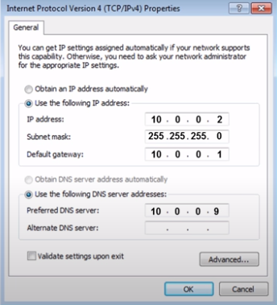
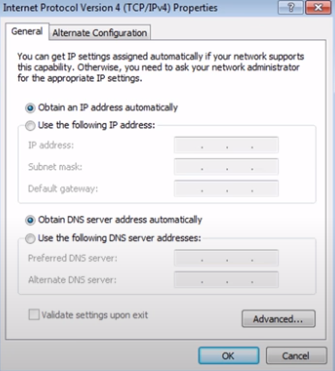

# Network Services

## DNS
`DNS` is an application layer service that uses UDP protocol.
`DNS - Domain Name Sysytem`:  is a global and highly distributed network service that resolves strings of letters into IP addresses.
Computers don't go by names but by numbers thus `www.bestSite.com` can't be understood by a pc, and it needs to be translated to an IP address.
DNS can be compared to a "phonebook" in some way.
DNS resolves domain name to IP addresses - this process is known as `name resolution`

Configuration needed for a host to operat on a network:
- IP
- Subnet mask
- Getaway 
- DNS server
___
### How DNS works
Five types of DNS servers:
1. `Caching name servers`: provided by ISP. Purpose is to store domain name lookups for a certain amount of time. Most caching name servers are also recursive name servers. 
2. `Recursive name servers`: provided by ISP. Performs full DNS resolution request. 
3. `Root name servers` 
4. `TLD name servers` 
5. `Authoritative name servers`

When you type `www.bestSite.com` into your web server, the DNS server will search through its database to find a matching IP address
for that domain name and if it finds it will resolve that domain name to the IP address of the requested website, and when is done your 
computer is able to communicate with bestSite web server and retrieve the page.

Steps:
When typing website in web browser and the web browser or your operational system can't find the IP address in its cache memory, the
query will be sent to the next level to a `resolver server/recursive name server - your ISP`. 
The resolver will check its own cache memory to find the IP address, if it can't find it, it will send the query to the `root server`.
Root servers are the top of the DNS hierarchy, there are 13 sets which were strategically placed around the world and are operated by 12
different organization. Each set of these root servers has their own unique IP address.
I say were because today they're mostly distributed across the globe via `Anycast` - a technique that's used to route traffic to different 
destinations depending on factors like location, congestion or link health.
Using Anycast, a computer can send a datagram to a specific IP, but could see it routed to one of many different actual 
destinations depending on a few factors.
This should also make it clear that there aren't really only 13 physical root name servers anymore.
It's better to think of them as 13 authorities that provide root name lookups as a service.

When the resolver asks the root wht is the IP for the searched web page, actually the root doesn't know it but the root does know where to send
the resolver to help it find the IP address.
So the root server will direct the resolver to `TLD - top level domain server` for the `.com` domain.
Noe the resolver will ask the TLD server for the www.bestSite.com IP address.
TLD server stores the address information for a top level,like .com, .net, .org. 
For each TLD in existence, there is a TLD name server. But just like with root servers, this doesn't mean 
there's only physically one server in question. It's most likely a global distribution of Anycast accessible servers 
responsible for each TLD.
The TLD name servers will respond again with a redirect, this time informing the computer performing the name 
lookup with what `authoritative name server` to contact.

 `Authoritative name servers` are responsible for the last two 
parts of any domain name, which is the resolution at which a single organization may be responsible for DNS lookups.
Using www.weather.com as an example, the TLD name server will point a lookup at the authoritative server for weather.com, 
which would likely be controlled by the weather channel, the organization itself that runs the site.
Finally, the DNS lookup could be redirected at the authoritative server for weather.com, which would finally provide the
actual IP of the server in question.
Authoritative name servers are responsible for knowing everything about a domain.
Now the resolver will tell your computer the IP and your computer can retrieve the bestSite.com web page.
Once the resolver will receive the IP address it will store it in its cache memory in case of a 
query for the same page, so it doesn't have to go through all these steps again.

This strict hierarchy is very important to the stability of the Internet. Making sure that all full 
DNS resolutions go through a strictly regulated and controlled series of lookups to get the correct responses is the 
best way to protect against malicious parties redirecting traffic. Your computer will blindly send traffic to whatever 
IP it's told to, so by using a hierarchical system controlled by trusted entities in the way DNS does, we can better ensure 
that the responses to DNS lookups are accurate. Now it makes sense why our local name servers to cache DNS lookups. It's so that full lookup path doesn't't have to happen for every single 
TCP connection. In fact, your local computer from your phone to a desktop will generally have its own temporary DNS cache as well. 
That way, it doesn't have to bother its local name server for every TCP connection either.

___
### DNS Records
Yhe authoritative name server has a database to resolve the name to IP address.
In a DNS database you have a `zone file` which contains DNS records.
There are many DNS records. The most common:

1. `A recored - Address record`: most common DNS record. This is what resolves a domain name to an IPv4 address

| Type | Name | IP address | TTL |
|------|------|------------|-----|
| A | example.com | 12.34.56.79 | 7200

A record is configured for a single domain name, but a single domain name can have multiple A records.
This allows for a technique known as `DNS round robin` to be used to balance traffic across multiple IPs.

`Round robin` is a concept that involves iterating over a list of items one by one in an orderly fashion.
The hope is that this ensures a fairly equal balance of each entry on the list that's selected.
Let's say we're in charge of a domain name www.microsoft.com. Microsoft is a large company, and their
website likely sees a lot of traffic. To help balance this traffic across multiple servers, we configure
four A records for www.microsoft.com at the authoritative name server for the microsoft.com domain.

We'll use the IPs 10.1.1.1, 10.1.1.2, 10.1.1.3, and 10.1.1.4. When a DNS resolver performs a
look up of www.microsoft.com, all four IPs would be returned in the order, first configured. 10.1.1.1
followed by 10.1.1.2, followed by 10.1.1.3, and finally 10.1.1.4.
The DNS resolving computer would know that it should try to use the first entry, 10.1.1.1. 
But it knows about all four just in case a connection to 10.1.1.1 fails. 
The next computer to perform a look up for www.microsoft.com, would also receive all four IPs in the response, 
but the ordering will have changed. The first entry would be 10.1.1.2, followed by 10.1.1.3,
followed by 10.1.1.4, and finally 10.1.1.1 would be last on that list. This pattern would continue for every
DNS resolution attempt, cycling through all of the A records configured, and balancing the traffic across these IPs.

2. `Quad A record`: is like A record

| Type | Name | IP address | TTL |
|------|------|------------|-----|
| AAAA | example.com | 2501:0:53b::3330:c2f4 | 7200

Resolves a domain name to an IPv6 address

3. `CNAME - Canonical name`: It resolves a domain or subdomain to another domain name.

| Type | Name | Alias to | TTL |
|------|------|------------|-----|
| CNAME | www.example.com | example.com | 7200

Computers read domain from right to left and a domain name will have several parts:

`example.com.` ---> the dot is hidden we don't see it

| Subdomain | 2nd level domain | Top level domain | Root domain |
|-----------|------------------|------------------|-------------|
| www. | example | .com | .

DNS can technically support up to 127 levels of domain in total for a single fully
qualified domain name = www.example.com

Subdomains are also often used when a website has different services running on the same server
and are using the ame IP address.
For example let's say that example.com has an FTP service running on the same server as their website.
In this case they can create a subdomain as ftp.ecample.com for their FTP service on the server
and the they can create a CNAME record and have it directed to example.com.
So when a user types in the web browser ftp.example.com, DNS will look at the CNMAE record
and forward the users to example.com, even though is pointing to example.com but once
the request reaches the web server, the web will inspect the URL that the user has typed and direct
it to FTP services.

4. `MX record - Mail exchanger record`: used for mail exchanger record. MX record tells the world which server to send
email for a particular domain name.

The generally have two entries `Primary email server` and  `Secondary email server`

The lower the `priorty number` means that it's the primary email server.
If the primary email server is overwhelmed or goes down, then the secondary email server would be used.

| Type | Priority| Name | Host | TTL |
|------|---------|------|-----|------|
| MX | 10 | example.com | mail1.exemple.com | 7200 
| MX | 20 | example.com | mail2.exemple.com | 7200 

The MX record simply points to the server where emails should be delivered for that domain name.
When you send an email to Tom@exampoe.com, your MTA or mail transfer agent will query the MX record for
example.com because it's looking for an email server. And then DNS will respond back telling MTA which server to
send tha email to which in this case would be mail1.exemple.com

5. `SOA - start of authority`: it stores administrative information about `DNS zone`.

MNAME is the primary name server
RName is the email address for the zone administrator the `.` is equivalent to `@`
Serial # represents a version in the zone

| Type | MName | RName | Serial # | Retry | TTL |
|------|-------|-------|----------|-------|-----|
| SOA | ns1.example.com | admin.example.com | 510025 | 60 | 7200

A `DNS zone` is a section of a domain name space that a certain administrator has been delegated control over.
The root and TLD name servers are actually just authoritative name servers too. It's just that the zones at
their authority for are special cases. I should call out that zones don't overlap. For example the
administrative authority of the TLD name server for the.com TLD doesn't encompass the google.com domain.
Instead, it ends at the authoritative server responsible for google.com. The purpose of DNS zones is to allow 
for easier control over multiple levels of a domain

`Zone files` = Simple configuration files that declare all resource record for a particular zone.

DNS zones allow a domain namespace like example.com to be divided into different sections.
So if we break example.com in 3 subdomains: shop.example.com, blog.example.com, support.example.com
DNS zones can be created and delegate control over these subdomains to a different administrators.

6. `NS - name server`: provides the name of the authoritative name server within a domain.

NS record lists two name servers `primary` and `secondary`

| Type | Value | Name | TTL |
|------|------|-------|-----|
| NS | ns1.example.com | example.com | 7200
| NS | ns2.example.com | example.com | 7200

7. `SRV - service record`: points to a server and it'll also point to a specific service
by including port numbers.

| Type | Priority | Service | Port | Name | Weight | TTL |
|------|----------|---------|------|------|--------|-----|
| SRV | 10 | service.example.com | 999| example.com |0 | 7200

So when an application needs to find the location of a service on a domain such as voice over IP
instant messaging, or a printer, it will look for a service record to see if there's a listing for
that specific service and it will direct it to the correct server and correct port number.

8. `PTR - pointer record`: is the revers of A record. The resolve IP addresses to domain name.

| Type | IP address | Name  | TTL |
|------|------|------------|-----|
| PTR | 12.34.56.78 | example.com | 7200

PTR record are attached to email and are used to prevent email spam. So whenever an email is received,
the email server uses the PTR record to make that the sender is authentic by matching the domain name
in the email with is authentic IP address - `revers DNS lookup`. Otherwise, the email will be flagged as spam

`Reverse loopup zone files` These let DNS resolvers ak for IP and get the FQDN associated with it returned.

9. `TXT - text`: contains miscellaneous information about the domain such as general or contact information

| Type | Name | IP address | TTL |
|------|------|------------|-----|
| TXT | example.com | This is a sample text for this domain | 7200

Also used to prevent email spam by making sure incoming email is coming from 
a trusted or authorized source.
___
### DHCP
`Dinamic host Configuration protocol`: Every computer on a network has to have an IP address for communication purpose.
There are 2 ways that a computer can be assigned an IP address:
1. Static IP: where a user assigns a device with an IP address manually.

2. Dynamic IP: A device gets an IP address automatically from a DHCP server.
DHCP can also assign a subnet mask, default getaway, DNS server

If you choose this option your device will broadcast a request for an IP address on the network then the DHCP server
will assign an IP address from its pool and deliver it to the device.
You can verify all the different setting that the DHCP serve has given with `ipconfig /all` on Windows.
DHCP servers assigns this information from its scope which determines the range of IP addresses that it can assign:

Start IP Address: 10.0.0.1
End IP Address: 10.0.0.100

Is important to point out that the DHCP server assigns the IP address as a lease - the amount of time
an IP address is assigned to a computer, this is to prevent that the DHCP server does not run out of IP addresses.
The devices have to as for renewal of the IP.

If you want to have a device with a specific IP address on the network all the time
you can create a reservation on the DHCP server. A reservation ensures that a specific device
identified by its MAC address, will always be given the same IP address when that device
request an IP address from the DHCP server.
Reservations ar typically given to special devices or computers such as networks printers, servers, routers, etc.
because devices like these should be given the same IP address constantly.

DHCP is service that runs on a server, but it also runs on many routers also.

___
## Sources
- PowerCertAnimated videos, How a DNS Server (Domain Name System) works, https://www.youtube.com/@PowerCertAnimatedVideos
- PowerCertAnimated videos, DNS record explained, https://www.youtube.com/@PowerCertAnimatedVideos
- PowerCertAnimated videos, DHCP Explained - Dynamic Host Configuration Protocol, https://www.youtube.com/@PowerCertAnimatedVideos
- Google, The Bits and Bytes of Computer Networking, https://www.coursera.org/