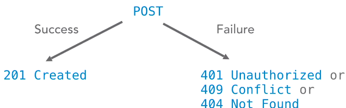
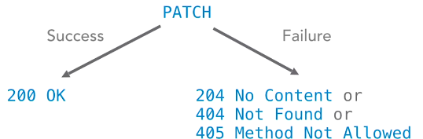
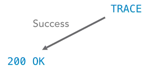
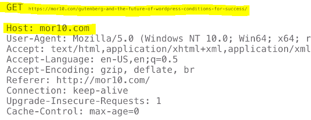
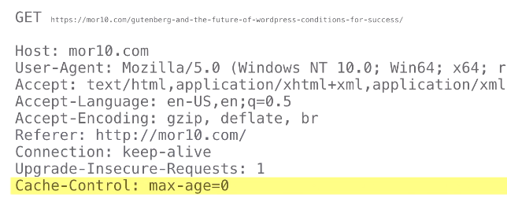
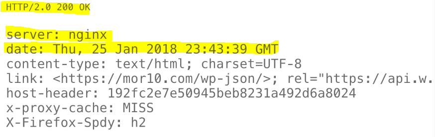
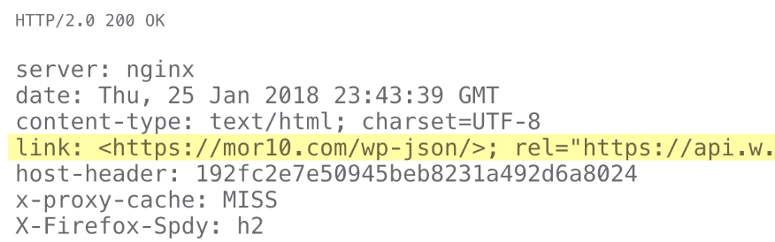

# HTTP, HTTP2, HTTPS
Hypertext Transfer Protocol:
 - Protocol: system of rules that allow communication of information between different entities, like computers.

 - Hypertext: Hypertext is a somewhat outdated word for text that is displayed on a computer screen that contains hyperlinks to other text.  
web document.

Hypertext transfer protocol is the set of rules, servers and browsers used to transfer web documents back and forth.

This why every URL you type into a web browser starts with http.

### HTTP principles:
1. ```Plain language and human readable```: HTTP request methods: GET, POST, PUT, DELETE, CONNECT itp.  
2. ```Stateless protocol```: each individual request sent over the protocol is unique, and no request is connected to another request - has no memory of previous requests.  
3. ```Sessions```: Are stored states shared between the browser and the server.
The browser and server can exchange information about where you are in the sequence by passing back and forth information in form of cookies.  
In other words:  
Reload the page, and the browser sends along a cookie to the server saying, "Hey, last time we spoke we were looking at the third picture, start there."  
4. ```HTTP Headers```: That passing of cookies that allows HTTP to preserve sessions is made possible by the extensibility of HTTP.
When request and responses are sent over HTTP we can include headers, they carry information about everything from  
type of client sent the requests, server configuration, time and dates, duration of data storage, data format, cookies used to track sessions etc.  
5. ```HTTP works based on request/response pairs```: Every action performed over HTTP starts with a request using one of the HTTP methods
and ends with a response containing an HTTP status code saying what happened to the request along with the data like headers and content.  

```Some terminology```:
Browser: application used to access and navigate between HTML documents.  
User Agent: Application acting on behalf of the user - typically a browser.  
URL: Uniform Resource Locator
Proxy: Software or hardware service acting as a middle person between clients and servers.
Cache: Method of storing data on the client or server to speed up  performance.  

## Request/Response
### Anatomy of URL
URL: Human readable address describing where on the web a particular resources i s located.  


`URN` provides the location of the resource and is made up of several pieces:  


`Host`: this is the domain which is registered at a domain name service - DNS. And this domain points to a dedicated server IP address, somewhere on the web.  
`Port number`: Implied and usually invisible connection port, stating which port we want to access on the server. For http is  80 for https is 443.  
If the server uses another port or we want to access another port, say 8080, that port can be declared using a colon, localhost:8080.  
`Resource path`: This is the file location within the server. The default names for web documents are index.html and default.html, or just htm, or something like that.
If we request a folder without a file specification, the server and browser automatically look for files named either index.html or default.html or index.php or similar and returns that file to us.
If the file is called anything else, like about.html or contact.php, etc., the resource path needs to list the filename specifically, so mysite.com/folder/about.html.  
`URL query`: This is one or more queries added to the end of the resource path that can perform further actions on the server.
In some cases, such queries are used to track a user's ID, in others they're used to filter content or perform other actions.
URL queries start with a question mark and then each query comprises an argument and a value like u=1234. These queries can be strung together, using the ampersand symbol.  

### Methods
For standard web transactions we use typically 3: GET, POST, DELETE.
Other examples:
PUT
PATCH
HEAD
OPTIONS
TRACE

`GET`: Get the specified resources, if available.
A GET request for a public resource only needs the method and the URL to work.
If this resource sits behind a security layer, the request typically also needs an authorization header
containing an encrypted username and password pair and may require a cookie containing an authentication token


To send the data from the client to the server we use: POST, PUT, PATCH

`POST`: Create a new resources and add it to a collection
A POST request asks the server to create a new resource and give it an ID for future retrieval.
Because POST requests make changes to the server, they typically need an authorization header.



`PUT`: Update an existing singleton resources based on ID.
PUT is used to update an existing resource by replacing some or all of its contents with the contents of the request.
Like POST, PUT typically requires an authorization header.
Unlike POST, which just contains the contents, a PUT request contains the ID of a resource and the new content to be added to that resource.
If the resource already exists, the existing content is replaced with the contents in the PUT request.
If no resource with this ID exists, the server will in some cases allow the new resource to be created
with the user defined ID or you'll get an error message.


`PATCH`: Modify an existing singleton resource based on ID.
PATCH is used to modify an existing resource. Where PUT updates the resource by replacing content, Patch can carry along instructions on how to modify
the existing resource without necessarily replacing data.
PATCH also typically requires an authorization header and returns the same status as PUT.



`DELETE`: Delete a singleton resources based on ID.
It deletes a specified resource. A DELETE request must contain the ID for the resource and an authorization header.


`Methods to get infomration from  server`:  
`HEAD`: Get just the response headers from the resources


`OPTIONS`: Get the options available from this resources


`TRACE`: Create a loopback for the request message.



## HTTP status messages

1xx - Information  
2xx - Success  
3xx - Redirection  
4xx - Client error  
5xx - Server error  
___
## HTTP headers
An HTTP header is a human readable name value pair separated by a colon, added to the HTTP request or response,  
which can be used to pass standard or custom information back and forth between the client and the server.
A request can hold as many headers as are needed, each separated by a line break.

E.g:
Say you want to send a POST request to a content management system to create a new resource.  
To make this work, you first have to authenticate yourself to prove to the server you have the correct authorization to create new resources.
In it's most basic form, this type of authentication
is done by sending an authentication header with basic authentication information, a username and a password.
In the real world, the username password combo is Base64 encoded, to ensure it doesn't get misunderstood as a text string  when passed to the server.

If a server wants, or needs, the client to remember where it has been or what state it is in, it can use a set cookie header,
to give the client a cookie, a small piece of data.
The next time the client visits the server, it sends the cookie back, and the server brings the client to the right state.

If a server wants the client to cache, so effectively save some data for specific period of time,
it can send one or several cache headers.
These headers tell the browser what files to save, whether cached files should be updated,
and for how long they should be kept.

Caching files can dramatically improve performance cause you're not sending as many files
back and forth every time you're reloading a page, but when files are cached in the browser,
the browser will not receive any new versions of those files until the cached files are either cleared or have expired.  
Headers are also often used to provide information about the client or the server.  
This can be anything from date and time information about the request response pair,
to a user agent header identifying the client, a server header identifying the software used by the server,
proxy information, security information, cross origin resource sharing information,
and much more.
With HTTP2 and other modern technologies, we're also seeing new headers come online including Link,
which allows us to use server Push, to push files to the client before they are requested.

### Anatomy of a request header
Example:

First the client states what method is using and what resources it's requesting using a regular URL.



Next, the client adds in a user-agent header to identify itself, lists out what file types, language types and encoding types it accepts,  


tells the server where it came from, using the refer header,


tells it to keep the connection alive for future requests


and sets the cache-control of the current file to zero seconds, meaning it will not be saved when it arrives.



### Anatomy of a response header
Example:

This response header declares the status of the response 200 OK, the server type, the date and time of the response  
message, the content type of the return data, and other information.




In addition comes the entire payload which in this case is html document.



The client in our case, the Firefox browser, receives this header and processes whatever data  
is returned in the payload according to the header content.  
In this example that is to render the content of the return of the html document.


___
## Analyzing traffic logs example
Example of log file (access.log):

```
192.168.1.1 - alice [10/Nov/2024:13:01:15 -0500] "GET /index.html HTTP/1.1" 200 2456 "http://example.com/home" "Mozilla/5.0 (Windows NT 10.0; Win64; x64) AppleWebKit/537.36 (KHTML, like Gecko) Chrome/95.0.4638.54 Safari/537.36"
203.0.113.25 - bob [10/Nov/2024:13:01:50 -0500] "POST /login HTTP/1.1" 302 512 "http://example.com/login" "Mozilla/5.0 (Windows NT 10.0; Win64; x64) AppleWebKit/537.36 (KHTML, like Gecko) Chrome/95.0.4638.54 Safari/537.36"
198.51.100.42 - charlie [10/Nov/2024:13:02:15 -0500] "OPTIONS /api/ HTTP/1.1" 204 0 "http://example.com/" "Mozilla/5.0 (Macintosh; Intel Mac OS X 10_15_7) AppleWebKit/537.36 (KHTML, like Gecko) Chrome/92.0.4515.159 Safari/537.36"
192.168.1.3 - dave [10/Nov/2024:13:03:00 -0500] "PATCH /profile HTTP/1.1" 200 1024 "http://example.com/settings" "Mozilla/5.0 (Windows NT 10.0; Win64; x64) AppleWebKit/537.36 (KHTML, like Gecko) Firefox/92.0"
203.0.113.20 - eve [10/Nov/2024:13:03:30 -0500] "PUT /settings/update HTTP/1.1" 200 512 "http://example.com/settings" "Mozilla/5.0 (Windows NT 10.0; Win64; x64) AppleWebKit/537.36 (KHTML, like Gecko) Edge/95.0"
198.51.100.55 - frank [10/Nov/2024:13:04:10 -0500] "DELETE /account HTTP/1.1" 204 0 "http://example.com/settings" "Mozilla/5.0 (Macintosh; Intel Mac OS X 10_15_7) AppleWebKit/537.36 (KHTML, like Gecko) Safari/537.36"
192.168.1.1 - alice [10/Nov/2024:13:05:00 -0500] "GET /assets/js/main.js HTTP/1.1" 304 - "http://example.com/index.html" "Mozilla/5.0 (Windows NT 10.0; Win64; x64) AppleWebKit/537.36 (KHTML, like Gecko) Chrome/95.0.4638.54 Safari/537.36"
203.0.113.25 - bob [10/Nov/2024:13:06:05 -0500] "POST /api/submit HTTP/1.1" 200 4321 "http://example.com/form" "Mozilla/5.0 (Windows NT 10.0; Win64; x64) AppleWebKit/537.36 (KHTML, like Gecko) Chrome/95.0.4638.54 Safari/537.36"
198.51.100.42 - charlie [10/Nov/2024:13:07:12 -0500] "OPTIONS /api/items HTTP/1.1" 204 0 "http://example.com/items" "Mozilla/5.0 (Macintosh; Intel Mac OS X 10_15_7) AppleWebKit/537.36 (KHTML, like Gecko) Chrome/92.0.4515.159 Safari/537.36"
192.168.1.3 - dave [10/Nov/2024:13:07:40 -0500] "GET /contact HTTP/1.1" 200 1723 "http://example.com/" "Mozilla/5.0 (Windows NT 10.0; Win64; x64) AppleWebKit/537.36 (KHTML, like Gecko) Firefox/92.0"
203.0.113.20 - eve [10/Nov/2024:13:08:25 -0500] "PUT /api/update-item HTTP/1.1" 200 2134 "http://example.com/items" "Mozilla/5.0 (Windows NT 10.0; Win64; x64) AppleWebKit/537.36 (KHTML, like Gecko) Edge/95.0"
198.51.100.55 - frank [10/Nov/2024:13:09:15 -0500] "PATCH /items/1234 HTTP/1.1" 200 1298 "http://example.com/items/1234" "Mozilla/5.0 (Macintosh; Intel Mac OS X 10_15_7) AppleWebKit/537.36 (KHTML, like Gecko) Safari/537.36"
192.168.1.1 - alice [10/Nov/2024:13:09:45 -0500] "GET /about HTTP/1.1" 200 1950 "http://example.com/contact" "Mozilla/5.0 (Windows NT 10.0; Win64; x64) AppleWebKit/537.36 (KHTML, like Gecko) Chrome/95.0.4638.54 Safari/537.36"
...
```
Each individual line represents a request.
Analysis:
```
cat access.log | cut -f 6 -d " " | sort | uniq -c | sort -n
7 "OPTIONS
12 "CONNECT
21 "-"
51 "HEAD
235 "POST
2997 "GET --> maybe a web scraping was searching for info?
```
```
cat access.log | grep "OPTIONS 

OTPIONS lists all teh method the the server supports
this can be an indicator on attacker trying to do an enumeration

POST to check is somone is uploading data
```
To check teh requested resource (after the HTTP method):
```
cat access.log | cut -f 7 -d " " | sort | uniq -c | sort -n

...
118 robots.txt
898 / --> root level of web page

robots.txt: resource to tell bots and web crawlers what part of the page you don't want them to be indexed
attacker use it so look for sensitive info and restricted areas.
```
Extract response status:
```
cat access.log | cut -f 9 -d " " | sort | uniq -c | sort -n
to see a t what file are pointing
cat access.log | cut -f 7,9 -d " " | sort | uniq -c | sort -n | grep "404"
```
___
## Sources
- M. Rand-Hendriksen, HTTP Essential Training, https://www.linkedin.com/learning/http-essential-training
- B. DeVault, Network Protocols for Security: HTTP, https://app.pluralsight.com/