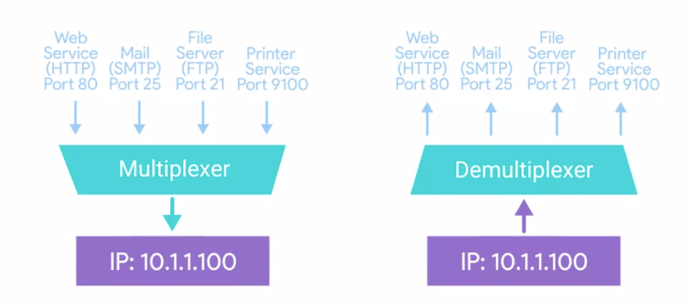
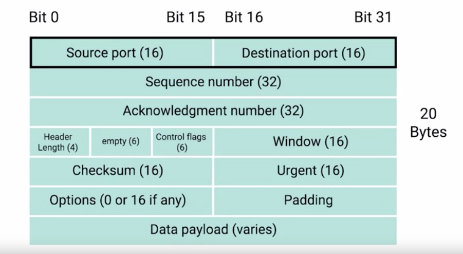
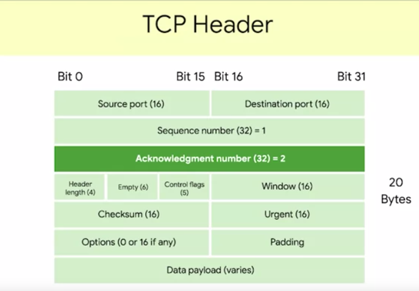
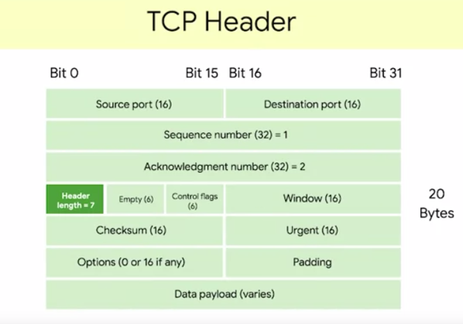

# Transport layer
The transport layer has the ability to `multiplex` and `demultiplex`.

Multiplexing: nodes on a network have the ability to direct traffic toward many different receiving services.
Demultiplexing: is the same concept just at the receiving end, it's taking traffic that's all aimed at the same node and delivering it to the proper receiving service.

Multiplexing and demultiplexing is handled via `ports`.
Port: a 16-bit number that's used to direct traffic to specific services/server running on a networked computer

A server or service is a program running on a computer waiting to be asked for data. 
A client is another program that is requesting this data. 
Different network services run while listening on specific ports for incoming requests. 
For example, the traditional ports for http or unencrypted web traffic is ports 80. 
If we want to request a web page from a web server running on a computer listening on IP 10.1.1.100, 
the traffic would be directed to port 80 on that computer. 
Ports are normally denoted with a colon after the IP address. So the full IP and ports in this scenario could be described as 10.1.1.100:80

TCP = Transmission Control Protocol = garantees that all thae date is recived and is in the rioght order
TCP is a connection-oriented protocol, which  basically means that it must first acknowledge a session
between the two computers that are cummunicating, the two machines verify a connection befor any connection takes places
to do this it uses the three-way handshake:
1. Sender computer sends a messega cale SYN
2. Reciving computer will send back an acknowlegment message SYN ACK
3. Sender computer sends another acknolwedgment message
Once this three steps have taken place data can be delivered. TCP also garantees the delivery of the data, if a data packet goes misssing TCP will resnd it

UDP = User Datagram protocol = is connection-less it dosen't establish a session and does not guarantee data delivery, fire and forget protocol
but is faster than TCP
___
## TCP segment
`TCP segment` = made up of a TCP header and a data section, data section, is just another payload area for where the application layer places its data.

`Source and destination ports`: The destination port is the port of the service the traffic is intended for.
A source port is a high numbered port chosen from a special section of ports known as `ephemeral ports`.
Source port is needed to keep lots of outgoing connection separate, a source port is needed so that when the web server replies, 
the computer making the original request can send this data to the program that was actually requesting it. 
It is in this way that when a web server responds to your request to view a webpage, 
that this response gets received by your web browser and not your word processor. 

`Sequence number`: 32-bit number that's used to keep track of where in a sequence of 
TCP segments this one is expected to be. You might remember that lower on our protocol stack, 
there are limits to the total size of what we send across the wire. 
An Ethernet frame is usually limited in size to 1,518 bytes, but we usually need to 
send way more data than that. At the transport layer, TCP splits all of this data up into many segments. 
The sequence number in a header is used to keep track of which segment out of many this particular segment might be. 

`Acknowledgment number`: The acknowledgment number is the number of the next expected segment. 
In very simple language, a sequence number of 1 and an acknowledgment number of 2 could be read as this is segment 1, expect segment 2 next. 

`Data offset`: This field is a four-bit number that communicates how long the TCP header for this segment is. 
This is so that the receiving network device understands where the actual data payload begins. 

Then we have six bits that are reserved for the six TCP control flags. 

`TCP window`: is a 16-bit number. A TCP window specifies the range of sequence numbers that might be sent before an acknowledgment is required. 
TCP is a protocol that's super reliant on acknowledgments. This is done in order to make sure that all expected data is actually being received, 
and that the sending device doesn't waste time sending data that isn't being received. 

`TCP checksum`: is a 16-bit number. It operates just like the checksum fields at the IP and Ethernet level. 
Once all of this segment has been ingested by recipient, the checksum is calculated across the entire segment and is compared with the checksum in the header 
to make sure that there was no data lost or corrupted along the way. 

U`rgent pointer`: field is used in conjunction with one of the TCP control flags to point out particular segments that might be more important than others. 

`Options field`: Like the urgent pointer field, this is rarely used in the real-world, but it's sometimes used for more complicated flow control protocols. 

`Padding`: which is just a sequence of zeros to ensure that the data payload section begins at the expected location.

___
## Sources
- PowerCertAnimated videos, Comparison between TCP and UDP, https://www.youtube.com/@PowerCertAnimatedVideos

