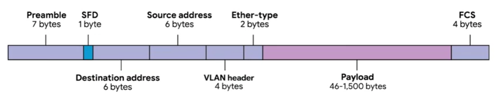

# Data Link
Basically abstract away the need for any other layers to care about the physical layer and what hardware is in use. 
In this way the internet transport and application layers can all operate the same no matter how the device they're running on is connected.
## Ethernet, MAC address
Before ethernet devices a network shared a `single collision domain` - a network segment where only one device can speak at a time,
because all data in a collision domain is sent to all the nodes connected to it.
If two computers were to send data across the wire at the same time, this would result in literal 
collisions of the electrical current representing ones and zeros, leaving the end result unintelligible. 

Ethernet as a protocol solve this problem by using a technique known as `carrier sense multiple access with collision detection - CSMA CD`.
`CSMA CD` is used to determine when the communications channels are clear and when the device is free to transmit data. 
If there's no data currently being transmitted on the network segment, a node will feel free to send data. 
If it turns out that two or more computers end up trying to send data at the same time, the computers 
detect this collision and stop sending data. Each device involved with the collision then waits a random interval of time before trying to send data again.

When a network segment is a `collision domain`, it means that all devices on that segment receive all communication across the entire segment. 
We need a way to identify which node the transmission was actually meant for we use `MAC address -  media access control`. 
A MAC address is a globally unique identifier attached to an individual network interface. 
It's a 48-bit number normally represented by six groupings of two hexadecimal numbers. Just like how binary is a way to represent numbers 
with only two digits. Hexadecimal is a way to represent numbers using 16 digits. 
Additional hexadecimal numbers employ the letters A, B, C, D, E and F to represent the numbers 10, 11, 12, 13, 14 and 15, we don't have numerals to represent any individual digit larger than nine.
Another way to reference each group of numbers in a MAC address is an octet. In octet, in computer networking is any number that can be 
represented by 8-bits. In this case, two hexadecimal digits can represent the same numbers that 8-bits can. 
MAC addresses are globally unique, there are a lot of combination for a 48-bit number.
The total number of possible MAC addresses that could exist is two to the power of 48 or 281.474.976.710.656 unique possibilities. 

A MAC address is split into two sections. 
The first three octets of a MAC address are known as the `organizationally unique identifier or OUI`. 
These are assigned to individual hardware manufacturers by the IEEE or the Institute of Electrical and Electronics Engineers. 
This is a useful bit of information to keep in your back pocket because it means that you can always identify the manufacturer of a 
network interface purely by its MAC address. 
The last three octets of a MAC address can be assigned in any way that the manufacturer would 
like, with the condition that they only assign each possible address once to keep all MAC addresses globally unique. 
Ethernet uses MAC addresses to ensure that the data it sends has both an address for the machine that sent the transmission, as well as, 
the one that the transmission was intended for. In this way, even on a network segment acting as a single collision domain, each node on that 
network knows when traffic is intended for it.

`Data packet` is an all-encompassing term that represents any single set of binary 
data being sent across a network link. One set of data being sent from point A to point B.

Data packets at the Ethernet level are known as `Ethernet frames`. 
An Ethernet frame is a highly structured collection of information presented in a specific order. 
This way, network interfaces at the physical layer can convert a stream of bits traveling across a 
link into meaningful data or vice versa. 

Ethernet frame:

Almost all sections of an Ethernet frame are mandatory, and most of them have a fixed size. 
The first part of an Ethernet frame is known as the `preamble`. A preamble is eight bytes or 64 bits long, and can itself be split into two sections. 
The first seven bytes are a series of alternating ones and zeros. These act partially as a buffer between frames and can also be used by the network 
interfaces to synchronize internal clocks they use to regulate the speed at which they send data. 
This last byte in the preamble is known as the `SFD, or start frame delimiter`. 
This signals to a receiving device that the preamble is over and that the actual frame contents will now follow.

Immediately following the start frame delimiter, comes the `destination MAC address`. 
This is the hardware address of the intended recipient, which is then followed by the source MAC 
address or where the frame originated from. MAC address is 48 bits or six bytes long.

The next part of an Ethernet frame is called the `Ether-type field`. 
It's 16 bits long and used to describe the protocol of the contents of the frame.
It's worth calling out that instead of the Ether-type field, you can also find what's known as a `VLAN header`. 
It indicates that the frame itself is what's called a `VLAN frame`. If a VLAN header is present, the Ether-type field follows it. 
VLAN stands for virtual LAN. It's a technique that lets you have multiple logical LANs operating on the same physical equipment. 
Any frame with a VLAN tag will only be delivered out of a switch interface configured to relay that specific tag. This way, you can 
have a single physical network that operates like its multiple LANs. VLANs are usually used to 
segregate different forms of traffic.

After this, you'll find the `data payload` of an Ethernet frame. A payload in networking 
terms is the actual data being transported, which is everything that isn't a header. 
The data payload of a traditional Ethernet frame can be anywhere from 46-1500 bytes long. 
This contains all of the data from higher layers, such as the IP, transport, and application 
layers that actually being transmitted. 

Following that data, we have what's known as a `frame check sequence`. 
This is a four-byte or 32-bit number that represents a checksum value for the entire frame. 
This checksum value is calculated by performing what's known as a cyclical redundancy check against the frame. 
A `cyclical redundancy check, or CRC`, is an important concept for data integrity and is used all over computing. 
A CRC is basically a mathematical transformation that uses polynomial division to 
create a number that represents a larger set of data. Anytime you perform a CRC against a set of data, 
you should end up with the same checksum number. The reason it's included in an Ethernet 
frame is so that the receiving network interface can infer if it received uncorrupted data.
When a device gets ready to send an Ethernet frame, it collects all the information described above, 
like the destination and originating MAC addresses, the data payload, and so on. 
Then it performs a CRC against that data and attaches the resulting checksum number as the frame check sequence 
at the end of the frame. This data is then sent across a link and received at the other end. 
Here, all the various fields of the Ethernet frame are collected, and now the receiving side performs a CRC against that data. 
If the checksum computed by the receiving end doesn't match the checksum in the frame check sequence field, the data is thrown out. 
This is because some amount of data must have been lost or corrupted during transmission. 
It's then up to a protocol at a higher layer to decide if that data should be retransmitted. 
Ethernet itself only reports on data integrity, it doesn't perform data recovery.
___
## Sources
- Google, The Bits and Bytes of Computer Networking, https://www.coursera.org/