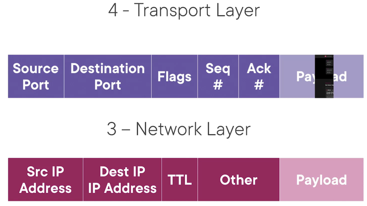

## OSI model (Open Systems Interconnection Model)

| Level | Layer Name | Protocol | Protocol Data Unit | Addressing | Explanation |
|-------|------------|----------|--------------------|------------|-------------|
| 7 | Application | HTTP, FTP, IRC, SSH, DNS etc...| Messages | n/a | End user layer. The application layer of the OSI model is the layer that you will be most familiar with. This familiarity is because the application layer is the layer in which protocols and rules are in place to determine how the user should interact with data sent or received. Everyday applications such as email clients, browsers, or file server browsing software such as FileZilla provide a friendly, Graphical User Interface (GUI) for users to interact with data sent or received. Other protocols include DNS (Domain Name System), which is how website addresses are translated into IP addresses.
| 6 | Presentation | SSL, SSH, IMAP, FTP, MPEG, JPEG | | |  Syntax layer. Layer 6 of the OSI model is the layer in which standardisation starts to take place. Because software developers can develop any software such as an email client differently, the data still needs to be handled in the same way — no matter how the software works. This layer acts as a translator for data to and from the application layer (layer 7). The receiving computer will also understand data sent to a computer in one format destined for in another format. For example, when you send an email, the other user may have another email client to you, but the contents of the email will still need to display the same. Security features such as data encryption (like HTTPS when visiting a secure site) occur at this layer.
| 5 | Session | ApI's, Sockets, WinSock | | | Synch & send to port. Once data has been correctly translated or formatted from the presentation layer (layer 6), the session layer (layer 5) will begin to create and maintain the connection to other computer for which the data is destined. When a connection is established, a session is created. Whilst this connection is active, so is the session. The session layer is also responsible for closing the connection if it hasn't been used in a while or if it is lost. Additionally, a session can contain "checkpoints," where if the data is lost, only the newest pieces of data are required to be sent, saving bandwidth. What is worthy of noting is that sessions are unique — meaning that data cannot travel over different sessions, but in fact, only across each session instead.
| 4 | Transport | TCP, UDP | Segment | Port#'s | Sorts out which client and server programs are supposed to get that data. End-to-end connection.
| 3 | Network | IP, ICMP, IPSec, IGMP | Packet/Diagram | IP Address | Allows different networks to communicate with each other through devices known as routers
| 2 | Data Link | Ethernet, PPP, Switch, Bridge | Frames | MAC Address | Responsible for defining a common way of interpreting these signals so network devices can communicate. The data link layer focuses on the physical addressing of the transmission. It receives a packet from the network layer (including the IP address for the remote computer) and adds in the physical MAC (Media Access Control) address of the receiving endpoint. Inside every network-enabled computer is a Network Interface Card (NIC) which comes with a unique MAC address to identify it. MAC addresses are set by the manufacturer and literally burnt into the card; they can’t be changed – although they can be spoofed. When information is sent across a network, it’s actually the physical address that is used to identify where exactly to send the information. Additionally, it’s also the job of the data link layer to present the data in a format suitable for transmission.
| 1 | Physical | n/a | Bits | n/a | Physical devices that interconnect computers (Coax, fiber, wireless, hubs, repeaters)
___
## TCP/IP five layer model

| Level | Layer Name | Protocol | Protocol Data Unit | Addressing | Explanation |
|-------|------------|----------|--------------------|------------|-------------|
| 5 | Application | HTTP,SMTP etc...| Messages | 7,6,5 OSI layers | 
| 4 | Transport | TCP/UDP | Segment | Port#'s | Sorts out which client and server programs are supposed to get that data. End-to-end connection
| 3 | Network | IP | Packet/Datagram | IP Address | Allows different networks to communicate with each other through devices known as routers
| 2 | Data Link | Ethernet, Wi-Fi | Frames | MAC Address | Responsible for defining a common way of interpreting these signals so network devices can communicate. The data link layer focuses on the physical addressing of the transmission. It receives a packet from the network layer (including the IP address for the remote computer) and adds in the physical MAC (Media Access Control) address of the receiving endpoint. Inside every network-enabled computer is a Network Interface Card (NIC) which comes with a unique MAC address to identify it. MAC addresses are set by the manufacturer and literally burnt into the card; they can’t be changed – although they can be spoofed. When information is sent across a network, it’s actually the physical address that is used to identify where exactly to send the information. Additionally, it’s also the job of the data link layer to present the data in a format suitable for transmission.
| 1 | Physical | n/a | Bits | n/a | Physical devices that interconnect computers
___
## TCP/IP 

| Level | Layer Name | OSI model layers|
|-------|------------|----------|
| 4 | Application | 7,6,5
| 3 | Host to Host | 4
| 2 | Internet | 3
| 1 | Network Access | 2,1

`Etherent`: Ethernet standards also define a protocol responsible for getting data 
to nodes on the same network or link  
`Internetwork`: A collection of networks connected together throughout routers (Internet)

The physical layer is the delivery truck and the roads. The data link layer is 
how the delivery trucks get from one intersection to the next over and over. 
The network layer identifies which roads need to be taken to get from address A to address B. 
The transport layer ensures that delivery driver knows how to knock on your door 
to tell you your package has arrived. 
And the application layer is the contents of the package itself.
___
## Unicast, Multicast, Broadcast
`Unicast`: one device transmits data to another device.  
A unicast transmission is always meant for just one receiving address. 
At the ethernet level this is done by looking at a special bit in the destination MAC address. 
If the least significant bit in the first octet of a destination address is set to zero, 
it means that ethernet frame is intended for only the destination address. 
This means it would be sent to all devices on the collision domain, but only actually received and processed by the intended destination.

`Multicast`: If the least significant bit in the first octet of a destination address is set to one, it means you're dealing with a multicast frame. 
A multicast frame is set to all devices on the local network segment. It will be accepted or discarded by each device depending on criteria 
aside from their own hardware MAC address. Network interfaces can be configured to accept 
lists of configured multicast addresses for these sorts of communications. 

`Broadcast`:  In ethernet, broadcast is sent to every single device on a LAN. 
This is accomplished by using a special destination known as a broadcast address. 
The ethernet broadcast address is all F's `FF:FF:FF:FF:FF:FF`. Ethernet broadcasts are used so that devices can learn more about each other.
___
## Encapsulation
Packets and frames are small pieces of data that, when forming together, make a larger piece of information or message. However, they are two different things in the OSI model. A frame is at layer 2 - the data link layer, meaning there is no such information as IP addresses. Think of this as putting an envelope within an envelope and sending it away. The first envelope will be the packet that you mail, but once it is opened, the envelope within still exists and contains data (this is a frame).
This process is called encapsulation
`Encapsulation`:  

Application layer = in this case the actual website
Using Hypertext Transfer Protocol, HTTP because websites are written in HTML
The website can be quite large, so it has to be "broken up" into smaller chunks to be sent,
this is because some protocols like `Ethernet`, has a maximum amount of data that we can transfer for each frame that we send. 
For each chunk of data that we send across the network, we have a maximum amount of data that we can send in each one. 
The application layer, works in conjunction with the transport layer to take that data, break it into smaller pieces, and then add it to a header.

The transport layer, sets up a session between our client and our server, we need specific information in there to allow that to happen (like an envelope for a letter, here the "envelope" is called a `segment`). 
In this case, it's a source port, a destination port number, some flags, which is just some general information about what's happening in the transaction, a sequence number, 
an acknowledgement number, and those keep track of how much data has been sent and received. 

This information allows the client and the server to set up a session and keep track of what data has been sent and received. 

Now, that's just one component of this transaction. In order to know where we are sending this data, we need to tell it what the source and 
destination IP addresses are. 
So we need to know where on the internet or on a network the server and the client are. 
So we take our transport layer information, which is going to keep that session between our endpoints going, and then we send it down to the network layer, 
so we take our segment and it becomes the payload of our network layer.

and then we add this header, we add the source IP, destination IP, a value called the TTL, or time to live, 
which tells it how far this packet can travel at a maximum distance, 
and other information that we add into the network layer header to make this transaction work correctly. 

So now we have our segment inside the payload of our network layer header. This is called a `packet`. 

This particular one is an IP header, or Internet Protocol, specifically, Internet Protocol version 4. So our network layer header is going to allow us to know what two endpoints on 
the internet, or any network, we're going to send this information to. 

Now in order to get our packet to go from one device to the next, from our workstation to the switch, from the switch to the router, from the router to the 
cable modem, from the cable modem out to the internet, and all the hops that go along the internet, we're going to need a `data link layer` header here. 
So we send our network layer packet down to the data link layer, and we put it in a `frame`. 

Now a frame is just a chunk of data with a `data link layer header`. In this particular case, this is an Ethernet header, so this is going to be an `Ethernet frame`, 
and we'll send data from our workstation to the switch, from the switch to our router, from a router to the cable modem. 
However, once we get to the cable modem, we're going to use a different protocol there which requires 
a different frame. So what we'll end up doing is taking the packet out of the frame and putting it into a new frame, 
and this happens consistently throughout the transaction as removing the data across the internet.

The packet will remain the same; the `frame header` will change as it goes from segment to segment to segment. 
Now in our frame, especially an Ethernet frame,  there's a maximum amount of data that we can send.
So here, our data is still intact, that chunk of website that we're sending is still encapsulated inside of this frame. 
There's also a `transport layer header`, there's a `network layer header`, and then we have this `Ethernet header`. 
When we're working with this, especially Ethernet, the data part of this can have something called a `maximum transmission unit` for Ethernet, or `MTU`, 
and for Ethernet that's typically 1500 bytes. 

Once we have our frame constructed with the source MAC address, destination MAC address, and then layer 3 protocol that we're using, 
we can then take that frame, send it down to the physical layer. 

When we send it down to the physical layer, what's going to happen here is we're going to convert that into 1s and 0s, and then the 1s and 0s are converted into a signal. That signal could be a light signal 
that we send across fiber optics, it could be an electrical pulse that we send across a copper wire, or it might be an electromagnetic signal that we send with wireless.

So in order  get the website over to our workstation, we have to send all that data up and down the OSI model in order to make all the hops that we need to make in order to get it from our server over to our workstation.
And that involves taking our application layer information, putting it inside a segment, taking the segment, putting it inside a packet, taking the packet, putting it inside of a frame, and then sending it across the wire.
___
## Sources
- Ross Bagurdes, Network Concepts and Protocols, https://app.pluralsight.com/
- Google, The Bits and Bytes of Computer Networking, https://www.coursera.org/
- https://tryhackme.com/

