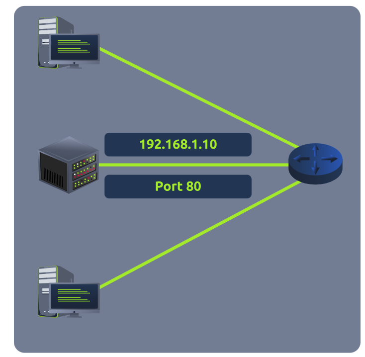
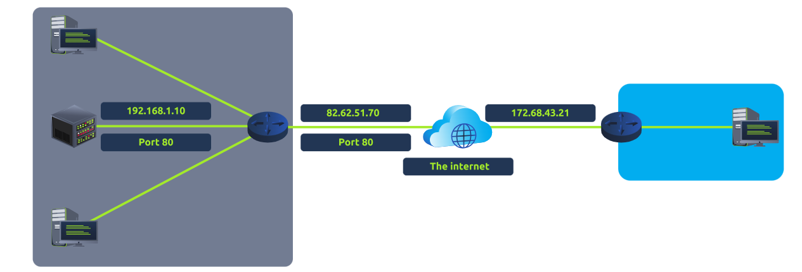

Perhaps aptly titled by their name, ports are an essential point in which data can be exchanged. Think of a harbour and port. Ships wishing to dock at the harbour will have to go to a port compatible with the dimensions and the facilities located on the ship. When the ship lines up, it will connect to a port at the harbour. Take, for instance, that a cruise liner cannot dock at a port made for a fishing vessel and vice versa.

These ports enforce what can park and where — if it isn't compatible, it cannot park here. Networking devices also use ports to enforce strict rules when communicating with one another. When a connection has been established (recalling from the OSI model's room), any data sent or received by a device will be sent through these ports. In computing, ports are a numerical value between 0 and 65535 (65,535).

Because ports can range from anywhere between 0-65535, there quickly runs the risk of losing track of what application is using what port. A busy harbour is chaos! Thankfully, we associate applications, software and behaviours with a standard set of rules. For example, by enforcing that any web browser data is sent over port 80, software developers can design a web browser such as Google Chrome or Firefox to interpret the data the same way as one another.

This means that all web browsers now share one common rule: data is sent over port 80. How the browsers look, feel and easy to use is up to the designer or the user's decision.

While the standard rule for web data is port 80, a few other protocols have been allocated a standard rule. Any port that is within 0 and 1024 (1,024) is known as a common port. Let's explore some of these other protocols below:

| Protocol | Port Number | Description |
|----------|-------------|-------------|
| File Transfer Protocol (FTP) | 21 | This protocol is used by a file-sharing application built on a client-server model, meaning you can download files from a central location.
| Secure Shell (SSH) | 22 | This protocol is used to securely login to systems via a text-based interface for management.
| HyperText Transfer Protocol (HTTP) | 80 | This protocol powers the World Wide Web (WWW)! Your browser uses this to download text, images and videos of web pages.
| HyperText Transfer Protocol Secure (HTTPS) | 443 | This protocol does the exact same as above; however, securely using encryption.
| Server Message Block (SMB) | 445 | This protocol is similar to the File Transfer Protocol (FTP); however, as well as files, SMB allows you to share devices like printers.
| Remote Desktop Protocol (RDP) | 3389 | This protocol is a secure means of logging in to a system using a visual desktop interface (as opposed to the text-based limitations of the SSH protocol).

What is worth noting here is that these protocols only follow the standards. I.e. you can administer applications that interact with these protocols on a different port other than what is the standard (running a web server on 8080 instead of the 80 standard port). Note, however, applications will presume that the standard is being followed, so you will have to provide a colon (:) along with the port number.

complete list of ports:  

https://www.vmaxx.net/techinfo/ports.htm

## Port Forwarding
Port forwarding is an essential component in connecting applications and services to the Internet. Without port forwarding, applications and services such as web servers are only available to devices within the same direct network.

Take the network below as an example. Within this network, the server with an IP address of "192.168.1.10" runs a webserver on port 80. Only the two other computers on this network will be able to access it (this is known as an intranet).

If the administrator wanted the website to be accessible to the public (using the Internet), they would have to implement port forwarding,

Network #2 will now be able to access the webserver running on Network #1 using the public IP address of Network #1 (82.62.51.70).

It is easy to confuse port forwarding with the behaviours of a firewall (a technology we'll come on to discuss in a later task). However, at this stage, just understand that port forwarding opens specific ports (recall how packets work). In comparison, firewalls determine if traffic can travel across these ports (even if these ports are open by port forwarding).

Port forwarding is configured at the router of a network.

## Sources
- https://tryhackme.com/