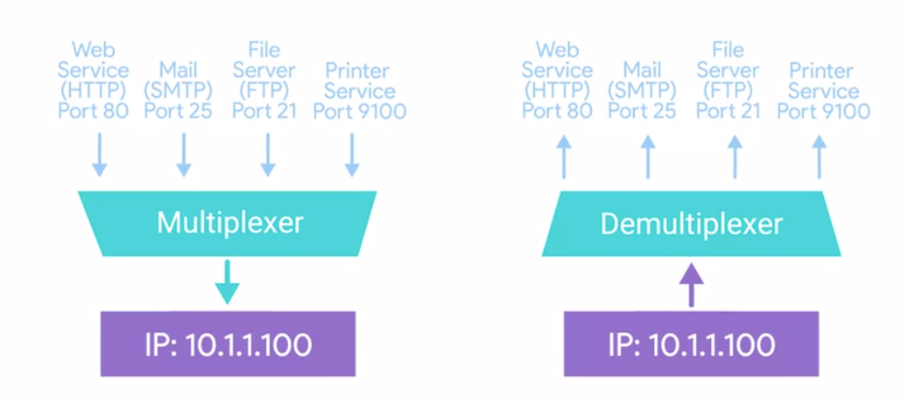
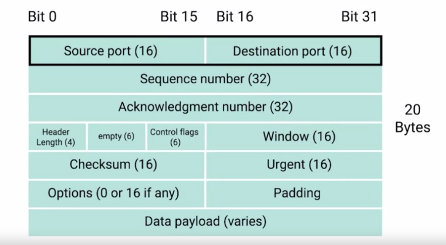
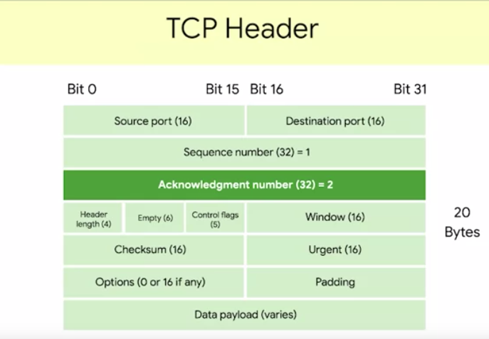
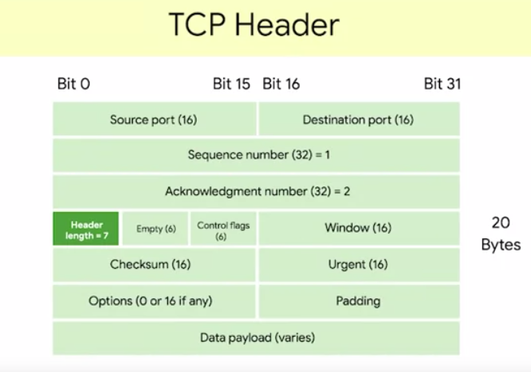
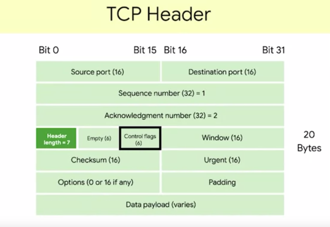
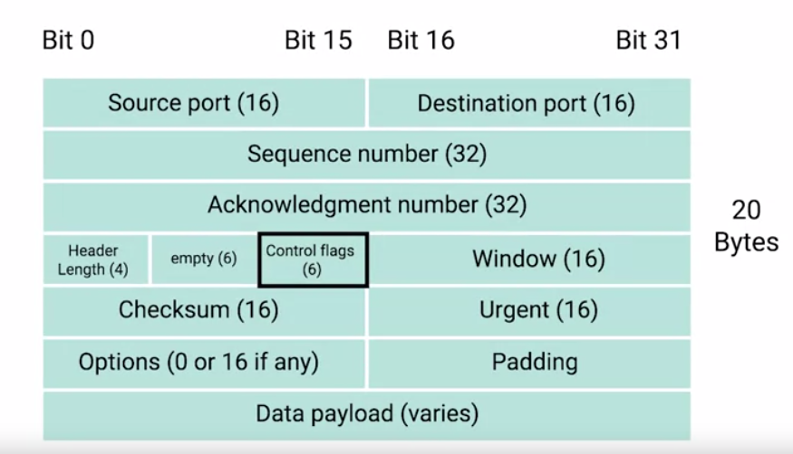
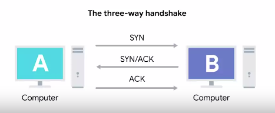
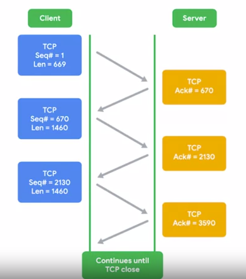
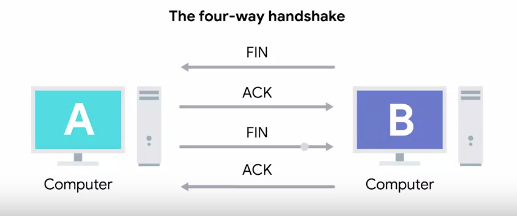

# Transport layer
The transport layer has the ability to `multiplex` and `demultiplex`.

`Multiplexing`: nodes on a network have the ability to direct traffic toward many different receiving services.
`Demultiplexing`: is the same concept just at the receiving end, it's taking traffic that's all aimed at the same node and delivering it to the proper receiving service.

Multiplexing and demultiplexing is handled via `ports`.
Port: a 16-bit number that's used to direct traffic to specific services/server running on a networked computer

A server or service is a program running on a computer waiting to be asked for data. 
A client is another program that is requesting this data. 
Different network services run while listening on specific ports for incoming requests. 
For example, the traditional ports for http or unencrypted web traffic is ports 80. 
If we want to request a web page from a web server running on a computer listening on IP 10.1.1.100, 
the traffic would be directed to port 80 on that computer. 
Ports are normally denoted with a colon after the IP address. So the full IP and ports in this scenario could be described as 10.1.1.100:80

`TCP` = Transmission Control Protocol = guarantees that all the date is received and is in the right order
TCP is a connection-oriented protocol, which  basically means that it must first acknowledge a session
between the two computers that are communicating, the two machines verify a connection before any connection takes places
to do this it uses the three-way handshake:
1. Sender computer sends a message cale SYN
2. Receiving computer will send back an acknowledgment message SYN ACK
3. Sender computer sends another acknowledgment message
Once this three steps have taken place data can be delivered. TCP also guarantees the delivery of the data, if a data packet goes missing TCP will resend it.

`UDP` = User Datagram protocol = is connection-less it doesn't establish a session and does not guarantee data delivery, fire and forget protocol
but is faster than TCP
___
## TCP segment
`TCP segment` = made up of a TCP header and a data section, data section, is just another payload area for where the application layer places its data.

`Source and destination ports`: The destination port is the port of the service the traffic is intended for.
A source port is a high numbered port chosen from a special section of ports known as `ephemeral ports`.
Source port is needed to keep lots of outgoing connection separate, a source port is needed so that when the web server replies, 
the computer making the original request can send this data to the program that was actually requesting it. 
It is in this way that when a web server responds to your request to view a webpage, 
that this response gets received by your web browser and not your word processor. 

`Sequence number`: 32-bit number that's used to keep track of where in a sequence of 
TCP segments this one is expected to be. You might remember that lower on our protocol stack, 
there are limits to the total size of what we send across the wire. 
An Ethernet frame is usually limited in size to 1,518 bytes, but we usually need to 
send way more data than that. At the transport layer, TCP splits all of this data up into many segments. 
The sequence number in a header is used to keep track of which segment out of many this particular segment might be. 

`Acknowledgment number`: The acknowledgment number is the number of the next expected segment. 
In very simple language, a sequence number of 1 and an acknowledgment number of 2 could be read as this is segment 1, expect segment 2 next. 

`Data offset`: This field is a four-bit number that communicates how long the TCP header for this segment is. 
This is so that the receiving network device understands where the actual data payload begins. 

Then we have six bits that are reserved for the six `TCP control flags`. 

`TCP window`: is a 16-bit number. A TCP window specifies the range of sequence numbers that might be sent before an acknowledgment is required. 
TCP is a protocol that's super reliant on acknowledgments. This is done in order to make sure that all expected data is actually being received, 
and that the sending device doesn't waste time sending data that isn't being received. 

`TCP checksum`: is a 16-bit number. It operates just like the checksum fields at the IP and Ethernet level. 
Once all of this segment has been ingested by recipient, the checksum is calculated across the entire segment and is compared with the checksum in the header 
to make sure that there was no data lost or corrupted along the way. 

`Urgent pointer`: field is used in conjunction with one of the TCP control flags to point out particular segments that might be more important than others. 

`Options field`: Like the urgent pointer field, this is rarely used in the real-world, but it's sometimes used for more complicated flow control protocols. 

`Padding`: which is just a sequence of zeros to ensure that the data payload section begins at the expected location.

### TCP Control Flags

`URG`: short for urgent. A value of one here indicates that the segment is considered urgent and that the urgent pointer field has more data about this. 
This feature of TCP has never really had widespread adoption and isn't normally seen.

`ACK`: short for acknowledged. A value of one in this field means that the acknowledgement number field should be examined. 

`PSH`: short for push. This means that the transmitting device wants the receiving device to push currently-buffered data to the application on the receiving end as soon as possible.

A `buffer` is a computing technique where a certain amount of data is held somewhere before being sent somewhere else.
In terms of TCP, it's used to send large chunks of data more efficiently. By keeping some amount of data in a buffer, TCP can deliver more meaningful chunks of data to the program waiting for it.
But in some cases you might be sending a very small amount of information that you need the listening program to respond to immediately. This is what the `push flag` does.

`RST`: short for reset. This means that one of the sides in a TCP connection hasn't been able to properly recover from a series of missing or malformed segments. 
It's a way for one of the partners in a TCP connection to basically say, wait, I can't put together what you mean, let's start over from scratch. 

`SYN`: stands for synchronize. It's used when first establishing a TCP connection and make sure the receiving end knows to examine the sequence number field. 

`FIN`: short for finish. When this flag is sent to one, it means the transmitting computer doesn't have any more data to send and the connection can be closed. 

`Three-way handshake`:

Computer A = transmitting computer 
Computer B will = receiving computer

To start the process off computer A sends a TCP segment to Computer B, with a SYN flag sent. This is computer A's way of saying, let's establish a connection and look at my sequence number field so we know where this conversation starts. 
Computer B then responds with a TCP segment where both the SYN and ACK flags are sent. This is Computer B's way of saying, sure, let's establish a connection and I acknowledge your sequence number. 
Then Computer A responds again with just the ACK flag sent, which is just saying I acknowledge your acknowledgement, let's start sending data. 
This exchange involving segments that have SYN, SYN/ACK and ACK sent happens every single time a TCP connection is established anywhere. 
A handshake is a way for two devices to ensure that they're speaking the same protocol and will be able to understand each other. Once the three-way handshake is complete, the TCP connection is established. 
Now, Computer A is free to send whatever data it wants to Computer B and vice versa. Since both sides have now sent SYN/ACK pairs to each other, a TCP connection in this state is operating in full duplex. 
Each segment sent in either direction should be responded to by a TCP segment with the ACK field sent. This way the other side always knows what has been received. 

`DATA`: Once a connection has been established, data (such as bytes of a file) is sent via the "DATA" message

Any sent data is given a random number sequence and is reconstructed using this number sequence and incrementing by 
Both computers must agree on the same number sequence for data to be sent in the correct order. This order is agreed upon during three steps:

1. SYN - Client: Here's my Initial Sequence Number(ISN) to SYNchronise with (0)
2. SYN/ACK - Server: Here's my Initial Sequence Number (ISN) to SYNchronise with (5,000), and I ACKnowledge your initial number sequence (0)
3. ACK - Client: I ACKnowledge your Initial Sequence Number (ISN) of (5,000), here is some data that is my ISN+1 (0 + 1)

| Device | Initial Number Sequence | Final Number Sequence |
|--------|-------------------------|-----------------------|
| Client (sender) | 0 | 0+1=1 |
| Client (sender) | 1 | 1+1=2 |
| Client (sender) | 2 | 2+1=3 |

Once one of the devices involved with the TCP connection is ready to close the connection, something known as a `four-way handshake happens`:

The computer ready to close the connection sends a FIN flag, which the other computer acknowledges with an ACK flag. 
Then, if this computer is also ready to close the connection, which will almost always be the case, it will send a FIN flag. 
This is again responded to by an ACK flag. Hypothetically, a TCP connection can stay open in simplex mode with only one side closing the connection, but this isn't something you'll run into very often.
___
## TCP socket
`TCP socket`: a socket is the instantiation of an endpoint in a potential TCP connection. 

An instantiation is the actual implementation of something defined elsewhere. 
TCP sockets require actual programs to instantiate them. You can contrast this with a port which is more of a virtual descriptive thing. 
In other words, you can send traffic to any ports you want, but you're only going to get a response if a program has opened a socket on that port. 

TCP sockets can exist in lots of states. 
The most common ones:
`LISTEN`: listen means that a TCP socket is ready and listening for incoming connections (server side only). 
`SYN_SENT`: this means that a synchronization request has been sent, but the connection hasn't been established yet (client side only). 
`SYN_RECEIVED`: this means that a socket previously in a LISTEN state has received a synchronization request and sent a SYN/ACK back, but it hasn't received the final ACK from the client yet (server side only). 
`ESTABLISHED`: this means that the TCP connection is in working order and both sides are free to send each other data (client and server side).
This will be true of all the following socket states too. So keep that in mind. 
`FIN_WAIT`: this means that a FIN has been sent but the corresponding ACK from the other end hasn't been received yet (client and server side). 
`CLOSE_WAIT`: this means that the connection has been closed at the TCP layer, but that the application that opened the socket hasn't released its hold on the socket yet (client and server side). 
`CLOSED`: this means that the connection has been fully terminated and that no further communication is possible (client and server side).

There are other TCP socket states that exists. 
Additionally, socket states and their names can vary from operating system to operating system. That's because they exist outside of the scope of the definition of TCP itself. 
TCP, as a protocol, is universal in how it's used since every device speaking the TCP protocol has to do this in the exact same way for communications to be successful. 
Choosing how to describe the state of a socket at the operating system level isn't quite as universal. 
When troubleshooting issues at the TCP layer, make sure you check out the exact socket state definitions for the systems you're working with.
___
## Firewall
`Firewall`: device that blocks traffic that meets certain criteria. 

Firewalls can  operate at lots of different layers of the network. 
There are firewalls that can perform inspection of application layer traffic and firewalls that primarily deal with blocking ranges of IP addresses but mostly used at transportation level.
Firewalls that operate at the transportation layer will generally have a configuration that enables them to block traffic to certain ports 
while allowing traffic to other ports. 

Let's imagine a simple small business network. The small business might have one server which hosts multiple network services. 
The server might have a web server that hosts the company's website while also serving as the file server for a confidential internal document. 
A firewall placed at the perimeter of the network could be configured to allow anyone to send traffic to port 80 in order to view the web page. 
At the same time, it could block all access for external IPs to any other port so that no one outside of the local area network could access the 
file server. 
Firewalls are sometimes independent network devices but it's really better to think of them as a program that can run anywhere. 
For many companies and almost all home users, the functionality of a router and a firewall is performed by the same device. 
Firewalls can run on individual hosts instead of being a network device. 
All major modern operating systems have firewall functionality built in. 
That way, blocking or allowing traffic to various ports and therefore to specific services can be performed at the host level as well.

A firewall is a device within a network responsible for determining what traffic is allowed to enter and exit. Think of a firewall as border security for a network. An administrator can configure a firewall to permit or deny traffic from entering or exiting a network based on numerous factors such as:

Where the traffic is coming from? (has the firewall been told to accept/deny traffic from a specific network?)
Where is the traffic going to? (has the firewall been told to accept/deny traffic destined for a specific network?)
What port is the traffic for? (has the firewall been told to accept/deny traffic destined for port 80 only?)
What protocol is the traffic using? (has the firewall been told to accept/deny traffic that is UDP, TCP or both?)
Firewalls perform packet inspection to determine the answers to these questions

TODO finish firewalls
TODO UDP UDP/IP
___
## UDP
The User Datagram Protocol (UDP) is another protocol that is used to communicate data between devices.
Unlike its brother TCP, UDP is a stateless protocol that doesn't require a constant connection between the two devices for data to be sent. For example, the Three-way handshake does not occur, nor is there any synchronisation between the two devices.
amely, UDP is used in situations where applications can tolerate data being lost (such as video streaming or voice chat) or in scenarios where an unstable connection is not the end-all.

As mentioned, no process takes place in setting up a connection between two devices. Meaning that there is no regard for whether or not data is received, and there are no safeguards such as those offered by TCP, such as data integrity.
UDP packets are much simpler than TCP packets and have fewer headers. However, both protocols share some standard headers, which are what is annotated in the table below:

| Header | Description |
|--------|-------------|
| Time to Live (TTL) | This field sets an expiry timer for the packet, so it doesn't clog up your network if it never manages to reach a host or escape!|
| Source Address | The IP address of the device that the packet is being sent from, so that data knows where to return to.
| Destination Address | The device's IP address the packet is being sent to so that data knows where to travel next.
| Source Port | This value is the port that is opened by the sender to send the UDP packet from. This value is randomly chosen (out of the ports from 0-65535 that aren't already in use at the time).
| Destination Port | This value is the port number that an application or service is running on the remote host (the one receiving the data); for example, a webserver running on port 80. Unlike the source port, this value is not chosen at random.
| Data | This header is where data, i.e. bytes of a file that is being transmitted, is stored.
___
## Sources
- PowerCertAnimated videos, Comparison between TCP and UDP, https://www.youtube.com/@PowerCertAnimatedVideos
- Google, The Bits and Bytes of Computer Networking, https://www.coursera.org/
- https://tryhackme.com/

