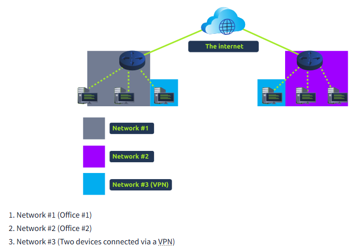

A Virtual Private Network (or VPN for short) is a technology that allows devices on separate networks to communicate securely by creating a dedicated path between each other over the Internet (known as a tunnel). Devices connected within this tunnel form their own private network.

For example, only devices within the same network (such as within a business) can directly communicate. However, a VPN allows two offices to be connected. Let's take the diagram below, where there are three networks:

The devices connected on Network #3 are still a part of Network #1 and Network #2 but also form together to create a private network (Network #3) that only devices that are connected via this VPN can communicate over.

Some VPN technologies:

| VPN Technology | Description |
|----------------|-------------|
| PPP | This technology is used by PPTP (explained below) to allow for authentication and provide encryption of data. VPNs work by using a private key and public certificate (similar to SSH). A private key & certificate must match for you to connect. This technology is not capable of leaving a network by itself (non-routable).
| PPTP | The Point-to-Point Tunneling Protocol (PPTP) is the technology that allows the data from PPP to travel and leave a network. PPTP is very easy to set up and is supported by most devices. It is, however, weakly encrypted in comparison to alternatives.
| IPSec | Internet Protocol Security (IPsec) encrypts data using the existing Internet Protocol (IP) framework. IPSec is difficult to set up in comparison to alternatives; however, if successful, it boasts strong encryption and is also supported on many devices.

## Sources
- https://tryhackme.com/