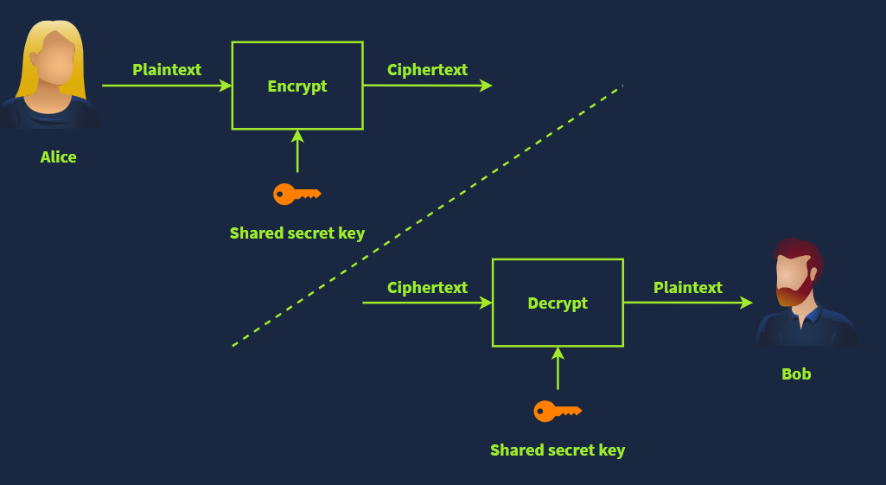
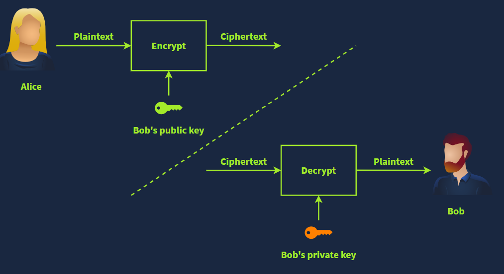
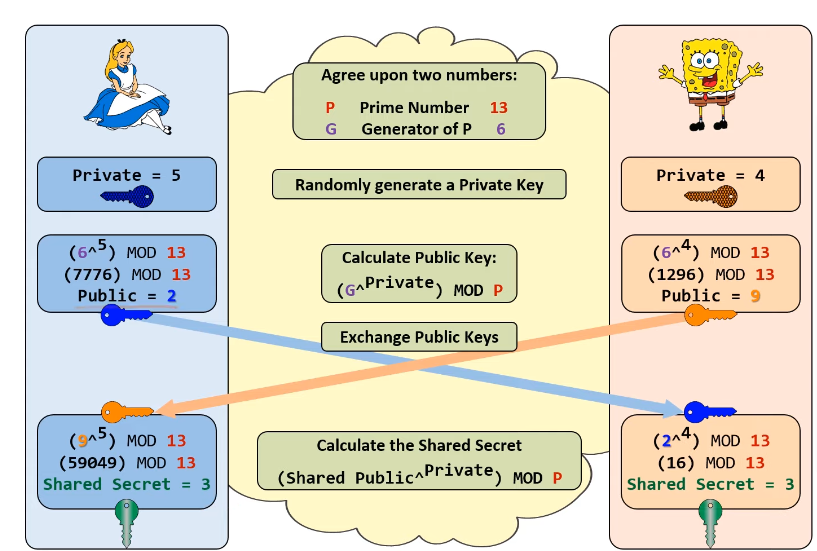
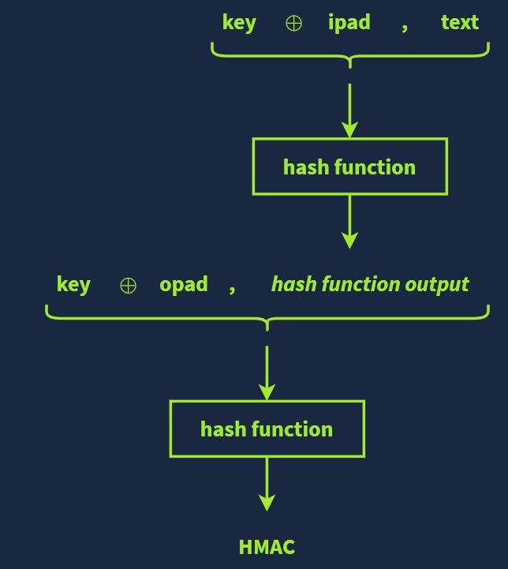
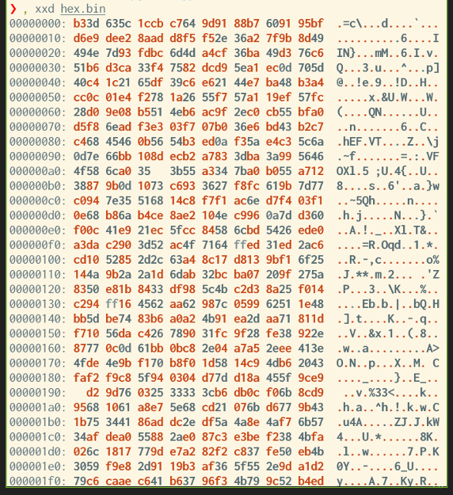
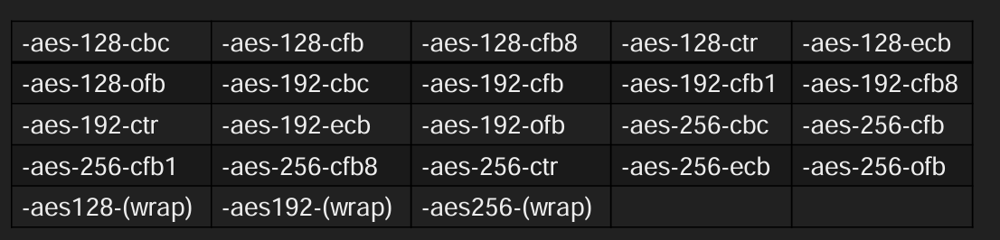

# Cryptography

`Plaintext`: The original, readable message or data before encryption. Examples include documents, images, or multimedia files.  
`Ciphertext`: The scrambled, unreadable version of the message after encryption. It reveals no information about the plaintext other than its approximate size.  
`Cipher`: The algorithm or method used to convert plaintext to ciphertext and vice versa. It is generally developed by mathematicians.  
`Key`: A secret string of bits used by the cipher to encrypt or decrypt data. The cipher is public knowledge, but the key must remain private (except for public keys in asymmetric encryption).  
`Encryption`: The process of converting plaintext into ciphertext using a cipher and a key. The cipher is disclosed, but the key is not.  
`Decryption`: The reverse process of encryption, converting ciphertext back to plaintext using a cipher and a key. Without the key, recovering the plaintext should be infeasible.  

## Types of Encryption
`Symmetric encryption (or symmetric cryptography)` uses the same key for both encryption and decryption.  
The key must remain secret, making secure communication of the key a significant challenge.  
Sharing the key securely, especially in the presence of potential threats like industrial espionage, is difficult. 
For example, you can encrypt a document and email it to a colleague, but sharing the password over email is unsafe.  
A secure channel, such as an in-person meeting, may be necessary to share the key safely.



Examples of symmetric encryption: DES, 3DES, and AES.  
`DES (Data Encryption Standard)`: Adopted in 1977, uses a 56-bit key. It became insecure as computing power advanced, with a key broken in under 24 hours by 1999.  
`3DES (Triple DES)`: An interim solution applying DES three times, with a 168-bit key (effective security: 112 bits). Deprecated in 2019, but still present in some legacy systems.  
`AES (Advanced Encryption Standard)`: Adopted in 2001 with key sizes of 128, 192, or 256 bits. It is the recommended standard today.


`Asymmetric encryption (public key cryptography)` uses two keys—a public key to encrypt data and a private key to decrypt it. 
The private key must remain secret. Examples: `RSA`, `Diffie-Hellman`, and `Elliptic Curve Cryptography (ECC)`.
More secure but slower than symmetric encryption.
Based on mathematical problems that are easy to compute in one direction but practically infeasible to reverse (e.g., would take millions of years to solve with current technology).
Key sizes:  
`RSA and Diffie-Hellman`: Minimum recommended key size is 2048 bits, with 3072-bit and 4096-bit keys offering enhanced security.
`ECC`: Provides equivalent security with shorter keys (e.g., a 256-bit ECC key matches the security of a 3072-bit RSA key).
Advantages and disadvantages:



`Hybryd encryption`: asymmetric + symmetric. Use asymmetric to facilitate a key exchange of secret key used for symmetric encryption for data.

## Basic Math (XOR and Modulo)
The `XOR (Exclusive OR`) operation is a logical operation that outputs true (or 1) if and only if the inputs are different. 
If the inputs are the same, the output is false (or 0). It’s widely used in digital electronics, computer science, 
and programming.  
XOR is typically represented by the symbol ⊕ or ^ (caret) in programming.

| Input A | Input B | Output A ⊕ B |
|---------|---------|--------------|
| 0 | 0 | 0
| 0 | 1 | 1
| 1 | 0 | 1
| 1 | 1 | 0

Key Properties of XOR:  
`Self-Inverse`: A ⊕ A = 0  
XOR-ing a number with itself always results in 0.  
`Identity`: A ⊕ 0 = A  
XOR-ing a number with 0 leaves it unchanged.  
`Commutative`: A ⊕ B = B ⊕ A  
The order of the inputs doesn't matter.  
`Associative`: A ⊕ (B ⊕ C)=(A ⊕ B) ⊕ C  
Grouping doesn’t matter in sequences of XOR operations.  
`Bitwise Operation`: XOR works bit by bit in binary numbers.  

Example: XORing binary values 1010 and 1100 yields 0110.  

Use in cryptography:
XOR is a key operation in symmetric encryption.  
Encryption: C= P ⊕ K (ciphertext = plaintext XOR key).  
Decryption: P = C ⊕ K, as (P ⊕ K) ⊕ K= P.
A secret key as long as the plaintext is required in practice.

The `modulo operator (% or mod)` gives the remainder when one number (X) is divided by another (Y). 
In cryptography, this remainder is more important than the quotient. For example:
25%5 = 0 (remainder is 0)  
23%6 = 5 (remainder is 5)  
23%7 = 2 (remainder is 2)  
When working with large numbers in cryptography, programming languages like Python can handle them easily, 
as they support big integers.  
The modulo operation always returns a result between 0 and one less than the divisor, but it’s not reversible.  
If x%5 = 4, there are infinite possible values for x.

## RSA
RSA encryption relies on the difficulty of factoring large numbers. 
While multiplying two large prime numbers is easy, factoring their product is computationally challenging. 
For example, multiplying primes like 113 × 127 gives 14351, and even larger primes can be multiplied manually.  
However, when you multiply very large primes, like 982451653031 and 169743212279, the result is a huge number (166764499494295486767649), 
making factoring it much more difficult. This difficulty is the basis of RSA's security.

RSA creates a pair of "commutative" keys, encrypt with one decrypt with the other. 

Factor = numbers you can multiply to get original number. Factors of 12: 1,2,3,4,6,12  
Prime = numbers whose factors are only 1 and itself Factors of  7 = 1,7  
Semi-Prime = Numbers whose factors are prime numbers Factors of 21: 1,3,7,21 Product of two primes is always Semi Prime  
Modulo = remainder division 13 mod 5 = 3

RSA Example:
1. Generate Keys: 
- Select two Prime Numbers (P,Q)  
- Calculate Product (N=P*Q)  
- Calculate Totien(to trudna rzecz po prostu wez tak jak jest) T = (P-1)*(Q-1)  
- Select Public Key (E) for example will be 29, must match three condition: must be prime, must be less than Totient, must not be a factor of Totient  
- Select a Private Key (D) for example here 41, one condition: product of D and E, divided by T must result in reminder of 1
2. Encryption and Decryption:
- Encryption: Message^E MOD N = Cipher text
- Decryption: Cipher^D MOD N = Message

## Diffie-Hellman Key Exchange
Allows two parties to establish a shared secret over an unsecured medium.

Alice and Bob  what they do:
1. Agree upon two numbers `P` prime number ex: 13 and `G` generator of `P` ex: 6
2. Randomly Generate a Private Key ex: Alice = 5  Bob = 4
3. Calculate the public key (G^Private) MOD P so  Alice = 2 and Bob = 9
4. Now Alice and Bob exchange their public values anyone listening on the public wire will now what these values are
5. Calculate the Shared Secret (Shared Public^Private) MOD P



## SSH
When connecting to a server via SSH, the client checks the server's public key fingerprint to ensure authenticity. If the key is unrecognized, the user is prompted to confirm the connection, as shown in the example.  
```
root@TryHackMe# ssh 10.10.244.173
The authenticity of host '10.10.244.173 (10.10.244.173)' can't be established.
ED25519 key fingerprint is SHA256:lLzhZc7YzRBDchm02qTX0qsLqeeiTCJg5ipOT0E/YM8.
This key is not known by any other name.
Are you sure you want to continue connecting (yes/no/[fingerprint])? yes
Warning: Permanently added '10.10.244.173' (ED25519) to the list of known hosts.
```
This protects against potential man-in-the-middle attacks, where a malicious server could impersonate the target. After confirming by typing "yes," the public key is saved. Future connections to the server will proceed without prompts unless the server's key changes, indicating a potential security risk.  

To authenticate the client in SSH, users typically log in with a username and password, though this is less secure. A better approach is key-based authentication, which uses a pair of public and private keys.  
By default, SSH keys are RSA keys, but other algorithms like Ed25519 or ECDSA can be used.
Keys are generated using the `ssh-keygen` command, allowing for options like encryption with a passphrase.  
`ssh-keygen` supports various algorithms, from man:  
```
root@TryHackMe# man ssh-keygen
[...]
-t dsa | ecdsa | ecdsa-sk | ed25519 | ed25519-sk | rsa
Specifies the type of key to create. The possible values are “dsa”, “ecdsa”, “ecdsa-sk”, “ed25519”, “ed25519-sk”, or “rsa”.
[...]
```
- **DSA (Digital Signature Algorithm)** is a public-key cryptography algorithm specifically designed for digital signatures.  
- **ECDSA (Elliptic Curve Digital Signature Algorithm)** is a variant of DSA that uses elliptic curve cryptography to provide smaller key sizes for equivalent security.  
- **ECDSA-SK (ECDSA with Security Key)** is an extension of ECDSA. It incorporates hardware-based security keys for enhanced private key protection.  
- **Ed25519** is a public-key signature system using EdDSA (Edwards-curve Digital Signature Algorithm) with Curve25519.  
- **Ed25519-SK (Ed25519 with Security Key)** is a variant of Ed25519. Similar to ECDSA-SK, it uses a hardware-based security key for improved private key protection.  

Example of key pair generation:
`ssh-keygen -t ed25519`

The public key is shared with the server, while the private key is kept secure. Sharing the private key compromises security. Key authentication is more secure than passwords and avoids vulnerabilities like brute-force attacks.  
SSH private keys are like passwords and must be kept secure. Never share them, as anyone with your private key can access servers where it is authorized unless it’s encrypted with a passphrase. The passphrase decrypts the private key locally and is never transmitted.  

For enhanced security:  
- Use a strong, complex passphrase.  
- Generate keys on your machine and only transfer the public key to the server (e.g., with `ssh-copy-id`).  
- Set strict permissions for the private key file (e.g., 600) to avoid warnings or security issues.  
- Store keys in the default `~/.ssh` folder, and public keys authorized for server access go in the `authorized_keys` file.  

Key-based authentication is more secure than passwords and should be enforced, especially for root access. SSH keys can also "upgrade" reverse shells during penetration tests by providing a stable, authenticated connection if keys are added to the `authorized_keys` file.  

## Digital Signatures and Certificates
A digital signature ensures the authenticity and integrity of digital messages or documents using asymmetric cryptography. You sign a document with your private key, and others verify it with your public key, proving the file is from you and unaltered. Unlike simple electronic signatures (like pasting an image), digital signatures secure the document by encrypting its hash with your private key. The recipient decrypts the hash and compares it with the file's hash to confirm integrity. Digital signatures have the same legal value as physical ones in many countries.  
Certificates, essential for public key cryptography, verify the authenticity of entities like websites. For example, a web server uses a certificate to prove it’s the real tryhackme.com. Certificates rely on a chain of trust starting with a root Certificate Authority (CA), which your browser or operating system automatically trusts. If a CA trusts an organization that issues a certificate, your browser trusts that certificate.  
To enable HTTPS for a website, you need a TLS certificate, which can be purchased from CAs or obtained for free from services like [Let’s Encrypt](https://letsencrypt.org/). HTTPS is critical for modern websites to ensure secure connections.  

## PGP and GPG
PGP (Pretty Good Privacy) and its open-source implementation, GPG (GNU Privacy Guard), enable encryption and digital signing for files and emails. GPG is commonly used to secure email communication by encrypting messages for confidentiality and signing them to verify integrity.  
When generating a GPG key pair, users choose the key’s purpose (e.g., signing or encrypting), cryptographic algorithm, expiry date, and provide personal information like name and email. Public keys are shared for others to encrypt messages, while private keys are used for decryption. Private keys can be protected with passphrases for additional security.  
For practical use, securely back up your GPG keys. If you get a new device, import the key using `gpg --import backup.key`. To decrypt messages, use `gpg --decrypt confidential_message.gpg`. Protect private keys to prevent unauthorized access.  
___
# Hashing
A hash function creates a fixed-size digest or summary of input data, regardless of its size. Unlike encryption, it cannot be reversed to determine the input. Good hash functions ensure even small input changes produce significantly different outputs, making prediction or reversal impractical.  

For example, the letters "T" and "U" differ by one bit, yet their MD5, SHA1, and SHA256 hashes are entirely different. Hash outputs are typically encoded in hexadecimal or base64 formats. Tools like `md5sum`, `sha1sum`, and `sha256sum` generate these hashes for files, displaying the results in hexadecimal. Hash functions are essential for verifying data integrity.

Hashing is crucial for data integrity and password security. Servers typically store password hashes, not the passwords themselves. When you log in, the server hashes your input and compares it to the stored hash to verify your credentials. This process ensures security and prevents exposure of plain-text passwords. Hashing is widely used in everyday activities like logging into websites or computers, even if it remains invisible to users.  

A **hash collision** occurs when two different inputs produce the same hash output. While hash functions aim to minimize collisions, the pigeonhole effect makes them inevitable due to the limited number of possible outputs compared to infinite inputs. Good hash functions ensure collisions are extremely rare. Older algorithms like MD5 and SHA1 are vulnerable to engineered collisions and are now considered insecure for hashing passwords or sensitive data.  

Hashing is crucial in cybersecurity, particularly for password storage and ensuring data integrity. For password storage in authentication systems, passwords should never be stored in plaintext. Poor practices, such as storing passwords in plaintext, using outdated encryption methods, or insecure hashing algorithms, lead to breaches. Examples include RockYou’s breach from storing passwords in plaintext, Adobe’s breach from using weak encryption, and LinkedIn’s 2012 breach due to using SHA-1 without salting. Proper password hashing and salting are vital for secure password storage.

## Using Hashing to Store Passwords
Hashing is used to securely store passwords by saving their hash values instead of the actual passwords. However, if two users have the same password, their hashes will be identical, potentially leading to security risks like rainbow table attacks. To counter this, a **"salt" (a unique, random value)** is added to each password before hashing, ensuring that even identical passwords have unique hashes. Secure hashing functions like `Bcrypt`, `Scrypt`, and `Argon2` handle this automatically. Encrypting passwords instead of hashing is less secure because the encryption key must also be stored, which could lead to password decryption if the key is compromised.  

A [**Rainbow Table**](https://hashes.com/en/decrypt/hash) is a lookup table of hashes to plaintexts, so you can quickly find out what password a user had just from the hash  
Websites like [CrackStation](https://crackstation.net/) and [Hashes.com](https://hashes.com/en/decrypt/hash) internally use massive rainbow tables to provide fast password cracking for hashes without salts.  

## Recognising Password Hashes
From an offensive security perspective, recognizing and cracking password hashes involves identifying the hash type and understanding the context. Hashes in web applications are more likely to be MD5 than NTLM. 

On **Linux**, password hashes are stored in the `/etc/shadow` file, which is accessible only by root, unlike the older /etc/passwd file that was publicly readable. The shadow file contains nine fields, with the login name and hashed password being the first two. The hashed password is composed of four components: **prefix (algorithm ID), options (parameters), salt, and hash**. The format is `$prefix$options$salt$hash`, and the prefix helps identify the hashing algorithm used. Different Unix-style password prefixes vary in strength, with more secure algorithms listed first.  
Most common Unix-style password prefixes `man 5 crypt` to check more:  

| Prefix | Algorithm |
|--------|-----------|
| $y$ | yescrypt is a scalable hashing scheme and is the default and recommended choice in new systems
| $gy$ | gost-yescrypt uses the GOST R 34.11-2012 hash function and the yescrypt hashing method
| $7$ | scrypt is a password-based key derivation function
| $2b$, $2y$, $2a$, $2x$ | bcrypt is a hash based on the Blowfish block cipher originally developed for OpenBSD but supported on a recent version of FreeBSD, NetBSD, Solaris 10 and newer, and several Linux distributions
| $6$ | sha512crypt is a hash based on SHA-2 with 512-bit output originally developed for GNU libc and commonly used on (older) Linux systems
| $md5 | SunMD5 is a hash based on the MD5 algorithm originally developed for Solaris
| $1$ | md5crypt is a hash based on the MD5 algorithm originally developed for FreeBSD

Example: 
```
root@TryHackMe# sudo cat /etc/shadow | grep strategos
strategos:$y$j9T$76UzfgEM5PnymhQ7TlJey1$/OOSg64dhfF.TigVPdzqiFang6uZA4QA1pzzegKdVm4:19965:0:99999:7:::
```
The fields are separated by colons. The important ones are the username and the hash algorithm, salt, and hash value. The second field has the format `$prefix$options$salt$hash`.

In the example above, we have four parts separated by `$`:  
- `y` indicates the hash algorithm used, yescrypt  
- `j9T` is a parameter passed to the algorithm  
- `76UzfgEM5PnymhQ7TlJey1` is the salt used  
- `/OOSg64dhfF.TigVPdzqiFang6uZA4QA1pzzegKdVm4` is the hash value  

In **MS Windows**, passwords are hashed using NTLM, a variant of MD4, which looks similar to MD4 and MD5 hashes, making it important to use context to identify them. These hashes are stored in the Security Accounts Manager (SAM), with NT and LM hashes present. While Windows tries to protect these hashes, tools like `mimikatz` can bypass security. To identify various hash formats and prefixes, the [Hashcat Example Hashes](https://hashcat.net/wiki/doku.php?id=example_hashes) page is a helpful resource. For other hash types, researching the length, encoding, or the generating application may be necessary.  

## Password Cracking
Rainbow tables are ineffective for salted hashes. To crack salted password hashes, you need to hash many potential inputs (like from rockyou.txt) and include the salt if applicable, then compare the result to the target hash. Once a match is found, the original password is revealed. Tools like [Hashcat](https://hashcat.net/hashcat/) and [John the Ripper](https://www.openwall.com/john/) are often used for this process.  

Modern GPUs are highly effective for cracking passwords due to their ability to perform parallel calculations quickly. While they excel at certain mathematical tasks in hash functions, algorithms like Bcrypt are designed to resist GPU acceleration, making them slower to crack compared to CPUs.  

Cracking hashes on VMs is less efficient because they typically don’t have access to the host's GPU, and using the CPU in a virtualized environment leads to performance degradation. For optimal performance, tools like Hashcat should run on the host machine to leverage the GPU. John the Ripper, which uses the CPU by default, also works better when run directly on the host OS to avoid virtualization overhead.  

**Example**:  
`hashcat -m <hash_type> -a <attack_mode> hashfile wordlist`

- `-m <hash_type>` specifies the hash type (e.g., `-m 1000` for NTLM).  
- `-a <attack_mode>` specifies the attack mode (e.g., `-a 0` for straight).  
- `hashfile` is the file with the hash.  
- `wordlist` is the file containing passwords to try.  

`hashcat -m 3200 -a 0 hash.txt /usr/share/wordlists/rockyou.txt`  

## Integrity Checking 
Hashing can verify file integrity by ensuring it hasn’t been altered. A small change in the file will result in a significant change in its hash. For example, comparing the hash of a downloaded file to an official hash (like from a web server) confirms they are identical. Hashing also helps find duplicate files since identical documents will have the same hash.  
Example:  
run `sha256sum` on the file you downloaded returned the same hash listed in this signed file, you can be confident that your file is identical to the official one.  

**HMAC (Keyed-Hash Message Authentication Code)** combines a cryptographic hash function and a secret key to verify data authenticity and integrity. It ensures the message hasn't been altered and confirms the sender's identity. The process involves padding the secret key, XORing it with constants, hashing the message, and then performing another hash with the modified key to produce the final HMAC value.  




Technically speaking, the HMAC function is calculated using the following expression:
`HMAC(K,M) = H((K⊕opad)||H((K⊕ipad)||M))`  
Note that M and K represent the message and the key, respectively.  
___
## Ćwiczenia studia
### Zapis heksadecymalny
Ponieważ będziemy posługiwać się danymi binarnymi, musimy je umieć jakoś zapisać. Jednym ze sposobów zapisu danych binarnych jest zapis heksadecymalny (zwany również szesnastkowym). Należy zwrócić uwagę na różnicę między zapisem heksadecymalnym liczb, a danych binarnych. Na przykład liczba 1000, może zostać zapisana jako 0x3e8.  

Dane binarne to z kolei ciągi bajtów, zapis d38c9ba6af7fa8bb oznacza więc ciąg 8 bajtów o wartościach kolejno: 211 (0xd3), 140 (0x8c), 155 (0x9b), 166 (0xa6), 175(0xaf), 127 (0x7f), 168 (0xa8), 187 (0xbb).  
Czasem zapisujac liczby w systemie heksadecymalnym pomija się prefix “0x”.  
Należy z kontekstu wywnioskować, czy chodzi o liczbę, czy dane binarne.  

Wzapisie danych binarnych zazwyczaj poszczególne bajty oddziela się, co znacznie ułatwia ich czytanie. Np. zamiast pisać 4fdc2d3746b412d222d2ffd61442, możemy napisać 4f dc 2d 37 46 b4 12 d2 22 d2 ff d6 14 42.  
Czasem grupuje się też bajty w pary: 4fdc 2d37 46b4 12d222d2ffd61442.  

Zapisaliśmy flagę właśnie w tej postaci. Zdekoduj ją, a następnie wpisz w formularzu:  
`504A41544B7B737A65736E61736369657D`  
Możesz użyć do tego celu jednego z licznych narzędzi online, a nawet wiersza poleceń systemu Linux! Np.:  
`echo 504A41544B7B737A65736E61736369657D|xxd -r -p;echo`  

O pozostałych, choć niemniej ważnych metodach zapisu danych wspomnimy łącznie.  
1. **Base64** – jest to metoda zapisu danych, która pozwala m.in. na przesyłanie danych binarnych w formie tekstowej. PJATK w base64 to UEpBVEs=  
2. **Urlencode** - mechanizm kodowania informacji w URI, obecnie definiowany w RFC3986. Głównie jest używane do kodowania danych przesyłanych przez zapytanie GET w adresie URL. Kodowane są tylko niektóre znaki (na przykład spacja, „_”, „&”)  
3. **Encje HTML** – Sposób zapisu niektórych znaków używanych głównie jako element języka HTML. Istnieją encje nazwane, dziesiętne i szestanstkowe.  
Symbol "<" można zapisać jako &lt;, &#60; lub &#x3c;. Pełną listę można znaleźć tutaj: https://www.w3schools.com/html/html_entities.asp.  

### Inne sposoby zapisu danych
W tym zadaniu zakodowaliśmy flagę za pomocą base64. Zdekoduj ją i wklej w formularzu na stronie:  
`UEpBVEt7YTExeW91cmJhc2V9`  
Możesz użyć jednego z licznych dekoderów online, a nawet wiersza poleceń systemu Linux:  
`echo UEpBVEt7YTExeW91cmJhc2V9 | base64--decode`  

### Wyświetlanie danych binarnych
Celem zadania jest wyświetlenie na konsoli zawartości pliku `hex.bin` w zapisie heksadecymalnym. Plik ten znajduje się już na maszynie testowej.  

Może nas kusić użycie podstawowej komendy cat, służy ona jednak do wyświetlania danych tekstowych (spróbuj wywołać cat hex.bin i zobacz efekt).  
Do wyświetlenia danych binarnych można użyć np. komendy xxd:  
`xxd hex.bin`  

Komenda xxd domyślnie wyświetla dane binarne wypisując 16 bajtów w każdej linii.  
W pierwszej kolumnie znajduje się pozycja w pliku aktualnej linii. Pozycja pliku jest liczbą zapisaną heksadecymalnie.  
W ostatniej kolumnie znajduje się zapis tekstowy w formacie ASCII, w którym bajty spoza zakresu ASCII oraz znaki niedrukowalne zostały zastąpione kropkami.  



### Funkcje skrótu
Funkcje skrótu to algorytmy kryptograficzne, które przekształcają dowolnie długie dane wejściowe w unikalny ciąg o stałej długości, zwany skrótem (hash).  
Ich cechą charakterystyczną jest to, że nawet minimalna zmiana w danych wejściowych powoduje znaczną zmianę wyniku, co uniemożliwia przewidzenie skrótu na podstawie oryginalnych danych.  
Funkcje skrótu są kluczowe w zabezpieczaniu danych, stosowane m.in. w podpisach cyfrowych, weryfikacji integralności plików oraz przechowywaniu haseł.  
Przykładami popularnych funkcji skrótu są MD5, SHA-1 oraz rodzina algorytmów SHA-2 (np. SHA-256).  

W tym zadaniu naszym celem będzie obliczenie wartości hashu MD5 dla „PJATK”.  
Możesz użyć do tego celu jednego z licznych narzędzi online, a nawet wiersza poleceń systemu Linux! Na przykład:  
`echo -n PJATK | md5sum`  

### Baza MD5
O ile sam algorytm MD5 jest nieodwracalny, tak istnieją olbrzymie bazy danych, które przechowują już przeliczone hashe, co pozwala na odzyskanie danych zapisanych w ten sposób.  

Bazy danych MD5 są często wykorzystywane w atakach, gdzie można spróbować odwrócić proces haszowania, aby odzyskać oryginalne hasła.  
Ze względu na słabe zabezpieczenia, MD5 jest uważany za przestarzały i niewystarczający do ochrony danych w nowoczesnych systemach, gdzie zaleca się stosowanie bardziej zaawansowanych funkcji skrótu, takich jak SHA-256.  

Przykładowa baza danych: https://md5decrypt.net/en

Wykorzystamy jedną z takich baz, aby dowiedzieć się, jakie dane zostały przekształcone za pomocą MD5.  
Używając wybranej bazy (może będzie trzeba sprawdzić kilka?) znajdź flagę zakodowaną jako: 3062e1e11c64939824f4f249890f7157  
Odpowiedźpodaj wformie: PJATK{flaga} w formularzu.  

### Operacja XOR
Operacja XOR (exclusive OR) to operacja logiczna, która działa na dwóch bitach i zwraca 1, jeśli dokładnie jeden z bitów jest równy 1, a drugi 0; w przeciwnym razie zwraca 0. W edukacji szkolnej uczniowie poznają podstawowe operacje logiczne, takie jak AND, OR, NOT, a XOR jest kolejną z nich, specyficzną w swoim działaniu.  

Własności matematyczne XOR:  
A XOR 0 = A  
A XOR A = 0  
(A XOR B) XOR B = A  
A XOR B = B XOR A  
A XOR B = (A AND NOT B) OR (NOT A AND B)  
Te własności czynią XOR przydatnym w szyfrowaniu, gdzie szyfrowanie można łatwo odwrócić, ale tylko jeśli zna się oryginalny klucz.  

Spróbujmy zaszyfrować przy pomocy operacji XOR skrót PJATK za pomocą klucza abc.  
W tym celu zapisujemy zarówno PJATK jak i abc wpostaci binarnej:  
P: 01010000  
J: 01001010  
A: 01000001  
T: 01010100  
K: 01001011  

a: 01100001  
b: 01100010  
c: 01100011  

Teraz kolejno wykonujemy operacje (klucz powtarzamy cyklicznie, aby znaków było tyle samo, co w szyfrowanej wiadomości):  
P(01010000)XORa(01100001)=00110001  
J (01001010)XORb(01100010)=00101000  
A(01000001)XORc(01100011)=00100010  
T (01010100)XORa(01100001)=00110101  
K(01001011)XORb(01100010)=00101001  

Wynikowe wartości binarne ponownie zapisujemy jako znaki ASCII:  
00110001(1)  
00101000(()  
00100010(")  
00110101(5)  
00101001())  
Po wykonaniu operacji XOR z kluczem "abc", hasło "PJATK" zostało zaszyfrowane do ciągu binarnego, który odpowiada znakom "1("5)".  
Aby odzyskać oryginalne hasło, należy ponownie zastosować operację XOR z tym samym kluczem.  

Istniejetylko 256 jednobajtowych kluczy XOR (jest 8 bitów wbajcie, a 2 do potęgi 8 to 256),więc możemy sprawdzić wszystkie. 
Wykorzystamy w tym celu narzędzie:  
[CyberChef](https://cyberchef.org/)

Celem zadania jest zdekodowanie podanego niżej ciągu znaków, który został zaszyfrowany za pomocą jednobajtowego klucza przy pomocy algorytmu XOR.  
Odpowiednia konfiguracja narzędzia CyberChef jest widoczna na następnym slajdzie.  
Ciąg do zdekodowania:  
`08 12190C132320372A36313D323D2B2C3A3D2228313D3B22362125`  

Dla jednego z kluczy powinieneś otrzymać flagę. Którego? To już musisz sprawdzić samodzielnie. Odpowiedź podaj w formularzu.  

###  Algorytm AES
AES jest blokowym algorytmem szyfrowania symetrycznego. Wykorzystując go możemy zaszyfrować dane przy pomocy hasła. Zaszyfrowane dane możemy nawet opublikować w internecie, ale bez znajomości hasła nikt nie będzie w stanie odczytać niezaszyfrowanej zawartości.  
Jedyną możliwością odczytania zawartości jest poznanie, bądź zgadnięcie, hasła. AES wykonuje różne operacje matematyczne, takie jak zamiana miejscami, mieszanie, i podstawianie elementów w każdym bloku.  

Algorytm AES może występować w wielu trybach. Z oczywistych powodów nie będziemy tu omawiać różnic, jednak przynajmniej pokażmy, ile ich jest:  



Celem zadania jest odszyfrowanie pliku plik_enc_aes-256-cbc.bin zaszyfrowanego hasłem z wykorzystaniem AES. Plik ten znajduje się na maszynie wirtualnej studenta.    
Aby dostać się na maszynę należy zalogować się po ssh:  
Hasło brzmi PJATK.  
W celu odszyfrowania pliku należy wykonać komendę:
`openssl aes-256-cbc -pbkdf2 -d -in plik_enc_aes-256-cbc.bin`  
Zdobytą w tej sposób flagę wklej w formularzu na stronie.  

### Algorytm RSA
Podobnie jak AES, RSA jest algorytmem szyfrowania. W przeciwieństwie do AES, RSA służy do szyfrowania asymetrycznego, często system RSA określa się mianem kryptografii klucza publicznego.  
W RSA wykorzystuje się klucze, czyli specjalne pliki. Aby móc coś zaszyfrować, należy w pierwszej kolejności wygenerować losowy klucz prywatny. Kluczem prywatnym można dane odszyfrować. Takie wykorzystanie RSA nie różni się od AES.  
Istotna cześć RSA leży w możliwości wygenerowania klucza publicznego związanego z zadanym kluczem prywatnym. Kluczem publicznym można dane zaszyfrować, ale nie da się nim odszyfrowywać danych. Mimo to, dane zaszyfrowane kluczem publicznym można odszyfrować wykorzystując klucz prywatny sparowany z kluczem publicznym.  

RSA wykorzystuje się np. do szyfrowania e-maili. Właściciel adresu email może udostępnić innym swój klucz publiczny. Dzięki temu, pisząc maila do tej osoby, możemy zaszyfrować treść wiadomości przy pomocy klucza publicznego.  
Do odszyfrowania wiadomości potrzebny jest klucz prywatny sparowany z kluczem publicznym, a więc tylko właściciel adresu e-mail będzie w stanie odszyfrować i odczytać tę wiadomość.  

Celem zadania jest wygenerowanie pary kluczy RSA i użycie ich do zaszyfrowania pliku plik2.txt. Plik znajduje się na maszynie wirtualnej studenta.  
Generacja klucza prywatnego:  
`openssl genrsa-out rsa_key 3072`  
Generacja klucza publicznego sparowanego z kluczem prywatnym:  
`openssl rsa-in rsa_key-pubout-out rsa_key.pub`  
Szyfrowanie:  
`openssl pkeyutl-encrypt -in plik2.txt -pubin-inkey rsa_key.pub-out plik2.bin`  

**GPG (GNU Privacy Guard)** to narzędzie do szyfrowania i podpisywania danych, które jest oparte na standardzie OpenPGP. Działa na zasadzie kryptografii asymetrycznej, co oznacza, że używa pary kluczy: publicznego, który może być udostępniany innym, i prywatnego, który jest znany tylko właścicielowi.    
Klucz publiczny służy do szyfrowania wiadomości, które może odszyfrować jedynie właściciel odpowiadającego mu klucza prywatnego.  
GPG jest powszechnie stosowane do bezpiecznej komunikacji i zapewnienia autentyczności dokumentów poprzez cyfrowe podpisy.  

## Ćwiczenia studia Pentest
### Hash MD5
W katalogu domowym znajduje się plik hash1, który zawiera hash MD5.   
Użyj programu hashcat, aby poznać zaszyfrowany ciąg znaków. Użyto ciągu, który znajduje w słowniku rockyou.txt.  
`hashcat-m 0 hash1 /usr/share/wordlists/rockyou.txt`  

Hashe MD5 były popularnie stosowane do zapisywania haseł w bazach danych. Obecnie odchodzi się od nich, jednak nadal bywają używane zarówno w aplikacjach internetowych, jak i działających lokalnie.  

### Hash sha1
W katalogu domowym znajduje się plik hash2, który zawiera hash SHA1.  
Użyj programu hashcat, aby poznać zaszyfrowany ciąg znaków. Użyto ciągu, który znajduje w słowniku rockyou.txt.  
`hashcat-m 100 hash2 /usr/share/wordlists/rockyou.txt`  

Hashe SHA1 uchodzą za bezpieczniejsze od MD5 i nadal są często stosowane w bazach danych dużych internetowych serwisów do zapisywania haseł użytkowników. Nierzadko stosowane jest podwójne hashowanie: sha1(sha1(hasło))  

### Hash bcrypt
W katalogu domowym znajduje się plik hash3, który zawiera hash bcrypt.  
Użyj programu hashcat, aby poznać zaszyfrowany ciąg znaków. Użyto ciągu, który znajduje w słowniku rockyou.txt.  
`hashcat-m 3200 hash3 /usr/share/wordlists/rockyou.txt`  

Bcrypt jest coraz popularniejszym hashem ze względu na znaczną poprawę bezpieczeństwa poprzez umożliwienie dodania do szyfrowanego ciągu znaków tzw. „soli” – dodatkowych znaków.  
Jego obliczenie jest jednak dłuższe, niż w przypadku MD5 i SHA1.  

W hashu bcrypt występuje znak `$`, który może być różnie interpretowany w konsoli. Uważaj na to!  

### Hash NTLM
W katalogu domowym znajduje się plik hash4, który zawiera hash NTLM.  
Użyj programu hashcat, aby poznać zaszyfrowany ciąg znaków. Tym razem użyto hasła składającego się z dziewięciu cyfr, które nie znajduje się w słowniku  
`hashcat-m 1000 hash4-a3 ?d?d?d?d?d?d?d?d?d?d?d`  

NTLM to metoda hashowania opracowana przez i Microsoft stosowana do zapisu haseł użytkowników w systemach z rodziny NT (m.in. Windows XP).  
Uwaga! Złamanie tego hasła może zająć kilka minut!  

### Archiwum ZIP
W katalogu domowym znajduje się plik pkzip.zip, który zawiera plik z flagą.  
Użyjemy programu John the Ripper do złamania hasła. Najpierw musimy jednak przygotować plik wejściowy na podstawie naszego archiwum. Hasło do archiwum znajduje się w słowniku rockyou.txt.  
```
zip2john pkzip.zip > hash5
john --wordlist=/usr/share/wordlists/rockyou.txt hash5
unzip pkzip.zip
```

### Archiwum RAR
W katalogu domowym znajduje się file.rar, który zawiera nieznany plik. Ponownie użyjemy programu John the Ripper do złamania hasła. Najpierw musimy jednak przygotować plik wejściowy na podstawie naszego archiwum.  
Hasło do archiwum nie znajduje się w słowniku. Wiemy jednak, że składa się z małych liter oraz cyfr i ma maksymalnie trzy znaki.  
Użyjemy więc programu crunch, aby stworzyć słownik właśnie takich haseł:  
`crunch 1 3 -f /usr/share/crunch/charset.lst lalpha-numeric > new_dict.txt`  

Następnie musimy utworzyć plik wejściowy dla John the Ripper na podstawie naszego archiwum, a później uruchomić łamanie hasła z utworzonym słownikiem.   
Uwaga, łamanie hasła może potrwać kilka minut!  

```
rar2john file.rar > hash6
john--wordlist=new_dict.txt hash6
```

Spróbujmy wypakować archiwum i wyświetlić zawartość pliku. Czy wyświetla się poprawnie?  
```
unrar x file.rar
cat file
```
Taki widok świadczy o tym, że możemy mieć do czynienia z plikiem binarnym.   
Uruchamianie nieznanego pliku z zaszyfrowanego archiwum zwykle nie jest dobrym pomysłem, jednak tym razem nie jest to wirus. Zobaczmy, co stanie się po uruchomieniu.  
`./file`  

Mamy więc już pewność, że jest to binarny plik wykonywalny.  
W jaki sposób możemy poszukać w nim flagi? Mamy dwie możliwości, jednak obie będą wymagały od nas odpowiedniej analizy otrzymanych wyników.  
Wyszukajmy stringi lub otwórzmy plik w odpowiedniej aplikacji:  
`strings file lub xxd file`
___
## Dodatkowe informacje
[szyfry klasyczne](http://ekryptografia.pl/kryptografia/szyfry-klasyczne/)  
[algorytm md5 zapisany w języku Python](https://www.cs.bu.edu/~goldbe/teaching/HW55814/static/pymd5.py)  
[informacje o funkcjach skrótu](https://cyberwiedza.pl/funkcja-skrotu-kryptograficznego/)
[różnice pomiędzy AES, a DES](https://www.geeksforgeeks.org/difference-between-aes-and-des-ciphers/)
[struktura plików ZIP](https://users.cs.jmu.edu/buchhofp/forensics/formats/pkzip.html)
[struktura plików RAR](https://ctf-wiki.mahaloz.re/misc/archive/rar/)
[podstawy uwierzytelniania NTLM](https://learn.microsoft.com/en-us/openspecs/windows_protocols/ms-nlmp/b38c36ed-2804-4868-a9ff-8dd3182128e4)
[przełączniki programu Hashcat](https://hashcat.net/wiki/doku.php?id=example_hashes)
___
## Sources
- tryhackme, Cryptography Basics, https://tryhackme.com/r/room/cryptographybasics.
- tryhackme, Public Key Cryptography Basics, https://tryhackme.com/r/room/publickeycrypto.
- tryhackme, Hashing Basics, https://tryhackme.com/r/room/hashingbasics.
- Practical Networking, RSA Algorithm - How does it work? - I'll PROVE it with an Example! -- Cryptography - Practical TLS, https://www.youtube.com/watch?v=Pq8gNbvfaoM&t=10s&ab_channel=PracticalNetworking.
- Practical Networking, Diffie-Hellman Key Exchange - the MAGIC that makes it possible - Cryptography - Practical TLS, https://www.youtube.com/watch?v=KXq065YrpiU&ab_channel=PracticalNetworking.
- Kryptografia, Polsko-Japońska Akademia Technik Komputerowych, 2024. Prezentacja pdf.
- Kryptografia Pentest, Polsko-Japońska Akademia Technik Komputerowych, 2024. Prezentacja pdf.