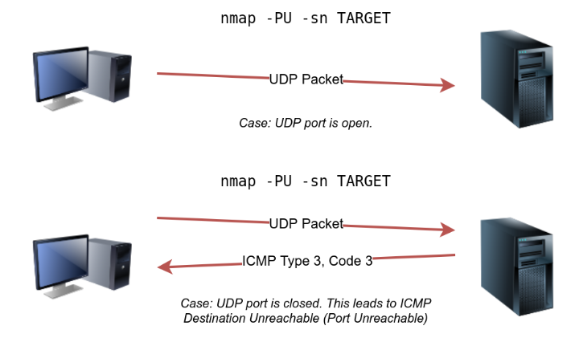
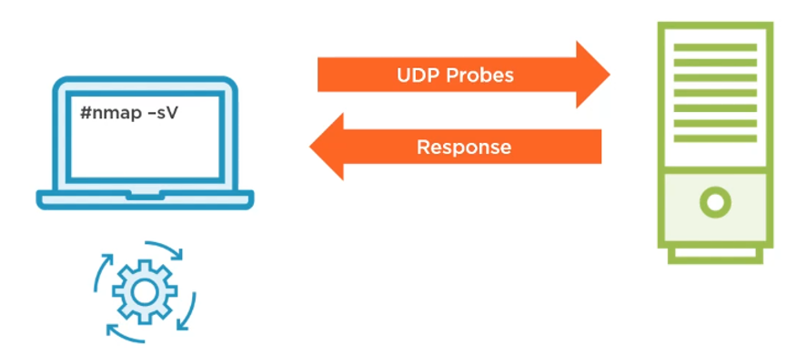

# Nmap (gui zenmap)

Nmap (Network Mapper) to popularne narzędzie open source służące 
do odkrywania sieci i audytowania jej bezpieczeństwa. Jest używane 
głównie do skanowania portów, co pozwala na identyfikację 
aktywnych urządzeń oraz uruchomionych usług w sieci. Nmap może 
również wykrywać systemy operacyjne oraz szczegóły dotyczące 
oprogramowania na podstawie tzw. fingerprintingu.

Nmap uses IP packets to scan networks for hosts, open ports and vulnerabilities.  

## Fazy
`Target Enumeration`: Nmap determines the list of target IP addresses based on user input.  
`Host Discovery`: Nmap determines which hosts are online.  
`Reverse-DNS Resolution`: Nmap uses reverse-DNS resolution to determine the names of hosts.  
`Port Scanning`: Nmap sends probes (various IP packets) and collects the responses which are used to classify ports into different states.  
`Version detection`: Nmap sends additional packets and evaluates responses.  
`OS detection`: Nmap evaluates responses to probes to determine the operating system.  
`Traceroute`: Nmap contains its own traceroute function.  
`Script scanning`: The nmap scripting Engine can be leveraged to expand on Nmap's capabilities.  
`Output`: Outputs results on the screen.

## Usage 

`nmap [Scan Type(s)] [Options] {target specification}`

Before we get started, we should note that throughout this room, we are either running nmap as root or using sudo because we don’t want to restrict Nmap’s abilities with our account privileges. Running Nmap as a local (non-root) user would limit us to fundamental types of scans such as ICMP echo and TCP connect scans; 

Default scan type: nmap runs a SYN (stealth scan) scan when no specified type is entered
Other scan types use the properties of TCP/UDP packets and connections.
Stealth scan minimizes the likelihood of detection by the target system or intrusion detection systems

In a SYN scan, Nmap sends only a SYN packet (the first step in the TCP handshake) to the target port.
If the port is open, the target responds with a SYN-ACK. Nmap does not complete the handshake; instead, it sends a RST (Reset) packet to close the connection. This incomplete handshake often avoids logging on the target system, as the connection never fully establishes.

Default options: by default it runs host discovery and scans 1000 TCP ports
Port scanning options enable selection from  to all ports.
Additional options allow for service, version and OS detection.

Target specification: has no default option. Can take list of IP addresses, hostnames and networks.  
Options include input of a list from a name.
Nmap ca also select targets at random.

This command will tell nmap to run a stealth SYN scan your loopback interface for port 22 ssh.
```
nmap -sS -p22 127.0.0.1

Starting Nmap 7.80 ( https://nmap.org ) at 2024-11-21 19:25 CET
Nmap scan report for localhost (127.0.0.1)
Host is up (0.0021s latency).

PORT   STATE  SERVICE
22/tcp closed ssh

Nmap done: 1 IP address (1 host up) scanned in 0.48 seconds
```
___
## Host Enumeration and Network Mapping - Who is Online? (Fazy 1-3)
- Determine which hosts are active
- Find hosts running a particular service
- Find unauthorized devices on the network
- Determine the focus of further scans

| Scan Type | Example Command |
|-----------|-----------------|
| ARP Scan | sudo nmap -PR -sn MACHINE_IP/24 |
| ICMP Echo Scan | sudo nmap -PE -sn MACHINE_IP/24
| ICMP Timestamp Scan | sudo nmap -PP -sn MACHINE_IP/24
| ICMP Address Mask Scan | sudo nmap -PM -sn MACHINE_IP/24
| TCP SYN Ping Scan | sudo nmap -PM -sn MACHINE_IP/24
| TCP ACK Ping Scan | sudo nmap -PM -sn MACHINE_IP/24
| UDP Ping Scan | sudo nmap -PU53,161,162 -sn MACHINE_IP/30

Remember to add `-sn` if you are only interested in host discovery without port-scanning.  
Omitting `-sn` will let Nmap default to port-scanning the live hosts.

| Other options | Purpose|
|---------------|--------|
| -Pn | no ping
| --traceroute | trace the path to the host
| -n and -R | DNS resolution `-n` turns off DNS resolution, `-R` forces DNS resolution for all hosts.
| --system-dns | System DNS
| --dns-servers | DNS servers specific dns to resolve to
| -sn | host discovery only |


### Specifying targets
`list`: MACHINE_IP scanme.nmap.org example.com will scan 3 IP addresses.
`IP range`: 10.11.12.15-20 will scan 6 IP addresses: 10.11.12.15, 10.11.12.16,… and 10.11.12.20.
`IP subnet`: If you want to scan a subnet, you can express it as 192.168.0.1/24, and this would be equivalent to 192.168.0.0-255
`hostname`: You can also specify your target by hostname, for example, example.thm

### List Scan (-sL)
`-sL` performs: 
- Lists all host thet will be scanned
- Performs reverse-DNS resolution on hosts
- `-n` suppresses  Nmap to the DNS serve
Is commonly used for enumeration and preparation before deeper analysis:


The command above lists all IP addresses in the /27 subnet associated with cosTam.com, along with their DNS names if resolvable. It does not actively scan or probe the targets.

### Ping Scan (-sn)
-sn aims to discover live hosts without attempting to discover the services running on them.
This scan might be helpful if you want to discover the devices on a network without causing much noise. However, this won’t tell us which services are running. I
`nmap -sn TARGETS`
`-sn` is for hosts discovery and performs:
- finds a list of available hosts
- by default sends an ICMP and TCP packet to determine if a host is up
- Can be combined with `-PS` option to check for other ports
When scanning a directly connected network, Nmap starts by sending ARP requests. When a device responds to the ARP request, Nmap labels it with “Host is up”.
When a privileged user tries to scan targets on a local network (Ethernet), Nmap uses ARP requests. A privileged user is root or a user who belongs to sudoers and can run sudo.
When a privileged user tries to scan targets outside the local network, Nmap uses ICMP echo requests, TCP ACK (Acknowledge) to port 80, TCP SYN (Synchronize) to port 443, and ICMP timestamp request.
When an unprivileged user tries to scan targets outside the local network, Nmap resorts to a TCP 3-way handshake by sending SYN packets to ports 80 and 443.

It gets a respons from the host and thus verifying if it is online.


Explanation:

1. `-sn: Ping Scan (No Port Scanning)`
The -sn option tells Nmap to only discover live hosts in the target range (192.168.0.0/27) without performing any port scanning.
It checks if hosts are up using:  
ICMP Echo Requests (ping).  
TCP SYN requests to port 443.  
Other lightweight probes, depending on the configuration.  
This mode is ideal for determining which devices in the range are online.  


2. `192.168.0.0/27: Target Subnet`
The 192.168.0.0/27 is a CIDR (Classless Inter-Domain Routing) range specifying 32 IP addresses:  
From 192.168.0.0 to 192.168.0.31.  
Nmap will probe each of these IP addresses.  


3. `--dns-servers 192.168.0.5: Custom DNS Server`
This option specifies a custom DNS server (in this case, 192.168.0.5) to resolve hostnames during the scan.  
By default, Nmap uses the system's configured DNS servers. Adding this option overrides that behavior.  
When a live host is detected in the subnet, Nmap queries 192.168.0.5 to attempt reverse DNS resolution (i.e., mapping the IP address to a hostname).

### Scanning specific hosts and subnets

- Subnets can be given in CIDR notation
- A range is entered using a hyphen
- Hostnames ca be used in place of IPs
- Devices can be excluded using `--exclude` option
- `-iL` option followed by filename to send a list of hosts to Nmap to scan
- `-iR` option tells Nmap to generate a random list of IP addresses for scanning

Selecting Specific hosts Example:


Sending a list of hosts and networks to nmap:


### TCP SYN Ping
We can send a packet with the SYN (Synchronize) flag set to a TCP port, 80 by default, and wait for a response. An open port should reply with a SYN/ACK (Acknowledge); a closed port would result in an RST (Reset). In this case, we only check whether we will get any response to infer whether the host is up. The specific state of the port is not significant here
If you want Nmap to use TCP SYN ping, you can do so via the option -PS followed by the port number, range, list, or a combination of them. For example, -PS21 will target port 21, while -PS21-25 will target ports 21, 22, 23, 24, and 25. Finally -PS80,443,8080 will target the three ports 80, 443, and 8080.
`nmap -PS -sn MACHINE_IP/24`
`sudo nmap -PS -sn 10.10.68.220/24`
`-PSPortNumber`
`nmap -PS22` ---> namp sends out a TCP SYN packet to make the target device think  
that we are initiating a TCP connection, if the port i open on the device it will respond with an ACK packet  
this verified that the host is online. Instead of completing the TCP connection however nmap sends  
an RST packet to close the connection.
If the targeted port is closed it will just send beck an RST packet.

### TCP ACK Ping
As you have guessed, this sends a packet with an ACK flag set. You must be running Nmap as a privileged user to be able to accomplish this. If you try it as an unprivileged user, Nmap will attempt a 3-way handshake.
By default, port 80 is used. The syntax is similar to TCP SYN ping. -PA should be followed by a port number, range, list, or a combination of them. For example, consider -PA21, -PA21-25 and -PA80,443,8080. If no port is specified, port 80 will be used.
`sudo nmap -PA -sn MACHINE_IP/24`
`-PAPortNumber`
`nmap -PA22` ---> sends out an ACK packet, in respons the target will send beck an RST packet to close the connection (since there was no TCP to initiate the connection).  
Any respons tells nmap that the target is online and responding to probes.

Additional advantage over the ICMP and TCP SYN ping is that can be used to get around firewall rules based on SYN filters.

Example:
`nmap -PA22, 80, 389, 443, 8080, 8443 192.168.0.1/24 -T4`

### UDP ping
Finally, we can use UDP to discover if the host is online. Contrary to TCP SYN ping, sending a UDP packet to an open port is not expected to lead to any reply. However, if we send a UDP packet to a closed UDP port, we expect to get an ICMP port unreachable packet; this indicates that the target system is up and available.
`-PUPortList` if no ports are specified will send to port 31338
`nmap -PU` ---> sends UDP packet to the target, then the target will not send anything back to us.  
If the port is closed the target will send an ICMP unreachable message back letting us know that the host is online.  
`sudo nmap -PU -sn 10.10.68.220/24`



Good to bypass firewall configuration set for TCP.

### ICMP ping
Sends ICMP Echo Request receives ICMP Echo Replay.
`-PE`: Echo request
`-PP`: Timestamp query `nmap -PP -sn MACHINE_IP/24`. Because ICMP echo requests tend to be blocked, you might also consider ICMP Timestamp or ICMP Address Mask requests to tell if a system is online. Nmap uses timestamp request (ICMP Type 13) and checks whether it will get a Timestamp reply (ICMP Type 14).
`-PM`: Address mask query  `nmap -PM -sn MACHINE_IP/24`.  Nmap uses address mask queries (ICMP Type 17) and checks whether it gets an address mask reply (ICMP Type 18).

If you don't want to follow with a port scan `nampa -PE -sn MACHINE_IP/24`
`sudo nmap -PE -sn 10.10.68.220/24`
If scanned from a system that belongs to a different subnet the results are without the MAC address.

### IP ping
`nmap -PO<protocol list> [target]`
Responses of ICMP protocol unreachable validates a live host.

### SCTP
SCTP uses the 4-way handshake to determine if the host is online
`nmap -PYPortNumbers` default port is 80 ---> it sends an INIT chunk to the target 
if the port is open it will respond with an init INIT-ACK chunk, the target is online.
The scanning machine will send an abort message to terminate athe connection.
If the port is closed the target will respond with an ABORT to terminate the connection,
this tells us the target is online and still responding to the probes.

### ARP ping
ARP scan is possible only if you are on the same subnet as the target systems. 
The MAC address is necessary for the link-layer header; the header contains the source MAC address and the destination MAC address among other fields. To get the MAC address, the OS sends an ARP query. A host that replies to ARP queries is up. The ARP query only works if the target is on the same subnet as yourself, i.e., on the same Ethernet/WiFi. You should expect to see many ARP queries generated during a Nmap scan of a local network. 

If you want Nmap only to perform an ARP scan without port-scanning, you can use `nmap -PR -sn TARGETS`

`-PR` uses the ARP process to discover hosts quickly on a LAN
`-disable-arp-ping` to diable because is used by default if targets are on the same LA


### Host discovery strategy
`Probe selection`: 
- TCP probes (-PS, -PA): TCP SYN scan produces maximum results. If we want to test firewall controls of each device or to discover additional device with ACK scan include both TCP SYN and ACK scan.
- UDP (-PU): additional firewall test
- ICMP probes (-PE, -PP, -PM): to check how our system reacts to various types of queries than attacker might use

`TCP Port Selection for Host Discovery`
Look for:
- Web services
- Mail and file services
- Authentication and remote access

`UDP and ICMP Port Selection`
Look for:
- Target UDP ports likely to be closed (for host discovery we are looking for a response which is provided if the port is closed)
- Standard ICMP echo with additional request

### How to defend against Nmap host discovery

Defense against the ping scan:
- Configure a host or network firewall to block ICMP traffic block ICMP echo request from a source outside the local network

Nmap also sends TCP packets to port 80 and 443 to see if hosts responds.
To prevent this you need to take the same action on your host:

- Configure firewall to drop TCP packets for port 80 and 443 unless needed.

The issue with using a network firewall to block these port is that they are used for http/https traffic
Limit TCP and UDP traffic allowed in to the network
Use stateful firewall
Configure outbond rules on the firewall
Block ICMP request
___
## Port scanning - Who is Listening  (Faza 4)
discover the network services listening on these live hosts. By network service, we mean any process that is listening for incoming connections on a TCP or UDP port. Common network services include web servers, which usually listen on TCP ports 80 and 443, and DNS servers, which typically listen on UDP (and TCP) port 53.

By design, TCP has 65,535 ports, and the same applies to UDP. How can we determine which ports have a service bound to it? 
- Detect outdated or valuable services
- Detect vulnerable applications
- Detect hosts not found with a ping
- Discover unnecessary services running on devices
se Firefox to access http://IP_ADDRESS:PORT_NUMBER
### Basics
- default scans 1000 ports.
- `-p` allows to specify port.
- `-F` fat mode runs a default scan but uses the most common 100 ports instead of 1000.
- `-r` not to randomize.
- `--top-ports` example: --top-ports 50 nmap will scan the 50 most commonly open ports.
- `--port-ratio` is followed with a decimal number between 0 and 1 like --top-ports utilizes  
the ports listed in Nmap services and selects ports that have a greater ratio value than the number you entered.  
This ratio is the frequency that nmap researchers found that port open when running scans.

Scanning a single port:


Selecting multiple ports:


```
nmap -p-1023 192.168.0.5 # with a port range

nmap -p1-1023,[1024-] win2k12-ad # [] only include ports that are registered in Nmap services.
```
### TCP SYN (stealth) scan
This is wah nmap runs by default if you don't enter any options
if you want to specify it use  `nmap -sS`.
If you want Nmap to use TCP SYN ping, you can do so via the option -PS followed by the port number, range, list, or a combination of them. For example, -PS21 will target port 21, while -PS21-25 will target ports 21, 22, 23, 24, and 25. Finally -PS80,443,8080 will target the three ports 80, 443, and 8080.
Similarly to host discovery nmap here initiates the scan by sending an SYN packet to the port sepcified in the command.
If the port is open then the target sends back an ACK to continiut the connection with us.
Sow e know that the port is open and sends an RST to close the connection.

Unlike the connect scan, which tries to connect to the target TCP port, i.e., complete a three-way handshake, the SYN scan only executes the first step: it sends a TCP SYN packet. Consequently, the TCP three-way handshake is never completed. The advantage is that this is expected to lead to fewer logs as the connection is never established, and hence, it is considered a relatively stealthy scan. 


If the port is closed the target will send an RST.
What happens if the target filters the port. nmap will send the SYN port 80 wait and the send it agait and wait for an answer.
if it will nevere recive one nmap nows that the port must be filtered, since we have previously verified that the host is online.  
When we did the host discovery process.


### TCP Connect Scan
`nmap -sT` ---> is a full open scan because we complete with SYN/ACK


With filtered port is the same as previously.

### TCP NULL, FIN and Xmas Scan
`nmap -sN` null scan sends TCP packet to the target port with no flags set.
`namp -sF` TCP FIN scan send a packet with FIN bit set.
`nmap -sX` sends a packet with FIN, PSH, URG bit set.

No respons from the target means the port is either open or filtered.
Respons with TCP RST port is closed.
Respons with ICMP unreachable port is filtered.

### TCP ACK Scan
`namp -sA`
If target respons with RST is we know that the port is not filtered because the sytem actually responded.
ICMP unreacheble: port must be filtered because the ACK packet can never get to its destination.
Waiting for timeout: sends ACK again if no response the port is filtered.

### TCP Window scan
`namp -sW`
Evaluates the response from the target's window field to try to determine different port states.

Port is open: 


Port is closed:


Port is filtered:


### TCP Idle Scan
`nmap -sl IP for zombie (gray) host and IP for target (green)`
Combine with `-PN` to increase stealth.


If the target port is closed or filtered it will send an RST to the zombie so the ID won't increment.

### UDP scan
`namp -sU`


No respons is or open or filtered

If closed:


If filtered:


### IP Scan
Is actually a protocol scan not port
Interprets ICMP protocol unreachable messages to try to determine which protocols are in use on the system.
Possible states for the protocol are open, closed, filtered and open | filtered

### Custom Port Scans
`--scanflags` to set custom scan

Example: Nmap will send TCP packets with the SYN, PSH and FIN flags:
`nmap -sS --scanflags SYNPSHFIN website.com`

### Limiting target ports
`-F` is for Fast mode, which scans the 100 most common ports (instead of the default 1000).
`-p[range]` allows you to specify a range of ports to scan. For example, -p10-1024 scans from port 10 to port 1024, while 
`-p-25` will scan all the ports between 1 and 25. Note that -p- scans all the ports and is equivalent to -p1-65535 and is the best option if you want to be as thorough as possible.

### Protecting against port scanning
- Scan your own network with nmap and close unnecessary ports and patch or mitigate vulnerabilities.
- Block scans with network firewalls
- Implement network security tools that can detect scans
___
## Performance and timing 
number of parallel service probes:

`--min- and --max-hostgroup`: controls the number of hosts that are scanned concurrently by Nmap
`--min-parallelism <numprobes> and --max- parallelism <numprobes>`: how many probes are launched in parallel
`--min-, --max-, and -inital-rtt-timeout`: control probe timeouts. Higher timeout values men that nmap will wait longer to receive each probe.
`--max-retries`: 
`--host-timeout`: Maximum amount of time to wait for a target host
`--scan-delay and --max-scan-delay`: control the time between each probe sent to an individual host.
`--min-rate <number> and --max-rate <number>`: controls the number of packets sent per second

Running your scan at its normal speed might trigger an IDS or other security solutions. It is reasonable to control how fast a scan should go. Nmap gives you six timing templates, and the names say it al
You can pick the timing template by its name or number. For example, you can add -T0 (or -T 0) or -T paranoid to opt for the slowest timing.

| Timing | Explanation/Total Duration |
|--------|----------------------------|
| T0 (-T paranoid) | 9,8 h
| T1 (-T sneaky) | 27,53 min
| T2 (-T polite) | 40.56 sec
| T3 (-T normal) | 0.15 sec
| T4 (-T aggressive) | 0,13 sec
| T5 | ?

___
## Service Version, Application Version, OS Detection
`-sV`:  This option is used for service version detection. It attempts to determine the version of the services running on open ports.  
Nmap will try to gather as much information as possible about each service to provide details such as software name, version,  
and sometimes even configuration options.
Multiple options exists beginning with `--versions` to determine intensity

Example:


| Option | Explanation |
|--------|-------------|
| -O | operating system detection.
| --osscan-limit | instruct Nmap to limit OS detection to promising targets only.
| --osscan-guess | tells namp to aggressively guess operating system of all detected targets in the scan
| -A | enables OS detection, version scanning, and traceroute, among other things.
| -Pn | Scan hosts that appear to be down

 `nmap -O -T4 192.168.0.0/28`

### How Service Version, Application Version  works
First a port scan:


Once it has the open ports will try the TCP connection, is looking for a banner from the target:


If a banner is not send but any other type of response it will evaluate that response:


If it can't evaluate it will move to UDP probes:



If it can't find it after TCP and UDP probes it will go for SSL Probes:


If SSL is successful it will try an SSL connect:


If SSl probes are unsuccessful nmap will attempt RPC and SMB probes:


If it is successful it will try brute force to get the information:


If nothing work it will produce a fingerprint of the version and output it to the screen.

### Options
`--version-intensity [0-9]`: version intensity just controls how many probes are sent to each port to try to determine the version
`--version-light`: intensity 2
`--version-all`: intensity 9
`--version-trace`: outputs the process of scanning

### How OS detection works
What different probes Nmap sends:
1. Sequence Generation probes (SEQ, OPS, WIN): 6 TCP probes sent to generate 4 test responses
2. ICMP echo (IE) requests: 2 ICMP echo request top the target
3. TCP explicit congestion notification (ECN)
4. Six more TCP tess
5. UDP probe to close port (U1)

Once nmap has compiled all teh responses from these tests it then evaluates them through a series of response tests.
32 different response tests.
___
## Detecting and evading Firewalls
Firewall detection example:


Scanning a firewall:


`Determine firewall rules with nmap`:
- TCP SYN scan of firewall to detect open, closed and filtered ports
- TCP ACK scan to test rules and compare
- UDP version detection scan

`TCP SYN scan`
Running the stealth SYN scan to test hosts firewall responses.
Responses indicate that SYN packets pass thorough host firewall


`TCP ACK scan`
TCP ACK scan used to verify host firewall responses
All ports came back as filtered


`UDP version scan`
Use UDP scanning with version detection to bypass TCP rules
Detected 5 open ports and 995 open|filtered ports


`Bypassing Firewall rules`:
1. FIN scan: sends TCP packets with different bits set 
2. Source port manipulation
3. IPv6 scans to bypass firewalls with limited configuration for IPv4
4. Fragmentation
5. MAC spoofing
6. Source rooting

`FIN Scan Example`:
Using the FIN scan can bypass SYN and ACK TCP rules.
FIN scans cannot differentiate between open and filtered


2
`Sourc Port Manipulation Example`:
Command runs a stealth SYN scan from source port 445.
When run against the domain controller, results were the same.


`Avoiding IDS Systems with nmap`
1. Slow down scans
2. Randomize hosts
3. Fragment packets
4. Evade know IDS rules

`Misleading IDS Systems`
1. Utilize decoy systems when scanning
2. Spoof port scans
3. DNS proxy
___
## Output control what you see
Most likely, the -v option is more than enough for verbose output; however, if you are still unsatisfied, you can increase the verbosity level by adding another “v” such as -vv or even -vvvv. You can also specify the verbosity level directly, for example, -v2 and -v4. You can even increase the verbosity level by pressing “v” after the scan already started.
If all this verbosity does not satisfy your needs, you must consider the -d for debugging-level output. Similarly, you can increase the debugging level by adding one or more “d” or by specifying the debugging level directly. The maximum level is -d9; 

Saving outputs:
-oN <filename> - Normal output
-oX <filename> - XML output
-oG <filename> - grep-able output (useful for grep and awk)
-oA <basename> - Output in all major formats


## Ćwiczenia ze studiów
### Ćwiczenia zwykłe
Prosty nmap: `nmap 192.168.100.2` cel znalezienie portu na, którym nasłuchuje usługa ssh (port 23)  

Bardziej szczegółowy raport: `nmap -A 192.168.100.2`  

Połączenie SSH: `ssh student@192.168.100.2 -p 23`  

Odkrywanie hostów: `nmap -sn 192.168.100.0/24 [wytłumaczenie: -sn wyłącza skanowanie portów]`  

`Otwarte Porty (uwaga może być na zaliczeniu)`: przeskanowanie sieci 192.168.100.0/24 pod kątem uruchomionych hostów oraz otwartych portów TCP bez dokładnego skanowania usług.  
`nmap -sT 192.168.100.0/24 [wytłumaczenie: -sT skanuje porty TCP]`  

Detekcja wersji: przeskanowanie sieci 192.168.100.0/24 pod kątem uruchomionych hostów oraz otwartych portów TCP z uwzględnieniem wersji usług.  
`nmap -sV 192.168.100.0/24 [wytłumaczenie: -sV skanuje porty TCP i pobiera wersje działających usług]`  

Skrypty: przeskanowanie sieci 192.168.100.0/24 pod kątem uruchomionych hostów, otwartych portów TCP oraz uruchomieniem domyślnych skryptów.  
`nmap -sC 192.168.100.0/24 [wytłumaczenie: -sC skanuje porty TCP, uruchamia domyślne skrypty]`  

Detekcja OS: `nmap -O --osscan-guess 192.168.100.0/24 [wytłumaczenie: -O --osscan-guess zgaduje system operacyjny na hostach]`  

### Ćwiczenia Pentest
Nmap podsumowanie: Celem zadania jest przeskanowanie maszyny 192.168.200.52
` nmap-sT-sV-sC-O --osscan-guess 192.168.200.52`
Serwer HTTP: Celem zadania jest odczytanie flagi z pliku flag2.2p.txt na serwerze HTTP
```
curl http://192.168.200.52/
curl http://192.168.200.52/flag2.2p.txt

alternatywnie:
wget http://192.168.200.52/flag2.2p.txt
cat flag2.2p.txt
pobieranie wszystkich plików:
wget-r--no-parent http://192.168.200.52/
```
Serwer FTP: Celem zadania jest odczytanie flagi z pliku flag2.3p.txt na serwerze FTP i wklejenie
do formularza na stronie.
```
ftp 192.168.200.52
Name: anonymous
Password: dowolne
dir
get flag2.3p.txt
 
cat flag2.3.txt
```
Serwer SMB: Celem zadania jest odczytanie flagi z pliku flag2.4p.txt na serwerze SMB
i wklejenie do formularza na stronie.

```
smbclient-N-L //192.168.200.52/ #wylistuje nazwy zasobów, w tym FLAG
smbclient-N //192.168.200.52/FLAG #połączy się z zasobem FLAG
ls
get flag2.4p.txt
```
Wnarzędziu smbclient, przełączniki-L i-N pełnią następujące funkcje:
-L: Wyświetla listę dostępnych zasobów (udostępnionych folderów) na serwerze  SMB. 
Używasięgo, aby zobaczyć, jakie udostępnione foldery są dostępne na serwerze.  
-N: Pomija uwierzytelnienie hasłem, co oznacza, że smbclient łączy się z serweremSMB bezwymagania podania hasła. Jest użyteczne,gdy dostęp  
do zasobów wymagatylko identyfikacji użytkownika.
___
## Sources
- M. Glass, Getting started with nmap 7, https://app.pluralsight.com/
- M. Glass, Testing Security Controls and Detecting Vulnerabilities with Nmap 7, https://app.pluralsight.com/
- https://tryhackme.com/


