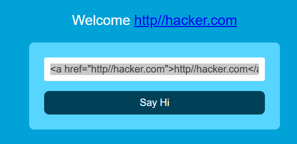

HTML Injection is a vulnerability that occurs when unfiltered user input is displayed on the page. If a website fails to sanitise user input (filter any "malicious" text that a user inputs into a website), and that input is used on the page, an attacker can inject HTML code into a vulnerable website.
When a user has control of how their input is displayed, they can submit HTML (or JavaScript) code, and the browser will use it on the page, allowing the user to control the page's appearance and functionality.

The image above shows how a form outputs text to the page. Whatever the user inputs into the "What's your name" field is passed to a JavaScript function and output to the page, which means if the user adds their own HTML or JavaScript in the field, it's used in the sayHi function and is added to the page - this means you can add your own HTML (such as a <h1> tag) and it will output your input as pure HTML.

The general rule is never to trust user input. To prevent malicious input, the website developer should sanitise everything the user enters before using it in the JavaScript function; in this case, the developer could remove any HTML tags.

<a href="http://hacker.com">http//hacker.com</a

