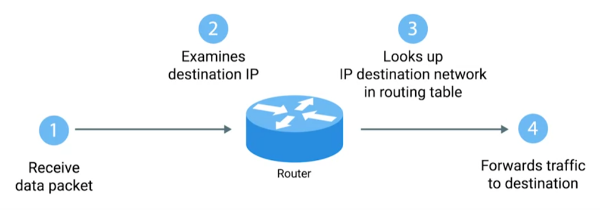

# IP addresses
Device talking to device needs an IP address --> identifier of a device in a network
Public and Private


Public address is assigned to your router and can communicate with the internet
are unique, used externally, assigned by an ISP, not free. are not secure because they are visible (use VPN or proxy)!


Private can't be registered are no unique only unique for your local area , used internally, are free 
assigned by router on the internet and the have to be "converted" to public first.
Router gives private ip addresses, and when the devices have to access internet router transaltes these private to public
via NET, also translate public to private

Private IP have diferent classes with different ranges

If you want to know your public IP address just go to https://www.whatismyip.com/

`ifconfig/ipconfig`

````
inet 192.168.57.139 # ipv4
inet6 fe80::20c:29ff:fe0a:4205 prefixlen 64 scopied 0x20<link> #ipv6
````
`inet` is in decimal notation `inet6` in hexadecimal.
layers? osi model? Layer 3 protocols -->router

````
 8 + 8 + 8 + 8 = 32 bits = 4 bytes
192.168.57.139
 |
 |--> realisticly this rapresent a bunch o 1 and 0 so we have a human readable format  
      8 bits = 11111111.11111111.11111111.11111111. or 0
      Each of the sets of numbers (octets) can be between 0-255

128 64 32 16 8 4 2 1
 0   0  0  0 0 1 1 1 = 7.7.7.7
 
ipv4 = 2^32 = 4,294,967,296 ---> possible amount of ip addresses, they are already used all!
                                this is why privat IP addresses have ben developed
 
ipv6 = 2^128 = 3.4028236692093846346337460743177e+38 wystarczjąco dla wszystkich :)

nat = network address transation. Powiedzmy, że mam 20 urządzeń które będą potrzebować 20ip adresów
Czy kradnę 20 adresów z tych 4 bilionów? NIE bo nat!

With nat we assigned thest 20 private ip address spaces to 192.168.57.139 which is a private address only know to you  
and we pass them out through what is acalled a public ip address
````

Subnet Maska/Netmask

Default getaway/aka Router

DHCP --> routers assigns ip addresses to your devices.
IP addresses are given via subnet mask

```
Ipv4       192.168.57.139
            |   |   |  |
Sbnet Mask 255.255.255.0

If the corrisponding Subnet Mask octet is 255 then the Ipv4 Octent will alweys be the same in your local network
here: 192.168.57 --> Network portion of the IP address is like the street name where you live
The lat number in Subnet mask = 0 seys that the corrsiponding cna be whatever number between 0-255  
139-->Host is like your home number

if 255 then network part of the address when 0 is host
```
two ip addresses are reserved, your address and the broadcast address + router so 253


