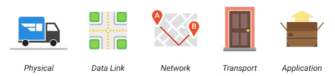

## OSI model

| Layer Name | Protocol | Protocol Data Unit | Addressing | Explanation |
|------------|----------|--------------------|------------|-------------|
| Application | HTTP, FTP, IRC, SSH, DNS etc...| Messages | n/a | End user layer
| Presentation | SSL, SSH, IMAP, FTP, MPEG, JPEG | | |  Syntax layer
| Session | ApI's, Sockets, WinSock | | | Synch & send to port
| Transport | TCP, UDP | Segment | Port#'s | Sorts out which client and server programs are supposed to get that data. End-to-end connection.
| Network | IP, ICMP, IPSec, IGMP | Packet/Diagram | IP Address | Allows different networks to communicate with each other through devices known as routers
| Data Link | Ethernet, PPP, Switch, Bridge | Frames | MAC Address | Responsible for defining a common way of interpreting these signals so network devices can communicate
| Physical | n/a | Bits | n/a | Physical devices that interconnect computers (Coax, fiber, wireless, hubs, repeaters)
___
## The TCP/IP five layer model

| Layer Name | Protocol | Protocol Data Unit | Addressing | Explanation |
|------------|----------|--------------------|------------|-------------|
| Application | HTTP,SMTP etc...| Messages | n/a | 
| Transport | TCP/UDP | Segment | Port#'s | Sorts out which client and server programs are supposed to get that data. End-to-end connection
| Network | IP | Packet/Datagram | IP Address | Allows different networks to communicate with each other through devices known as routers
| Data Link | Ethernet, Wi-Fi | Frames | MAC Address | Responsible for defining a common way of interpreting these signals so network devices can communicate
| Physical | n/a | Bits | n/a | Physical devices that interconnect computers

`Etherent`: Ethernet standards also define a protocol responsible for getting data 
to nodes on the same network or link  
`Internetwork`: A collection of networks connected together throughout routers (Internet)

The physical layer is the delivery truck and the roads. The data link layer is 
how the delivery trucks get from one intersection to the next over and over. 
The network layer identifies which roads need to be taken to get from address A to address B. 
The transport layer ensures that delivery driver knows how to knock on your door 
to tell you your package has arrived. 
And the application layer is the contents of the package itself.
___
## Unicast, Multicast, Broadcast
`Unicast`: one device transmits data to another device.  
A unicast transmission is always meant for just one receiving address. 
At the ethernet level this is done by looking at a special bit in the destination MAC address. 
If the least significant bit in the first octet of a destination address is set to zero, 
it means that ethernet frame is intended for only the destination address. 
This means it would be sent to all devices on the collision domain, but only actually received and processed by the intended destination.

`Multicast`: If the least significant bit in the first octet of a destination address is set to one, it means you're dealing with a multicast frame. 
A multicast frame is set to all devices on the local network segment. It will be accepted or discarded by each device depending on criteria 
aside from their own hardware MAC address. Network interfaces can be configured to accept 
lists of configured multicast addresses for these sorts of communications. 

`Broadcast`:  In ethernet, broadcast is sent to every single device on a LAN. 
This is accomplished by using a special destination known as a broadcast address. 
The ethernet broadcast address is all F's `FF:FF:FF:FF:FF:FF`. Ethernet broadcasts are used so that devices can learn more about each other.
___

