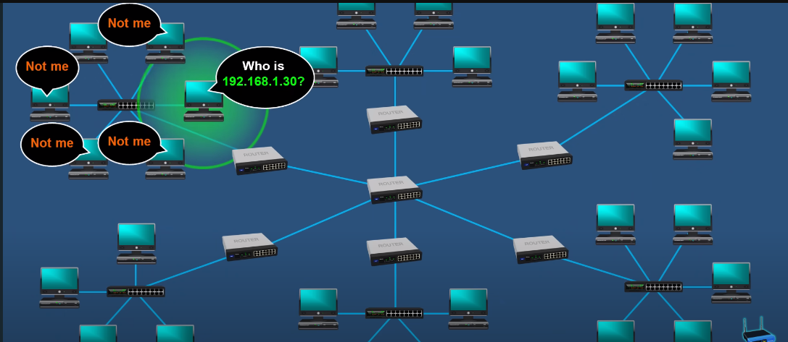

# Network
## IPv4
Device talking to device needs an IP address --> identifier of the network and the host
Can be `Public and Private`.
Public address is assigned to your router and can communicate with the internet are unique, used externally, assigned by an ISP, not free.
Private can't be registered are no unique only unique for your local area, used internally, are free assigned by router on the internet and the have to be "converted" to public first.
Router gives private ip addresses, and when the devices have to access internet router translates these private to public
via NET, also translate public to private.

If you want to know your public IP address just go to https://www.whatismyip.com/

`ifconfig/ipconfig`

````
inet 192.168.57.139 # ipv4
inet6 fe80::20c:29ff:fe0a:4205 prefixlen 64 scopied 0x20<link> #ipv6
````
`inet` is in decimal notation `inet6` in hexadecimal.

IPv4 addresses are a 32-bit long numbers made up of four octets and each octet is 
normally described in decimal numbers. 
Eight bits of data or a single octet can represent all decimal numbers from 0-255. 

````
 8 + 8 + 8 + 8 = 32 bits = 4 bytes
192.168.57.139 --> dotted decimal notation
 |
 |--> realisticly this rapresent a bunch o 1 and 0 so we have a human readable format  
      8 bits = 11111111.11111111.11111111.11111111. or 0
      Each of the sets of numbers (octets) can be between 0-255

128 64 32 16 8 4 2 1 = 255
 0   0  0  0 0 1 1 1 = 7.7.7.7
 
ipv4 = 2^32 = 4,294,967,296 ---> possible amount of ip addresses, they are already used all!
                                this is why privat IP addresses have ben developed
````

12.34.56.78 is a valid IP address but 123.456.789.100 would not be because it has numbers larger than could be represented by eight bits. 

IP addresses belong to the networks, not to the devices attached to those networks. Your laptop will 
always have the same MAC address no matter where you use it, but it'll have a different IP address assigned to it at an Internet café 
than it would when you're at home. 

Many modern networks, you can connect a new device and an IP address will be assigned 
to it automatically through a technology known as `Dynamic Host Configuration Protocol - DHCP`. An IP address assigned this way is 
known as a `dynamic IP address`. The opposite of this is known as a `static IP address`, which must be configured on a node manually. 
In most cases, static IP addresses are reserved for servers and network devices while dynamic IP addresses are reserved for clients.
___
### IP datagram
`IP datgram`:


IP datagram is a highly structured series of fields that are strictly defined.
The very first field, `Version`, is four bits and indicates what version of Internet Protocol is being used v4 or v6.

`Header Lenght`: four bit field that declares how long the entire header is. Almost always 20 bytes in length, when dealing with IPv4. In fact 20 bytes is the minimum length of an IP header.

`Service type`: These 8 bits can be used to specify details about quality of service or `QoS technologies`.
 The important takeaway about QoS is that there are services that allow routers to make decisions about which IP datagram maybe more important than others.

`Total Lenght`: 16 bit field . It's used to indicate the total length of the IP datagram it's attached to.

`Identification field`: 16 bit number that's used to group messages together. IP datagrams have a maximum size and you might already be able to figure out what that is since the total length field is 16 bits and this field indicates the size of an individual datagram. 
The maximum size of a single datagram is the largest number you can represent with 16 bits 65,535. If the total amount of data that needs to be sent is larger than what can fit in a single data gram the IP layer needs to split this data up into many individual packets. 
When this happens, the identification field is used so that the receiving end understands that every packet with the same value in that field is part of the same transmission.

`Flag field`: The flag field is used to indicate if a datagram is allowed to be fragmented or to indicate that the datagram has already been fragmented.

`Fragmentation offset field`:  Fragmentation is the process of taking a single IP datagram and splitting it up into several smaller datagrams. The fragmentation offset field contains values used by the receiving end to take all the parts of a fragmented packet and put them back together in the correct order.

`TTL - time to live`: This field is an 8 bit field that indicates how many router hops a datagram can traverse before it's thrown away. Every time a datagram reaches a new router, that router decrements the TTL field by one. Once this value reaches zero, a router knows it doesn't have to forward the datagram any further. 
The main purpose of this field is to make sure that when there's a miss configuration in routing that causes an endless loop. Datagrams don't spend all eternity trying to reach their destination. And endless loop could be when router A thinks router B is the next hop and router B thinks router A is the next hop.

`Protocol`: This is another 8 bit field that contains data about what transport layer protocol is being used. The most common transport layer protocols are TCP and UDP.

`Header Checksum`:This field is a check some of the contents of the entire IP datagram header. It functions very much like the ethernet checksum field (see Data link).

`Source IP Address`: 32 bit long.

`Destinatnion IP Address`: 32 bit long.

`IP Otions`: This is an optional field and is used to set special characteristics for data grams primarily used for testing purposes. The IP options field is usually followed by a padding field since the IP options field is both optional and variable in length.

`Paddinbg`: The padding field is just a series of zeroes used to ensure the header is the correct total size.
___
## Network ID/Host ID/Subnetting
IP addresses can be split into two sections; the `network ID` and the `host ID`.

`Netwrok address/ID`: Every network have a unique address. Network portion of the IP address is like the street name where you live
`Host address/ID`: is what is assigned to the host within that network. Host is like your home number

Here the Network Address is 192.168.1.0


Network + host is mainly for manageability to break bigger networks into smaller ones which is known as `subnetting`.
IP addresses have a network and host part., so networks can be logically broken down into smaller networks, which is `subnetting`.

If we have a large network and one computer starts to broadcasting it will send the message to all others machines, it would definitely slow dow the network
maybe eve bring it to a hold.
Networks are broken down and physically separated by using routers, broadcast do not get pass through routers, they only stay within they network/sub-network

So if this computer what to communicate with the other computer:

It will send a broadcast that only the computer in its subnet will hear:

But since the other computer is on a different subnet the signal will be sent through the default getaway, which is the router:


`Subnetting` is done by changing the default subnet mask by borrowing some of the bits from the host portion.

`Subnet mask` is used to understand which portion is network and which is host.
`Subnet mask` is a number that resembles an IP address, and tells you how many bits in the IP address are used for the network by 
masking the network portion of the IP address.

````
   192.    168.      1.      0 ---> IP address
11000000.10101000.00000001.00000000 ---> binary format computers undertund only this

   255.     255.     255.     0 ---> Subnet mask
11111111.11111111.11111111.00000000 ---> binary format
````
How to understand binary:
````
1 = on
0 = off

8 Bit Octet Chart  
128|64|32|16|8|4|2|1

128+64+32+16+8+4+1+2 = 255

192 = 11000000 = 128+64= 192
````
Masking:
````
Ipv4       192.168.57.139
            |   |   |  |
Sbnet Mask 255.255.255.0

192.168.57.139 = 11000000.10101000.00000001.00000000
                 ||||||||||||||||||||||||||
255.255.255.0  = 11111111.11111111.11111111.00000000

Where the IP address line up with the 1 in the subnet mask you have the network portion of the IP address,
and the remainig is the host portion. So in the subnet mask the 1 indicates the network and 0 the host.

````
What if subnet is something like 255.255.224.0?
```
255.       255.     224.      0
11111111.11111111.11100000.00000000

172.16.1.0 =    10101100.00010000.00000001.00000000
                |||||||||||||||||||||
255.255.224.0 = 11111111.11111111.11100000.00000000
```

`Subnetting` is done by changing the default subnet mask by borrowing some bits from the host portion.
````
255.255.225.0 = 11111111.11111111.11111111.00000000 = 1 network and 254 host (256 -2 because 1 for network and 1 for broadcast)

255.255.225.128 = 11111111.11111111.11111111.10000000 = 2 neworks with 126 hosts each

255.255.225.192 = 11111111.11111111.11111111.11000000 = 4 neworks with 62 hosts each

255.255.225.224 = 11111111.11111111.11111111.11100000 = 8 neworks with 30 hosts each 
...
255.255.225.254 = 11111111.11111111.11111111.11111110 = 128 neworks with 0 usable hosts 
````


Subnet mask can also be express in `CIDR - Classless Inter-Domain Routing (slash notation)`:

````
192.168.1.0 /24 ---> the number counts the 1 in the subnet mask
255.255.225.0 = 11111111.11111111.11111111.00000000
````
___
## Address class system
`Address class system`: is a way of defining how the global IP address space is split up. 
There are three primary types of address classes: Class A, class B, and class C. 

| Class | First Octet Address | Default subnet mask | 
|-------|---------------------|---------------------|
| A | 1-129 | 255.0.0.0
| B | 128-191 | 255.255.0.0
| C | 192-223 | 255.255.255.0

`Class A addresses` are those where the first octet is used for the network ID and the last three 
are used for the host ID. 
```
123.48.30.100
--- ---------
 |      |____ host ID
 |
 network ID

```
`Class B addresses` are where the first two octets are used for the network ID and the second two 
are used for the host ID. 
```
123.48.30.100
------ ------
 |        |____ host ID
 |
 network ID

```
`Class C addresses`, as you might have guessed, are those where the first three octets are 
used for the network ID and only the final octet is used for the host ID. 
```
123.48.30.100
--------- ---
 |         |____ host ID
 |
 network ID

```
Each address class represents a network of vastly different size.


If the first bit has to be a zero, as it is with the Class A address, the possible values for the first octet are 0-127. 
This means that any IP address with a first octet with one of those values is a Class A address. Similarly, Class B addresses are 
restricted to those that begin with the first octet value of 128 through 191 and Class C addresses begin with the first octet value 
of 192 through 223.
Class D addresses always begin with the bits 1110 and are used for multicasting, which is how a single IP datagram can be send to 
an entire network at once. 
These addresses begin with decimal values between 224 and 239. 
Lastly, Class E addresses makeup all of the remaining IP addresses, but they are unassigned and only used for testing purposes. 
In practical terms, this class system has mostly been replaced by a system known as CIDR or Classless Inter-Domain Routing.
___
## ARP
`Address resolution protocol`, or `ARP` is a protocol used to discover the hardware address of a node with a certain IP address.
Once an IP datagram has been fully formed, it needs to be encapsulated inside an Ethernet frame. 
This means that the transmitting device needs a destination MAC address to complete the Ethernet frame header. 
Almost all network connected devices will retain a local ARP table. 
An ARP table is just a list of IP addresses and the MAC address is associated with them.

Let's say we want to send some data to the IP address 10.20.30.40. 
It might be the case that this destination doesn't have an entry in the ARP table.

When this happens, the node that wants to send data sends a `broadcast ARP message` to the `MAC Broadcast address`, which is all Fs.  
These kinds of broadcast ARP messages are delivered to all computers on the local network.

When the network interface that's been assigned an IP of 10.20.30.40 receives this ARP broadcast, it sends back what's known as an `ARP response`.

Now the transmitting computer knows what MAC address to put in the destination hardware address field and the Ethernet frame is ready for delivery. 
It will also likely store this IP address in its local ARP table so that it won't have to send an ARP broadcast the next time it needs to communicate with this IP.
ARP table entries generally expire after a short amount of time to ensure changes in the network are accounted for.
___

## Sources
- PowerCertAnimated videos, Subnet Mask - Explained, https://www.youtube.com/@PowerCertAnimatedVideos
- Google, The Bits and Bytes of Computer Networking, https://www.coursera.org/

