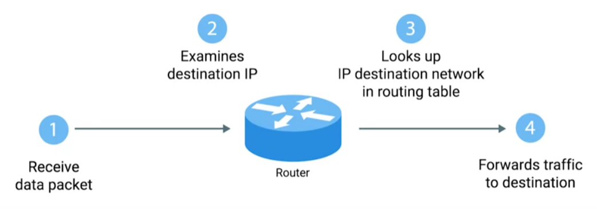
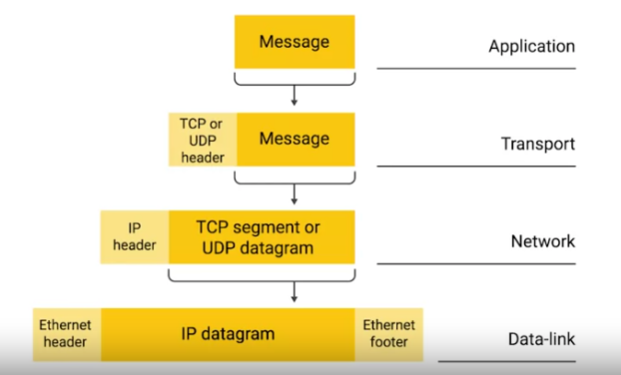
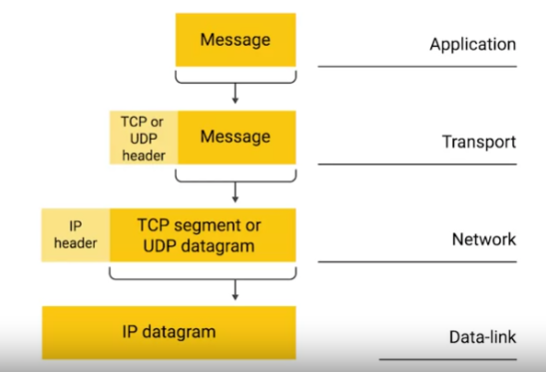
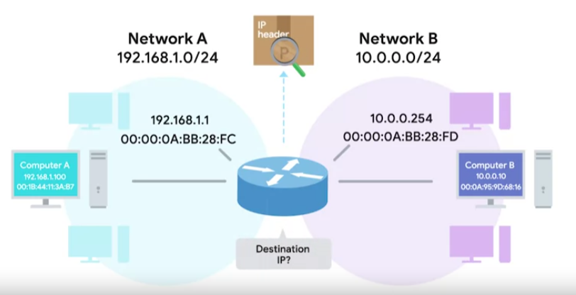
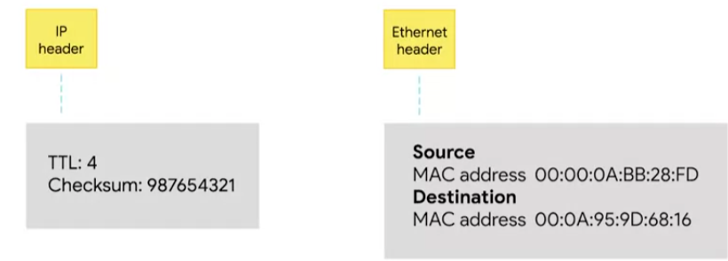

# Network
## IPv4
Device talking to device needs an IP address --> identifier of a device in a network
Can be Public and Private.
Public address is assigned to your router and can communicate with the internet
are unique, used externally, assigned by an ISP, not free.
Private can't be registered are no unique only unique for your local area, used internally, are free 
assigned by router on the internet and the have to be "converted" to public first.
Router gives private ip addresses, and when the devices have to access internet router translates these private to public
via NET, also translate public to private.

If you want to know your public IP address just go to https://www.whatismyip.com/

`ifconfig/ipconfig`

````
inet 192.168.57.139 # ipv4
inet6 fe80::20c:29ff:fe0a:4205 prefixlen 64 scopied 0x20<link> #ipv6
````
`inet` is in decimal notation `inet6` in hexadecimal.

IPv4 addresses are a 32-bit long numbers made up of four octets and each octet is 
normally described in decimal numbers. 
Eight bits of data or a single octet can represent all decimal numbers from 0-255. 

````
 8 + 8 + 8 + 8 = 32 bits = 4 bytes
192.168.57.139 --> dotted decimal notation
 |
 |--> realisticly this rapresent a bunch o 1 and 0 so we have a human readable format  
      8 bits = 11111111.11111111.11111111.11111111. or 0
      Each of the sets of numbers (octets) can be between 0-255

128 64 32 16 8 4 2 1
 0   0  0  0 0 1 1 1 = 7.7.7.7
 
ipv4 = 2^32 = 4,294,967,296 ---> possible amount of ip addresses, they are already used all!
                                this is why privat IP addresses have ben developed
````

12.34.56.78 is a valid IP address but 123.456.789.100 would not be because it has numbers larger than could be represented by eight bits. 

 

IP addresses belong to the networks, not to the devices attached to those networks. Your laptop will 
always have the same MAC address no matter where you use it, but it'll have a different IP address assigned to it at an Internet café 
than it would when you're at home. 


Many modern networks, you can connect a new device and an IP address will be assigned 
to it automatically through a technology known as `Dynamic Host Configuration Protocol - DHCP`. An IP address assigned this way is 
known as a `dynamic IP address`. The opposite of this is known as a `static IP address`, which must be configured on a node manually. 
In most cases, static IP addresses are reserved for servers and network devices while dynamic IP addresses are reserved for clients.


`IP datgram`:


IP datagram is a highly structured series of fields that are strictly defined.
The very first field, `Version`, is four bits and indicates what version of Internet Protocol is being used v4 or v6.
` Header Lenght`: four bit field that declares how long the entire header is. almost always 20 bytes in length, when dealing with IPv4. In fact 20 bytes is the minimum length of an IP header. 
`Service type`: These 8 bits can be used to specify details about quality of service or QoS technologies.
 The important takeaway about QoS is that there are services that allow routers to make decisions about which IP datagram maybe more important than others
`Total Lenght`: 16 bit field . It's used to indicate the total length of the IP datagram it's attached to.
`Identification field`: 16 bit number that's used to group messages together. IP datagrams have a maximum size and you might already be able to figure out what that is since the total length field is 16 bits and this field indicates the size of an individual datagram. The maximum size of a single datagram is the largest number you can represent with 16 bits 65,535. If the total amount of data that needs to be sent is larger than what can fit in a single data gram the IP layer needs to split this data up into many individual packets. When this happens, the identification field is used so that the receiving end understands that every packet with the same value in that field is part of the same transmission.
`Flag field`: The flag field is used to indicate if a datagram is allowed to be fragmented or to indicate that the datagram has already been fragmented
`Fragmentation offset field`:  Fragmentation is the process of taking a single IP datagram and splitting it up into several smaller datagrams. The fragmentation offset field contains values used by the receiving end to take all the parts of a fragmented packet and put them back together in the correct order
`TTL - time to live`: This field is an 8 bit field that indicates how many router hops a datagram can traverse before it's thrown away. Every time a datagram reaches a new router, that router decrements the TTL field by one. Once this value reaches zero, a router knows it doesn't have to forward the datagram any further. The main purpose of this field is to make sure that when there's a miss configuration in routing that causes an endless loop. Datagrams don't spend all eternity trying to reach their destination. And endless loop could be when router A thinks router B is the next hop and router B thinks router A is the next hop. 
`Protocol`: This is another 8 bit field that contains data about what transport layer protocol is being used. The most common transport layer protocols are TCP and UDP
`Header Checksum`:This field is a check some of the contents of the entire IP datagram header. It functions very much like the ethernet checksum field (see Data link)
`Source IP Address`: 32 bit long
`Destinatnion IP Address`: 32 bit long
`IP Otions`: This is an optional field and is used to set special characteristics for data grams primarily used for testing purposes. The IP options field is usually followed by a padding field since the IP options field is both optional and variable in length
`Paddinbg`: The padding field is just a series of zeroes used to ensure the header is the correct total size

IP addresses can be split into two sections; the `network ID` and the `host ID`.

`Netwrok address/ID`: Every network have a unique address. Network portion of the IP address is like the street name where you live
`Host address/ID`: is what is assigned to the host within that network. Host is like your home number

Here the Network Address is 192.168.1.0


Network + host is mainly for manageability to break bigger networks into smaller ones which is known as `subnetting`.
IP addresses have a network and host part., so networks can be logically broken down into smaller networks, which is `subnetting`.

If we have a large network and one computer starts to broadcasting it will send the message to all others machines, it would definitely slow dow the network
maybe eve bring it to a hold.
Networks are broken down and physically separated by using routers, broadcast do not get pass through routers, they only stay within they network/sub-network

So if this computer what to communicate with the other computer:

It will send a broadcast that only the computer in its subnet will hear:

But since the other computer is on a different subnet the signal will be sent through the default getaway, which is the router:


`Subletting` is done by changing the default subnet mask by borrowing some of the bits from the host portion.


Subnet mask is used to understand which portion if network on which is host.
Subnet mask is a number that resembles an IP address, and tells you how many bits in the IP address are used for the network by 
masking the network portion of the IP address.

````
   192.    168.      1.      0 ---> IP address
11000000.10101000.00000001.00000000 ---> binary format computers undertund only this

   255.     255.     255.     0 ---> Subnet mask
11111111.11111111.11111111.00000000 ---> binary format
````

How to understand binary:
````
1 = on
0 = off

8 Bit Octet Chart  
128|64|32|16|8|4|2|1

128+64+32+16+8+4+1+2 = 255

192 = 11000000 = 128+64= 192
````

Subnetting:

````
Ipv4       192.168.57.139
            |   |   |  |
Sbnet Mask 255.255.255.0

192.168.57.139 = 11000000.10101000.00000001.00000000
                 ||||||||||||||||||||||||||
255.255.255.0  = 11111111.11111111.11111111.00000000

Where the IP address line up with the 1 in the subnet mask you have the network portion of the IP address,
and the remainig is the host portion. So in the subnet mask the 1 indicates the network and 0 the host.

````
What if subnet is something like 255.255.224.0?
```
255.       255.     224.      0
11111111.11111111.11100000.00000000

172.16.1.0 =    10101100.00010000.00000001.00000000
                |||||||||||||||||||||
255.255.224.0 = 11111111.11111111.11100000.00000000
```

`Subnetting` is done by changing the default subnet mask by borrowing some bits from the host portion.
````
255.255.225.0 = 11111111.11111111.11111111.00000000 = 1 network and 254 host (256 -2 because 1 for network and 1 for broadcast)

255.255.225.128 = 11111111.11111111.11111111.10000000 = 2 neworks with 126 hosts each

255.255.225.192 = 11111111.11111111.11111111.11000000 = 4 neworks with 62 hosts each

255.255.225.224 = 11111111.11111111.11111111.11100000 = 8 neworks with 30 hosts each 
...
255.255.225.254 = 11111111.11111111.11111111.11111110 = 128 neworks with 0 usable hosts 
````


Subnet mask can also be express in `CIDR - Classless Inter-Domain Routing (slash notation)`:

````
192.168.1.0 /24 ---> the number counts the 1 in the subnet mask
255.255.225.0 = 11111111.11111111.11111111.00000000
````

`Address class system`: is a way of defining how the global IP address space is split up. 
There are three primary types of address classes: Class A, class B, and class C. 

| Class | First Octet Address | Default subnet mask | 
|-------|---------------------|---------------------|
| A | 1-129 | 255.0.0.0
| B | 128-191 | 255.255.0.0
| C | 192-223 | 255.255.255.0

Class A addresses are those where the first octet is used for the network ID and the last three 
are used for the host ID. 
```
123.48.30.100
--- ---------
 |      |____ host ID
 |
 network ID

```

Class B addresses are where the first two octets are used for the network ID and the second two 
are used for the host ID. 
```
123.48.30.100
------ ------
 |        |____ host ID
 |
 network ID

```
Class C addresses, as you might have guessed, are those where the first three octets are 
used for the network ID and only the final octet is used for the host ID. 
```
123.48.30.100
--------- ---
 |         |____ host ID
 |
 network ID

```
Each address class represents a network of vastly different size.


You might remember that each octet in an IP address is eight bits, which means each octet can take a value between zero and 255. If the first bit has to be a zero, as it is with the Class A address, the possible values for the first octet are 0-127. This means that any IP address with a first octet with one of those values is a Class A address. Similarly, Class B addresses are restricted to those that begin with the first octet value of 128 through 191 and Class C addresses begin with the first octet value of 192 through 223. Y
Class D addresses always begin with the bits 1110 and are used for multicasting, which is how a single IP datagram can be send to an entire network at once. These addresses begin with decimal values between 224 and 239. Lastly, Class E addresses makeup all of the remaining IP addresses, but they are unassigned and only used for testing purposes. In practical terms, this class system has mostly been replaced by a system known as CIDR or Classless Inter-Domain Routing.
___
## ARP
address resolution protocol, or ARP, comes into play. ARP is a protocol used to discover the hardware address of a node with a certain IP address. Once an IP datagram has been fully formed, it needs to be encapsulated inside an Ethernet frame. This means that the transmitting device needs a destination MAC address to complete the Ethernet frame header. Almost all network connected devices will retain a local ARP table. An ARP table is just a list of IP addresses and the MAC address is associated with them

Let's say we want to send some data to the IP address 10.20.30.40. It might be the case that this destination doesn't have an entry in the ARP table.

When this happens, the node that wants to send data sends a broadcast ARP message to the MAC Broadcast
address, which is all Fs. 
These kinds of broadcast ARP messages are delivered to all computers on the local network.

When the network interface that's been assigned an IP of 10.20.30.40 receives this ARP broadcast, it sends back what's known as an ARP response

Now the transmitting computer knows what MAC address to put in the destination hardware address field and the Ethernet frame is ready for delivery. It will also likely store this IP address in its local ARP table so that it won't have to send an ARP broadcast the next time it needs to communicate with this IP. Handy. ARP table entries generally expire after a short amount of time to ensure changes in the network are accounted for.

## Subnetting
```
Ipv4       192.168.57.139
            |   |   |  |
Sbnet Mask 255.255.255.0

If the corrisponding Subnet Mask octet is 255 then the Ipv4 Octent will alweys be the same in your local network
here: 192.168.57 --> Network portion of the IP address is like the street name where you live
The lat number in Subnet mask = 0 seys that the corrsiponding cna be whatever number between 0-255  
139-->Host is like your home number

if 255 then network part of the address when 0 is host
```
two ip addresses are reserved, your address and the broadcast address + router so 253



In the most basic of terms, subnetting is the process of taking a large network and splitting it up into many individual smaller subnetworks or subnets.

Address classes give us a way to break the total global IP space into discrete networks. If you want to communicate with the IP address 9.100.100.100, core routers on the Internet know that this IP belongs to the 9.O.O.O Class A network. They then route the message to the gateway router responsible for the network by looking at the network ID. A gateway router specifically serves as the entry and exit path to a certain network.

 You can contrast this with core Internet routers, which might only speak to other core routers. Once your packet gets to the gateway router for the 9.O.O.O Class A network, that router is now responsible for getting that data to the proper system by looking at the host ID. This all makes sense until you remember that a single Class A network contains 16,777,216 individual IPs. That's just way too many devices to connect to the same router. This is where subnetting comes in. With subnets, you can split your large network up into many smaller ones. These individual subnets will all have their own gateway router's serving as the ingress and egress point for each subnet.


___
### Subnet Masks
In a world with subnetting, some bits that would normally comprise the host 
ID are actually used for the subnet ID. With all three of these IDs representable
by a single IP address, we now have a single 32-bit number that can be accurately 
delivered across many different networks. At the Internet level, core routers 
only care about the network ID and use this to send the datagram along to the 
appropriate gateway router to that network. 
That gateway router then has some additional information that it can use to send
the datagram along to the destination machine or the next router in the path to get there. 
Finally, the host ID is used by that last router to deliver the datagram to the 
intended recipient machine. 

Subnet IDs are calculated via what's known as a subnet mask. Just like an IP address, 
subnet masks are 32-bit numbers that are normally written out as four octets in decimal. 

A subnet mask is a binary number that has two sections. The beginning part, which 
is the mask itself, is a string of ones. Just zeros come after this. The subnet mask, 
which is the part of the number with all the ones, tells us what we can ignore when computing a host ID. 
The part with all the zeros tells us what to keep. Let's use the common subnet mask of 255.255.255.0.
This would translate to 24 ones followed by eight zeros. 
The purpose of the mask or the part that's all ones, is to tell a router what part of an IP address 
is the subnet ID

Let's use the common subnet mask of 255.255.255.0. This would translate to 24 ones followed by 
eight zeros. The purpose of the mask or the part that's all ones, is to tell a router what part 
of an IP address is the subnet ID. You might remember that we already know how to get the network 
ID for an IP address. For 9.100.100.100 a class A network. We know that this is just the first octet. 
This leaves us with the last three octets. Let's take those remaining octets and imagine them next to 
the subnet mask in binary form. The numbers in the remaining octets that have a corresponding one in 
the subnet mask are the subnet ID. The numbers in the remaining octets that have a corresponding zero 
are the host ID. The size of a subnet is entirely defined by its subnet mask. For example, with a subnet 
mask of 2550255.255.0, we know that only the last octet is available for host IDs regardless of what 
size the network and subnet IDs are. A single eight-bit number can represent 256 different numbers, or 
more specifically, the numbers 0-255. This is a good time to point out that in general, 
a subnet can usually only contain two less than the total number of host IDs available. 
Again, using a subnet mask of 255.255.255.0, we know that the octet available for host IDs 
can contain the numbers 0-255, but zero is generally not used, and 255 is normally reserved 
as a broadcast address for the subnet. This means that really only the numbers 
1-254 are available for assignment to a host.


Now, let's look at a subnet mask that doesn't draw its boundaries at an entire octet or eight-bits of address. The subnet mask 255.255.255.224 would translate to 27 ones followed by five zeros. This means that we have five bits of host ID space or a total of 32 addresses. This brings up a shorthand way of writing subnet masks. Let's say we're dealing with our old friend, 9.100.100.100 with a subnet mask of 255.255.255.224. Since that subnet mask represents 27 ones followed by five zeros, a quicker way of referencing this is with the notation /27. The entire IP and subnet mask could be written out as 9.100.100.100/27.




Address classes were the first attempt that splitting up the global Internet IP space. Subnetting was introduced when it became clear that address classes themselves weren't a sufficient way of keeping everything organized. But as the Internet continued to grow, traditional subnetting just couldn't keep up. With traditional subnetting and the address classes, the network ID is always either eight bit for class A networks, 16 bit for Class B networks, or 24 bits for class C networks. This means that there might only be 254 class A networks in existence. But it also means there are 2,097,152 potential class C networks. That's a lot of entries in a routing table. To top it all off, the sizing of these networks aren't always appropriate for the needs of most businesses. 254 hosts in a class C network is too small for many use cases. But the 65,534 hosts available for use in a class B network is often way too large. Many companies ended up with various adjoining class C networks to meet their needs. That meant that routing tables ended up with a bunch of entries for a bunch of class C networks that were all actually being routed to the same place. This is where CIDR or classless inter-domain routing comes into play. CIDR is even more flexible approach to describing blocks of IP addresses. It expands on the concept of subnetting by using subnet masks to demarcate networks. To demarcate something means to set something off. When discussing computer networking, you will often hear the term demarcation point to describe where one network or system ends and another one begins. In our previous model, we relied on a network ID, subnet ID, and host ID to deliver an IP datagram to the correct location. With CIDR, the network ID and subnet ID are combined into one. CIDR is where we get this shorthand slash notation that we discussed in the earlier video on subnetting. This slash notation is also known as CIDR notation. CIDR basically just abandons the concept of address classes entirely, allowing an address to be defined by only two individual IDs. Let's take 9.100.100.100 with a net mask of 255.255.255.0. Remember, this can also be written as 9.100.100.100/24. In a world where we no longer care about the address class of this IP, all we need is what the network mask tells us to determine the network ID. In this case, that would be 9.100.100.100/24.
The host ID remains the same. This practice not only simplifies how routers and other network devices need to think about parts of an IP address, but it also allows for more arbitrary network sizes. Before, network sizes were static, think only class A, class B, or class C, and only subnets could be of different sizes. CIDR allows for networks themselves to be differing sizes. Before this, if a company needed more addresses than a single class C could provide, they need an entire second class C. With CIDR they could combine that address space into one contiguous chunk with a net mask of slash 23 or 255.255.254.0. This means that routers now only need to know one entry in the routing table to deliver traffic to these addresses instead of two, It's also important to call out that you get additional available host IDs out of this practice. Remember that you always lose to host IDs per network. If a slash 24 network has 2^8 or 256 potential hosts, you really only have 256 - 2 or 254 available IPs to assign. If you need two networks of this size, you have a total of 254 + 254 or 508 hosts. A single slash 23 network, on the other hand, is 2^9 or 512, 512 - 2, 510 hosts. Take a second and lock that into your memory.


___
## Sources
- PowerCertAnimated videos, Subnet Mask - Explained, https://www.youtube.com/@PowerCertAnimatedVideos

