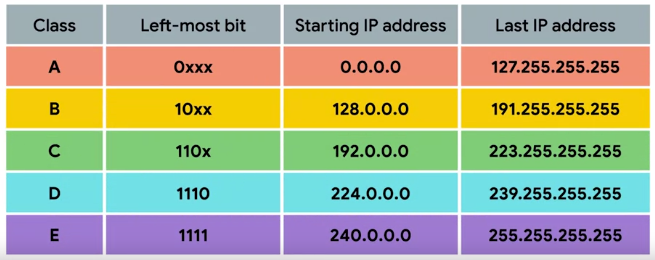
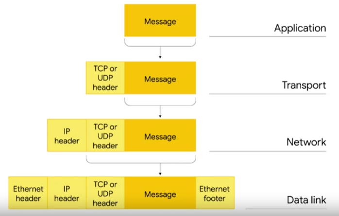
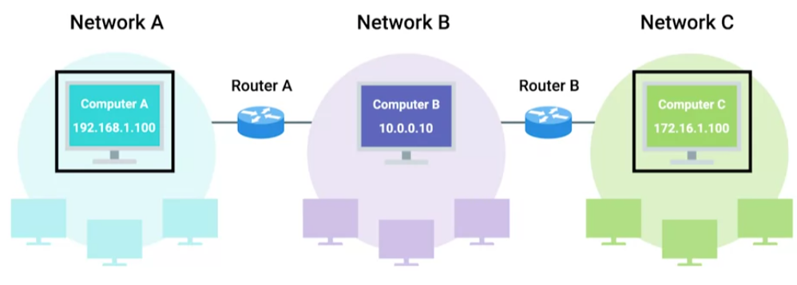
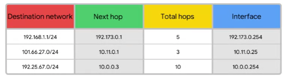
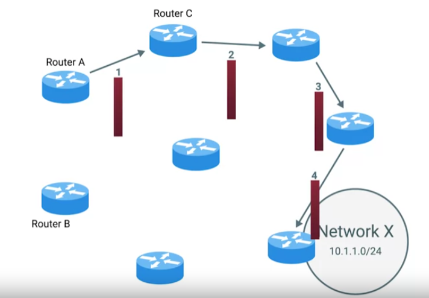
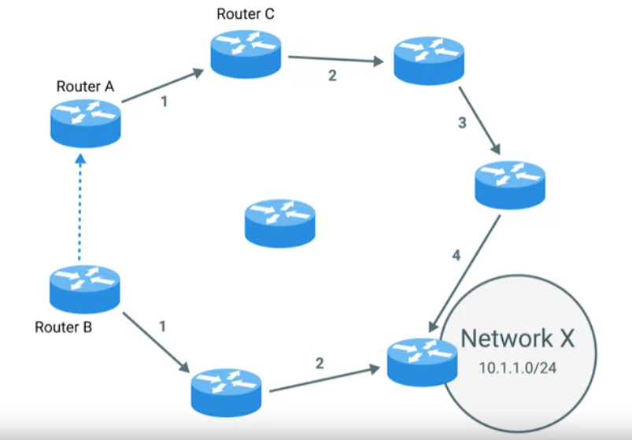
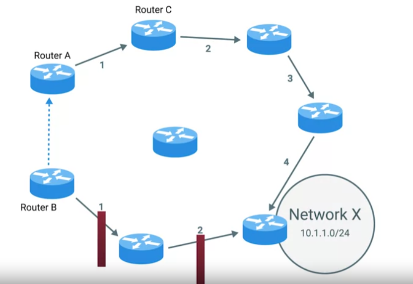
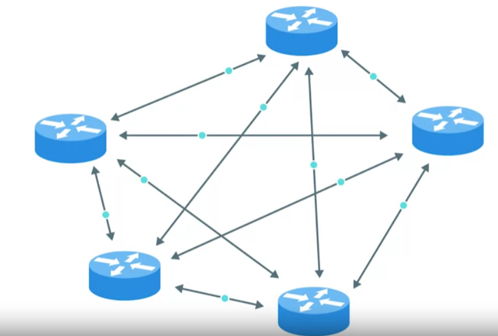
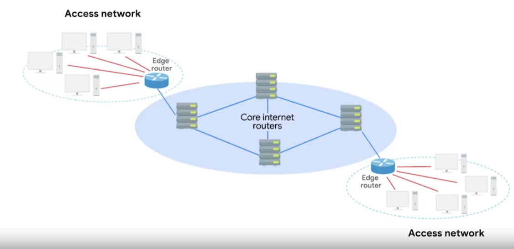

# Network
## IPv4
Device talking to device needs an IP address --> identifier of the network and the host
Can be `Public and Private`.
Public address is assigned to your router and can communicate with the internet are unique, used externally, assigned by an ISP, not free.
Private can't be registered are no unique only unique for your local area, used internally, are free assigned by router on the internet and the have to be "converted" to public first.
Router gives private ip addresses, and when the devices have to access internet router translates these private to public
via NET, also translate public to private.

If you want to know your public IP address just go to https://www.whatismyip.com/

`ifconfig/ipconfig`

````
inet 192.168.57.139 # ipv4
inet6 fe80::20c:29ff:fe0a:4205 prefixlen 64 scopied 0x20<link> #ipv6
````
`inet` is in decimal notation `inet6` in hexadecimal.

IPv4 addresses are a 32-bit long numbers made up of four octets and each octet is 
normally described in decimal numbers. 
Eight bits of data or a single octet can represent all decimal numbers from 0-255. 

````
 8 + 8 + 8 + 8 = 32 bits = 4 bytes
192.168.57.139 --> dotted decimal notation
 |
 |--> realisticly this rapresent a bunch o 1 and 0 so we have a human readable format  
      8 bits = 11111111.11111111.11111111.11111111. or 0
      Each of the sets of numbers (octets) can be between 0-255

128 64 32 16 8 4 2 1 = 255
 0   0  0  0 0 1 1 1 = 7.7.7.7
 
ipv4 = 2^32 = 4,294,967,296 ---> possible amount of ip addresses, they are already used all!
                                this is why privat IP addresses have ben developed
````

12.34.56.78 is a valid IP address but 123.456.789.100 would not be because it has numbers larger than could be represented by eight bits. 

IP addresses belong to the networks, not to the devices attached to those networks. Your laptop will 
always have the same MAC address no matter where you use it, but it'll have a different IP address assigned to it at an Internet café 
than it would when you're at home. 

Many modern networks, you can connect a new device and an IP address will be assigned 
to it automatically through a technology known as `Dynamic Host Configuration Protocol - DHCP`. An IP address assigned this way is 
known as a `dynamic IP address`. The opposite of this is known as a `static IP address`, which must be configured on a node manually. 
In most cases, static IP addresses are reserved for servers and network devices while dynamic IP addresses are reserved for clients.
___
### IP datagram
`IP datgram`:


IP datagram is a highly structured series of fields that are strictly defined.
The very first field, `Version`, is four bits and indicates what version of Internet Protocol is being used v4 or v6.

`Header Lenght`: four bit field that declares how long the entire header is. Almost always 20 bytes in length, when dealing with IPv4. In fact 20 bytes is the minimum length of an IP header.

`Service type`: These 8 bits can be used to specify details about quality of service or `QoS technologies`.
 The important takeaway about QoS is that there are services that allow routers to make decisions about which IP datagram maybe more important than others.

`Total Lenght`: 16 bit field . It's used to indicate the total length of the IP datagram it's attached to.

`Identification field`: 16 bit number that's used to group messages together. IP datagrams have a maximum size and you might already be able to figure out what that is since the total length field is 16 bits and this field indicates the size of an individual datagram. 
The maximum size of a single datagram is the largest number you can represent with 16 bits 65,535. If the total amount of data that needs to be sent is larger than what can fit in a single data gram the IP layer needs to split this data up into many individual packets. 
When this happens, the identification field is used so that the receiving end understands that every packet with the same value in that field is part of the same transmission.

`Flag field`: The flag field is used to indicate if a datagram is allowed to be fragmented or to indicate that the datagram has already been fragmented.

`Fragmentation offset field`:  Fragmentation is the process of taking a single IP datagram and splitting it up into several smaller datagrams. The fragmentation offset field contains values used by the receiving end to take all the parts of a fragmented packet and put them back together in the correct order.

`TTL - time to live`: This field is an 8 bit field that indicates how many router hops a datagram can traverse before it's thrown away. Every time a datagram reaches a new router, that router decrements the TTL field by one. Once this value reaches zero, a router knows it doesn't have to forward the datagram any further. 
The main purpose of this field is to make sure that when there's a miss configuration in routing that causes an endless loop. Datagrams don't spend all eternity trying to reach their destination. And endless loop could be when router A thinks router B is the next hop and router B thinks router A is the next hop.

`Protocol`: This is another 8 bit field that contains data about what transport layer protocol is being used. The most common transport layer protocols are TCP and UDP.

`Header Checksum`:This field is a check some of the contents of the entire IP datagram header. It functions very much like the ethernet checksum field (see Data link).

`Source IP Address`: 32 bit long.

`Destinatnion IP Address`: 32 bit long.

`IP Otions`: This is an optional field and is used to set special characteristics for data grams primarily used for testing purposes. The IP options field is usually followed by a padding field since the IP options field is both optional and variable in length.

`Paddinbg`: The padding field is just a series of zeroes used to ensure the header is the correct total size.
___
## Network ID/Host ID/Subnetting
IP addresses can be split into two sections; the `network ID` and the `host ID`.

`Netwrok address/ID`: Every network have a unique address. Network portion of the IP address is like the street name where you live
`Host address/ID`: is what is assigned to the host within that network. Host is like your home number

Here the Network Address is 192.168.1.0


Network + host is mainly for manageability to break bigger networks into smaller ones which is known as `subnetting`.
IP addresses have a network and host part., so networks can be logically broken down into smaller networks, which is `subnetting`.

If we have a large network and one computer starts to broadcasting it will send the message to all others machines, it would definitely slow dow the network
maybe eve bring it to a hold.
Networks are broken down and physically separated by using routers, broadcast do not get pass through routers, they only stay within they network/sub-network

So if this computer what to communicate with the other computer:

It will send a broadcast that only the computer in its subnet will hear:

But since the other computer is on a different subnet the signal will be sent through the default getaway, which is the router:


`Subnetting` is done by changing the default subnet mask by borrowing some of the bits from the host portion.

`Subnet mask` is used to understand which portion is network and which is host.
`Subnet mask` is a number that resembles an IP address, and tells you how many bits in the IP address are used for the network by 
masking the network portion of the IP address.

````
   192.    168.      1.      0 ---> IP address
11000000.10101000.00000001.00000000 ---> binary format computers undertund only this

   255.     255.     255.     0 ---> Subnet mask
11111111.11111111.11111111.00000000 ---> binary format
````
How to understand binary:
````
1 = on
0 = off

8 Bit Octet Chart  
128|64|32|16|8|4|2|1

128+64+32+16+8+4+1+2 = 255

192 = 11000000 = 128+64= 192
````
Masking:
````
Ipv4       192.168.57.139
            |   |   |  |
Sbnet Mask 255.255.255.0

192.168.57.139 = 11000000.10101000.00000001.00000000
                 ||||||||||||||||||||||||||
255.255.255.0  = 11111111.11111111.11111111.00000000

Where the IP address line up with the 1 in the subnet mask you have the network portion of the IP address,
and the remainig is the host portion. So in the subnet mask the 1 indicates the network and 0 the host.

````
What if subnet is something like 255.255.224.0?
```
255.       255.     224.      0
11111111.11111111.11100000.00000000

172.16.1.0 =    10101100.00010000.00000001.00000000
                |||||||||||||||||||||
255.255.224.0 = 11111111.11111111.11100000.00000000
```

`Subnetting` is done by changing the default subnet mask by borrowing some bits from the host portion.
````
255.255.225.0 = 11111111.11111111.11111111.00000000 = 1 network and 254 host (256 -2 because 1 for network and 1 for broadcast)

255.255.225.128 = 11111111.11111111.11111111.10000000 = 2 neworks with 126 hosts each

255.255.225.192 = 11111111.11111111.11111111.11000000 = 4 neworks with 62 hosts each

255.255.225.224 = 11111111.11111111.11111111.11100000 = 8 neworks with 30 hosts each 
...
255.255.225.254 = 11111111.11111111.11111111.11111110 = 128 neworks with 0 usable hosts 
````


Subnet mask can also be express in `CIDR - Classless Inter-Domain Routing (slash notation)`:

````
192.168.1.0 /24 ---> the number counts the 1 in the subnet mask
255.255.225.0 = 11111111.11111111.11111111.00000000
````
___
## Address class system
`Address class system`: is a way of defining how the global IP address space is split up. 
There are three primary types of address classes: Class A, class B, and class C. 

| Class | First Octet Address | Default subnet mask | 
|-------|---------------------|---------------------|
| A | 1-129 | 255.0.0.0
| B | 128-191 | 255.255.0.0
| C | 192-223 | 255.255.255.0

`Class A addresses` are those where the first octet is used for the network ID and the last three 
are used for the host ID. 
```
123.48.30.100
--- ---------
 |      |____ host ID
 |
 network ID

```
`Class B addresses` are where the first two octets are used for the network ID and the second two 
are used for the host ID. 
```
123.48.30.100
------ ------
 |        |____ host ID
 |
 network ID

```
`Class C addresses`, as you might have guessed, are those where the first three octets are 
used for the network ID and only the final octet is used for the host ID. 
```
123.48.30.100
--------- ---
 |         |____ host ID
 |
 network ID

```
Each address class represents a network of vastly different size.


If the first bit has to be a zero, as it is with the Class A address, the possible values for the first octet are 0-127. 
This means that any IP address with a first octet with one of those values is a Class A address. Similarly, Class B addresses are 
restricted to those that begin with the first octet value of 128 through 191 and Class C addresses begin with the first octet value 
of 192 through 223.
Class D addresses always begin with the bits 1110 and are used for multicasting, which is how a single IP datagram can be send to 
an entire network at once. 
These addresses begin with decimal values between 224 and 239. 
Lastly, Class E addresses makeup all of the remaining IP addresses, but they are unassigned and only used for testing purposes. 
In practical terms, this class system has mostly been replaced by a system known as CIDR or Classless Inter-Domain Routing.
___
## ARP
`Address resolution protocol`, or `ARP` is a protocol used to discover the hardware address of a node with a certain IP address.
Once an IP datagram has been fully formed, it needs to be encapsulated inside an Ethernet frame. 
This means that the transmitting device needs a destination MAC address to complete the Ethernet frame header. 
Almost all network connected devices will retain a local ARP table. 
An ARP table is just a list of IP addresses and the MAC address is associated with them.

Let's say we want to send some data to the IP address 10.20.30.40. 
It might be the case that this destination doesn't have an entry in the ARP table.

When this happens, the node that wants to send data sends a `broadcast ARP message` to the `MAC Broadcast address`, which is all Fs.  
These kinds of broadcast ARP messages are delivered to all computers on the local network.

When the network interface that's been assigned an IP of 10.20.30.40 receives this ARP broadcast, it sends back what's known as an `ARP response`.

Now the transmitting computer knows what MAC address to put in the destination hardware address field and the Ethernet frame is ready for delivery. 
It will also likely store this IP address in its local ARP table so that it won't have to send an ARP broadcast the next time it needs to communicate with this IP.
ARP table entries generally expire after a short amount of time to ensure changes in the network are accounted for.
___
## Routing
`Router` = A network device that forwards traffic depending on the destination address of that traffic. It has at least two network interfaces.
Basic routing:
1. A router receives a packet of data on one of its interfaces.
2. The router examines the destination IP of this packet. 
3. The router then looks up the destination network of this IP in its routing table. 
4. The router forwards that out through the interface that's closest to the remote network as determined by additional info within the routing table. 
These steps are repeated as often as needed until the traffic reaches its destination. 


Example with 2 networks:  
Network A address space: 192.168.1.0/24.  
Network B address space: 10.0.0.0/24. 


The router has an interface on each network. On network A, it has an IP of 192.168.1.1 and on network B it has an IP of 10.0.0.254. 
IP addresses belong to networks, not individual nodes on a network. 
A computer on network A with an IP address of 192.168.1.100 sends a packet to the address 10.0.0.10. 
This computer knows that 10.0.0.10, isn't on its local subnets. 
So it sends this packet to the MAC address of its gateway, the router. 
The router's interface on network A receives the packet because it sees that destination MAC address belongs to it. 

The router then strips away the data link layer encapsulation, leaving the network layer content, the IP datagram. 


Now, the router can directly inspect the IP datagram header for the destination IP field. 


It finds the destination IP of 10.0.0.10. The router looks at its `routing table` and 
sees that network B or the 10.0.0.0/24, network is the correct network for the destination IP. 
It also sees that this network is only one hop away in fact, since it's directly connected, the 
router even has the MAC address for this IP in its ARP table.

ARP table:

| Mac address | IP address |
|-------------|------------|
| 00:1B:44:11:3A:B7 | 192..168.1.100
| 00:0A:95:9D:68:16 | 10.0.0.10

Next, the router needs to form a new packet to forward along to network B, it 
takes all of the data from the first IP datagram and duplicates it, but it detriments 
the TTL field by one and calculates a new checksum. 
Then, it encapsulates this new IP datagram inside of a new Ethernet frame.




This time it sets its own MAC address of the interface on network B as the source MAC address.
Since it has the MAC address of 10.0.0.10 in its ARP table, it sets that as the destination MAC address. 
Lastly, the packet is sent out of its interface on network B and the data finally gets delivered to the node living at 10.0.0.10. 

Example with 3 networks:  
Network A address space: 192.168.1.0/24.  
Network B address space: 10.0.0.0/24.  
Network C address space: 172.16.1.0/23

There's a second router connecting network B and network C, its interface on network B has an IP of 10.0.0.1 and its 
interface on network C has an IP of 172.16.1.1. 
This time around our computer at 192.168.1.100 wants to send some data to the computer that has an IP of 172.16.1.100



The computer at 192.168.1.100 knows that 172.16.1.100 is not on its local network. 
So it sends the packet to its gateway, the router between network A network B. Again, the router inspects the content of 
this packet, it sees a destination address of 172.16.1.100. And through a look up of its `routing table`, it knows 
that the quickest way to get to the 172.16.1.0 /23 network is via another router with an IP of 10.0.0.1. 
The router detriments the TTL field and sends it along to the router of 10.0.0.1. 
This router then goes through the motions, knows that the destination IP of 172.16.1.100 is directly connected and 
forwards the packet to its final destination, that's the basics of routing.  

The only difference between these examples and how things work on the internet is scale.  
Routers are usually connected to many more than just two networks. 
Very often your traffic may have to cross a dozen routers before it reaches its final destination. And finally, in order 
to protect against breakages, core internet routers are typically connected in a mesh, meaning that there might be 
many different paths for a packet to take. Still, the concepts are all the same. Routers inspect the destination IP, 
look at their routing table to determine which path is the quickest and forward the packet along the path. 
This happens over and over every single packet, making up every single bit of traffic all over the internet at all times.
### Routing Tables
Routing tables can vary a ton depending on the make and class of the router, but they all share a few things in common.
Basic Routing Table:




The most basic routing table will have four columns:
`Destination network`: This column would contain a row for each network that the router knows about. 
This is just the definition of the remote network, a network ID and the net mask. 
These can be stored in one column inside a notation, or the network ID and net mask might be in a separate column.
The router has a definition for a network and therefore knows what IP addresses might live on that network. 
When the router receives an incoming packet, it examines the `destination IP address` and determines which network it belongs to. 
A routing table will generally have a catch-all entry that matches any IP address that it doesn't have an explicit network listing for. 

`Next hop`: This is the IP address of the next router that should receive data intended for the destination networking question, or this 
could just state the network is directly connected and that there aren't any additional hops needed. 

`Total hops`: This is the crucial part to understand routing and how routing tables work. On any complex network like the Internet, there will be lots of different paths to get from point A to point B. 
Routers try to pick the shortest possible path at all times to ensure timely delivery of data. But the shortest possible path to a destination network 
is something that could change over time. Sometimes rapidly. Intermediary routers could go down. Links could become disconnected and new routers could be introduced. 
Traffic congestion could cause certain routes to become too slow to use.
For each next hop and each destination network, the router will have to keep track of  how far away that destination currently is. 
That way, when it receives updated information from neighboring routers, it will know if it currently knows about the best path, or if they knew better path is available. 

`Interface`: the router also has to know which of its interfaces it should forward traffic, matching the destination network out of. 
In most cases, routing tables are pretty simple. The really impressive part is that many core Internet routers 
have millions of rows in the routing tables. These must be consulted for every single packet that flows through a router on its way to its final destination.

### Interior Gateway protocols
`Routing protocols`: These are special protocols, the routers use to speak to each other in order to share what information they might have.

This is how a router on one side of the planet can eventually learn about the best path to a network on the other side of the planet.

Two main categories:
`Interior gateway protocols`:  are further split into two categories, `link state routing protocols` and `distance vector protocols`.
Interior gateway protocols are used by routers to share information within a single autonomous system. 
In networking terms, an autonomous system is a collection of networks that all fall under the control of a single network operator. 
The best example of this would be a large corporation that needs to route data between their many offices and each of which might have their own local area network. 
Another example is the many routers employed by an internet service provider whose reaches are usually national in scale.

`Distance vector protocols`: A router using a distance vector protocol basically just takes its routing table, which is a list of every network known to it and how far away these networks are in terms of hops. 
Then the router sends this list to every neighboring router which is basically every router directly connected to it. 
In computer science, a list is known as a vector. This is why a protocol that just sends a list of distances to networks is known as a distance vector protocol. 
With a distance vector protocol, routers don't really know that much about the total state of an autonomous system. 
They just have some information about their immediate neighbors.

Example:
Router A based on his routing table knows that it needs 4 hops to reach network X



Router B is just 2 hops to reach network X. Router B using a distance vector protocol send s it's the basic contents of its routing table to Router A. 



Router A sees that network X is only two hops away from Router B. 



Even with the extra hop to get from Router A to Router B, 
this means that Network X is only three hops away from router A. If it forwards data to Router B instead of router C, armed with this new information, 
Router A updates its routing table to reflect this. In order to reach network X in the fastest way it should forward traffic through its own interface one to router B

Distance vector protocols don't allow for a router to have much information about the state of the world outside of their own direct neighbors. 
Because of this, a router might be slow to react to a change in the network far away from it. This is why link state protocols were eventually invented. 

`Link state protocols`: get their name because each router advertises the state of the link of each of its interfaces. 



These interfaces could be connected to other routers or they could be direct connections to networks. 
The information about each router is propagated to every other router on the autonomous system. 
This means that every router on the system knows every detail about every other router in the system. 
Each router then uses this much larger set of information and runs complicated algorithms against it to determine what the best path to any destination network might be. 
Link state protocols require both more memory in order to hold all of this data and also much more processing power. 
This is because it has to run algorithms against this data in order to determine the quickest path to update the routing tables. 
As computer hardware has become more powerful and cheaper, over the years, link state protocols have mostly made distance vector protocols outdated.

`Exterior gateway protocols`:used for the exchange of information between independent autonomous systems.

### Exterior Gateways, Autonomous Systems, and the IANA
`Exterior gateway protocols` are used to communicate data between routers representing the edges of an autonomous system. 
Since routers sharing data using interior gateway protocols are all under control of the same organization. 
Routers use exterior gateway protocols when they need to share information across different organizations. 
Exterior gateway protocols are really key to the Internet operating how it does today.

The Internet is an enormous mesh of `autonomous systems`. 



At the highest levels, core Internet routers need to know about autonomous systems in order to properly forward traffic. 
Since autonomous systems are known and defined collections of networks, getting data to the edge router of an autonomous system is the number 1 goal of `core Internet routers`. 
The `IANA or the Internet Assigned Numbers Authority` is a nonprofit organization that helps manage things like IP address allocation. 
The Internet couldn't function without a single authority for these sorts of issues. Otherwise, anyone could try and use any IP space they wanted, which would cause total chaos online. 
Along with managing IP address allocation, the IANA is also responsible for `ASN or Autonomous System Number allocation`. 
ASNs are numbers assigned to individual autonomous systems. Just like IP addresses ASNs are 32 bit numbers, but unlike IP addresses they're normally referred to as just a single decimal number instead of being split out into readable bits. 
There are two reasons for this, first, IP addresses need to be able to represent a network ID portion and a host ID portion for each number. 
This is more easily accomplished by splitting the number in four sections of eight bits, especially back in the day when address classes ruled the world. 
An ASN never needs to change in order for it to represent more networks or hosts, it's just the core Internet routing tables that need to be updated to know what the 
ASN represents. Second, ASNs are looked at by humans far less often than IP addresses are. 
So, because it can be useful to be able to look at the IP 9.100.100.100 and know that 9.0.0.0/8 address space is owned by IBM, ASNs represent entire autonomous systems. 
Just being able to look up the fact that AS19604 belongs to IBM is enough. 
Unless you one day end up working at an Internet service provider, understanding more details about how exterior gateway protocols work is out of scope for most people in IT. 
But grasping the basics of autonomous systems, ASNs, and how core Internet routers route traffic between them is important to understand some of the basic building blocks of the Internet.

### Non-routable address space
`Non-routable address space`: They are ranges of IPs set aside for use by anyone that cannot be routed to. 
Not every computer connected to the Internet needs to be able to communicate with every other computer connected to the Internet. 
Non-routable address space allows for nodes on such a network to communicate with each other, 
but no gateway router will attempt to forward traffic to this type of network.

RFC 1918 defined three ranges of IP addresses that will never be routed anywhere by core routers. 
That means that they belong to no one and that anyone can use them. 
In fact, since they're separated from the way traffic moves across the Internet, there's no limiting to how many people might use these addresses for their internal networks.
The primary three ranges of non-routable address space are `10.0.0.0/8`, `172.16.0.0/12`, and `192.168.0.0/16`. 
These ranges are free for anyone to use for their internal networks.
___
## Sources
- PowerCertAnimated videos, Subnet Mask - Explained, https://www.youtube.com/@PowerCertAnimatedVideos
- Google, The Bits and Bytes of Computer Networking, https://www.coursera.org/

