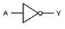
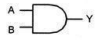
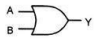
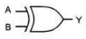
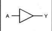
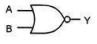
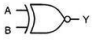
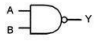

# Logika Cyfrowa

## Bramiki Logiczne
Proąd to 1 niema prądu to 0, bramiki manipuluja tymi 1 i 0.

### Inverter/Bramka NOT
Bramka NOT ma jedno wejście i generuje wyjście, które jest odwrotnością stanu wejścia.

Tablica prawdy:

|  A  |  Wyjście |
|----|-------|
|  0  |     1     |
|  1  |     0     |

### Bramka AND
Bramka AND ma dwa lub więcej wejścia i generuje wyjście równe 1 (TRUE), tylko  
gdy wszystkie wejścia są równe 1.

Tablica prawdy:

|  A  |  B  |  Wyjście |
|----|----|-------|
|  0  |  0  |     0     |
|  0  |  1  |     0     |
|  1  |  0  |     0     |
|  1  |  1  |     1     |

### Bramka OR
Bramka OR ma dwa lub więcej wejść i generuje wyjście równe 1 (TRUE),  
gdy przynajmniej jedno z wejść jest równe 1

Tablica prawdy:

|  A  |  B  |  Wyjście |
|----|----|-------|
|  0  |  0  |     0     |
|  0  |  1  |     1     |
|  1  |  0  |     1     |
|  1  |  1  |     1     |

### Bramka XOR
Bramka XOR ma dwa wejścia i generuje wyjście równe 1 (TRUE),  
gdy dokładnie jedno z wejść jest równe 1.

Tablica prawdy:

|  A  |  B  |  Wyjście |
|----|----|-------|
|  0  |  0  |     0     |
|  0  |  1  |     1     |
|  1  |  0  |     1     |
|  1  |  1  |     0     |

### Buffer/Wzmacniacz
Bramka buffer jest stosunkowo prosta w swojej operacji - powiela sygnał wejściowy   
na wyjściu. Oznacza to, że stan logiczny na wyjściu jest taki sam, jak na wejściu,  
bez żadnych zmian.  
Bramka buffer nie wykonuje żadnych operacji logicznych, po prostu przekazuje sygnał

Tablica prawdy:

|  A  |  Wyjście |
|----|-------|
|  0  |     0     |
|  1  |     1     |

### Bramka NOR
Bramka NOR to podstawowa bramka logiczna, która wykonuje operację logiczną NOR  
(NOT OR). Oznacza to, że generuje sygnał wyjściowy równy 1 (TRUE), tylko gdy  
żadne z wejść nie jest równe 1. W przeciwnym razie, gdy choć jedno z wejść jest  
równe 1, wyjście jest równe 0.

Tablica prawdy:

|  A  |  B  |  Wyjście |
|----|----|-------|
|  0  |  0  |     1     |
|  0  |  1  |     0     |
|  1  |  0  |     0     |
|  1  |  1  |     0     |

### Bramka XNOR
Bramka XNOR (Exclusive NOR) to inna podstawowa bramka logiczna, która jest  
odwrotnością bramki XOR. Bramka XNOR (lub bramka ekskluzywna NOR) wykonuje  
operację logiczną XNOR, co oznacza, że generuje sygnał wyjściowy równy 1 (TRUE),  
tylko gdy oba wejścia są równe (oba równe 1 lub oba równe 0). W przeciwnym razie,  
gdy wejścia są różne (jedno równe 1, a drugie równe 0), wyjście jest równe 0

Tablica prawdy:

|  A  |  B  |  Wyjście |
|----|----|-------|
|  0  |  0  |     1     |
|  0  |  1  |     0     |
|  1  |  0  |     0     |
|  1  |  1  |     1     |

### Bramka NAND
Bramka NAND (NOT AND) to jedna z podstawowych bramek logicznych w elektronice cyfrowej.  
Bramka NAND wykonuje operację logiczną NAND, co oznacza, że generuje sygnał wyjściowy  
równy 0 (FALSE) tylko wtedy, gdy wszystkie wejścia są równe 1. W przeciwnym razie,  
gdy przynajmniej jedno z wejść jest równe 0, wyjście jest równe 1.

Tablica prawdy:

|  A  |  B  |  Wyjście |
|----|----|-------|
|  0  |  0  |     1     |
|  0  |  1  |     1     |
|  1  |  0  |     1     |
|  1  |  1  |     0     |
