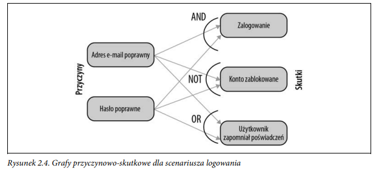
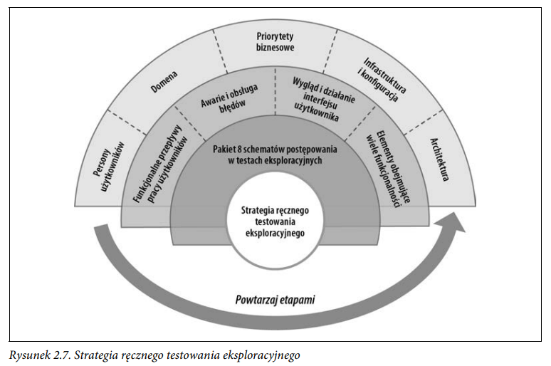

# Testowanie eksploracyjne

Ręczne testowanie eksploracyjne to dynamiczny proces badania aplikacji w celu odkrycia jej zachowania w różnych, nieudokumentowanych sytuacjach. Pomaga wykrywać nieprzewidziane przepływy użytkowników oraz błędy, co wymaga wysokich umiejętności analitycznych i obserwacyjnych.

Choć testy eksploracyjne mogą nie obejmować perspektywy docelowego użytkownika czy środowiska produkcyjnego, są kluczowe dla kompleksowej weryfikacji aplikacji. **Łączą wymagania biznesowe, aspekty techniczne i potrzeby użytkowników, kwestionując dotychczasowe założenia.**

Przeprowadzane są one w środowisku testowym, umożliwiając dynamiczną ingerencję w komponenty aplikacji. W przeciwieństwie do tradycyjnych testów ręcznych, które sprawdzają spełnienie wymagań, testy eksploracyjne pozwalają wychodzić poza znane informacje i odkrywać nowe perspektywy.

Mimo że testy eksploracyjne często są niedoceniane, stanowią cenne uzupełnienie testów automatycznych i analizy biznesowej, pomagając zespołom unikać ograniczeń wynikających z wąskiego zakresu myślenia podczas programowania.  
__
## Techniki stosowane w ręcznym testowaniu eksploracyjnym
- **Podział klasy równoważności.**  
- **Analiza wartości granicznych.**  
- **Przejścia stanu.**  
- **Tabele decyzyjne.**  
- **Grafy przyczynowo-skutkowe:** Grafy przyczynowo-skutkowe wizualizują powiązania między danymi wejściowymi a możliwymi wynikami, co pomaga w analizie funkcjonalności systemu. Po utworzeniu grafu można przekształcić go w tabelę decyzyjną, aby wygenerować szczegółowe przypadki testowe. Relacje między przyczynami a skutkami są przedstawiane za pomocą operatorów logicznych, co ułatwia strukturyzację powiązanych danych wejściowych.  

- **Testowanie parami ( ang. all-pairs testing/pairwise testing)**: to technika optymalizacji testów, gdy mamy wiele niezależnych danych wejściowych. Zamiast testować wszystkie możliwe kombinacje, metoda ta zapewnia, że każda para wartości wejściowych pojawi się co najmniej raz w zestawie testowym.  
Przykładowo, jeśli formularz ma trzy pola: system operacyjny (2 wartości), producent urządzenia (3 wartości) i rozdzielczość (3 wartości), pełne testowanie wymagałoby 18 kombinacji. Dzięki testowaniu parami lista przypadków testowych zostaje skondensowana do 9, eliminując zbędne powtórzenia.
Metoda ta znacząco redukuje liczbę testów przy zachowaniu pokrycia kluczowych zależności między danymi wejściowymi. (skończyć https://testerzy.pl/baza-wiedzy/pairwise-testing-projektowanie-przypadkow-testowych-i-testy-konfiguracji-metoda-redukcji-par-danych-wejsciowych)

- **Próbkowanie w testowaniu** to technika stosowana, gdy dane wejściowe są zbyt obszerne, by testować każdą możliwą kombinację. Jest szczególnie przydatna przy migracji dużych zbiorów danych, np. w systemach ubezpieczeniowych.  

Wyróżniamy dwa główne podejścia:  
1. **Próbkowanie losowe** – wybór losowej grupy danych do testowania (np. 50–100 użytkowników z 1000).  
2. **Próbkowanie według specyficznych kryteriów** – wybór danych na podstawie określonych cech, np. wieku, zawodu, rodzaju polisy.  

Dodatkowo, dane można dobierać proporcjonalnie do ich rzeczywistego rozkładu, co zapewnia **lepsze pokrycie przypadków testowych** i reprezentatywność próby.

- **Metoda odgadywania błędów**.  
___
## Odkrywanie funkcjonalności 
Na podstawie aplikacji e-commerce.

### Funkcjonalne przepływy pracy użytkowników
**Funkcjonalne przepływy pracy użytkownika** opisują działania podejmowane przez użytkownika w aplikacji, np. logowanie, wyszukiwanie produktu, zakup i płatność.  

Główne rodzaje przepływów do testowania:  
1. **Pozytywne przepływy pracy** – standardowa ścieżka użytkownika, którą należy sprawdzić w pierwszej kolejności, uwzględniając różne adresy wysyłki, metody płatności i dostawy.  
2. **Powtarzające się przepływy pracy** – sprawdzanie, czy aplikacja zachowuje się poprawnie przy wielokrotnym powtarzaniu tych samych akcji (np. wielokrotne dodawanie produktu do koszyka).  
3. **Przepływy obejmujące wielu użytkowników** – testowanie interakcji między użytkownikami, np. sytuacji, gdy dwóch użytkowników próbuje kupić ostatni dostępny produkt jednocześnie.  

### Awarie i obsługa błędów
**Awarie i obsługa błędów** to kluczowe aspekty testów eksploracyjnych, które obejmują interakcje z komponentami aplikacji i symulowanie rzeczywistych scenariuszy.  

Podczas testowania należy uwzględnić:  
1. **Awarie techniczne** – np. problemy z siecią, opóźnienia w połączeniu, awarie usług lub sprzętu.  
2. **Błędy użytkownika** – np. niepoprawne dane logowania, nieprawidłowe formaty wprowadzanych danych czy brak dostępności produktów.  

Testy eksploracyjne powinny sprawdzać, czy aplikacja poprawnie obsługuje te sytuacje, informuje użytkownika o błędach i sugeruje możliwe rozwiązania poprzez czytelne komunikaty.

### Wygląd i działanie interfejsu użytkownika
**Wygląd i działanie interfejsu użytkownika** to kluczowy element jakości aplikacji. Testy powinny obejmować:  

- Odpowiednie rozmieszczenie treści, np. dostosowaną ilość miejsca na adresy wysyłki.  
- Wysoką jakość wyświetlanych obrazów produktów.  
- Poprawne działanie na różnych przeglądarkach.  
- Informowanie użytkownika o opóźnieniach (np. ikona ładowania).  

Celem jest zapewnienie płynnej i intuicyjnej obsługi aplikacji bez problemów wizualnych i funkcjonalnych.

### Aspekty obejmujące wiele funkcjonalności 
**Aspekty obejmujące wiele funkcjonalności** to obszary wymagające szczególnej uwagi podczas testów eksploracyjnych. Przykłady to:

1. **Bezpieczeństwo** – zapobieganie atakom (np. SQL injection), ochrona danych (np. kart kredytowych).
2. **Prywatność** – zapewnienie, że dane użytkowników (np. adresy, karty kredytowe) są przechowywane zgodnie z przepisami i użytkownicy są informowani o ich wykorzystaniu.
3. **Uwierzytelnianie (autoryzacja)** – testowanie logowania, uwierzytelniania dwuskładnikowego, sesji, ról i uprawnień użytkowników.

Te aspekty, obok innych, są niezbędne do zapewnienia pełnej funkcjonalności aplikacji i jej zgodności z wymaganiami bezpieczeństwa, prywatności i autoryzacji. Testy eksploracyjne mogą również prowadzić do nowych przypadków testowych, które warto później opracować.  
___
## Strategia ręcznego testowania eksploracyjnego
### Zrozumienie aplikacji 

**Persony użytkowników** to fikcyjne postacie, które reprezentują grupy docelowych użytkowników z podobnymi cechami. Tworzone są na początku projektu, aby ich potrzeby były uwzględnione na wszystkich etapach cyklu życia oprogramowania. Przykładem może być różnica oczekiwań między młodymi dorosłymi, którzy preferują ekstrawagancję, a seniorami, którzy oczekują prostych interakcji. Testowanie wymaga „wcielenia się” w docelowego użytkownika, więc ważne jest zrozumienie zestawu person i badanie, jak każda z nich korzysta z aplikacji.    
**Dziedzina** to obszar, który posiada specyficzny przepływ pracy, procesy oraz terminologię, które muszą być zrozumiane, by skutecznie przeprowadzać testy eksploracyjne. Przykład e-commerce pokazuje, jak ważna jest wiedza dziedzinowa – zamówienie przechodzi przez różne etapy, takie jak odczytanie, obietnica i potwierdzenie, a jego realizacja wymaga interakcji z magazynem, firmą kurierską i dostawcami. Bez znajomości tych procesów i terminologii, badanie aplikacji może być trudne.  
**Priorytety biznesowe** mogą wymagać testowania rozwiązania nie tylko pod kątem funkcjonalnego przepływu użytkownika, ale również z perspektywy skalowalności i rozszerzalności platformy. W takich przypadkach ważne jest, aby sprawdzić, czy interfejs użytkownika i usługi sieciowe są ze sobą ściśle powiązane, czy też usługi są niezależne i mogą być łatwo integrowane z innymi systemami.  
**Infrastruktura i konfiguracja** są kluczowe w testach eksploracyjnych, ponieważ znajomość środowiska testowego i ustawień aplikacji pomaga odkrywać nowe ścieżki testowe. Informacje o wdrożeniu składników aplikacji, takich jak usługi sieciowe i bazy danych, a także o konfiguracji, np. ograniczeniach przepustowości, są niezbędne do symulowania różnych scenariuszy, w tym awarii, i do testowania zachowań aplikacji w trudnych warunkach, takich jak przekroczenie limitu przepustowości.  
**Znajomość architektury aplikacji** jest kluczowa w testach eksploracyjnych, ponieważ umożliwia odkrywanie nowych ścieżek testowych. Na przykład, jeśli aplikacja korzysta z usług sieciowych, testy interfejsu API stają się istotne, a w przypadku strumieni zdarzeń ważne jest badanie komunikacji asynchronicznej. Zrozumienie architektury pomaga również w testowaniu integracji komponentów, przepływu danych i obsługi błędów. Choć architektura i infrastruktura mogą początkowo wydawać się przytłaczające, testy eksploracyjne można zacząć od funkcjonalności, stopniowo rozszerzając zakres testów.  

## Źródła
- G. Mohan, Testowanie full stack, 2023 Helion S.A