## Test Planning
### Purpose and Content of Test Plan
A test plan outlines the objectives, resources, and processes for a test project, serving as a key tool for organization and communication.  
Purpose of a Test Plan:  
- Defines the schedule and means to achieve test objectives.  
- Ensures testing aligns with established criteria, policies, and strategies (or explains deviations).  
- Facilitates communication among team members and stakeholders.  
- Helps address future challenges related to risks, schedules, resources, tools, and costs.  

Typical Content of a Test Plan:  
1. Context: Scope, objectives, constraints, and test basis.  
2. Assumptions & Constraints: Factors impacting the project.  
3. Stakeholders: Roles, responsibilities, and training needs.  
4. Communication: Methods, frequency, and documentation templates.  
5. Risk Register: Product and project risks.  
6. Test Approach: Test levels, types, techniques, deliverables, entry/exit criteria, metrics, data, environment needs, and policy deviations.  
7. Budget & Schedule: Resources and timelines.  
The test plan process fosters strategic thinking about the effort needed to achieve testing goals. For more details, refer to the ISO/IEC/IEEE 29119-3 standard.

### Tester's Contribution to Iteration and Release Planning (K1)
In iterative software development, testers contribute to two main planning activities:  

1. Release Planning: Focuses on the product release and the overall backlog. Testers:  
- Write testable user stories and acceptance criteria.  
- Participate in project and quality risk analyses.  
- Estimate test effort for user stories.  
- Define the test approach and plan testing across iterations.  

2. Iteration Planning: Focuses on the iteration backlog for a single cycle. Testers:  
- Conduct detailed risk analysis of user stories.  
- Assess and ensure the testability of user stories.  
- Break down user stories into specific tasks, including testing tasks.  
- Estimate effort for testing tasks.  
- Refine functional and non-functional test aspects.  

Testers play a critical role in ensuring test coverage, risk management, and test readiness at both planning levels.

### Entry Criteria and Exit Criteria 
`Entry Criteria` define the prerequisites for starting an activity, ensuring it is efficient and manageable.
Should be defined for each test level.  
Failing to meet all entry criteria have various negative impacts on an activity.  
Referred to as the `Definition of Ready` in Agile software development.  
Types to know for exam: 
- Availability of resources (e.g., people, tools, data)  
- Availability of testware (e.g., requirements, test cases, cod eor design documents)  
- Initial quality level of the test object (e.g., passing smoke tests, basics check)  

`Exit Criteria` define what must be achieved to complete an activity.  
May act as entry criteria for a subsequent activity.  
Should be defined for each test level.  
Referred to as the `Definition of Done` in Agile software development.  
Types to know for exam:  
- Measures of thoroughness (specified lvl of coverage have been achieved, certain number of unresolved defects or failed TC)  
- Completion Criteria (All planned TC have been executed, all regression test have been automated, all identified risks have a mitigation)
- Running out of time or budget (provided stakeholders accept the associated risks)  

### Estimation Techniques
`Estimation based on Ratio`:  
- Development to test effort  
- Metric-based
- Requires historical project data
- Involves calculating standard ratios

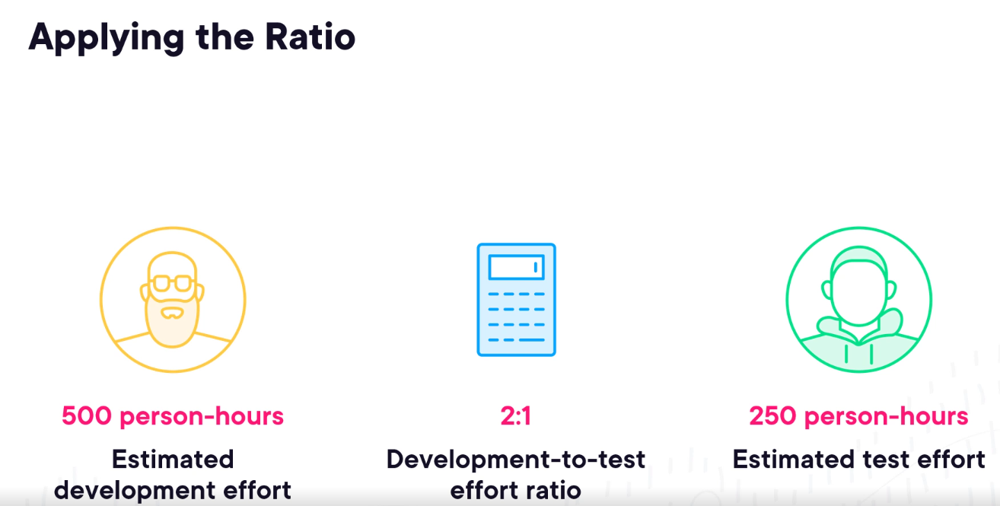

`Extrapolation`:  key word is `average` 
In this metrics-based technique, measurements are made as early as possible in the 
current project to gather the data. Having enough observations, the effort required for the remaining work 
can be approximated by extrapolating this data (usually by applying a mathematical model). This method 
is very suitable in iterative SDLCs. For example, the team may extrapolate the test effort in the 
forthcoming iteration as the averaged effort from the last three iterations. 

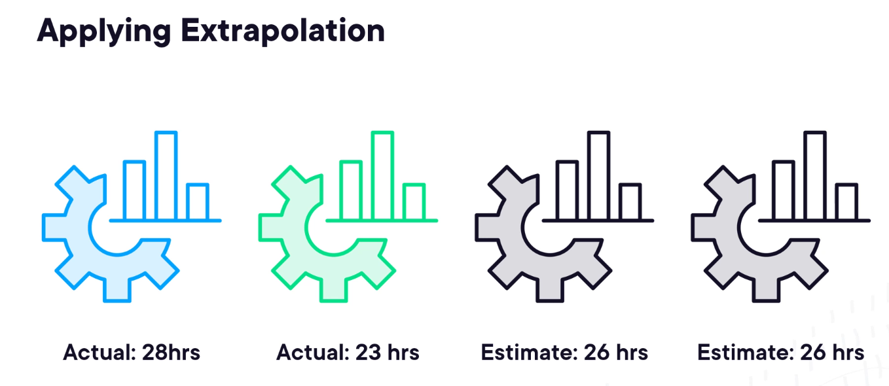

`Wideband Delphi`:  
`Planning poker` is a variant of this.
Estimations are based upon the experts past experience:

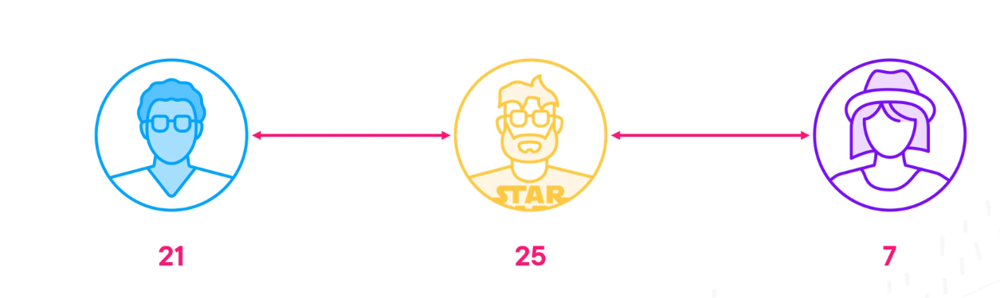

The estimation is shared between the experts and each explains why the number.
Once the discussion is finished the experts estimate independently again, and discuss again.  
This process is repeated until the consensus is reached.  

`Three-point estimation`:
In this expert-based technique, three estimations are made by the experts: the 
most optimistic estimation (a), the most likely estimation (m) and the most pessimistic estimation (b). The 
final estimate (E) is their weighted arithmetic mean.  

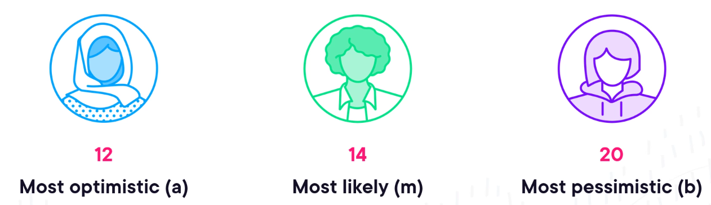

Formula:

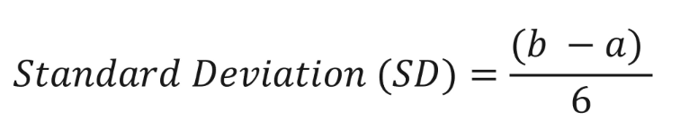

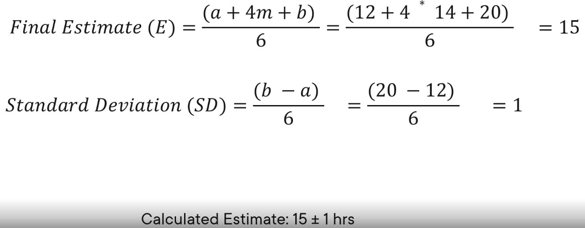

### Test Case Prioritization
Once test cases and procedures are defined and grouped into test suites, they can be organized in an execution schedule.  
The order of execution can be prioritized using various strategies:  
1. `Risk-Based Prioritization`: Test cases addressing the highest risks (based on risk analysis) are executed first.  
2. `Coverage-Based Prioritization`: Test cases that achieve the highest coverage (e.g., statement coverage) are executed first. In additional coverage prioritization, test cases are executed in the order that maximizes additional coverage, takes also in consideration overlaps between TC.  
3. `Requirements-Based Prioritization`: Test cases related to the most important requirements (as defined by stakeholders) are executed first. Highest to the lowest priority. Dependencies can override priority order.

Test cases should ideally be executed in order of priority, but dependencies between test cases or features may require adjustments.  
Additionally, resource availability (tools, environments, personnel) must be considered when determining the execution schedule.

### Test Pyramid (K1)
The Test Pyramid is a model illustrating the varying granularity of tests, guiding teams in test automation and resource allocation.

- Used to group tests into layers with different goals
- Commonly used for test automation
- Lower-level tests are faster and more isolated
- Lower-level tests are generally easier to run earlier in the development process

It consists of layers that group tests by purpose and scope:  
1. `Bottom layer`: Contains numerous small, isolated, and fast tests (e.g., unit tests) that validate specific pieces of functionality.  
2. `Top layer`: Includes fewer, slower, high-level tests (e.g., end-to-end tests) that check broader functionality.  

The higher the layer, the less granular, isolated, and faster the tests become.  
The specific layers may vary across models, such as unit, service, and UI tests, or unit, integration, and end-to-end tests.

Example:
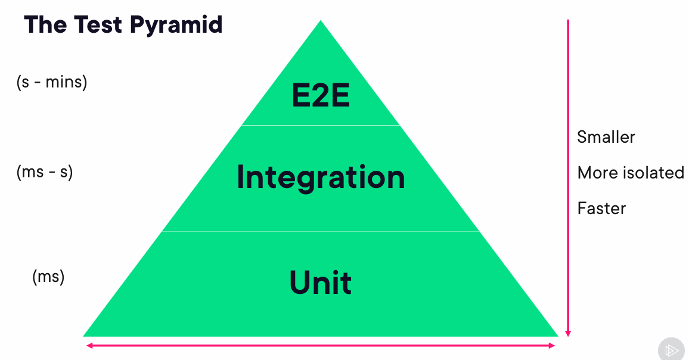

Width of the pyramid stands for the amount of TC should be created.
There are many variation:

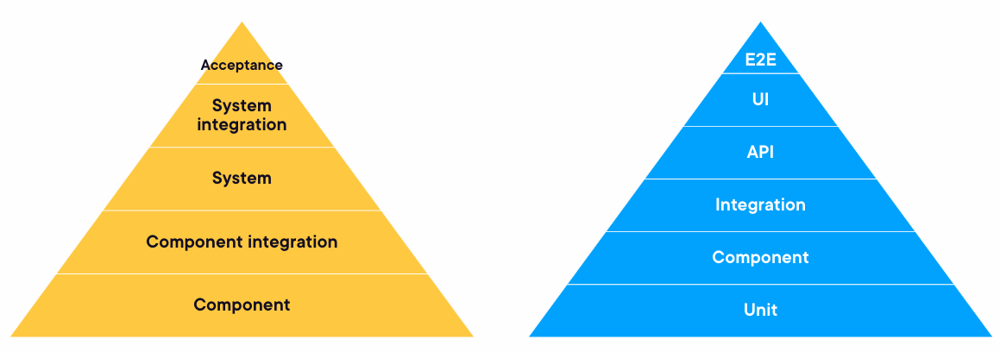

### Testing Quadrants
The Testing Quadrants model, developed by Brian Marick, organizes test levels, types, and techniques in Agile software development.  
It helps ensure all relevant test types are included in the SDLC and clarifies their relevance to different levels for stakeholders.  

Tests are categorized as either business-facing or technology-facing and as either supporting the team (guiding development)  
or critiquing the product (validating expectations). These combinations create four quadrants:

- `Q1` (Technology-facing, support the team): Includes component and integration tests; typically automated and part of CI.  
- `Q2` (Business-facing, support the team): Covers functional tests, user story tests, API tests, and simulations; checks acceptance criteria and can be manual or automated.  
- `Q3` (Business-facing, critique the product): Focuses on exploratory, usability, and user acceptance testing; often manual and user-oriented.  
- `Q4` (Technology-facing, critique the product): Includes smoke and non-functional tests (excluding usability); often automated.  

Example:
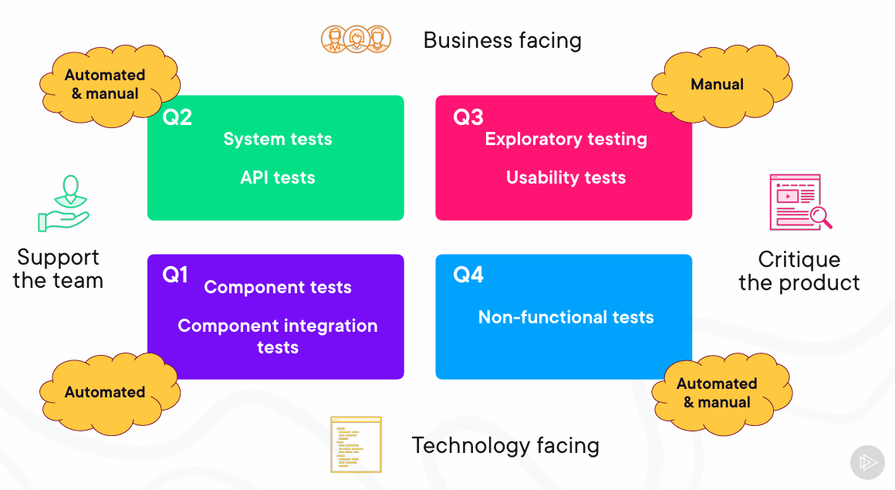

___
## Risk Management
Risk management helps increase the likelihood of success, improve product quality, and build stakeholder trust.  

Key activities in risk management include:  
- `Risk analysis`: Identifying and assessing risks.
- `Risk control`: Mitigating and monitoring risks.
When test activities are planned and managed based on risk analysis and control, it is referred to as risk-based testing.  

### Risk Definition and Risk Attributes (K1)
Risk is a potential event or situation that may cause adverse effects. It is characterized by:  
- `Risk Likelihood`: Probability of occurrence (between 0 and 1).  
- `Risk Impact`: Consequences if it occurs.
- `Risk Level`: A measure the takes into account likelihood and impact
The risk level is determined by these factors; higher levels indicate greater urgency for treatment.

### Project Risks and Product Risks
In software testing, risks are classified into two types:  
1. `Project Risks`: Related to project management and control, potentially impacting schedule, budget, or scope.  
Examples include:  
- Organizational issues: Delays, inaccurate estimates, cost-cutting.  
- People issues: Skill gaps, conflicts, staffing shortages.  
- Technical issues: Scope creep, inadequate tools.  
- Supplier issues: Third-party failures, bankruptcy.  

2. `Product Risks:` Related to product quality, potentially causing negative consequences.  
Examples include:  
- Issues: Missing functionality, runtime errors, poor architecture, security vulnerabilities.  
- Consequences: User dissatisfaction, revenue loss, reputation damage, legal penalties, or in extreme cases, physical harm.  

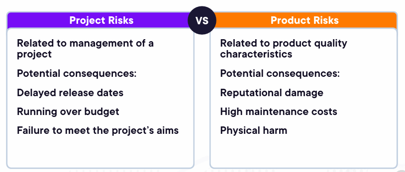

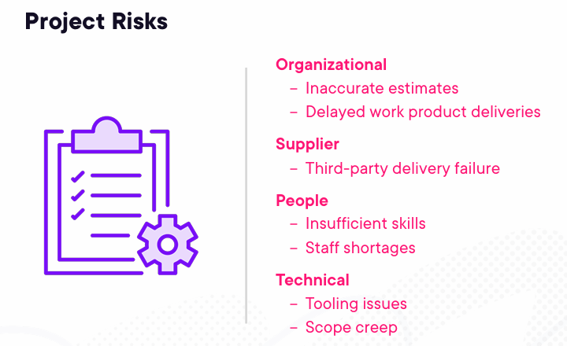

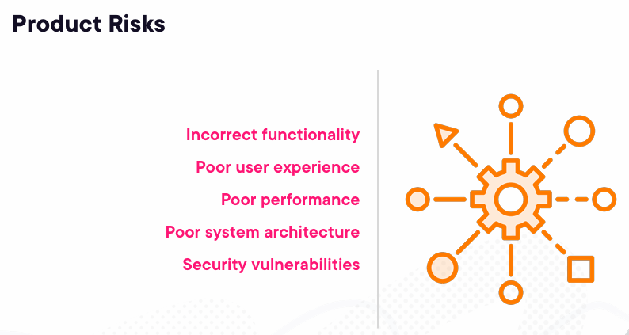

### Product Risk Analysis 
Product risk analysis aims to identify and minimize residual product risks by focusing testing efforts.  
It begins early in the SDLC and involves two main activities:  
1. `Risk Identification`: Generating a comprehensive list of risks using techniques like brainstorming, workshops, interviews, or cause-effect diagrams.  
2. `Risk Assessment`: Categorizing risks, evaluating their likelihood and impact, determining risk levels (using quantitative or qualitative approaches), prioritizing risks, and proposing mitigation strategies.  

Results of product risk analysis guide testing by:  
- Defining the testing scope, levels, types, techniques, and coverage.
- Estimating required test effort.
- Prioritizing critical defect detection early.
- Identifying additional activities to reduce risk beyond testing.

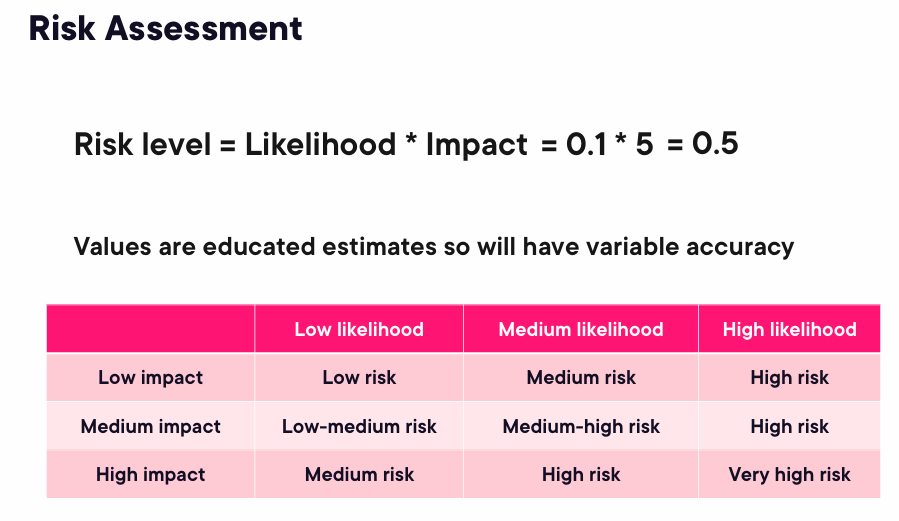

### Product Risk Control 
Product risk control involves actions to manage identified risks, including:  
1. `Risk Mitigation`: Implementing measures to reduce risk levels. Risk control options:
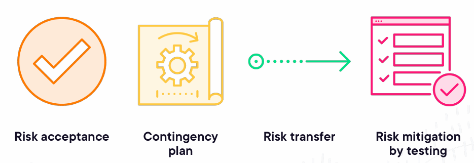

2. `Risk Monitoring`: Ensuring mitigation is effective, improving risk assessment, and identifying new risks.  
 
Risk mitigation through testing may involve:  
- Selecting experienced and skilled testers.  
- Ensuring appropriate testing independence.  
- Conducting reviews and static analysis.  
- Using suitable test techniques, coverage levels, and test types.  
- Performing dynamic and regression testing.  

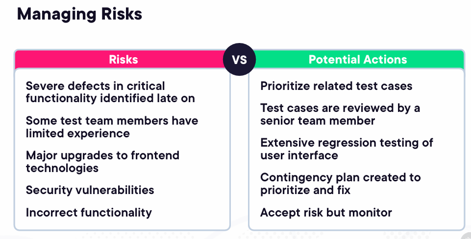
___
##  Test Monitoring, Test Control and Test Completion 
`Test monitoring` gathers information to assess progress and ensure test exit criteria are met, such as coverage of risks, requirements, or acceptance criteria.  

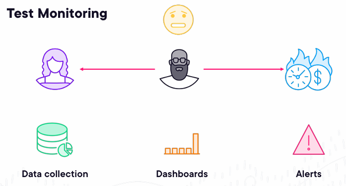

`Test control` uses this data to issue directives for effective testing, such as:  
- Reprioritizing tests for emerging risks.  
- Reassessing entry/exit criteria after rework.  
- Adjusting schedules for delays.  
- Allocating additional resources. 
- Update test plan.  
- Implement contingency plans.  
- Escalate issues.  
Test control activities aim to make improvements as well as to fix problems.

`Test completion` performed at projects milestones. Final faze before delivering testing reports.
collects data from completed test activities to consolidate experience, testware, and any 
other relevant information. Test completion activities occur at project milestones such as when a test level 
is completed, an agile iteration is finished, a test project is completed (or cancelled), a software system is 
released, or a maintenance release is completed.  
Test Completion Activities:
- Finalizing test execution.  
- Documenting test results.  
- Preparing reports.  

`Test Reporting` updating relative stakeholders about progress.

### Metrics used in Testing (K1)
Test metrics track progress, quality, and the effectiveness of testing activities, supporting test control and completion. Key metrics include:  
- `Project progress metrics`: Task completion, resource usage, test effort.  
- `Test progress metrics`: Test case status, test environment readiness, execution time.  
- `Product quality metrics`: Availability, response time, mean time to failure.  
- `Defect metrics`: Defect counts, priorities, density, detection percentage.  
- `Risk metrics`: Residual risk levels.  
- `Coverage metrics`: Requirements and code coverage.  
- `Cost metrics`: Testing costs and overall quality costs.  

### Purpose, Content and Audience for Test Reports 
Test reporting communicates testing status and results during and after testing. It serves two main purposes:  
1. `Test Progress Reports`: Generated regularly (e.g., daily, weekly) to support test monitoring and control. These include:  
- Testing period and progress (e.g., schedule deviations).  
- Impediments and workarounds.  
- Test metrics, new/changed risks, and plans for the next period.  
- New and changed risks within testing period 
- Testing planned for the next period 
- Summary of test progress for the given time period
- Key milestones achived

2. `Test Completion Reports`: Prepared at the end of a test phase or project, summarizing:  
- Test outcomes, product quality evaluation, and alignment with test objectives.  
- Deviations from the plan, unresolved defects, and unmitigated risks.  
- Lessons learned and metrics from progress reports.  
- Testing impediments and workarounds  
- Unmitigated risks, defects not fixed  
- Test summary  
- Key milestones achieved

Reports vary in formality and frequency based on the audience, ranging from informal team updates to formal project  
summaries. Templates for these reports are provided in the ISO/IEC/IEEE 29119-3 standard.

### Communicating the Status of Testing 
The best way to communicate test status depends on factors like test management concerns, organizational strategies, regulatory standards, or the team structure.  
Communication options include:  
- Verbal communication with team members and stakeholders.  
- Dashboards (e.g., CI/CD, task boards, burn-down charts).  
- Electronic channels (e.g., email, chat).  
- Online documentation.  
- Formal test reports.  
Multiple options can be used, with more formal methods often suited for distributed teams.  
Communication should be tailored to meet the specific needs of different stakeholders.
___
## Configuration Management 
Configuration management (CM) in testing ensures proper control and tracking of work products like test plans, cases, scripts, results, and environments.  
Key aspects of CM include:  
- Identifying, version controlling, and tracking changes to configuration items (e.g., test plans, environments).  
- Approving items for testing and creating baselines, which can only be changed through a formal process.  
- Maintaining records of changes and enabling rollback to previous baselines for reproducibility.  

CM supports testing by ensuring all configuration items are uniquely identified, versioned, tracked, and traceable.  
It also ensures documentation and software are properly referenced in test materials.  
In automated DevOps pipelines, CM is often integrated for continuous integration and testing.

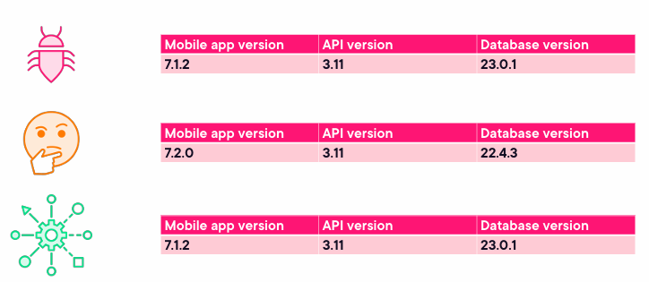

___
## Defect Management 
An effective defect management process is crucial for identifying and handling defects during testing.  
The process involves logging, analyzing, classifying, and resolving defects, with rules for classification and a  
workflow from discovery to closure.  
The process should be followed by all stakeholders and applied to both dynamic and static testing defects.  

A typical defect report includes:  
- Unique identifier, title, and a summary of the issue.  
- Date, author, and role, along with the test object and environment.  
- Context (e.g., test case, test activity, SDLC phase).  
- Detailed description of the failure, including steps to reproduce, test logs, screenshots, etc.  
- Expected vs. actual results, severity, priority, and status (e.g., open, closed).  
- References (e.g., related test case).  

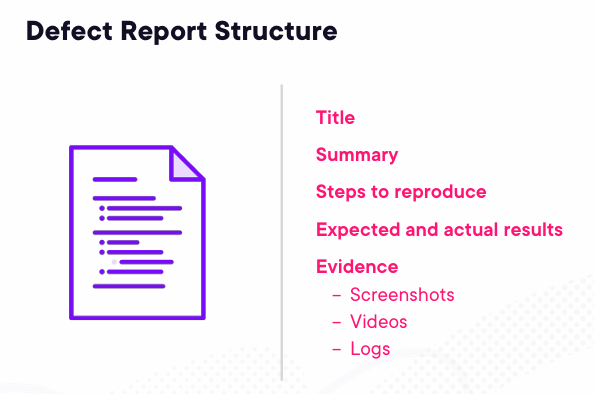

Defect management tools often automate parts of this process.  
Templates and examples can be found in the ISO/IEC/IEEE 29119-3 standard.
___
## Sources
- Certified Tester Foundation Level Syllabus v4.0
- G. McNeilly, ISTQB® CTFL: Managing the Test Activities, https://app.pluralsight.com/