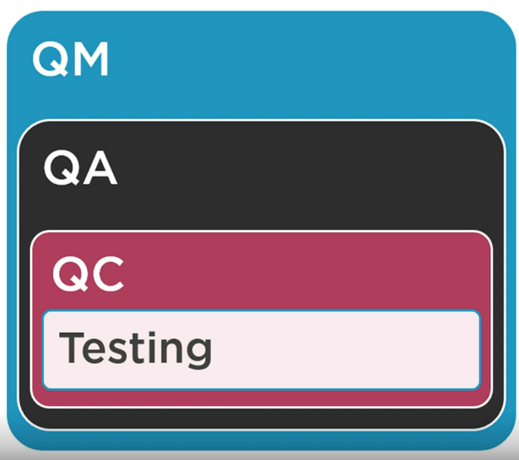
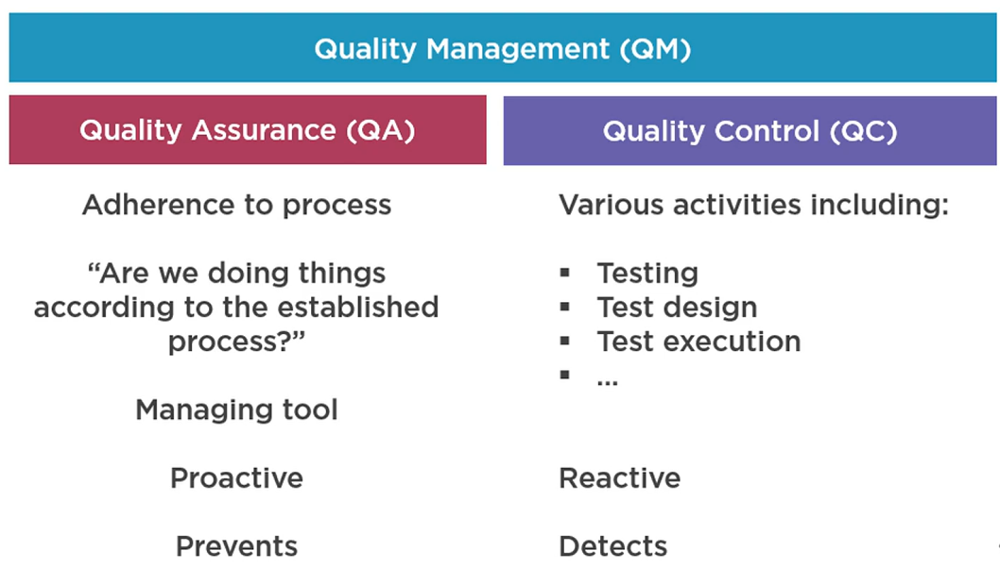
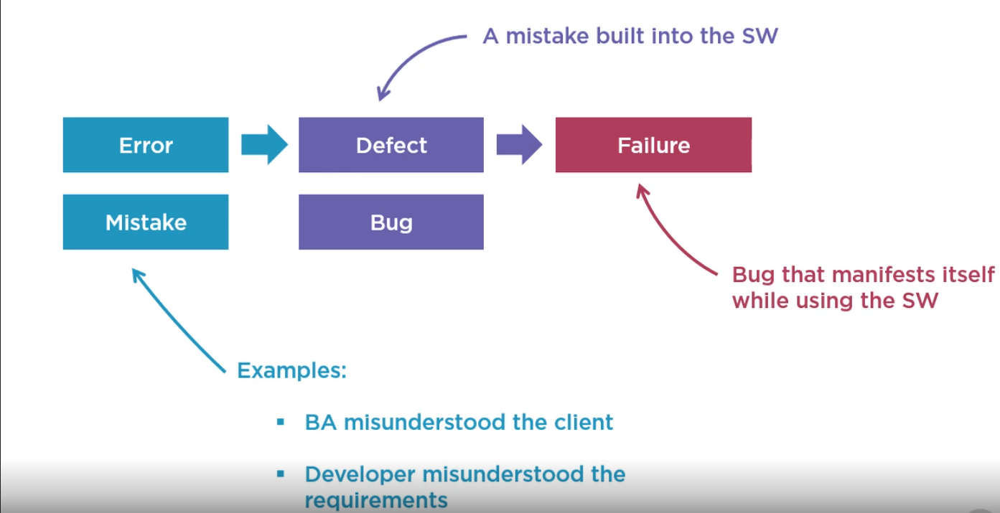
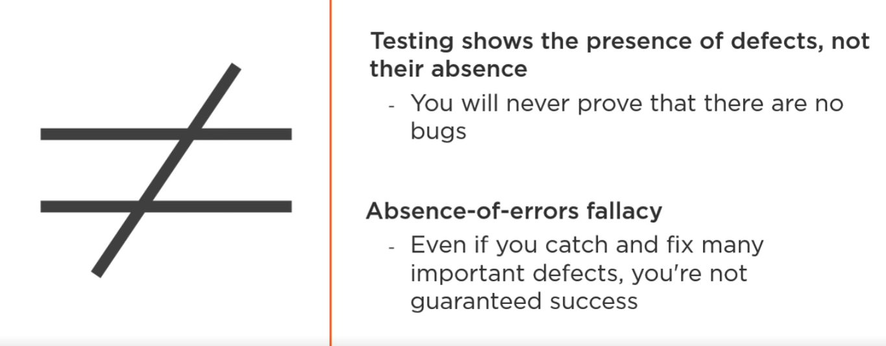
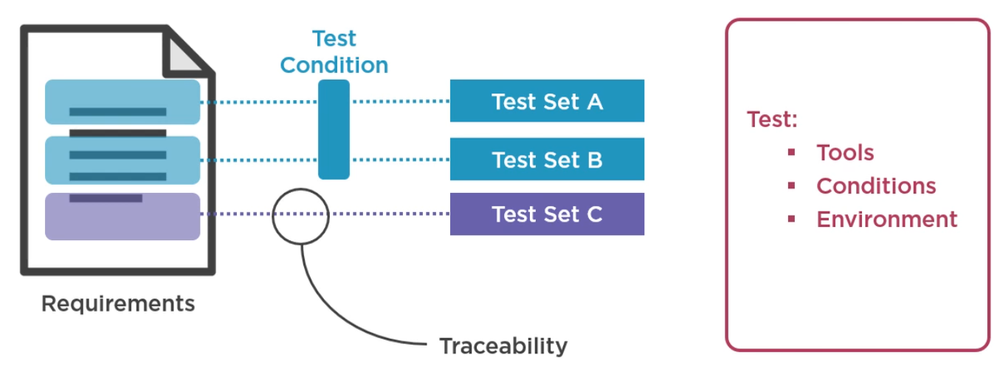
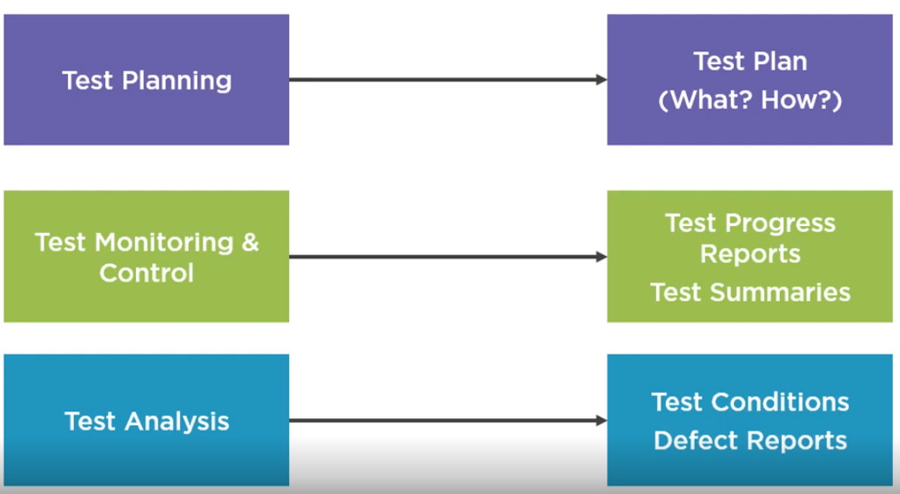
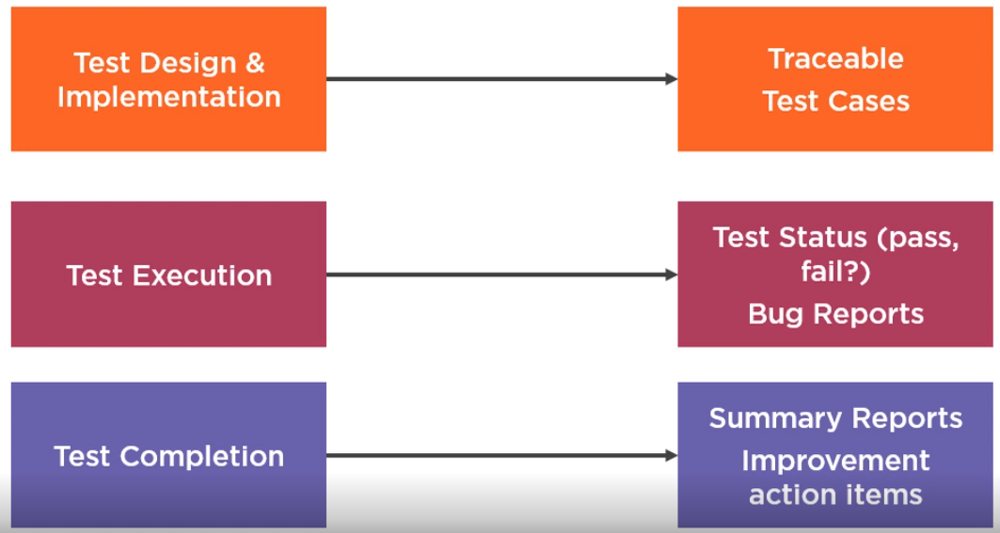

# Podstawy Testowania

## What is testing
Software testing is a set of activities to discover defects and evaluate the quality of software artifacts.
These artifacts, when being tested, are known as `test objects`.
A common misconception about testing is that it only consists of executing tests. 
However, software testing also includes other activities and must be aligned with the 
software development lifecycle.

Another common misconception about testing is that testing focuses entirely on verifying the test object.
Whilst testing involves `verification`, i.e., checking whether the system meets specified requirements, it also
involves `validation`, which means checking whether the system meets users’ and other stakeholders’
needs in its operational environment.

Testing is not only a technical activity. It also needs to be properly planned, managed, estimated,
monitored and controlled.

Testers use tools, but it is important to remember that testing is largely an intellectual
activity, requiring the testers to have specialized knowledge, use analytical skills and apply critical
thinking and systems thinking.

Testowanie to technologiczne badanie pozwalające otrzymać informacje o jakości  
testowanego produktu.

Testowanie jest procesem który składa się z następujących głównych punktów:
1. Planowanie testów
2. Monitorowanie i nadzór testów
3. Analiza testów
4. Projektowanie testów
5. Implementacja testów
6. Wykonywanie testów
7. Ukończenie testów

Testowanie może mieć zarówno formę `dynamiczną` (uruchamiamy testowany moduł/system),  
jak i `statyczną` (bez uruchomiania, dokumentacja itp).

Testowanie skupia się zarówno na:
- Weryfikacji (Czy produkt tworzony jest prawidłowo?)
- Walidacji (Czy tworzony jest prawidłowy produkt?)

### Cele testowania K1
The typical test objectives are:  
• Evaluating work products such as requirements, user stories, designs, and code  
• Triggering failures and finding defects  
• Ensuring required coverage of a test object  
• Reducing the level of risk of inadequate software quality  
• Verifying whether specified requirements have been fulfilled  
• Verifying that a test object complies with contractual, legal, and regulatory requirements  
• Providing information to stakeholders to allow them to make informed decisions  
• Building confidence in the quality of the test object  
• Validating whether the test object is complete and works as expected by the stakeholders  

### Testing and Debugging
`Testowanie (ujawnia awarię)`: triggers failures that are caused by defects in
the software (dynamic testing) or can directly find defects in the test object (static testing). 

`Debugowanie (szuka przyczyny)`: debugging is concerned with finding causes of
this failure (defects), analyzing these causes, and eliminating them
___
### Why is Testing Necessary?

Testing provides a cost-effective means of detecting defects. These defects can then be removed (by
debugging – a non-testing activity), so testing indirectly contributes to higher quality test objects.
Testing provides a means of directly evaluating the quality of a test object at various stages in the SDLC.
These measures are used as part of a larger project management activity, contributing to decisions to
move to the next stage of the SDLC, such as the release decision.
Testing provides users with indirect representation on the development project. Testers ensure that their
understanding of users’ needs are considered throughout the development lifecycle. The alternative is to
involve a representative set of users as part of the development project, which is not usually possible due
to the high costs and lack of availability of suitable users.
Testing may also be required to meet contractual or legal requirements, or to comply with regulatory
standards

### QM/QA/TQC/testing K1
`Quality assurance` (zapewnianie jakości) jest często utożsamiane z testowaniem.
Są to dwa oddzielne procesy, które zawierają się w szerszym pojęciu `Quality management` (zarządzanie jakościa).  
`QM` obejmuje wszystkie czynności mające na celu kierowanie organizacji w dziedzinie  
jakości i ich nadzorowanie.

Testing is a form of quality control.

`QC`: `product-oriented`, corrective approach that focuses on those activities supporting the achievement 
of appropriate levels of quality.

`QA`: `process-oriented`, preventive approach that focuses on the implementation and improvement of 
processes. It works on the basis that if a good process is followed correctly, then it will generate a good 
product.

Test results are used by QA and QC. In QC they are used to fix defects, while in QA they provide 
feedback on how well the development and test processes are performing. 

Elementami `QM` są:
- `Zapewnianie jakości`: skupia się na przestrzeganiu właściwych procesów w celu uzyskania  
  pewności, że osiągnięte zostaną odpowiednie poziomy jakości. Jeśli proces jest wykonywany prawidłowo  
  powstające produkty pracy mają wyższą jakość.
- `Kontrola jakości`: obejmuje cały szereg czynności, także testowych, które wspierają  
  osiągnięcie odpowiednich poziomów jakości.

### Errors, Defects, Failures, Root Causes
- `Pomyłka/Error (błąd)`: działanie człowieka powodujące powstanie nieprawidłowego rezultatu (programista zle NAPISAŁ funkcje, w której pomylił znak + z *)
- `Defekt/Defect (bug, usterka)`: niedoskonałość, wada produktu pracy, polegająca na niespełnianiu wymagań (bug w kodzie czyli * zamiast +)
- `Awaria/Failure`: zdarzenie, w którym moduł/system nie wykonuje wymaganej funkcji w określonym zakresie. (kiedy użytkownik chce dodać to produk mnoży i bęc jest awaria)
- `Podstawowa przyczyna defektu/Root Cause`: fundamental reason for the occurrence of a problem

Errors and defects are not the only cause of failures. Failures can also be caused by environmental 
conditions, such as when radiation or electromagnetic field cause defects in firmware.

### Wyniki fałszywie pozytywne/negatywne

- `Fałszywie pozytywny`: raportowany jako defekt którego właściwie nie ma
- `Fałszywie negatywny`: nie wykrywają defektu który powinien zostać wykryty

Dlatego kluczowa jest analiza podstawowej przyczyny defektu.

### 7 testing principles
1. Testing shows the presence, not the absence of defects.
2. Exhaustive testing is impossible.
3. Early testing saves time and money.
4. Defects cluster together.
5. Paradoks pestycydów/Tests wear out.
6. Testing is context dependent. 
7. Przekonanie o braku błędów jest błędem/Absence-of-defects fallacy.

___
### Test Activities, Testware and Test Roles
Testing is context dependent many things influence your testing decisions.

External factors: e.g: stakeholder interest, general laws, the domain you're working in, 
and standards applicable to your domain. 

Internal factors: e.g: multiple software development lifecycle models that hugely influence your workflow, budgets, resources, time, and overall complexity of the system

`Testing activites` can be broadly grouped as test planning, test monitoring and control, test analysis, test design, test implementation, test execution, and test completion. 
Each of these groups can be broken down further. One note, although these activities seem logically sequential, they don't have to be carried out in sequence. 
So instead of doing all of the planning, then all test analysis, then all test design and execution, and then reporting, and finally, test completion without ever 
taking a step back, you might, and most likely will, have an agile or agile‑like approach. 
This means you will do a bit of planning and analysis, create and execute basic tests, report the results, and then repeat in small chunks, plan, analyze, test, report, plan, 
analyze, test, report. 
The dynamic of your workflow will largely depend on how the entire team works, and you'll have to adapt to that.

`Test planning`: consists of defining the test objectives and then selecting an approach that best achieves 
the objectives within the constraints imposed by the overall context. A test plan is not something set in stone.

`Test monitoring and control`: Test monitoring involves the ongoing checking of all test activities and the 
comparison of actual progress against the plan. Are we doing what we planned to do, if no, why not? Are we on track to meet the deadline?
If the answer is no, why not, and what can we do about it? Test control involves taking the actions necessary to 
meet the objectives of testing.

In order to implement effective test monitoring and control, it is important to establish and maintain 
traceability throughout the test process between the test basis elements, testware associated with these 
elements (e.g., test conditions, risks, test cases), test results, and detected defects. 
Accurate traceability supports coverage evaluation, so it is very useful if measurable coverage criteria are 
defined in the test basis. The coverage criteria can function as key performance indicators to drive the 
activities that show to what extent the test objectives have been achieved. For 
example: 
• Traceability of test cases to requirements can verify that the requirements are covered by test 
cases. 
• Traceability of test results to risks can be used to evaluate the level of residual risk in a test 
object.  
In addition to evaluating coverage, good traceability makes it possible to determine the impact of 
changes, facilitates test audits, and helps meet IT governance criteria. Good traceability also makes test 
progress and completion reports more easily understandable by including the status of test basis 
elements. This can also assist in communicating the technical aspects of testing to stakeholders in an 
understandable manner. Traceability provides information to assess product quality, process capability, 
and project progress against business goals. 

`Test analysis (what to test?)`: includes analyzing the test basis to identify testable features and to define and prioritize 
associated test conditions, together with the related risks and risk levels. The test basis 
and the test objects are also evaluated to identify defects they may contain and to assess their testability. 
Test analysis is often supported by the use of test techniques. Test analysis answers the 
question “what to test?” in terms of measurable coverage criteria.
The better you understand the system, the better your tests will be, and pretty much the rest of your work. 
What exactly do you analyze? Well, anything you can get your hands on. Business requirements, functional requirements, non‑functional requirements 
are a great start. Architectural diagrams, UML diagrams, graphs, and anything else created by technical people who designed the system. Actual code, metadata, 
developer documentation, documentation of the system interfaces, all that can be useful, too. Finally, risk analysis reports if your project happens to have them. 
All of this is material for your test basis, the foundation upon which you will design and create your tests. This all sounds great, but what do we really mean by analyzing? 
Reading and then what? Yes, reading and trying to identify all possible defects such as ambiguities, omissions, inconsistencies, inaccuracies, contradictions, superfluous 
statements. Any of these defects on paper has the potential to be converted to defects in software and eventually to failures. This might ring a bell. 
This is directly related to one of the seven testing principles, early testing saves time and money.

Test Design and Implementation
Okay, we analyzed everything we possibly could, and so we know what to test. Now we have to answer how to test it. Test design includes 
the following major activities, designing and prioritizing test cases and sets of test cases, identifying necessary test data to support 
test conditions and test cases, designing, evaluating or preparing the test environment, and identifying any required infrastructure and tools, 
capturing bi‑directional traceability between the test basis, test conditions, and test cases. If you've never done this, then this might seem a 
bit vague and abstract, so let me try with a picture. 

You create multiple test cases, you write down the steps, expected results, and the necessary input data in each. 
You then typically group them into a test set, test suite or test pack. These terms are largely interchangeable. 
You also write down everything you need to test, the testing tools, test conditions, and environment that you'll be using such as the browser 
version, operating system version, and special software, and so forth. And finally, you map all of this to the relevant part of the requirements. 
Requirements are large, so you will have hundreds of tests backed into dozens of test sets, mapped to many subsections of the global requirements 
if we're talking about the same big piece of software. And in that case, you may create these so‑called test conditions in between that map to a 
subsection of requirements. 
I'll explain what the test condition is in more detail a bit later. Regardless of how you do it, you should create requirements 
to test mapping, also known as traceability, between the requirements, your test basis, and the test work products, in this case, the test cases. 
This is important to do and to remember for the exam. So test design answers how to test, 

`Test design (how to test)`: includes elaborating the test conditions into test cases and other testware (e.g., test 
charters). This activity often involves the identification of coverage items, which serve as a guide to 
specify test case inputs. 
Test design also includes defining the test data requirements, designing the test environment and identifying any 
other required infrastructure and tools.
Test design includes 
the following major activities, designing and prioritizing test cases and sets of test cases, identifying necessary test data to support 
test conditions and test cases, designing, evaluating or preparing the test environment, and identifying any required infrastructure and tools, 
capturing bi‑directional traceability between the test basis, test conditions, and test cases.
Example:
You create multiple test cases, you write down the steps, expected results, and the necessary input data in each. 
You then typically group them into a test set, test suite or test pack. These terms are largely interchangeable. 
You also write down everything you need to test, the testing tools, test conditions, and environment that you'll be using such as the browser 
version, operating system version, and special software, and so forth. And finally, you map all of this to the relevant part of the requirements. 
Requirements are large, so you will have hundreds of tests backed into dozens of test sets, mapped to many subsections of the global requirements 
if we're talking about the same big piece of software. And in that case, you may create these so‑called test conditions in between that map to a 
subsection of requirements. 
You should create requirements to test mapping, also known as traceability, between the requirements, your test basis, and the test work products, in this case, the test cases.

`Test implementation (do we now have everything in place to run the tests?)`: includes creating or acquiring the testware necessary for test execution (e.g., test 
data). Test cases can be organized into test procedures and are often assembled into test suites. Manual 
and automated test scripts are created. Test procedures are prioritized and arranged within a test 
execution schedule for efficient test execution (see section 5.1.5). The test environment is built and 
verified to be set up correctly.
Test implementation includes the following major activities, developing test procedures and 
potentially creating automated test scripts. Setting up the test environment, including potentially test harnesses, service virtualization, 
simulators, and any other kind of infrastructure, preparing test data and ensuring it is properly loaded into the test environment. 
In the previous step, you identified which data you need. Now you're getting it or creating it. Finally, verifying and updating 
bi‑directional traceability between the test basis, test conditions, test cases, and so forth.

`Test execution`: includes running the tests in accordance with the test execution schedule (test runs). 
Test execution may be manual or automated. Test execution can take many forms, including continuous 
testing or pair testing sessions. Actual test results are compared with the expected results. The test 
results are logged. Anomalies are analyzed to identify their likely causes. This analysis allows us to report 
the anomalies based on the failures observed

`Test completion`: activities usually occur at project milestones (e.g., release, end of iteration, test level 
completion) for any unresolved defects, change requests or product backlog items created. Any testware 
that may be useful in the future is identified and archived or handed over to the appropriate teams. The 
test environment is shut down to an agreed state. The test activities are analyzed to identify lessons 
learned and improvements for future iterations, releases, or projects. A test completion 
report is created and communicated to the stakeholders.
You typically do this when a big software version is released, a test project is completed or an agile 
iteration is finished. In short, it is a kind of retrospective that you do at the end of some milestone. Test completion includes 
ensuring that all defect reports are closed, it's important to do this to ensure you didn't miss anything, creating a test 
summary report to be communicated to stakeholders, finalizing, archiving, and/or sharing testware, meaning test cases, 
test data, and other things, perhaps for later reuse. Depending on where you work, you might be required by law to store 
test evidence for a year or even more in case some external audit comes in and demands to see it. Analyzing lessons learned 
from the completed test activities to determine changes needed for future iterations, releases, and projects, basically, 
learn from mistakes and do things better in the future.

Testing is not performed in isolation. Test activities are an integral part of the development processes 
carried out within an organization. Testing is also funded by stakeholders and its final goal is to help fulfill 
the stakeholders’ business needs. Therefore, the way the testing is carried out will depend on a number 
of contextual factors including: 
• Stakeholders (needs, expectations, requirements, willingness to cooperate, etc.) 
• Team members (skills, knowledge, level of experience, availability, training needs, etc.) 
• Business domain (criticality of the test object, identified risks, market needs, specific legal 
regulations, etc.) 
• Technical factors (type of software, product architecture, technology used, etc.) 
• Project constraints (scope, time, budget, resources, etc.) 
• Organizational factors (organizational structure, existing policies, practices used, etc.) 
• Software development lifecycle (engineering practices, development methods, etc.) 
• Tools (availability, usability, compliance, etc.) 
These factors will have an impact on many test-related issues, including: test strategy, test techniques 
used, degree of test automation, required level of coverage, level of detail of test documentation, 
reporting, etc. 

`Testware/Test work products`:  is created as output work products from the test activities.

The following list of work products is not exhaustive: 

• `Test planning work products include`: test plan, test schedule, risk register, and entry and exit 
criteria. Risk register is a list of risks together with risk likelihood, risk impact and 
information about risk mitigation. Test schedule, risk register and entry and exit 
criteria are often a part of the test plan. 

• `Test monitoring and control work products include`: test progress reports, 
documentation of control directives and risk information. All kinds of reports such as test 
progress reports and test summaries - In other words, who is working on what report? 

• `Test analysis work products include`: (prioritized) test conditions (e.g., acceptance criteria), 
and defect reports regarding defects in the test basis (if not fixed directly). 
What are the test conditions again? It means a testable aspect of a component 
or a system identified as a basis for testing. In plain English, you can break down requirements into logical chunks, 
map those to test conditions, each with a limited scope, and then based on those, create individual test cases.

Test design and test implementation are the phases where you create specific test 
cases packaged into test sets and you map or trace those to the more broadly defined test conditions. Additionally, you may 
define the necessary test data.

• `Test design work products include`: (prioritized) test cases, test charters, coverage items, test 
data requirements and test environment requirements. 

• `Test implementation work products include`: test procedures, automated test scripts, test 
suites, test data, test execution schedule, and test environment elements. Examples of test 
environment elements include: stubs, drivers, simulators, and service virtualizations. 

• `Test execution work products include`: test logs, and defect reports. 

• `Test completion work products include`: test completion report, action items 
for improvement of subsequent projects or iterations, documented lessons learned, and change 
requests (e.g., as product backlog items). 

 
___
## Sources
- A. Doronins, ISTQB® Foundation: Getting Started, https://app.pluralsight.com/
- A. Roman, L. Stapp, Certifikowany tester ISTQB Poziom Podstawowy, Helion SA 2020
- Certified Tester Foundation Level Syllabus v4.0

