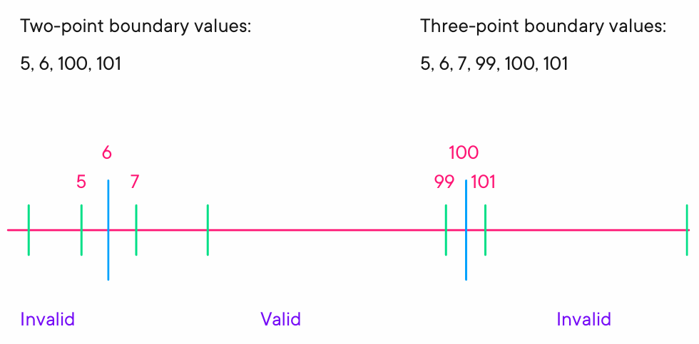
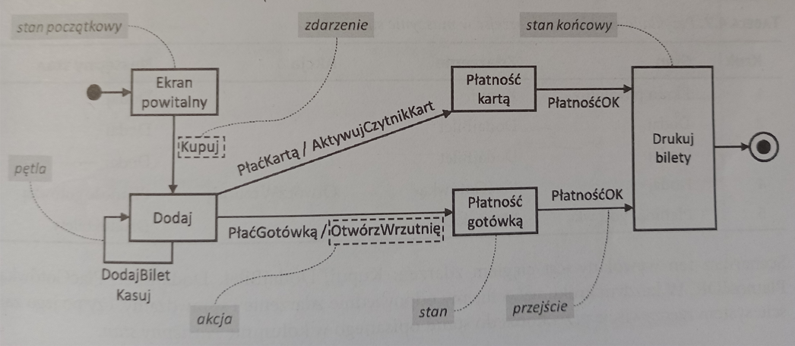
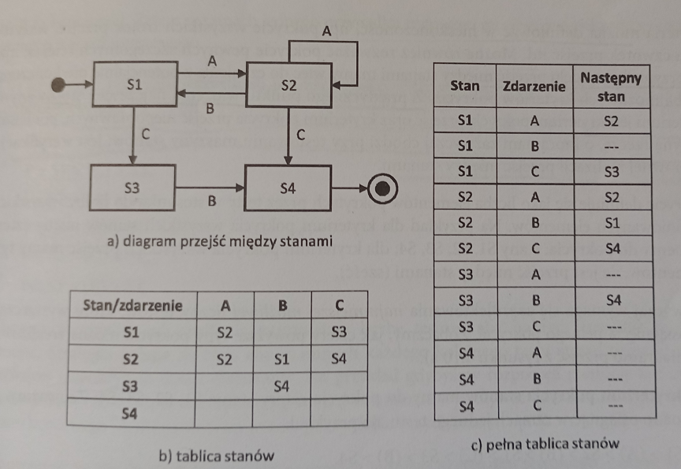
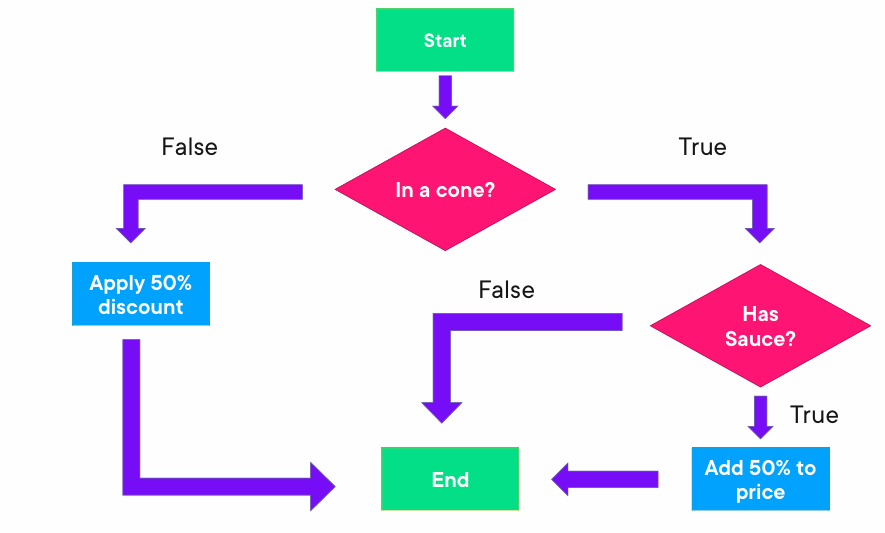

# Techniki Testowania
Test techniques support the tester in test analysis (what to test) and in test design (how to test). Test 
techniques help to develop a relatively small, but sufficient, set of test cases in a systematic way. Test 
techniques also help the tester to define test conditions, identify coverage items, and identify test data 
during the test analysis and design. Further information on test techniques and their corresponding 
measures can be found in the ISO/IEC/IEEE 29119-4 standard, and in (Beizer 1990, Craig 2002, 
Copeland 2004, Koomen 2006, Jorgensen 2014, Ammann 2016, Forgács 2019). 

## Black-box test techniques (also known as specification-based techniques) 
### Equivalence Partitioning (Podział na klasy równoważności)
#### Charakterystyka
Podstawa: próbuje przezwyciężyć zasadę niemożności testowania gruntowego.  
Możliwych danych wejściowych jest nieskończenie wiele, ale oczekiwanych zachowań programu na te dane  
jest już skończona liczba.
Testowane zachowanie programu da się sprowadzić do skończonej liczby wariantów.

Technika EP polega na podzieleniu zbioru wszystkich możliwych danych wejściowych na klasy równoważności, 
czyli grupy danych, które są traktowane jako równoważne pod względem przewidywanych wyników działania programu.

Technika EP jest uniwersalna, można ją stosować w każdej sytuacji na każdym poziomie testów i w każdym typie.
Do dziedzin wejściowych, wyjściowych oraz wewnętrznych (związanych ze zmiennymi, które nie są bezpośrednio podawane na wejściu ani  
zwracane na wyjściu).
Nie musi być to koniecznie dziedzina liczbowa, może to być dowolny zbiór np. słowa (jednoliterowe czy dwuliterowe), typy OS (windows, Linux, Mac)

Technika KR identyfikuje problemy wynikłe z błędnego przetwarzania danych.

#### Implementacja
- Każdy element dziedzin należy do dokładnie jednej klasy równoważności.
- Żadna klasa równoważności nie może być pusta

Klasy, które zawierają wartości normalne/poprawne nazywane są ```klasami prawnymi``` a
klasy zawierające wartości, które moduł lub system powinien odrzucić nazywane są ```klasami niepoprawnymi```.  

Klasy mogą podlegać dalszemu podziałowi na podklasy.

#### Maskowanie błędów
W sytuacji, w której testy mają jednocześnie pokrywać KR pochodzące z więcej niż jednego
podziału, dobrą praktyką jest, aby nie tworzyć przypadków testowych, które będą pokrywać dwie lub więcej klas niepoprawnych.
Poprawna strategia to:
1. Najpierw stwórz przypadki testowe złożone wyłącznie z danych z klas poprawnych, które pokryją wszystkie klasy poprawne.
2. Następnie dla każdej niepokrytej klasy niepoprawnej stwórz osobny przypadek testowy, w którym wystąpi dana z tej klasy, a wszystkie pozostałe  
dane pochodzić będą z klas poprawnych.

Przykład:
System wystawia ocenę studentowi na podstawie dwóch danych:
- liczny punktów za ćwiczenia (0-50)
- liczby punktów za egzamin (0-50)
Student zalicza przedmiot, jeśli suma punktów przekracza 50.

Wyróżniliśmy następujące dziedziny:
1. dziedzina zmiennej "A" = punkty za ćwiczenia:
- A1 klasa niepoprawna: n < 0
- A2 klasa poprawna: n = 0-50
- A3 klasa niepoprawna: n > 50
2. dziedzina zmiennej "B" = punkty za egzamin:
- B1 klasa niepoprawna: n < 0
- B2 klasa poprawna: n = 0-50
- B3 klasa niepoprawna: n > 50

Chcemy pokryć wszystkie klasy równoważności obu dziedzin. Każdy przypadek testowy zawiera
jakąś liczbę punktów za egzamin oraz ćwiczenia.
Najpierw pokrywamy klasy poprawne, wystarczy tylko jeden TC (test case) albo PT(przypadek testowy):
PT1: A = 25, B = 30 (pokrywa poprawną klasę A2 i poprawną klasę B2)

Aby pokryć klasy niepoprawne potrzebujemy 4 kolejnych TC, w których klasy będziemy testować indywiduualnie poniważ druga klasa musi być poprawna:
PT2: A = -8, B = 35 (pokrywa niepoprawną klasę A1; dodatkowo poprawną B2)
PT3: A = 48, B = -11 (nie ok B1; ok A2)
PT4: A = 64; B = 4 (nie ok A3; ok B2)
PT5: A = 12, B = 154 (nie ok B3; ok A2)

Dlaczego:
Załóżmy, że system weryfikuje, czy student zliczył przedmiot, poprzez następująca procedurę:
```
DANE WEJSCIOWE: punkty_za_cwiczenia, punkty_za_egzamin
JEZELI (punkty_za_cwiczenia + punkty_za_egzamin > 50) TO
    ZWROC WYNIK "Przedmiot zdany"
W PRZECIWNYM RAZIE
    ZWROC WYNIK "Przedmiot niezdany"
```
Rozważmy teraz następujący TC:
PT6: A = -26; B = 105 (ni ok A1; nie ok B3)
-26 + 105 = 77 Przedmiot zdany ---> Tym jest ```Maskowanie błędów```

#### Pokrycie
Minimalny zbiór TC zapewniających 100% pokrycie to taki, który pokrywa każdą klasę.
W przypadku wielowymiarowym (więcej niż jedna dziedzina) jest to trochę bardziej skomplikowane, 
gdyż liczba przypadków będzie zależeć od liczby kombinacji klas niepoprawnych,  
a także od ewentualnych zależności pomiędzy wartościami różnych podziałów.

Pokrycie mierzy się jako iloraz liczby klas przetestowanych przy użyciu co najmniej jednej wartości  
przez łączną liczbę zidentyfikowanych klas i jest wyrażana w %

Np.: zbiór 3 testów pokrywa 12 klas, zatem osiąga pokrycie (3/12) * 100 = 25%

#### Each Choice Coverage
Many test objects include multiple sets of partitions (e.g., test objects with more than one input 
parameter), which means that a test case will cover partitions from different sets of partitions. The 
simplest coverage criterion in the case of multiple sets of partitions is called Each Choice coverage. 
Each Choice coverage requires test cases to exercise each partition from each set of 
partitions at least once. Each Choice coverage does not take into account combinations of partitions. 

Each Choice coverage jest techniką testowania stosowaną do testowania złożonych systemów, w których  
istnieje wiele możliwych kombinacji danych wejściowych. Głównym celem tej metody jest zapewnienie, że  
każda możliwa opcja dla każdej zmiennej (czyli każdy wybór) zostanie przetestowana przynajmniej raz.  

Przykład: Rozważmy system z trzema zmiennymi wejściowymi:

A: {1, 2}  
B: {X, Y}  
C: {true, false}  

Dla Each Choice coverage stworzymy przypadki testowe tak, aby każda z możliwych wartości A, B i C 
wystąpiła przynajmniej raz, ale nie musimy sprawdzać każdej kombinacji.

Przykładowe przypadki testowe:  

(A=1, B=X, C=true)  
(A=2, B=Y, C=false)  
(A=1, B=Y, C=true)  

Tymi przypadkami testowymi zapewniamy, że każda z wartości A (1, 2), B (X, Y) i C (true, false) wystąpiła w testach.
___
### Boundary Value Analysis (Analiza wartości brzegowych AWB)
#### Charakterystyka
AWB to rozszerzenie KR. W AWB do testów wybierane są wartości leżące na brzegach klas wyróżnionych w KR.
Elementy dziedziny muszą być uszeregowane/uporządkowane od najmniejszego do największego, aby tę technikę zastosować.
Wartości brzegowe to po prostu element największy i najmniejszy dla danej klasy.

- ```Wersja dwupunktowa```: dla każdej zidentyfikowanej wartości brzegowej wybiera się tę wartość oraz 
najbliższego sąsiada NIENALEŻĄCEGO do tej klasy.
Np. klasa z wartościami 1 do 6:
- 1 wartość brzegowa
- 0 najbliższy sąsiad spoza klasy dla wartości brzegowej 1
- 6 wartości brzegowa
- 7 najbliższy sąsiad spoza klasy dla wartości brzegowej 6

-```Wersja trójpunktowa```: dla każdej zidentyfikowanej wartości brzegowej wybiera się tę wartość oraz obu jej sąsiadów,
niezależnie do jakich klas należą.
Np. klasa z wartościami 1 do 6:
- 1 wartość brzegowa
- 0 lewy sąsiad dla wartości brzegowej 1
- 2 prawy sąsiad dla wartości brzegowej 1
- 6 wartości brzegowa
- 5 lewy sąsiad dla wartości brzegowej 6
- 7 prawy sąsiad dla wartości brzegowej 6


Przykład oby wersji:


#### Implementacja
1. Zidentyfikuj dziedzinę, którą chcesz poddać analizie.
2. Przeprowadź podział tej dziedziny na KR.
3. Dla każdej KR wyznacz wartości brzegowe.
4. Dla każdej wartości brzegowej wyznacz elementy do przetestowania.

Przykład: System oblicza zniżkę na bilet osobom poniżej 18 oraz powyżej 65.
1. Identyfikacja dziedziny: Analizowaną zmienną jest wiek pasażera, a więc nieujemna liczba całkowita.
Dziedzina ma więc postać 1,2,3,4....
2. Identyfikacja KR:
Mamy następujące klasy:
- K1: wiek uprawniający dla zniżki 0-17
- K2: bilet normalny 18-65
- K3: wiek uprawniający dla zniżki 66+
3. Identyfikacja wartości brzegowych:
- K1: 0 i 17
- K2: 18 i 65
- K3: 66 nie ma wartości największej
4. Identyfikacja wartości do przetestowania:
- Metoda dwupunktowa: 0,17,18,65,66
W tym przypadku mamy pewnego rodzaju symetrię między każdymi dwiema sąsiadującymi ze sobą wartościami 
brzegowymi dwóch klas. Nie ma wartości mniejszych niż 0.
- Metoda trójpunktowa: 0,1,16,17,18,19,64,65,66,67

#### Uważne wyznaczanie brzegów
W praktyce wartości globalne największe/najmniejsze istnieją, np. zakresy akceptowane przez pola danego typu.  
Warto sprawdzać nie tylko granice klasy wyznaczonych specyfikacją, ale również granice wyznaczone "architekturą"
testowanego rozwiązania.
Poza tym należy uważać na to, jak zdefiniowane są granice klas, np, w specyfikacji mamy sformułowanie, że
poruszamy się w dziedzinie liczb naturalnych, wtedy stwierdzenia "do klasy nalezą elementy nie mniejsze niż 7"
oznacza, iż 7 jest najmniejszą liczbą tej klasy. Z kolei sformułowanie "do klasy należą wartością większe od 7"
oznacza, że najmniejszą liczbą jest 8.
An alogicznie "co najwyżej 65" oznacza liczby do 65 włącznie a warunek "x < 65" oznacza, że największą wartością spełniającą tę nierówność jest 64.

#### Pokrycie
```Metoda dwupunktowa```: iloraz liczby przetestowanych wartości brzegowych oraz łącznej liczby zidentyfikowanych wartości brzegowych.
In 2-value BVA (Craig 2002, Myers 2011), for each boundary value there are two coverage items: this 
boundary value and its closest neighbor belonging to the adjacent partition. To achieve 100% coverage 
with 2-value BVA, test cases must exercise all coverage items, i.e., all identified boundary values. 
Coverage is measured as the number of boundary values that were exercised, divided by the total 
number of identified boundary values, and is expressed as a percentage. 

```Metoda trójpunktowa```: wartościami brzegowymi są wszystkie wartości do testów.
In 3-value BVA (Koomen 2006, O’Regan 2019), for each boundary value there are three coverage items: 
this boundary value and both its neighbors. Therefore, in 3-value BVA some of the coverage items may 
not be boundary values. To achieve 100% coverage with 3-value BVA, test cases must exercise all 
coverage items, i.e., identified boundary values and their neighbors. Coverage is measured as the 
number of boundary values and their neighbors exercised, divided by the total number of identified 
boundary values and their neighbors, and is expressed as a percentage. 
___
### Decision Table Testing (Tabele Decyzyjne)
#### Charakterystyka
Decision tables are used for testing the implementation of system requirements that specify how different 
combinations of conditions result in different outcomes. Decision tables are an effective way of recording 
complex logic, such as business rules.
Testowanie na podstawie tablic decyzyjnych to technika, którá wykorzystuję się do weryfikacji
poprawności implementacji reguł biznesowych.
Reguły biznesowe zazwyczaj mają postać logicznej implementacji:  
```JEZELI(warunek)TO(akcja)```
Zarówno warunek, jak i akcja mogą być złożone z więcej niż jednego czynnika.
Tablice decyzyjne pozwalają w systematyczny sposób przetestować implementacje kombinacje warunków.  

Przykład:

| Warunki | 1 | 2 | 3 | 4 | 5 | 6 | 7 | 8 |
|---------|---|---|---|---|---|---|---|---|
| Ma kartę stałego klienta? | T | T | T | T | N | N | N | N |
| Sumaryczna kwota > 1000? | T | T | N | N | T | T | N | N |
| Kupował w ostatnich 30 dniach? | T | N | T | N | T | N | T | N |
| Akacja |
|Przyznana zniżka | 10% | 5% | 5% | 0%| 0% | 0% | 0% | 0% |

Tablica decyzyjna składa się z dwóch części, opisujących, odpowiednio, warunki oraz akcje.
W poszczególnych kolumnach opisane są reguły biznesowe.

Wyżej jest przedstawiona tablica dla takich warunków i akcji:
- Czy posiada kartę stałego klienta (TAK/NIE)
- Czy sumaryczna kwota zakupów przekracza 1000zl? (TAK/NIE)
- Czy klient dokonywał zakupów w okresie ostatnich 30 dni? (TAK/NIE)

Na podstawie odpowiedzi na te warunki/pytania przydzielana jest zniżka (akcja):
0%, 5%, 10%.

#### Implementacja
1. Identyfikacja wszystkich możliwych warunków (z podstawy testów, np. specyfikacja, rozmowy z klientem itp.)  
i wpisanie ich do tablicy.
2. Identyfikacja wszystkich odpowiadających warunkom akcji, jakie mogą zajć w systemie i jakie są zależne od tych warunków,  
i wpisanie ich do tablicy.
3. Generowanie wszystkich kombinacji warunków i eliminacja kombinacji nieosiągalnych. Dla każdej osiągalnej kombinacji   
tworzona jest osobna kolumna.
4. Identyfikacja dla każdej zidentyfikowanej kombinacji warunków, które akcje i w jaki sposób mogą zajść. Uzupełnienie dolnej część tablcy.  
5. Stworzenie dla każdej kolumny przypadku testowego, w którym wymuszana jest zadana w kolumnie kombinacja warunków.  
Test jest zaliczony, jeśli po wykonaniu system podejmie akcje w taki sposób jak opisane w dolnej części tablicy.

Zazwyczaj wartości warunków przyjmują postać PRAWDA/FALSZ (T/F) (1/0) (TAK/NIE).  
Wartości warunków i akcji mogą być dowolnymi obiektami.  
 
In limited-entry decision tables all the values of the conditions and actions (except for irrelevant or infeasible ones; see below) are shown as Boolean values 
(true or false). Alternatively, in extended-entry decision tables some or all the conditions and actions may 
also take on multiple values (e.g., ranges of numbers, equivalence partitions, discrete values). 

The notation for conditions is as follows: “T” (true) means that the condition is satisfied. “F” (false) means 
that the condition is not satisfied. “–” means that the value of the condition is irrelevant for the action 
outcome. “N/A” means that the condition is infeasible for a given rule. For actions: “X” means that the 
action should occur. Blank means that the action should not occur. Other notations may also be used

```Sposób wyznaczania wszystkich kombinacji warunków - Mwtoda drzewa```:
Przykład:
3 warunki:
1. zarobki (M-małe ;D-durze)
2. wiek (ML-młody; SR-średni; ST-stary)
3. miejsce zamieszkania (MI-miasto; W-wieś)

Aby stworzyć wszystkie wartości warunków, budujemy drzewo, z którego korzenia wyprowadzamy wszystkie możliwości pierwszego warunku (zarobki).
Jest to pierwszy poziom drzewa. Następnie z każdego wierzchołka tego poziomu wyprowadzamy wszystkie możliwości drugiego warunku-drugi poziom.
Na końcu z każdego wierzchołka drugiego poziomu wyprowadzamy wszystkie możliwe wartości trzeciego warunku.

```
                           ROOT
                       /         \
                     /            \
                   /               \
ZAROBKI           M                D
              /    |   \          /  |  \
             /     |    \        /   |   \
            /      |     \      /    |    \
WIEK       ML     SR    ST     ML    SR   ST
          /  \   /  \  /  \   /  \   /\    /\
M. ZAM.  MI  W  MI  W  MI  W  MI  W MI W  MI W

```
Tablica na podstawie tego drzewa:


| Warunki | 1 | 2 | 3 | 4 | 5 | 6 | 7 | 8 | 9 | 10 | 11 | 12 |
|---------|---|---|---|---|---|---|---|---|---|----|----|----|
| Zarobki | M | M | M | M | M | M | D | D | D | D | D | D | 
| Wiek | ML | ML | SR | SR | ST | ST | ML | ML | SR | SR | ST |ST |
| Miejsce Zam. | MI | W | MI | W | MI | W | MI | W | MI | W | MI | W |

####  Kombinacje nieosiągalne
Np.:
wiek klient  > 18 (T/N)
wiek klienta <= 18 (T/N)

Czasami tablica nie będzie zawierała wszystkich możliwych kombinacji ze względów czysto logicznych albo semantycznych.
Wtedy potrzebna jest ```minimalizacja```  
Np, jeśli system pozwala wykupić ubezpieczenie jedynie pełnoletnim klientom, a w zależności od tego, czy palą, czy nie dostaj ą
zniżkę na to ubezpieczenie. System i tak pozwoli na wykup ubezpieczenie, tylko jeśli klient jest pełnoletni. 
Wartości nieistotne zaznacza się znakiem "-" albo "N/A".
Algorytmy minimalizacji są omówione na certyfikat ISTQB Analityk Testów.

#### Pokrycie
100% pokrycie wymaga, by dla każdej kolumny przygotować i wykonać przynajmniej jeden przypadek
testowy odpowiadający danej kombinacji warunków. Test jest zaliczony, jeśli system rzeczywiści wykona zdefiniowane dla tej  
kolumny akcje.
Nie bierzemy pod uwagę wszystkich możliwych kombinacji warunków tylko kolumny-minimalizacja!.

Coverage is measured as the number of exercised columns, divided by the total number of feasible 
columns, and is expressed as a percentage. 

#### Tablice decyzyjne jako statyczna technika testowania
Technika tablic decyzyjnych znakomicie nadaje się do wykrywania problemów dotyczących wymagań.
Np. problemy ze specyfikacją takie jak:
- niepełność: brak zdefiniowanych akcji dla określonego zestawu warunków
- sprzeczność: zdefiniowanie w dwóch różnych miejscach specyfikacji dwóch różnych zachowań systemu wobec tego samego zestawu warunków.
- redundatność: zdefiniowanie tego samego zachowania systemu w dwóch różnych miejscach specyfikacji-opisane w inny sposób.
___
### State transition testing (Testowanie przejść między stanami)
#### Charakterystyka
Technika stosowana w celu sprawdzenia zachowania się modułu lub systemu-sprawdza aspekt behawioralny.
Model opisujący aspekt behawioralny to `diagram przejść między stanami` i składa się z następujących elementów:
- `states (stany)`: reprezentują możliwe sytuacje, w jakich może się znajdować system.
- `transitions (przejścia)`: reprezentują możliwe poprawne zmiany stanów.
- `event, event [guard condition] (zdarzenia)`: reprezentują zjawiska, zazwyczaj zewnętrzne wobec systemu, których zajście  
wyzwala odpowiadające im przejście. They may be additionally qualified by a guard condition.
- `action (akcje)`: czynności, które system może podjąć podczas przejścia między stanami.

#### Implementacja
Przykładowy diagram przejść między stanami:



Model przejść między stanami może być wyrażony poprzez: diagram przejść między stanami, tablica stanów, pełna tablica stanów.



W przypadku `pełnej tablicy stanów` ukazane są wszystkie możliwe kombinacje stanów oraz wszystkich możliwych zdarzeń.

A state table is a model equivalent to a state transition diagram. Its rows represent states, and its 
columns represent events (together with guard conditions if they exist). Table entries (cells) represent 
transitions, and contain the target state, as well as the resulting actions, if defined. In contrast to the state 
transition diagram, the state table explicitly shows invalid transitions, which are represented by empty 
cells.

A test case based on a state transition diagram or state table is usually represented as a sequence of 
events, which results in a sequence of state changes (and actions, if needed). One test case may, and 
usually will, cover several transitions between states. 

#### Pokrycie

- `All state coverage (Pokrycie wszystkich stanów) TAK na egazmin`: To achieve 100% all states coverage, test 
cases must ensure that all the states are visited. Coverage is measured as the number of visited states 
divided by the total number of states, and is expressed as a percentage. 

Przykład: mamy do pokrycia stany: S1, S2, S3, S4
Można to uzyskać w ramach jednego testu:

S1 > (A) > S2 > (B) > S1 > (C) > S3 > (B) > S4

W ramach jednego przypadku testowego osiągnęliśmy 100% pokrycia.

- `Valid transition coverage (also called 0-switch coverage) TAK na egzamin`:  the coverage items are single valid 
transitions. To achieve 100% valid transitions coverage, test cases must exercise all the valid transitions. 
Coverage is measured as the number of exercised valid transitions divided by the total number of valid 
transitions, and is expressed as a percentage.

Przykład: biorąc pod uwagę, że chcemy zaprojektować możliwie najmniejszą liczbę testów  
aby pokryć wszystkie zidentyfikowane przejścia:

P1: S1 > (A) > S2,  
P2: S1 > (C) > S3,  
P3: S2 > (A) > S2,  
P4: S2 > (B) > S1,  
P5: S2 > (C) > S4,  
P6: S3 > (B) > S4.  

Można to sięgnąć za pomocą dwóch PT:

| PT | Pokryte przejście |
|----|-------------------|
| S1>(A)>S2>(A)>S2>(B)>S1>(C)>S3>(B)>S4 | P1,P3,P4,P2,P6
| S1>(A)>S2>(C)>S4 | P1,P5

- `All transition coverage TAK na egzamin`:  the coverage items are all the transitions shown in a state table. To achieve 
100% all transitions coverage, test cases must exercise all the valid transitions and attempt to execute 
invalid transitions.  

Testing only one invalid transition in a single test case helps to avoid `fault masking`, 
i.e., a situation in which one defect prevents the detection of another. Coverage is measured as the 
number of valid and invalid transitions exercised or attempted to be covered by executed test cases, 
divided by the total number of valid and invalid transitions, and is expressed as a percentage.  

All states coverage is weaker than valid transitions coverage, because it can typically be achieved without 
exercising all the transitions. Valid transitions coverage is the most widely used coverage criterion. 
Achieving full valid transitions coverage guarantees full all states coverage. Achieving full all transitions 
coverage guarantees both full all states coverage and full valid transitions coverage and should be a 
minimum requirement for mission and safety-critical software.   

W książce są opisane dodatkowe dwa typy pokrycia NIE na egzaminie:

- `pokrycie przejść n ie poprawnych`: musimy spróbować wywołać każde niezdefiniowane w modelu przejście.
Przykład:

| PT | Pokryte niepoprawne przejścia |
|----|-------------------------------|
| S1>(B)>? | S1>(B)>? |
| S1>(C)>S3>(A)>? | S3>(A)>? |
| S1>(C)S3>(C)>? | S3>(C)>? |
| S1>(C)>S3>(B)>S4(A)>? | S4>(A)>? |
| S1>(C)>S3>(B)>S4>(B)>? | S4>(B)>? |
| S1>(C)>S3>(B)>S4(C)>? | S4>(C)>? |

- `kryterium pokrycia par przejść`: musimy zdefiniować wszystkie dozwolone pary przejść.  
Dla każdego pojedynczego przejścia rozważane są wszystkie jego możliwe kontynuacje w postaci następującego po nim pojedynczego   
przejścia.  

Przykład: najpierw trzeba zidentyfikować wszystkie możliwe pary:

PP1: S1>(A)>S2>(A)>S2,  
PP2: S1>(A)>S2>(B)>S1,  
PP3: S1>(A)>S2>(C)>S4,  
PP4: S1>(C)>S3>(B)>S4,  
PP5: S2>(A)>S2>(A)>S2,  
PP6: S2>(A)>S2>(B)>S1,  
PP7: S2>(A)>S2>(C)>S4,  
PP8: S2>(B)>S1>(A)>S2,  
PP9: S2>(B)>S1>(C)>S3.  

Biorąc pod uwagę, że chcemy uzyskać 100% pokrycie jak najmniejszą ilością PT:

| PT | Pokryte pary przejść |
|----|----------------------|
| S1>(A)>S2>(A)>S2>(A)>S2>(B)>S1>(A)>S2>(B)>S1>(C)>S3>(B)>S4 | PP1, PP5, PP6, PP8, PP2, PP9, PP4 |
| S1>(A)>S2>(C)>S4 | PP3 |
| S1>(A)>S2>(A)>S2>(C)>S4 | PP1,PP7 |
___
### Testowanie oparte na przypadkach użycia NIE na egzamin
#### Charakterystyka
Przypadek użycia (use case), opisuję interakcję pomiędzy tzw. aktorami, najczęściej użytkownik systemu.
Przypadek użycia jest opisem kroków, które wykonują użytkownik i system. Każdy przypadek użycia powinien opisywać jeden scenariusz.
Dla każdego przypadku użycia można skonstruować odpowiadający mu przypadek testowy, albo ich zestaw.

#### Implementacja
Poprawnie zbudowany przypadek użycia, poza technicznymi informacjami jak unikatowy numer i nazwa  
powinien składać się z:
- warunków wstępnych
- jeden sekwencyjny scenariusz główny
- opcjonalnie oznaczenie miejsc wystąpień sytuacji wyjątkowych oraz obsługi błędów
- warunków wyjścia

Przypadek główny nie powinien zawierać logiki biznesowej, scenariusz główny powinien być linearny i nie zawierać rozgałęzień.
Istnienie takich rozgałęzień sugeruje, że tak naprawdę mamy do czynienia z więcej niż jednym przypadkiem użycia.
Każda z takich ścieżek powinna zostać opisana w osobnym przypadku użycia.

#### Pokrycie
Należy zaprojektować:
- jeden PT do realizacji scenariusza głównego (poprawny scenariusz)
- po jednym PT do realizacji sytuacji wyjątkowej i błędu.

Każda sytuacja wyjątkowa oraz każda obsługa błędu powinna być testowana w osobnym PT, aby uniknąć maskowania błędów.

Pokrycie to stosunek liczby zweryfikowanych ścieżek przepływu w przypadku użycia w stosunku do wszystkich możliwych ścieżek przepływu użycia.
___
## White-box testing (białoskrzyniowe techniki testowania)
### Statement Testing

In statement testing, the coverage items are executable statements. The aim is to design test cases that 
exercise statements in the code until an acceptable level of coverage is achieved. Coverage is measured 
as the number of statements exercised by the test cases divided by the total number of executable 
statements in the code, and is expressed as a percentage. 

When 100% statement coverage is achieved, it ensures that all executable statements in the code have 
been exercised at least once. In particular, this means that each statement with a defect will be executed, 
which may cause a failure demonstrating the presence of the defect. However, exercising a statement 
with a test case will not detect defects in all cases. For example, it may not detect defects that are data 
dependent (e.g., a division by zero that only fails when a denominator is set to zero, calcualtor with + instead of * 2+2 = 4 2*2 =4).  
Also, 100% statement coverage does not ensure that all the decision logic has been tested as, for instance, it may not 
exercise all the branches (see chapter 4.3.2) in the code.  


````python

def calcualate_ice_cream_price(cone, has_souce):
    price = 3
    if cone and has_souce:
        price = price * 1.5
    else:
        price = price * 0.5
    return price
````


Sum up:
- Exercises executable statements in the code
- Coverage is measured as the number of statements exercised by the test divided by the total number of executable statements * 100
- Use control flow diagrams to visalise the control flows of the code
- Does not guarantee that it will detect all defects

### Branch testing
A branch is a transfer of control between two nodes in the control flow graph, which shows the possible 
sequences in which source code statements are executed in the test object. Each transfer of control can 
be either unconditional (i.e., straight-line code) or conditional (i.e., a decision outcome). IFY 
In branch testing the coverage items are branches and the aim is to design test cases to exercise 
branches in the code until an acceptable level of coverage is achieved.  

Coverage is measured as the number of branches exercised by the test cases divided by the total number of branches, and is 
expressed as a percentage. 

When 100% branch coverage is achieved, all branches in the code, unconditional and conditional, are 
exercised by test cases. Conditional branches typically correspond to a true or false outcome from an 
`if...then` decision, an outcome from a `switch/case` statement, or a decision to exit or continue in a `loop`. 
However, exercising a branch with a test case will not detect defects in all cases. For example, it may not 
detect defects requiring the execution of a specific path in a code. 
Branch coverage subsumes statement coverage. This means that any set of test cases achieving 100% 
branch coverage also achieves 100% statement coverage (but not vice versa). 

Sum up:
- Exercises the branches in the test objects
- Coverage is measured as the number of branches exercised by tests divided by total number of branches * 100
- 100% branch coverage guarantees 100% statement coverage but not vice versa
- Doesn't guarantee detection of all defects

___
## Sources
- A. Roman, L. Stapp, Certifikowany tester ISTQB Poziom Podstawowy, Helion SA 2020
- Certified Tester Foundation Level Syllabus v4.0
- G. McNeilly, ISTQB® CTFL: Test Analysis and Design, https://app.pluralsight.com/


