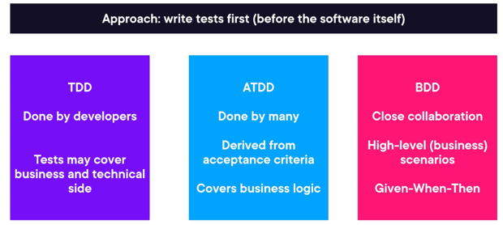
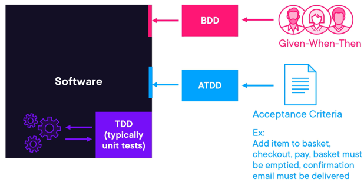
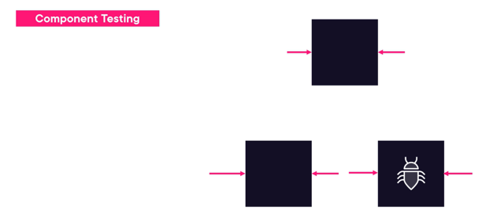
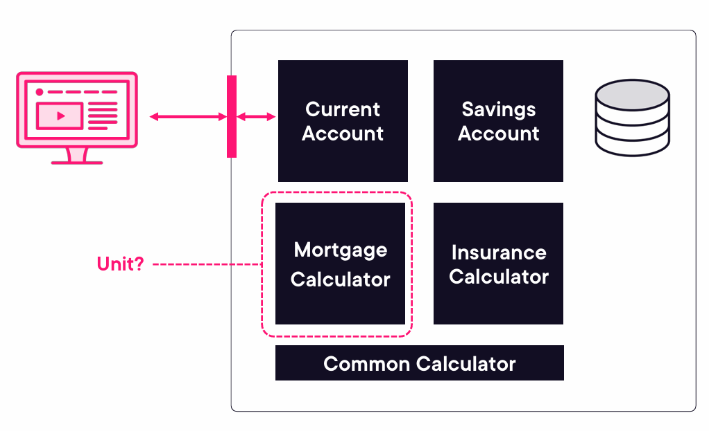
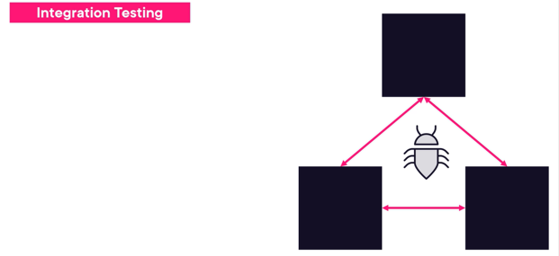
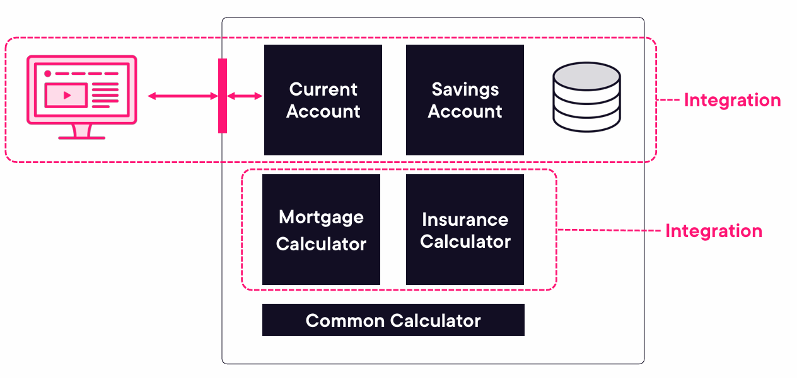
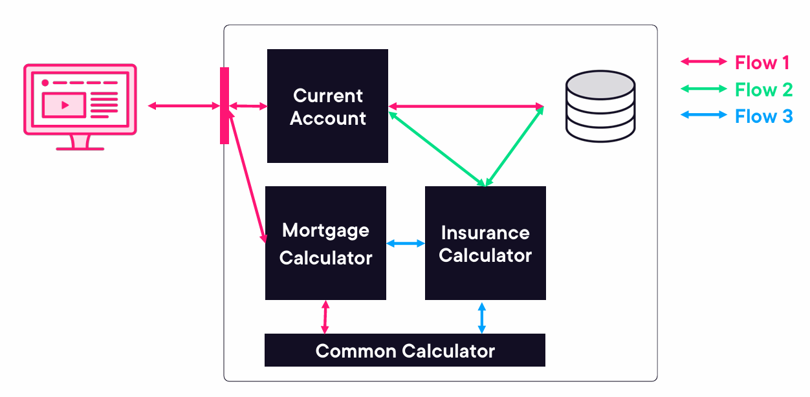
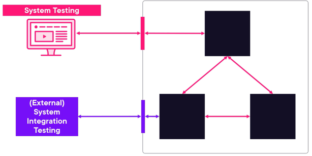
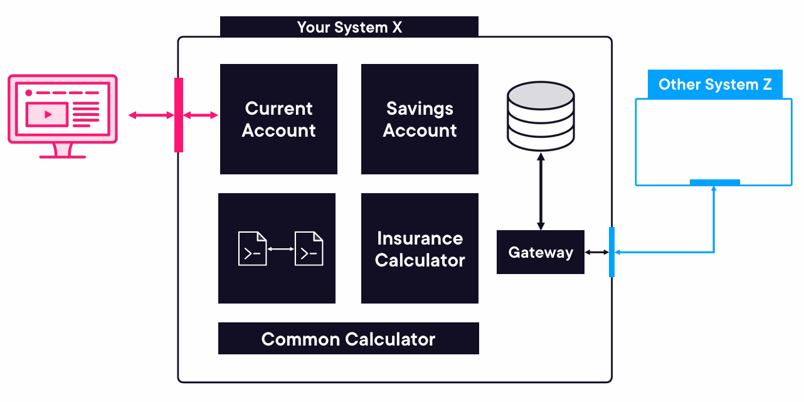

# Testing through SDLC

A software development lifecycle (SDLC) model is an abstract, high-level representation of the software 
development process. 
A SDLC model defines how different development phases and types of activities 
performed within this process relate to each other, both logically and chronologically. 

Examples of SDLC: 
- sequential development models (e.g., waterfall model, V-model) good when you have to be sure that the product is finished (avionics, medical devices, nuclear plants)
- iterative development models (e.g., spiral model, prototyping)
- incremental development models (e.g., Unified Process). 

___

### Impact of the Software Development Lifecycle on Testing 
Testing must be adapted to the SDLC to succeed. The choice of the SDLC impacts on the: 
• Scope and timing of test activities (e.g., test levels and test types) 
• Level of detail of test documentation 
• Choice of test techniques and test approach 
• Extent of test automation 
• Role and responsibilities of a tester 


In sequential development models, testing activities like requirement reviews and test  
design occur early, while dynamic testing happens later when code is available.  

In iterative and incremental models, each iteration delivers a working prototype,  
allowing for both static and dynamic testing at all levels, along with rapid feedback  
and regular regression testing.

Agile development expects continuous change, favoring  
minimal documentation and extensive test automation for easier regression testing.  
Agile also emphasizes experience-based manual testing, which requires less upfront test analysis and design.
___
### Software Development Lifecycle and Good Testing Practices 
Good testing practices, independent of the chosen SDLC model, include the following: 
• For every software development activity, there is a corresponding test activity, so that all 
development activities are subject to quality control 
• Different test levels have specific and different test objectives, which allows 
for testing to be appropriately comprehensive while avoiding redundancy 
• Test analysis and design for a given test level begins during the corresponding development 
phase of the SDLC, so that testing can adhere to the principle of early testing
• Testers are involved in reviewing work products as soon as drafts of this documentation are 
available, so that this earlier testing and defect detection can support the shift-left strategy
___
### Testing as a Driver for Software Development 
Each of these approaches implements the principle of early testing 
and follows a shift-left approach, since the tests are defined before the code is 
written. They support an iterative development model. These approaches are characterized as follows:   
`Test-Driven Development (TDD)`:   
• Directs the coding through test cases (instead of extensive software design) (Beck 2003)   
• Tests are written first, then the code is written to satisfy the tests, and then the tests and code are 
refactored  
`Acceptance Test-Driven Development (ATDD)`:  
• Derives tests from acceptance criteria as part of the system design process (Gärtner 2011)  
• Tests are written before the part of the application is developed to satisfy the tests    
`Behavior-Driven Development (BDD)`:  
• Expresses the desired behavior of an application with test cases written in a simple form of 
natural language, which is easy to understand by stakeholders – usually using the 
Given/When/Then format. (Chelimsky 2010)  
• Test cases are then automatically translated into executable tests   





For all the above approaches, tests may persist as automated tests to ensure the code quality in future 
adaptions / refactoring. 
___
### DevOps and Testing 
DevOps: Developer Operations, 

DevOps is an approach focused on integrating development, testing, and operations to  
streamline processes like server configuration, network management, security,  
and deployment automation. This collaboration requires a cultural shift valuing  
both development and operations equally, promoting autonomy, fast feedback, integrated toolchains,  
and continuous integration/delivery (CI/CD) practices.  
From the testing perspective, some of the benefits of DevOps are: 
• Fast feedback on the code quality, and whether changes adversely affect existing code 
• CI promotes a shift-left approach in testing  by encouraging developers to 
submit high quality code accompanied by component tests and static analysis 
• Promotes automated processes like CI/CD that facilitate establishing stable test environments 
• Increases the view on non-functional quality characteristics (e.g., performance, reliability)
 Automation through a delivery pipeline reduces the need for repetitive manual testing 
• The risk in regression is minimized due to the scale and range of automated regression tests 
DevOps is not without its risks and challenges, which include: 
• The DevOps delivery pipeline must be defined and established  
• CI / CD tools must be introduced and maintained 
• Test automation requires additional resources and may be difficult to establish and maintain 
Although DevOps comes with a high level of automated testing, manual testing – especially from the 
user's perspective – will still be needed. 
___
### Shift-Left Approach 
The principle of early testing is sometimes referred to as shift-left because it is an 
approach where testing is performed earlier in the SDLC. Shift-left normally suggests that testing should 
be done earlier (e.g., not waiting for code to be implemented or for components to be integrated), but it 
does not mean that testing later in the SDLC should be neglected. 
There are some good practices that illustrate how to achieve a “shift-left” in testing, which include: 
• Reviewing the specification from the perspective of testing. These review activities on 
specifications often find potential defects, such as ambiguities, incompleteness, and 
inconsistencies  
• Writing test cases before the code is written and have the code run in a test harness during code 
implementation 
• Using CI and even better CD as it comes with fast feedback and automated component tests to 
accompany source code when it is submitted to the code repository 
• Completing static analysis of source code prior to dynamic testing, or as part of an automated 
process 
• Performing non-functional testing starting at the component test level, where possible. This is a 
form of shift-left as these non-functional test types tend to be performed later in the SDLC when a 
complete system and a representative test environment are available 
A shift-left approach might result in extra training, effort and/or costs earlier in the process but is expected 
to save efforts and/or costs later in the process. 
For the shift-left approach it is important that stakeholders are convinced and bought into this concept.
___
### Retrospectives and Process Improvement 
Retrospectives are meetings held at the end of a project, iteration, or as needed,  
involving team members (testers, developers, product owners, etc.) to review successes,   
identify areas for improvement, and discuss future actions. These insights are recorded, 
often as part of the test completion report, supporting continuous improvement.  
Key benefits for testing include improved test effectiveness, enhanced quality of test  
processes and testware, team bonding and shared learning, higher quality of test inputs  
(like requirements), and strengthened collaboration between development and testing.
___
## Test Levels and Test Types 
Test levels are organized stages of testing activities, each focused on a specific  
development phase, from individual components to complete systems. In sequential  
SDLC models, each test level typically builds on the previous one, with exit criteria  
for one level serving as entry criteria for the next. This sequential handoff may not  
apply in iterative models, where test levels can overlap. Test types, meanwhile, focus  
on particular quality aspects and can be applied across various test levels. 
___
### Test Levels
• `Component testing (also known as unit or module testing)` focuses on testing components in isolation. It 
often requires specific support, such as test harnesses or unit test frameworks. Component 
testing is normally performed by developers in their development environments.





• `Component integration testing (also known as unit integration testing)` focuses on testing the 
interfaces and interactions between components. Component integration testing is heavily 
dependent on the integration strategy approaches like bottom-up, top-down or big-bang. 





• `System testing (end-to-end. front-to-back)` focuses on the overall behavior and capabilities of an entire system or product, 
often including functional testing of end-to-end tasks and the non-functional testing of quality 
characteristics. For some non-functional quality characteristics, it is preferable to test them on a 
complete system in a representative test environment (e.g., usability). Using simulations of subsystems is also possible. System testing may be performed by an independent test team, and is 
related to specifications for the system. 
Your starting point is typically not within the system, but rather outside.
Consider system paths and flows



• `System integration testing` focuses on testing the interfaces of the system under test and other 
systems and external services . System integration testing requires suitable test environments 
preferably similar to the operational environment. 





• `Acceptance testing` focuses on validation and on demonstrating readiness for deployment, 
which means that the system fulfills the user’s business needs. Ideally, acceptance testing should 
be performed by the intended users. The main forms of acceptance testing are: user acceptance 
testing (UAT), operational acceptance testing, contractual and regulatory acceptance testing, 
alpha testing and beta testing.
OAT: Operational Acceptance Testing
 - Backup and restore
 - Installing, uninstalling, upgrading
 - Disaster recovery
 - Data load and migration
 - Performance and load testing


• `Beta testing`: The point of beta testing is to use the infrastructure, both hardware and software of the end user.
• `Alpha testing`: end user in our env.

Test levels are distinguished by the following non-exhaustive list of attributes, to avoid overlapping of test 
activities: 
• Test object  
• Test objectives 
• Test basis 
• Defects and failures 
• Approach and responsibilities 
___
### Test Types
Test Types 
A lot of test types exist and can be applied in projects. In this syllabus, the following four test types are 
addressed: 
`Functional testing` evaluates the functions that a component or system should perform. The functions 
are “what” the test object should do. The main objective of functional testing is checking the functional 
completeness, functional correctness and functional appropriateness. 

`Non-functional testing` evaluates attributes other than functional characteristics of a component or 
system. Non-functional testing is the testing of “how well the system behaves”. 
- How well?
- How fast?
- How stable?
- How unstable
- How secure?

The main objective of non-functional testing is checking the non-functional software quality characteristics. The ISO/IEC 25010
standard provides the following classification of the non-functional software quality characteristics: 
• Performance efficiency  
• Compatibility  
• Usability  
• Reliability  
• Security  
• Maintainability  
• Portability  

It is sometimes appropriate for non-functional testing to start early in the life cycle (e.g., as part of reviews 
and component testing or system testing). Many non-functional tests are derived from functional tests as constraint is satisfied (e.g., checking that a function performs within a specified time, or a function can be 
ported to a new platform). The late discovery of non-functional defects can pose a serious threat to the 
success of a project. Non-functional testing sometimes needs a very specific test environment, such as a 
usability lab for usability testing. 
`Black-box testing` is specification-based and derives tests from documentation external 
to the test object. The main objective of black-box testing is checking the system's behavior against its 
specifications. 
`White-box testing` is structure-based and derives tests from the system's 
implementation or internal structure (e.g., code, architecture, work flows, and data flows). The main 
objective of white-box testing is to cover the underlying structure by the tests to the acceptable level. 
All the four above mentioned test types can be applied to all test levels, although the focus will be 
different at each level. Different test techniques can be used to derive test conditions and test cases for 
all the mentioned test types.  
___
### Confirmation Testing and Regression Testing 
When changes are made to a system—whether to add features or fix defects confirmation  
and regression testing are essential. Confirmation testing ensures that the specific  
defect has been resolved, often by re-running failed test cases or adding tests for any  
modifications involved in the fix. In tight schedules, this may be limited to verifying the  
original failure no longer occurs. Regression testing ensures that the fix or change hasn't  
negatively impacted other areas of the software or connected systems. This testing should  
ideally be automated and may include various levels, especially in CI setups like DevOps.  
Both confirmation and regression testing apply across all test levels whenever changes or  
fixes are introduced. 
___
## Maintenance Testing 
There are different categories of maintenance, it can be corrective, adaptive to changes in the 
environment or improve performance or maintainability (see ISO/IEC 14764 for details), so maintenance 
can involve planned releases/deployments and unplanned releases/deployments (hot fixes). Impact 
analysis may be done before a change is made, to help decide if the change should be made, based on 
the potential consequences in other areas of the system. Testing the changes to a system in production 
includes both evaluating the success of the implementation of the change and the checking for possible 
regressions in parts of the system that remain unchanged (which is usually most of the system).  
The scope of maintenance testing typically depends on: 
• The degree of risk of the change 
• The size of the existing system 
• The size of the change 
The triggers for maintenance and maintenance testing can be classified as follows: 
• Modifications, such as planned enhancements (i.e., release-based), corrective changes or hot 
fixes. 
• Upgrades or migrations of the operational environment, such as from one platform to another, 
which can require tests associated with the new environment as well as of the changed software, 
or tests of data conversion when data from another application is migrated into the system being 
maintained. 
• Retirement, such as when an application reaches the end of its life. When a system is retired, this 
can require testing of data archiving if long data-retention periods are required. Testing of restore 
and retrieval procedures after archiving may also be needed in the event that certain data is 
required during the archiving period. 

```Impact Analysis```:
- What has changed?
- Where in the system?
- Which parts are definitely affected?
- Which parts are likely to be affected?

___
## Sources
- A. Doronins, ISTQB® CTFL: Testing Throughout the SDLC, https://app.pluralsight.com/
- A. Roman, L. Stapp, Certifikowany tester ISTQB Poziom Podstawowy, Helion SA 2020
- Certified Tester Foundation Level Syllabus v4.0
